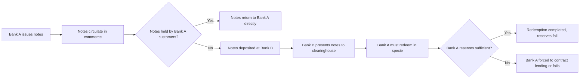

## Free Banking Eras and Private Currency Issuance

### Definition and Conceptual Overview

Free banking refers to a monetary and banking regime in which private banks are permitted to issue their own banknotes (currency) with minimal or no discretionary government regulation, subject typically only to general incorporation and disclosure laws rather than bank-specific chartering restrictions. It is distinguished from both central banking (a single monopoly issuer) and heavily chartered banking systems (where entry and note issuance are restricted to specially privileged institutions).

Key defining features:

- **Free entry**: Any entity meeting general incorporation requirements can establish a bank
- **Private note issuance**: Multiple competing banks issue their own circulating banknotes, redeemable in specie (gold or silver)
- **No central bank**: No lender of last resort or monopoly currency issuer
- **Reserve backing**: Notes are backed by reserves (specie, government bonds, or other assets) held by the issuing bank
- **Redeemability**: Notes are contractual claims redeemable on demand at the issuing bank or its agents

### Historical Episodes

**Scottish Free Banking (1716–1845)**

Often cited as the paradigmatic historical example. Scotland allowed multiple note-issuing banks to compete with minimal regulation, including joint-stock banks with unlimited liability.

- Banks included the Bank of Scotland, Royal Bank of Scotland, British Linen Company, and numerous provincial joint-stock banks
- Notable innovation: the **option clause**, allowing a bank to delay redemption for a period (commonly six months) while paying interest, which reduced vulnerability to sudden liquidity runs
- Banks developed a **note exchange system**, periodically clearing notes with rival banks, which is considered an early precursor to interbank clearinghouses
- Failure rates were relatively low compared to contemporary English country banking
- The system was gradually curtailed by the Bank Charter Act of 1844 and the Scottish equivalent (1845), which restricted further note issuance to existing issuers at fixed limits

**American Free Banking Era (1837–1863)**

The U.S. term "free banking" specifically denotes state-level laws (beginning with Michigan in 1837, followed by New York in 1838 and other states) that allowed any group meeting statutory capital requirements to establish a bank and issue notes, without needing a specific legislative charter.

- Banks were required to back note issuance with eligible state or federal bonds deposited with a state banking authority (bond-secured note issuance, not a true unregulated free-banking system in the Scottish sense)
- Ended with the National Banking Acts (1863–1864), which imposed a federal note-issuance framework, taxed state banknotes out of existence via a 10% tax (1865), and created nationally chartered banks
- Historical evaluation is contested: earlier historiography (Rockoff, and others describing "wildcat banking") emphasized fraud and instability, particularly from banks located in remote areas ("wildcat" territory) designed to be difficult to reach for redemption. Later revisionist research (Rolnick and Weber) found failure rates and losses to note holders were often overstated in the traditional narrative, and that many state free banking systems performed reasonably well, especially where bond-collateral requirements were well-designed. [Inference: the balance of evidence across states remains an active area of historical debate, not a settled consensus]

**Canadian Free Banking / Near-Free Banking (1817–1935, notably 1867–1914)**

Canada is frequently cited as a comparatively successful, less-regulated system operating alongside branch banking (rather than unit banking as in most of the U.S.).

- Branch banking allowed geographic diversification of risk, reducing failure rates significantly relative to the fragmented U.S. unit-banking system
- Notes were backed partly by a note-issue circulation redemption fund and, from 1908, a rediscount facility, moving Canada gradually away from pure free banking toward a hybrid system
- No major banking panics of the scale seen in the U.S. (e.g., 1907, 1893) occurred in Canada during this period, a point frequently used in comparative institutional analysis

**Other Episodes**

- **Sweden (1831–1902)**: Enskilda banks issued private notes under joint-stock, unlimited-liability structures
- **Ireland (pre-1845)**: Competing note-issuing banks, curtailed by the Bank Charter (Ireland) Act
- **Australia, Colombia, Chile, Switzerland (pre-1907), and several other jurisdictions** had documented free or quasi-free banking episodes of varying duration and regulatory strictness

### Theoretical Mechanisms

**Note Issuance and Backing**

A free bank issues notes as liabilities against its balance sheet, analogous to demand deposits:

$$\text{Notes Outstanding} + \text{Deposits} = \text{Specie Reserves} + \text{Loans} + \text{Other Assets}$$

The bank earns income on the spread between interest-bearing assets (loans, bonds) and the (typically zero) interest cost of note liabilities, subject to maintaining sufficient reserves to meet redemption demand.

**Self-Regulating Mechanisms Proposed by Free Banking Theory**

1. **Adverse clearing / note redemption discipline**: If a bank over-issues notes relative to its reserves, its notes disproportionately flow back to rival banks via commerce, and rivals present them for redemption in specie, forcing the over-issuing bank to contract. This is the core disciplining mechanism claimed by proponents (notably associated with the "Free Banking School" tradition, including modern theorists such as Lawrence White and George Selgin).
2. **Reputational capital**: Banks with unlimited liability or strong capital backing had incentive to maintain conservative issuance to protect franchise value.
3. **Clearinghouse mutual monitoring**: Regular note exchanges between competing banks created a decentralized auditing mechanism, as banks had a direct financial interest in monitoring rivals' solvency.

**Contrast with the "Currency School" View**

The historical Currency School (associated with the Bank Charter Act of 1844) argued that competitive note issuance was inherently inflationary and unstable, and that note issuance should be strictly tied one-for-one to specie reserves (or eventually monopolized by a central bank). The Free Banking School countered that competitive issuance with redemption discipline was self-limiting and did not require rigid reserve rules. [Inference: this remains a live theoretical dispute; empirical resolution depends heavily on institutional design in each historical case, so no single mechanism generalizes across all free banking episodes]

### Formal Model Sketch: Note Issuance Under Adverse Clearing

A simplified two-bank model illustrates the disciplining mechanism:

Let bank $i$'s notes in circulation be $N_i$, with reserve ratio $r_i = R_i / N_i$. If bank 1 over-issues relative to bank 2, a fraction $\alpha$ of bank 1's excess notes returns to bank 1 via ordinary commerce, while $(1-\alpha)$ circulates to holders who transact with bank 2's customers and are deposited at bank 2. Bank 2 then presents these notes to bank 1 for redemption at the clearinghouse. The net specie outflow from bank 1 is:

$$\Delta R_1 = -(1-\alpha) \cdot \Delta N_1$$

As $\Delta N_1$ (over-issuance) rises, the specie drain $\Delta R_1$ forces bank 1 to contract lending or face insolvency risk, which the Free Banking School argues limits systemic over-issuance without central coordination. [Inference: the strength of this discipline depends on the velocity and geographic pattern of note circulation, and its historical effectiveness varied by jurisdiction]

### Diagram: Note Issuance and Redemption Flow

### Comparative Table: Free Banking Systems

| Feature | Scotland (1716–1845) | U.S. (1837–1863) | Canada (1867–1914) |
| --- | --- | --- | --- |
| Bank structure | Joint-stock, branch banking | Mostly unit banking | Branch banking |
| Note backing | Bank assets, unlimited liability | State/federal bonds (statutory) | Note circulation redemption fund |
| Redemption discipline | Note exchange, option clause | Bond deposit requirement | Clearinghouse, later rediscount facility |
| Failure rate | Relatively low | Variable by state; some high-failure states ("wildcat" regions) | Very low, no major panics |
| Ended by | Bank Charter Acts (1844/1845) | National Banking Acts (1863–1865) | Gradual centralization, Bank of Canada Act (1935) |

### Modern Relevance and Debates

- **Free Banking School (Selgin, White, Dowd)**: Argues historical free banking episodes demonstrate that competitive private note issuance can be stable without central bank oversight, provided redemption and clearing mechanisms are robust.
- **Critics**: Argue free banking episodes were either not "free" in the pure sense (U.S. bond-collateral requirement was a significant regulatory constraint) or benefited from specific institutional features (branch banking, unlimited liability) not easily replicated in modern fractional-reserve systems with limited liability and deposit insurance.
- **Relevance to cryptocurrency and stablecoin debates**: Contemporary discussions of privately issued digital currencies (stablecoins, historical proposals for "synthetic" free banking via blockchain) draw analogies to free banking redemption discipline, though the underlying legal, technological, and reserve-backing structures differ substantially. [Speculation: the degree to which historical free banking discipline mechanisms transfer to digital/stablecoin contexts is a matter of ongoing analytical debate rather than established fact]

### Key Points

- Free banking systems allowed multiple private banks to issue redeemable notes with limited regulatory restriction
- Scotland (pre-1845) and Canada (pre-1935) are generally cited as comparatively stable historical examples, largely attributed to branch banking and interbank clearing discipline
- The U.S. state-level "free banking" era (1837–1863) required bond collateralization, making it a regulated rather than purely free system, with contested historiography on its stability
- The theoretical core of free banking stability arguments rests on adverse clearing and redemption discipline substituting for centralized regulation
- The Bank Charter Act of 1844 and the U.S. National Banking Acts effectively ended historical free banking by centralizing note issuance

### Related Topics

- Bank Charter Act of 1844 and the Currency School vs. Banking School debate
- Wildcat banking and the historiographical revision by Rolnick and Weber
- National Banking Acts (1863–1865) and the transition to a national currency
- Clearinghouse systems and private lender-of-last-resort arrangements (pre-Federal Reserve U.S.)
- Real Bills Doctrine and its relation to note issuance discipline
- Hayek's "Denationalisation of Money" and modern proposals for competing private currencies
- Comparative banking stability: unit banking vs. branch banking systems
- Gold standard mechanics and specie redemption constraints
- Modern stablecoin reserve-backing models as a digital analogue debate