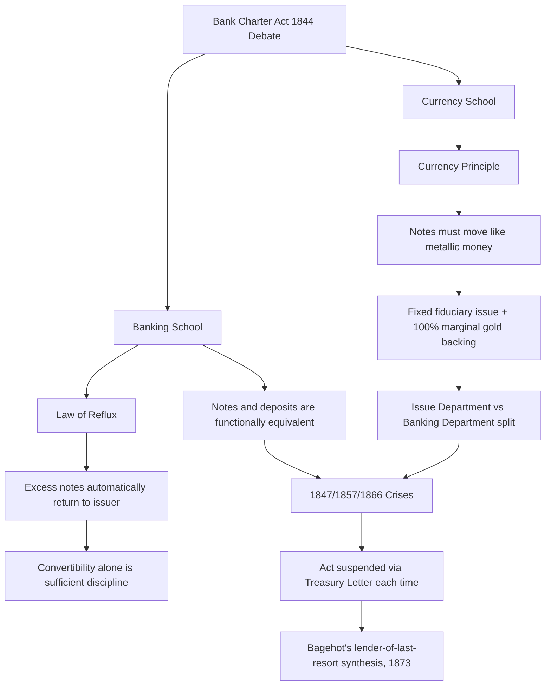

## The Currency School versus Banking School Debate

### Historical Context

The debate emerged in Britain during the 1830s–1840s, centered on how to regulate banknote issuance following the Bank Restriction Period (1797–1821, when the Bank of England suspended gold convertibility) and its aftermath, including the financial crises of 1825, 1836, and 1839. The dispute culminated in the Bank Charter Act of 1844 (Peel's Act), which institutionalized the Currency School position, though the debate's underlying theoretical questions persisted well beyond 1844.

Both schools accepted the gold standard as the monetary anchor; the disagreement concerned the mechanism by which note issuance should be constrained to preserve convertibility and price stability.

### The Currency School Position

**Core Doctrine**

The Currency School (associated with Robert Torrens, Samuel Jones Loyd/Lord Overstone, and George Norman) held that banknotes and coin were monetary equivalents, and that the total note circulation should vary exactly as a metallic currency would — expanding and contracting one-for-one with gold reserve flows. This is often termed the **Currency Principle**.

**Key Claims**

1. **Overissue causes crises**: Currency School theorists attributed commercial crises (1825, 1836, 1839) to excessive note issuance by banks, which they believed inflated prices, encouraged speculative lending, and ultimately triggered gold outflows and panics when convertibility was tested.
2. **Notes ≠ deposits**: They drew a sharp distinction between banknotes (money proper, requiring rigid backing) and deposits/bills of exchange (credit instruments, not requiring the same discipline) — a distinction later criticized as arbitrary since deposits are also convertible into gold on demand.
3. **Automatic rule over discretion**: They favored a mechanical rule — full marginal gold backing for any note issuance beyond a fixed fiduciary issue — rather than relying on bank managers' judgment.

**Policy Prescription: The Bank Charter Act of 1844**

The Act split the Bank of England into two departments:

- **Issue Department**: Notes backed 100% by gold, except for a fixed fiduciary issue (initially £14 million) backed by government securities
- **Banking Department**: Conducted ordinary commercial banking (deposits, discounting) without note-issuance constraints

The Act also froze note-issuing rights of other English banks at existing levels and prohibited new entrants from issuing notes, gradually concentrating issuance in the Bank of England (a policy later extended to Scotland and Ireland in 1845, with modifications preserving existing Scottish/Irish issuers).

### The Banking School Position

**Core Doctrine**

The Banking School (associated with Thomas Tooke, John Fullarton, and James Wilson) rejected the Currency Principle, arguing that convertibility of notes into gold, combined with competitive banking discipline, was sufficient to prevent overissue — no rigid quantitative rule was necessary or even coherent.

**Key Claims**

1. **The Law of Reflux**: Fullarton's central theoretical contribution. Banknotes issued in excess of the "needs of trade" would automatically flow back to the issuing bank via loan repayments, deposits, and redemption, since notes not needed for circulation would not be held idle by the public. This made overissue self-correcting without requiring a fixed reserve rule.
2. **Real Bills Doctrine influence**: Notes issued against short-term, self-liquidating commercial bills (representing real goods in transit) could not persistently exceed the needs of trade, because such bills matured and extinguished the corresponding note issue automatically. [Note: this doctrine has been separately and heavily criticized in later monetary theory, notably by Lloyd Mints and Milton Friedman, for failing to control the price level, since the nominal volume of "real" transactions itself expands with inflation]
3. **Notes and deposits are functionally equivalent**: Since deposits transferable by check performed the same monetary function as notes, restricting note issuance alone (while leaving deposit creation unregulated) could not control the money supply or credit conditions — a critique that proved historically prescient.
4. **Crises are caused by credit and speculation broadly, not note issuance specifically**: Tooke's *History of Prices* argued empirically that price movements preceded rather than followed changes in note circulation, undermining a strict quantity-theory causal link from notes to prices.

### Formal Contrast

| Dimension | Currency School | Banking School |
| --- | --- | --- |
| View of banknotes | Equivalent to metallic money; requires rigid backing | One credit instrument among several; convertibility suffices |
| Constraint mechanism | Fixed fiduciary issue plus 100% marginal gold backing | Law of Reflux; competitive redemption discipline |
| View of deposits/bills | Distinct from currency, less concerning | Functionally equivalent to notes |
| Cause of crises | Overissue of notes | Broader credit/speculative excess, not note volume specifically |
| Policy implication | Legislated quantitative rule (Bank Charter Act 1844) | Rely on convertibility and banking practice; no rigid rule needed |
| Theoretical ancestor | Bullionist tradition (Ricardo) | Anti-bullionist/real bills tradition |

### The Reflux Mechanism, Formally

Fullarton's reflux argument can be represented as a stock-flow identity. Let $N_t$ be notes in circulation at time $t$, $I_t$ new note issuance via lending, and $F_t$ reflux (repayments, deposits, redemptions):

$$N_t = N_{t-1} + I_t - F_t$$

The Banking School argued that if $I_t$ exceeds the "needs of trade," the excess notes are not held as idle balances but are quickly returned via $F_t$ (loan repayment or deposit), so $N_t$ self-corrects toward the level demanded by transactions. Critics (then and later) noted this reasoning is close to circular: it does not explain what determines the equilibrium price level if the nominal "needs of trade" themselves can expand under inflationary conditions, potentially producing sustained rather than self-correcting overissue. [Inference: whether reflux is genuinely self-limiting or merely restates the problem in different terms remains a central point of contention in evaluating the Banking School's argument]

### Assessment of the 1844 Act's Performance

The Bank Charter Act faced its most significant test almost immediately:

- **1847, 1857, and 1866 crises**: In each case, the Bank of England's fiduciary issue limit constrained its ability to expand note issuance during a liquidity crisis, and the British government was forced to suspend the Act's provisions (via a Letter of Indemnity/Treasury Letter) to permit emergency issuance beyond the statutory limit.
- This is widely read, including by later economists such as Bagehot, as evidence that the Currency School's rigid rule addressed note issuance but failed to address the Banking School's point that deposits and credit — not covered by the Act — were the primary vectors of instability.
- **Bagehot's synthesis** (*Lombard Street*, 1873) effectively sidestepped the debate: rather than resolving the mechanical note-issuance question, he argued the Bank of England should act as a lender of last resort, lending freely against good collateral at a penalty rate during a panic — a framework that implicitly accepted the Banking School's point about the centrality of credit/deposit dynamics while proposing a discretionary crisis-management tool the Act did not provide.

### Diagram: Structural Comparison

### Modern Theoretical Legacy

- **Quantity theory descendants**: The Currency School's emphasis on quantitative control over the monetary base is a direct ancestor of later monetarist thinking (Fisher, Friedman), though modern monetarism targets broader money aggregates (M1, M2) rather than notes alone, implicitly adopting the Banking School's point that deposits matter.
- **Endogenous money theories**: The Banking School's Law of Reflux is frequently cited as an intellectual precursor to modern Post-Keynesian "endogenous money" theory, which holds that the money supply expands to meet loan demand and is not independently controllable by a fixed quantitative rule.
- **Real Bills Doctrine critique**: The Banking School's real-bills-influenced reasoning is largely rejected in mainstream monetary economics today, following the debunking associated with Lloyd Mints (1945) and reinforced by Friedman and others, who showed the doctrine provides no true nominal anchor.
- **Central bank design**: Modern debates over rules versus discretion in monetary policy (e.g., Friedman's k-percent rule versus discretionary central banking, or later Taylor Rule frameworks) echo the Currency School/Banking School division between mechanical constraints and judgment-based management.

### Key Points

- The Currency School favored a rigid, rule-based link between note issuance and gold reserves (the Currency Principle), implemented via the Bank Charter Act of 1844
- The Banking School rejected rigid rules, relying on convertibility and the Law of Reflux, and argued deposits/credit instruments were as monetarily significant as notes
- The 1844 Act had to be suspended during the 1847, 1857, and 1866 crises, which is widely interpreted as vindicating the Banking School's critique that note-issuance controls alone could not prevent credit-driven panics
- Bagehot's later lender-of-last-resort doctrine effectively moved policy discussion past the original debate by addressing discretionary crisis response rather than resolving the note-issuance rule question
- The debate's core tension — rules versus discretion, and the proper definition of "money" for policy purposes — recurs throughout later monetary economics

### Related Topics

- Bank Charter Act of 1844 and its 1845 Scottish/Irish extensions
- Free banking eras and private currency issuance (comparative regulatory contrast)
- Real Bills Doctrine and its later critique by Lloyd Mints
- Walter Bagehot's lender-of-last-resort doctrine (*Lombard Street*)
- Bullionist controversy and the Bank Restriction Period (1797–1821)
- Rules versus discretion in monetary policy (Friedman's k-percent rule, Taylor Rule)
- Endogenous money theory and Post-Keynesian monetary economics
- 1847, 1857, and 1866 British financial crises