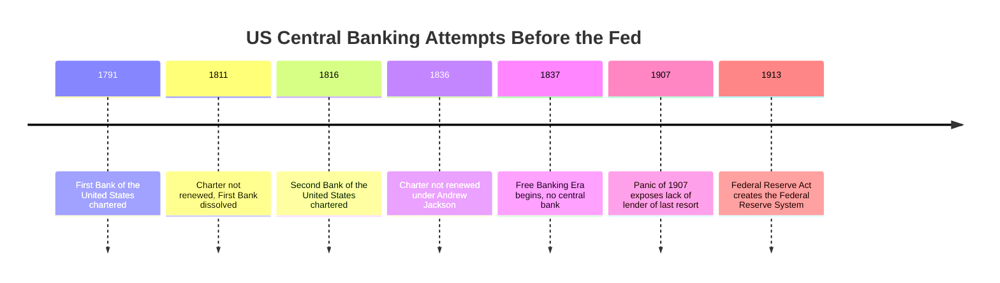
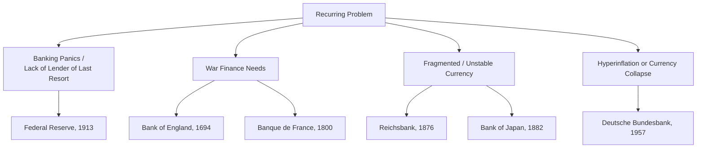

## Founding of Major Central Banks

### Overview

The founding of major central banks represents a series of institutional responses to recurring problems in monetary and financial systems: banking panics, fragmented currencies, war finance needs, and the absence of a "lender of last resort." Central bank formation was rarely driven by a single unified theory of monetary policy (that came later); rather, each institution emerged from specific historical pressures, and their founding charters reveal what problems policymakers were actually trying to solve at the time. Understanding this history clarifies why central banks today hold the specific powers and mandates they do.

### Sveriges Riksbank (Sweden, 1668)

**Key Points**

- Widely recognized as the world's oldest central bank still in operation
- Emerged from the collapse of Stockholms Banco (founded 1656 by Johan Palmstruch), Europe's first bank to issue banknotes
- Stockholms Banco failed in 1664 after over-issuing notes not backed by adequate reserves, an early lesson in the dangers of unbacked note issuance
- The Riksbank was established by the Swedish parliament (the Riksdag) as a state institution, not a private venture, partly to prevent a repeat of Palmstruch's abuse
- Originally named Riksens Ständers Bank ("Bank of the Estates of the Realm")
- Did not gain a full note-issuing monopoly until the 19th century; its early role was more conservative deposit and lending

**[Inference]** The Riksbank's direct parliamentary control (rather than royal or private ownership) is often cited as a response to the Palmstruch episode, though sources vary on how deliberate this design choice was versus a practical necessity given the political environment.

### Bank of England (1694)

**Key Points**

- Founded by royal charter under William III to finance the war against France (the Nine Years' War)
- Structured as a private joint-stock company that lent £1.2 million to the government in exchange for the charter and exclusive banking privileges
- This "loan-for-charter" model became a template followed by other early central banks
- Gained a growing monopoly on banknote issuance in England and Wales over subsequent centuries, formalized further by the Bank Charter Act of 1844
- Nationalized in 1946, becoming fully state-owned
- Became formally operationally independent for setting interest rates in 1997, though ownership remained with the UK Treasury

**Example**

The 1694 charter illustrates the core "grand bargain" pattern seen in early central bank founding: the state needed money for war or fiscal stability, and financiers wanted a stable, government-backed monopoly. The Bank of England received exclusive privileges (limited competition from other note-issuing joint-stock banks) in return for underwriting government debt.

### Banque de France (1800)

**Key Points**

- Established by Napoleon Bonaparte to stabilize French finances after the hyperinflation of the assignat currency during the Revolutionary period
- Structured initially as a private bank with a note-issuing monopoly for Paris, extended nationally in 1848
- Reflected a French pattern of using centralized banking as a tool for state fiscal control, closely tied to the executive rather than an independent legislature
- Nationalized in 1945 following World War II

**[Inference]** Napoleon's involvement is often framed as reflecting a broader Napoleonic-era emphasis on centralized economic institutions, though this framing is a historical interpretation rather than a documented statement of intent from primary sources.

### Federal Reserve System (United States, 1913)

**Key Points**

- Created by the Federal Reserve Act of 1913, signed by President Woodrow Wilson
- Direct response to the Panic of 1907, a severe banking crisis that revealed the US lacked a lender of last resort (the crisis was ultimately contained largely through private intervention led by J.P. Morgan)
- Preceded by two earlier, short-lived experiments: the First Bank of the United States (1791–1811) and the Second Bank of the United States (1816–1836), both of which failed to secure re-charter due to political opposition rooted in fears of concentrated financial power
- Designed as a decentralized system to balance competing regional and political interests: 12 regional Federal Reserve Banks under a central Board of Governors in Washington, D.C.
- The compromise structure reflected tension between those wanting a European-style central bank and those fearing Wall Street or federal government control over credit
- Given a dual mandate (maximum employment and stable prices) formally articulated later, via the Federal Reserve Reform Act of 1977

**Example**

The 12-district structure is a direct artifact of founding-era political compromise: agrarian and western interests distrusted a single powerful bank controlled by eastern financial centers, so the Federal Reserve Act distributed authority across regional banks (each with its own president and board) while retaining centralized oversight in Washington.

### Reichsbank / Deutsche Bundesbank (Germany, 1876 / 1957)

**Key Points**

- The Reichsbank was founded in 1876 following German unification (1871), replacing a patchwork of state and private note-issuing banks
- Intended to unify the German currency (the mark) and support the newly unified empire's fiscal and monetary coherence
- The Reichsbank's later mismanagement, particularly its role in financing German war debt and enabling the hyperinflation of 1921–1923, became a formative trauma shaping German monetary institutional culture
- After World War II, West Germany established the Bank deutscher Länder (1948), succeeded by the Deutsche Bundesbank in 1957
- The Bundesbank was deliberately designed with strong legal independence from the federal government, a direct institutional response to the hyperinflation trauma and the perceived dangers of politically subservient central banking
- The Bundesbank's independence model strongly influenced the design of the European Central Bank

**[Inference]** The frequently cited link between the Weimar hyperinflation and the Bundesbank's independence mandate is a widely accepted institutional narrative in monetary economics, though the precise causal weight of hyperinflation versus other postwar political factors (such as Allied occupation policy) is debated among economic historians.

### Bank of Japan (1882)

**Key Points**

- Established during the Meiji era as part of Japan's broader modernization and institution-building following the Meiji Restoration (1868)
- Modeled substantially on the National Bank of Belgium's structure
- Created to stabilize the currency and unify note issuance after earlier decentralized note-issuing experiments (the National Bank system, adapted from a US-inspired model) produced inflation
- Operated for much of its early history under close government direction, particularly during wartime periods
- Reformed with greater legal independence in 1998 under a revised Bank of Japan Act

### Common Founding Triggers Across Central Banks

**Key Points**

- **War finance**: Bank of England, Banque de France, and others were founded or expanded partly to help governments borrow more efficiently
- **Banking panics / crises**: Sveriges Riksbank's reform and the Federal Reserve's creation both followed high-profile financial failures
- **Currency unification**: The Reichsbank and Bank of Japan responded to fragmented, multi-issuer currency systems following political unification or modernization
- **Hyperinflation trauma**: The Bundesbank's design was shaped by lessons from the Reichsbank's failures
- **Institutional learning from failure**: Nearly every founding charter can be read as a correction to a specific prior failure (Palmstruch's overissuance, panics without a lender of last resort, fragmented note issuance, wartime monetary abuse)

### Structural Models of Early Central Banks

**Key Points**

- **Private joint-stock model**: Bank of England and Banque de France began as privately owned institutions granted state privileges (note monopoly, government banking) in exchange for financing the sovereign
- **State institution model**: Sveriges Riksbank was founded directly under parliamentary control, avoiding private ownership from the outset
- **Federated/decentralized model**: The Federal Reserve distributed authority across regional banks to satisfy competing political constituencies
- **State-directed modernization model**: Bank of Japan and the Reichsbank were created top-down as part of broader national unification or modernization projects
- Most of these institutions were nationalized or had ownership restructured toward the state in the 20th century (Bank of England 1946, Banque de France 1945), reflecting a broader mid-20th-century trend toward state control of monetary policy tools

### Independence as an Evolving Design Feature

**Key Points**

- Early central banks were generally not "independent" in the modern sense; most operated under close alignment with, or subordination to, the fiscal authority (monarchy, empire, or treasury)
- Central bank independence as an explicit design principle emerged more strongly in the postwar period, most visibly with the Bundesbank (1957) and later the European Central Bank (1998), which was explicitly modeled on Bundesbank independence
- The Federal Reserve's independence has always been a matter of degree, not absolute; it is a creature of Congress and its structure and mandate have been amended multiple times (1913, 1933, 1935, 1977, and further reforms after 2008)
- **[Inference]** The general historical trend toward greater central bank independence in the late 20th century is often linked by monetary economists to the stagflation experience of the 1970s and the associated credibility problems of discretionary monetary policy, though this is an interpretive framework rather than a settled historical fact

### Founding Timeline (Comparative)

| Central Bank | Founded | Country | Primary Founding Trigger |
| --- | --- | --- | --- |
| Sveriges Riksbank | 1668 | Sweden | Collapse of Stockholms Banco |
| Bank of England | 1694 | England | War finance (Nine Years' War) |
| Banque de France | 1800 | France | Post-assignat currency stabilization |
| Reichsbank | 1876 | Germany | Post-unification currency unification |
| Bank of Japan | 1882 | Japan | Meiji-era modernization, currency stabilization |
| Federal Reserve | 1913 | United States | Panic of 1907, lack of lender of last resort |
| Deutsche Bundesbank | 1957 | West Germany | Post-hyperinflation independence design |

### Relevance to Modern Monetary Economics

**Key Points**

- The historical founding conditions of central banks help explain persistent institutional differences today: the Fed's decentralized regional structure, the Bundesbank/ECB emphasis on independence and price stability, and the Bank of England's historically closer Treasury relationship (prior to 1997)
- These founding stories are frequently used pedagogically to illustrate core concepts such as the lender-of-last-resort function, time-inconsistency problems in monetary policy, and the political economy of central bank independence
- Understanding founding history provides context for later theoretical developments, such as Kydland and Prescott's work on time inconsistency and Barro-Gordon models of central bank credibility, which formalized why independence from short-term political pressure was later viewed as institutionally valuable

**Related Topics**

- Lender of last resort doctrine (Bagehot's Rule)
- Banking panics and the National Banking Era (US, 1863–1913)
- Bank Charter Act of 1844 and the currency vs. banking school debate
- Weimar hyperinflation (1921–1923) and its institutional legacy
- Central bank independence: theory and measurement (e.g., Cukierman index)
- Formation of the European Central Bank (1998) and the Maastricht convergence criteria
- Bretton Woods system and postwar international monetary architecture
- Time inconsistency in monetary policy (Kydland-Prescott, Barro-Gordon)