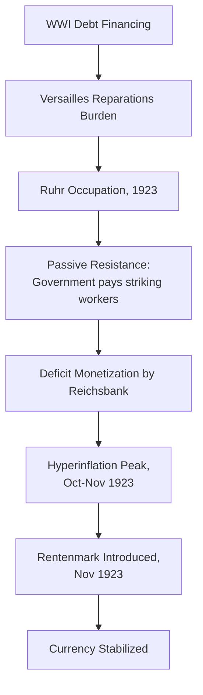
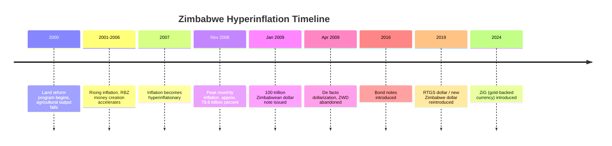
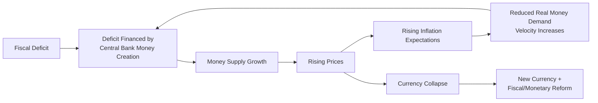

## Historical Hyperinflations: Weimar Germany, Hungary, Zimbabwe

### Overview

Hyperinflation episodes are among the most extreme monetary phenomena observable in economic history, providing natural experiments for testing theories of money supply, fiscal dominance, and expectations formation. The canonical academic definition, proposed by Phillip Cagan (1956), classifies hyperinflation as beginning in the month the monthly inflation rate first exceeds 50% and ending when it falls below 50% and stays below for at least a year. The three episodes below—Weimar Germany, Hungary (twice), and Zimbabwe—represent the most severe and most frequently studied cases in monetary economics, each illustrating the common causal mechanism of unconstrained money creation to finance fiscal deficits, but arising from distinct political and structural circumstances.

### Cagan's Definition and Measurement

**Key Points**

- Hyperinflation formally begins in the calendar month when the monthly price level increase first exceeds 50%
- A monthly rate of 50% compounds to an annual rate of approximately 12,875%, illustrating how quickly nominal values become meaningless
- The episode ends when monthly inflation drops below 50% and remains below that threshold for at least twelve consecutive months
- Cagan's model treats hyperinflation primarily as a monetary phenomenon driven by expected inflation and money supply growth, largely setting aside real-sector disturbances given the extreme dominance of monetary effects at such magnitudes

$$\pi_{monthly} > 50\% \implies \pi_{annual} \approx (1.5)^{12} - 1 \approx 12{,}875\%$$

### Weimar Germany (1921–1923)

**Key Points**

- Root cause: Germany financed World War I largely through debt rather than taxation, then faced reparations obligations under the Treaty of Versailles (1919) denominated in gold-backed marks and foreign currency
- The German government and the Reichsbank responded to fiscal shortfalls, exacerbated by the 1923 occupation of the Ruhr by French and Belgian troops (in response to reparations default) and the government's policy of passive resistance (paying striking Ruhr workers via the printing press), by monetizing deficits at an accelerating rate
- Peak hyperinflation reached in October–November 1923, with prices reportedly doubling roughly every few days at the worst point
- The mark's exchange rate against the US dollar moved from approximately 4.2 marks/dollar (pre-war) to over 4.2 trillion marks/dollar by November 1923
- Ended through the Rentenmark stabilization of November 1923, a new currency backed nominally by mortgages on agricultural and industrial land (not gold), combined with fiscal discipline and central bank reform under Hjalmar Schacht
- The Reichsbank's independence and disciplined institutional culture, established later via the 1957 Bundesbank, is frequently cited as a direct institutional legacy of this trauma

**Example**

A frequently cited illustration is that of household behavior during the peak: workers reportedly were paid multiple times per day and spent wages immediately, since the purchasing power of cash could halve within hours. Everyday transactions such as buying bread required wheelbarrows of banknotes, and firewood or wallpaper were, according to popular accounts, sometimes more practically used as fuel or decoration than the currency itself.

**[Inference]** Some of the most vivid anecdotes from this period (banknotes used as wallpaper, wheelbarrows of cash) are widely repeated in popular economic literature but are difficult to independently verify at scale; they should be treated as illustrative folklore consistent with documented price data rather than rigorously sourced statistics.

### Hungary (1945–1946): The Most Severe Hyperinflation on Record

**Key Points**

- Post-World War II Hungary experienced the highest inflation rate ever recorded, exceeding even Weimar Germany and Zimbabwe in peak monthly terms
- Peak monthly inflation is estimated at approximately 4.19 × 10^16 percent (41.9 quadrillion percent) in July 1946, with prices reportedly doubling roughly every 15 hours at the worst point
- Root causes: wartime destruction of productive capacity, Soviet-imposed reparations payments, loss of territory and population under postwar treaties, and a fiscally exhausted government resorting to unrestrained note issuance via the pengő currency
- The central bank issued increasingly large-denomination notes, culminating in a banknote for 100 quintillion pengő (10^20), among the highest-denomination notes ever issued
- Ended in August 1946 through the introduction of the forint, a new currency backed by a stabilization program supported partly by gold reserves and structured fiscal reform
- Considered the textbook extreme case in monetary economics for illustrating the mechanics of a total currency collapse

**[Inference]** Precise inflation-rate estimates for the 1946 Hungarian episode vary somewhat across sources depending on measurement methodology (index construction, sampling of available price data amid wartime disruption), though the qualitative severity and ranking as the historical maximum is broadly consistent across the literature.

### Hungary: A Second, Milder Episode (1923–1924)

**Key Points**

- Less frequently discussed than the 1946 episode, Hungary also experienced a milder hyperinflation in the early 1920s, driven by post-WWI fiscal strain and the costs of establishing the new Hungarian state following the dissolution of Austria-Hungary
- Stabilized through League of Nations-assisted reconstruction loans and fiscal reform in the mid-1920s
- Illustrates that some economies can experience repeat hyperinflationary episodes when underlying fiscal-institutional weaknesses are not durably resolved after the first stabilization

### Zimbabwe (2007–2009)

**Key Points**

- Root causes: a combination of the land reform program beginning in 2000 (which sharply reduced commercial agricultural output and export earnings), international sanctions, government fiscal deficits, and central bank financing of both government spending and quasi-fiscal activities (such as agricultural subsidies)
- The Reserve Bank of Zimbabwe expanded the money supply dramatically to fund these obligations, producing accelerating inflation from the early 2000s that became a full hyperinflation by 2007
- Official peak inflation estimates are highly uncertain because the government stopped publishing reliable statistics; independent estimates (notably by economist Steve Hanke) place the peak monthly rate at approximately 79.6 billion percent in mid-November 2008, implying prices doubling roughly every 24.7 hours
- The Zimbabwean dollar underwent multiple redenominations, including the removal of 10 zeros in 2008 and further zeros removed in early 2009, and famously culminated in the issuance of a 100 trillion Zimbabwean dollar banknote
- Ended via de facto dollarization in early 2009, when the government permitted foreign currencies (primarily the US dollar and South African rand) to be used for domestic transactions, effectively abandoning the Zimbabwean dollar
- Zimbabwe later attempted to reintroduce a domestic currency (bond notes in 2016, then the RTGS dollar/Zimbabwe dollar in 2019), which experienced renewed high inflation, and introduced a gold-backed currency called ZiG (Zimbabwe Gold) in April 2024 in a further stabilization attempt

**[Speculation]** Whether the ZiG currency will achieve durable stability is not yet empirically settled as of this writing and depends on continued fiscal discipline and credible gold-backing mechanisms; this should be treated as an open question rather than a documented historical outcome.

### Comparative Table

| Episode | Peak Period | Peak Monthly Inflation (approx.) | Price Doubling Time (approx.) | Resolution |
| --- | --- | --- | --- | --- |
| Weimar Germany | Oct–Nov 1923 | ~29,500% | ~3.7 days | Rentenmark introduced, fiscal reform |
| Hungary | Jul 1946 | ~4.19 × 10^16% | ~15 hours | Forint introduced, stabilization program |
| Zimbabwe | Nov 2008 | ~79.6 billion% | ~24.7 hours | De facto dollarization |

**[Unverified]** The Weimar peak monthly figure of approximately 29,500% is a commonly cited estimate in secondary economic literature; original contemporaneous price indices from 1923 Germany are incomplete, so this figure should be understood as a scholarly reconstruction rather than an officially measured statistic at the time.

### Common Causal Structure: The Fiscal Theory of Hyperinflation

**Key Points**

- All three episodes share a common underlying mechanism: a government facing a fiscal deficit it cannot finance through taxation or conventional borrowing resorts to financing the deficit through central bank money creation (seigniorage)
- As money supply grows faster than real output, the price level rises; if the public begins to expect continued inflation, they reduce their real money holdings (spending money faster, "hot potato" effect), which requires even more money creation to finance the same real deficit, an accelerating feedback loop
- This dynamic is formalized in the **Cagan money demand model**, where real money demand depends negatively on expected inflation:

$$\frac{M_t}{P_t} = \phi \cdot e^{-\alpha \pi_t^e}$$

where $M_t/P_t$ is real money balances, $\pi_t^e$ is expected inflation, and $\alpha$ is the semi-elasticity of money demand with respect to expected inflation.

- This framework connects to the broader **fiscal theory of the price level** and to seigniorage/inflation tax analysis: governments unable to raise sufficient conventional revenue effectively tax real money balances via inflation
- All three stabilizations required essentially the same structural fix: introducing a new, credible currency accompanied by a credible commitment to fiscal discipline and (eventually) central bank independence or external monetary anchoring (Rentenmark's asset backing, forint's reserve backing, Zimbabwe's dollarization)

### Distinguishing Features Across the Three Cases

**Key Points**

- **Weimar Germany**: primarily reparations- and occupation-driven; ended relatively quickly (about 2 years) via a well-designed asset-backed currency reform
- **Hungary (1946)**: primarily wartime destruction- and reparations-driven, representing the mathematically most extreme case ever recorded, with an unusually short but intense duration (about a year)
- **Zimbabwe**: primarily driven by a domestic supply shock (land reform reducing output) combined with sustained quasi-fiscal central bank financing over nearly a decade before reaching hyperinflationary extremes, illustrating a slower-building but eventually equally severe collapse

### Relevance to Monetary Economics

**Key Points**

- These cases are the primary empirical basis for the **Cagan model** of money demand under hyperinflation, still taught as a canonical application of rational/adaptive expectations to monetary economics
- They illustrate the **inflation tax** and **seigniorage** concepts: governments extract real resources from currency holders when conventional taxation is infeasible or politically constrained
- They demonstrate the practical limits of monetary financing of fiscal deficits, informing modern debates about central bank independence, fiscal dominance, and the risks of unconventional monetary financing (e.g., debates around modern monetary theory and unconstrained deficit monetization)
- The stabilization patterns (new currency + credible backing + fiscal reform) are frequently used as case studies in exchange-rate-based and money-based disinflation programs

**Related Topics**

- Cagan's model of hyperinflation and money demand
- Seigniorage and the inflation tax
- Fiscal theory of the price level
- Central bank independence and credibility (Bundesbank case study)
- Dollarization and currency substitution
- Other historical hyperinflations: Yugoslavia (1992–1994), Republic of Weimar successor comparisons, Venezuela (2016–present)
- Exchange-rate-based stabilization programs