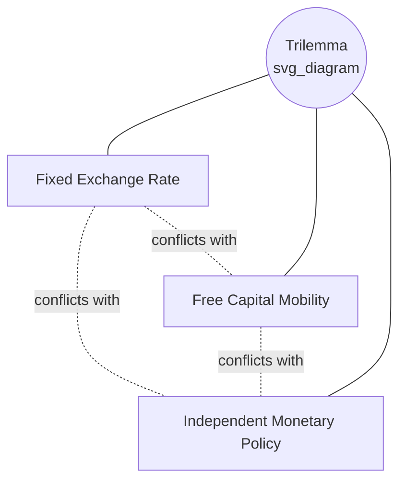
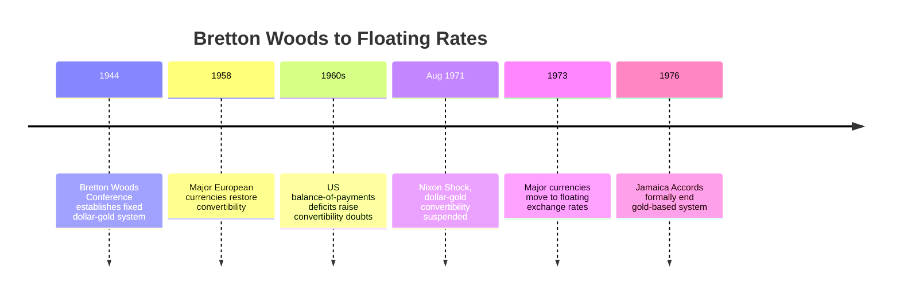
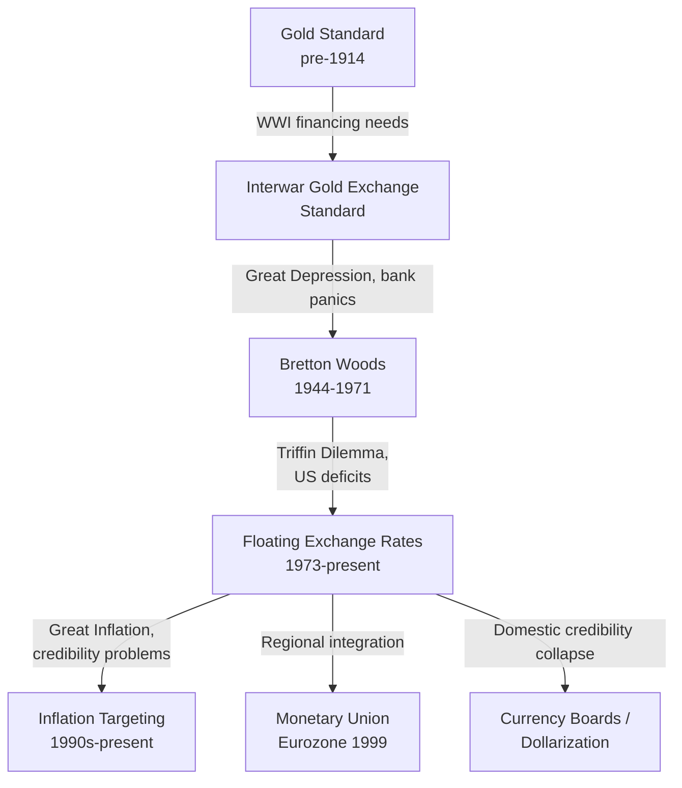

## Monetary Reforms and Regime Transitions

### Overview

Monetary regime transitions refer to structural changes in how a country's money is created, valued, and constrained—shifts between commodity standards, fiat systems, fixed and floating exchange rates, and various institutional anchors for credibility. These transitions are typically triggered by crises (currency collapse, unsustainable pegs, hyperinflation), changing economic ideology, or evolving international arrangements. Studying these transitions illuminates the recurring trade-offs in monetary economics between credibility, flexibility, and sovereignty, often summarized by the **impossible trinity (trilemma)**.

### The Monetary Policy Trilemma

**Key Points**

- A country cannot simultaneously maintain (1) a fixed exchange rate, (2) free capital mobility, and (3) independent monetary policy; at most two of the three are achievable
- Nearly every major regime transition in monetary history can be understood as a country choosing which leg of the trilemma to sacrifice
- The trilemma is foundational to understanding why fixed-rate systems (gold standard, Bretton Woods, European Exchange Rate Mechanism) eventually gave way to floating rates or deeper integration (monetary union)

**[Inference]** While the trilemma is a standard organizing framework in international monetary economics, some researchers argue real-world regimes often occupy a spectrum rather than discrete corner solutions (the "trilemma is not binary" critique), so its application to specific historical cases should be read as an analytical simplification.

### The Classical Gold Standard (c. 1870s–1914)

**Key Points**

- Major economies (Britain from 1821, followed by Germany, the US in practice, and others by the 1870s) fixed their currencies to a specific weight of gold, with central banks committed to converting currency to gold on demand
- Provided strong price-level discipline and facilitated international trade and capital flows due to exchange-rate predictability
- Constrained domestic monetary policy: central banks had limited ability to respond to domestic recessions or banking panics because policy was subordinated to maintaining gold convertibility (the "rules of the game")
- Effectively collapsed with the outbreak of World War I in 1914, as belligerent nations suspended convertibility to finance war spending through money creation

### Interwar Gold Exchange Standard and Its Collapse (1920s–1930s)

**Key Points**

- Several countries attempted to restore gold convertibility after WWI (Britain returned to gold in 1925 at the pre-war parity, widely criticized as overvalued and economically damaging)
- The interwar gold exchange standard allowed some countries to hold reserves in gold-convertible currencies (pounds, dollars) rather than gold itself, creating fragility
- The Great Depression (starting 1929) is closely linked in monetary economics (notably in the work of Milton Friedman and Anna Schwartz, and later Barry Eichengreen) to the constraints the gold standard placed on central banks' ability to expand money supply and act as lenders of last resort during the banking crises of the early 1930s
- Countries that abandoned gold earlier (Britain in 1931, the US effectively in 1933–1934) generally recovered from the Depression faster than countries that remained on gold longer (the "Gold Bloc" countries such as France)

**[Inference]** The causal claim that earlier gold standard abandonment led to faster recovery is a well-supported empirical finding in the economic history literature (particularly Eichengreen's work), though it remains a historical inference drawn from cross-country comparison rather than a controlled experiment.

### Bretton Woods System (1944–1971/1973)

**Key Points**

- Established at the 1944 Bretton Woods Conference, creating a system where the US dollar was pegged to gold ($35/ounce) and other major currencies were pegged to the dollar, with adjustable pegs permitted under IMF oversight
- Created the International Monetary Fund (IMF) and the World Bank (originally the International Bank for Reconstruction and Development) as supporting institutions
- Allowed limited capital controls, letting countries retain some domestic monetary policy independence while maintaining fixed rates (a partial trilemma resolution)
- Came under increasing strain in the 1960s as US balance-of-payments deficits grew, raising doubts about the sustainability of dollar-gold convertibility (the "Triffin dilemma": the world's reserve currency issuer must run persistent deficits to supply global liquidity, undermining confidence in convertibility)
- Ended when President Richard Nixon suspended dollar-gold convertibility on August 15, 1971 (the "Nixon Shock"), followed by the collapse of the fixed-rate structure and a general shift to floating exchange rates formalized by the Jamaica Accords of 1976

### The Triffin Dilemma

**Key Points**

- Articulated by economist Robert Triffin in the early 1960s
- States that a country issuing the world's primary reserve currency faces a structural conflict: it must run persistent current account deficits to supply the world with sufficient reserve currency for growing global trade and finance, but doing so progressively undermines confidence in that currency's convertibility and value
- Frequently invoked in modern discussions of the US dollar's reserve currency status and the international monetary system's structural stability

### Floating Exchange Rate Era and Inflation Targeting (1970s–present)

**Key Points**

- Following Bretton Woods' collapse, most major economies transitioned to floating or managed-floating exchange rate regimes, resolving the trilemma by sacrificing the fixed exchange rate leg in favor of monetary independence and capital mobility
- The 1970s "Great Inflation" in many advanced economies (driven partly by oil price shocks and partly by discretionary, credibility-weak monetary policy) motivated a search for new nominal anchors
- New Zealand pioneered formal **inflation targeting** in 1990, followed by Canada, the UK, Sweden, and many others through the 1990s and 2000s
- Inflation targeting represented a regime shift from exchange-rate or money-supply anchors toward explicit numerical inflation goals communicated transparently to the public, intended to anchor expectations and provide accountability without a rigid fixed-rate commitment
- Reflects the theoretical influence of time-inconsistency literature (Kydland-Prescott, Barro-Gordon), which argued that discretionary monetary policy has an inflationary bias absent credible commitment mechanisms

### Monetary Union: The Eurozone (1999/2002)

**Key Points**

- A distinct type of regime transition: rather than choosing a corner of the trilemma, participating countries surrendered independent monetary policy entirely by adopting a shared currency (the euro) and centralizing monetary authority in the European Central Bank (ECB)
- Physical euro currency was introduced in 2002, with the currency itself existing electronically from 1999
- Required convergence criteria under the Maastricht Treaty (1992): limits on inflation, government deficit and debt levels, interest rates, and exchange rate stability prior to entry
- Created a currency union without full fiscal union, a structural feature widely identified as a source of vulnerability during the 2010s European sovereign debt crisis (countries lost the ability to devalue their own currency to restore competitiveness)
- The ECB's design drew heavily on the Bundesbank's independence model, emphasizing price stability as the primary mandate

**[Inference]** The characterization of the euro's incomplete fiscal union as a central cause of the 2010s sovereign debt crisis is a widely shared view among monetary economists (e.g., work associated with the "optimal currency area" literature), though the relative weight of this structural factor versus individual country fiscal mismanagement remains debated.

### Currency Board and Dollarization Regimes

**Key Points**

- A **currency board** is a monetary arrangement in which a country's currency is fully backed by, and fixed to, a foreign reserve currency, with the monetary authority holding reserves equal to the entire monetary base (extremely limited ability to make independent monetary policy)
- Examples include Hong Kong's currency board (pegging the Hong Kong dollar to the US dollar since 1983) and Argentina's Convertibility Plan (1991–2001), which pegged the peso 1:1 to the US dollar
- Argentina's currency board collapsed in the 2001–2002 economic crisis when the fixed peg became unsustainable given fiscal deficits and external shocks, leading to devaluation, default, and a return to a floating (later managed) exchange rate
- **Dollarization** (full or partial adoption of a foreign currency, as opposed to merely pegging) represents an even more extreme sacrifice of monetary independence; examples include Ecuador (2000) and Zimbabwe's post-hyperinflation dollarization (2009)
- These regimes trade away all domestic monetary policy independence in exchange for maximal credibility and elimination of currency risk, often adopted after a credibility collapse makes domestic monetary policy institutions untrustworthy

### Common Patterns Across Monetary Regime Transitions

**Key Points**

- **Crisis-driven transitions**: most major regime changes (gold standard collapse, Bretton Woods collapse, Argentina's currency board collapse) occurred abruptly during acute economic or financial crises rather than through gradual, planned policy evolution
- **Credibility-seeking transitions**: countries adopting currency boards, dollarization, or joining monetary unions typically do so after a domestic credibility failure (hyperinflation, chronic high inflation, fiscal dominance) makes external anchors more attractive than domestic institutional reform alone
- **Trilemma trade-offs made explicit**: every regime, from the gold standard through inflation targeting, can be mapped onto which corner of the trilemma a country is choosing to approximate
- **Institutional design responds to prior failure**: much as central bank founding charters reflect lessons from earlier crises, exchange rate and monetary regime choices tend to reflect explicit lessons learned from the immediately preceding regime's failure mode

### Relevance to Monetary Economics

**Key Points**

- Regime transition history provides the empirical basis for the trilemma framework, optimal currency area theory, and the time-inconsistency literature that underpins modern central bank design
- These transitions illustrate the practical trade-offs between rules-based credibility (gold standard, currency boards, monetary union) and discretionary flexibility (floating rates with independent monetary policy)
- Understanding past regime failures (Bretton Woods' Triffin dilemma, Argentina's currency board collapse, the euro's incomplete fiscal union) informs ongoing debates about reserve currency status, digital currencies, and potential future international monetary architecture reforms

**Related Topics**

- Impossible trinity (Mundell-Fleming trilemma) in depth
- Optimal currency area theory (Mundell, 1961)
- Time-inconsistency and central bank credibility (Kydland-Prescott, Barro-Gordon)
- Triffin dilemma and reserve currency economics
- European sovereign debt crisis (2010–2012)
- Argentina's Convertibility Plan and 2001 crisis
- Inflation targeting frameworks and design (flexible vs. strict)
- Digital currencies and potential future monetary regime shifts (CBDCs)