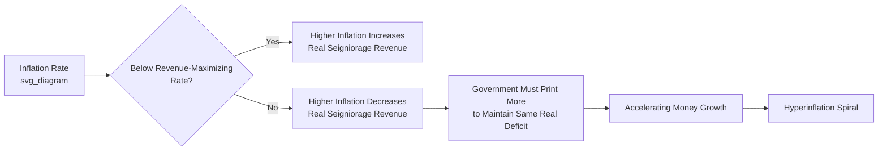

## The Government Budget Constraint and Seigniorage

### Overview

The government budget constraint (GBC) formalizes the requirement that all government spending, including debt service, must be financed through some combination of taxation, borrowing, and money creation. Seigniorage—the revenue a government or central bank earns from creating money—is the link connecting fiscal policy and monetary policy. Understanding this constraint is central to analyzing fiscal dominance, hyperinflation, debt sustainability, and the limits of monetary financing of deficits.

### The Government Budget Constraint: Basic Formulation

**Key Points**

- In any period, government expenditures (including interest on existing debt) must equal revenue from taxes, new borrowing, and money creation
- The standard flow budget constraint (in nominal terms) is:

$$G_t + i_t B_{t-1} = T_t + (B_t - B_{t-1}) + (M_t - M_{t-1})$$

where $G_t$ is government spending, $i_t B_{t-1}$ is interest on outstanding debt, $T_t$ is tax revenue, $B_t - B_{t-1}$ is new bond issuance (borrowing), and $M_t - M_{t-1}$ is the change in the monetary base (money creation)

- Rearranged, this shows the **primary deficit** (spending net of interest, minus taxes) must be financed by new borrowing plus new money creation:

$$G_t - T_t = (B_t - B_{t-1}) - i_t B_{t-1} + (M_t - M_{t-1})$$

- In real terms (dividing through by the price level $P_t$), the constraint highlights how inflation itself erodes the real value of nominal debt, an additional channel connecting money creation and fiscal outcomes

**[Inference]** The precise notational form of the GBC varies across textbooks (some separate central bank and treasury balance sheets explicitly, others consolidate them into a single "consolidated government" sector); the version presented here reflects the standard consolidated-sector approach common in most intermediate macroeconomics and monetary economics treatments.

### Seigniorage: Definition and Measurement

**Key Points**

- **Seigniorage** is the real resource value a government/central bank extracts by creating new money, historically originating from the profit earned by minting coins (the difference between face value and metal/production cost)
- In modern fiat money terms, seigniorage is typically measured as the real value of new money created:

$$S_t = \frac{M_t - M_{t-1}}{P_t}$$

- Seigniorage can alternatively be measured as an **opportunity cost concept**: the interest the government saves by issuing non-interest-bearing money instead of interest-bearing debt, given by $i_t \cdot \frac{M_t}{P_t}$ (the nominal interest rate times real money balances), sometimes called the "opportunity cost measure" of seigniorage, distinct from the "monetary base growth" measure above
- These two measures coincide under certain steady-state conditions but can diverge in the short run, a nuance frequently tested in graduate monetary economics coursework

**Example**

If a central bank increases the monetary base by 10 billion units of currency in a year while the price level is 2 (index units), real seigniorage revenue for that year is 10 billion / 2 = 5 billion units of real purchasing power transferred to the government sector.

### The Inflation Tax

**Key Points**

- Seigniorage is often decomposed into two components: the real revenue from *growth* in real money balances, and the **inflation tax**—the erosion of the real value of existing money balances held by the public due to inflation
- The inflation tax can be expressed as:

$$\text{Inflation Tax} = \pi_t \cdot \frac{M_{t-1}}{P_t}$$

where $\pi_t$ is the inflation rate and $M_{t-1}/P_t$ is the real value of money balances held at the start of the period

- Conceptually, the inflation tax operates like any other tax: it transfers real resources from the private sector (money holders) to the government, but instead of an explicit legislated tax, it operates through the erosion of the currency's purchasing power
- The **tax base** for the inflation tax is real money balances; as inflation rises, the public reduces real money holdings (Cagan's money demand effect), shrinking the tax base—this is the mechanism behind the **inflation tax Laffer curve**

### The Seigniorage/Inflation Tax Laffer Curve

**Key Points**

- Because higher inflation reduces real money demand (per Cagan's model), there exists a revenue-maximizing inflation rate beyond which further money creation reduces real seigniorage revenue rather than increasing it, mirroring the logic of a conventional tax Laffer curve
- Governments attempting to finance large deficits through money creation can enter a "hyperinflationary trap": as inflation accelerates past the revenue-maximizing point, real money demand collapses faster than the nominal money supply grows, so the government must print exponentially more money to obtain the same real resources, a dynamic strongly linked to hyperinflation episodes (Weimar Germany, Hungary, Zimbabwe)
- This provides a formal fiscal explanation for why hyperinflations tend to spiral rather than stabilize at a high but constant rate: a government trying to maintain a fixed real deficit via seigniorage on a shrinking real money base must accelerate money growth indefinitely

### Fiscal Dominance and Monetary Dominance Regimes

**Key Points**

- A **monetary dominance** regime is one in which the central bank sets monetary policy independently to achieve its objectives (e.g., price stability), and fiscal policy must adjust (through taxes or spending) to satisfy the government budget constraint given whatever monetary policy is chosen
- A **fiscal dominance** regime is the reverse: fiscal policy is set independently (often due to political constraints preventing tax increases or spending cuts), and the central bank is effectively compelled to accommodate government financing needs through money creation, regardless of its price stability objectives
- This dichotomy is central to the **Fiscal Theory of the Price Level (FTPL)**, associated with economists such as Thomas Sargent, Neil Wallace, Michael Woodford, and Eric Leeper, which analyzes how the price level can be determined by fiscal policy expectations rather than solely by monetary policy under certain regime configurations
- Sargent and Wallace's influential 1981 paper "Some Unpleasant Monetarist Arithmetic" formalized the idea that under fiscal dominance, tighter money today can require looser money (and higher inflation) later, since unfinanced deficits must eventually be monetized regardless of near-term central bank tightening

**[Inference]** The Fiscal Theory of the Price Level remains an actively debated area of monetary theory; while its core logic about budget constraints is uncontroversial, its stronger claims about price-level determination under "non-Ricardian" fiscal policy are contested among macroeconomists, and this content should be understood as reflecting an important but not universally accepted theoretical framework.

### Sargent and Wallace's "Unpleasant Monetarist Arithmetic"

**Key Points**

- Central proposition: in an economy where fiscal policy is fixed (persistent deficits that must eventually be financed) and monetary policy determines only the *timing* of money creation, restrictive monetary policy today (lower money growth, disinflation) can require higher money growth and inflation in the future, because the same cumulative deficit still needs to be financed via seigniorage or debt, and debt-financed deficits accumulate interest that must later be monetized
- Illustrates that money and fiscal policy cannot be analyzed independently under fiscal dominance; the intertemporal government budget constraint links them mechanically
- Frequently cited as a cautionary framework for evaluating central bank credibility when large, structurally embedded fiscal deficits exist alongside nominal disinflation commitments

### Debt Sustainability and the Intertemporal Budget Constraint

**Key Points**

- Extending the single-period GBC across time yields the **intertemporal government budget constraint**: the current value of outstanding debt must equal the present discounted value of future primary surpluses plus future seigniorage revenue
- This is often expressed conceptually as:

$$\frac{B_{t-1}}{P_t} = \sum_{j=0}^{\infty} \frac{PS_{t+j} + S_{t+j}}{(1+r)^{j+1}}$$

where $PS$ denotes primary surpluses, $S$ denotes seigniorage, and $r$ is the real interest rate used for discounting

- If a government is unwilling or unable to generate sufficient future primary surpluses, the constraint implies that either seigniorage revenue (inflation) must rise, or debt must be restructured/defaulted upon, to satisfy the constraint
- This framework underlies debates about debt sustainability in both advanced and emerging economies, and about whether persistently large deficits are ultimately compatible with low, stable inflation

### Real-World Relevance and Magnitude of Seigniorage

**Key Points**

- In modern advanced economies with credible, independent central banks and well-developed capital markets, seigniorage typically constitutes a very small share of government revenue (often under 1% of GDP annually), since governments rely primarily on taxation and conventional debt issuance
- Seigniorage becomes fiscally significant primarily in economies with weak tax collection capacity, limited access to credit markets, high existing debt burdens, or explicit central bank subordination to fiscal authorities—conditions common in many historical hyperinflation episodes and in some developing economies today
- **[Inference]** The general empirical pattern that seigniorage reliance correlates with weaker fiscal and monetary institutions is well documented in cross-country studies, though the exact seigniorage-to-GDP thresholds distinguishing "manageable" from "risky" reliance vary by study and country context, so specific numerical thresholds should not be treated as universal rules.

### Relevance to Monetary Economics

**Key Points**

- The government budget constraint is the analytical bridge connecting fiscal policy and monetary policy, essential for understanding when and why central banks lose effective independence (fiscal dominance)
- Seigniorage and inflation tax analysis provide the formal mechanism explaining historical hyperinflations (Weimar Germany, Hungary, Zimbabwe) as extreme cases of a government pushed past the revenue-maximizing point on the inflation tax Laffer curve
- These concepts underpin ongoing academic and policy debates about central bank independence, debt sustainability, the Fiscal Theory of the Price Level, and the risks associated with large-scale monetary financing of deficits (relevant to debates around modern monetary theory and post-pandemic fiscal expansion)

**Related Topics**

- Cagan's model of money demand under hyperinflation
- Fiscal Theory of the Price Level (Sargent, Wallace, Woodford, Leeper)
- "Some Unpleasant Monetarist Arithmetic" (Sargent and Wallace, 1981)
- Debt sustainability analysis and primary balance requirements
- Central bank independence and fiscal dominance
- Ricardian equivalence and non-Ricardian fiscal regimes
- Modern Monetary Theory (MMT) debates
- Historical hyperinflations: Weimar Germany, Hungary, Zimbabwe