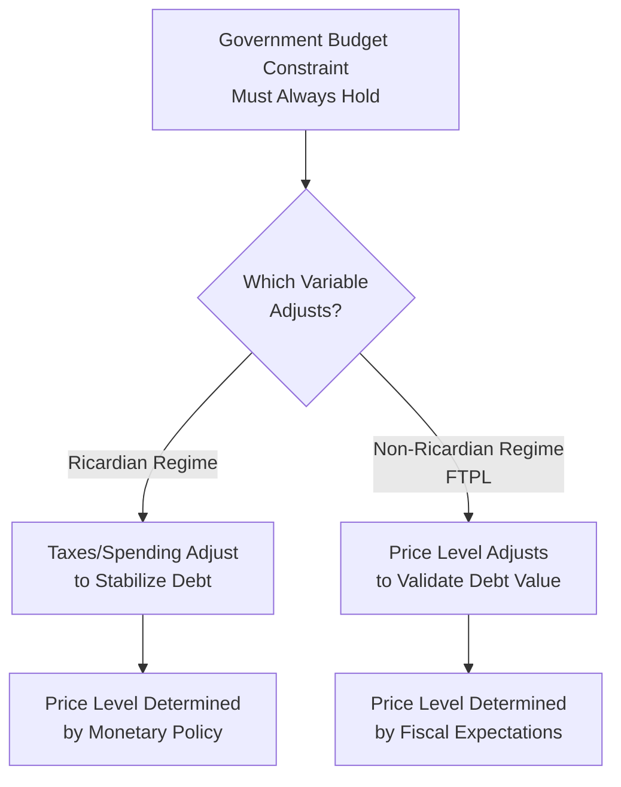

## The Fiscal Theory of the Price Level

### Overview

The Fiscal Theory of the Price Level (FTPL) is an approach to price-level determination that treats the government's intertemporal budget constraint as an equilibrium condition rather than as a constraint that fiscal policy must always passively satisfy through adjustment of taxes or spending. Under FTPL, the price level can adjust to ensure the real value of government debt equals the present value of expected future primary surpluses, meaning fiscal policy—not only monetary policy—can be a fundamental determinant of inflation. The theory, developed primarily by Michael Woodford, Christopher Sims, and Eric Leeper in the early-to-mid 1990s, represents a significant and still-debated departure from conventional monetarist and New Keynesian views in which the price level is determined solely by money supply or central bank interest rate rules.

### Conventional View vs. FTPL: The Core Distinction

**Key Points**

- In the **conventional ("Ricardian") view**, the government budget constraint is treated as always satisfied via fiscal adjustment: if debt rises, the public expects future taxes to rise or spending to fall enough to service that debt, regardless of the price level. Under this view, the price level is determined independently by monetary policy (money supply growth or interest rate rules), and fiscal policy simply adjusts passively in the background
- Under the **FTPL ("non-Ricardian") view**, fiscal policy is instead treated as following an independent rule (e.g., a government commits to a path of primary surpluses that does not automatically adjust to stabilize debt), and the price level becomes the equilibrating variable: it moves to ensure the real value of nominal debt matches the present value of expected surpluses
- The key distinguishing question in FTPL is not whether the government budget constraint holds (it always must, as an accounting identity) but *which variable adjusts to make it hold*: taxes/spending (conventional view) or the price level (FTPL)

### The Core FTPL Equation

**Key Points**

- The central relationship in FTPL is a valuation equation for government debt, analogous to valuing a financial asset by discounting its future cash flows:

$$\frac{B_{t-1}}{P_t} = E_t \sum_{j=0}^{\infty} \beta^j PS_{t+j}$$

where $B_{t-1}$ is the nominal value of government debt outstanding at the start of period $t$, $P_t$ is the price level, $\beta$ is the discount factor, and $PS_{t+j}$ is the expected real primary surplus in period $t+j$

- This equation states that the real value of government debt ($B_{t-1}/P_t$) must equal the present discounted value of all expected future primary surpluses
- Under FTPL, if the government commits to a fiscal rule generating a *given, fixed* sequence of expected surpluses independent of the debt level (a non-Ricardian policy), then $P_t$ must adjust to equate the left and right sides
- If expected future surpluses fall (e.g., a tax cut is announced with no offsetting future surplus increase), the theory implies $P_t$ must rise (the price level increases) so that the real value of existing debt falls to match the lower present value of surpluses, generating inflation through a channel entirely independent of the money supply

**Example**

Consider a government that unexpectedly announces a permanent tax cut, explicitly stating it does not intend to raise future taxes or cut future spending to compensate (a non-Ricardian fiscal announcement). Under FTPL, bondholders reassess: the debt is no longer fully backed by future surpluses. To restore the accounting identity, the real value of existing nominal government bonds must fall—the mechanism is a jump in the current price level $P_t$, which produces immediate (not just future) inflation, illustrating how FTPL can generate inflation from a purely fiscal shock without any change in money supply growth.

### Monetary and Fiscal Policy Regime Combinations (Leeper's Taxonomy)

**Key Points**

- Eric Leeper's influential 1991 framework classifies policy regimes along two dimensions: whether monetary policy is "active" or "passive," and whether fiscal policy is "active" or "passive"
- **Active monetary / passive fiscal (AM/PF)**: the traditional monetarist/New Keynesian regime; the central bank sets policy to control inflation (e.g., via a Taylor-rule-consistent response to inflation), and fiscal policy passively adjusts surpluses to ensure debt sustainability at whatever price level monetary policy delivers. This is the conventional Ricardian regime
- **Passive monetary / active fiscal (PM/AF)**: the FTPL regime; fiscal policy sets primary surpluses independently of the debt level (not adjusting to stabilize it), and monetary policy must accommodate, with the price level adjusting to satisfy the valuation equation. Monetary policy in this configuration cannot independently anchor inflation even if it wants to
- For overall macroeconomic stability (a unique, non-explosive equilibrium), exactly one of the two policy authorities must be "active" while the other is "passive"; combinations where both are simultaneously active or both simultaneously passive can generate indeterminacy or explosive dynamics in standard models
- This taxonomy reframes central bank independence debates: even a fully "independent" and inflation-focused central bank cannot control the price level if fiscal policy is in an "active" (non-adjusting) stance, according to FTPL logic

**[Inference]** Leeper's active/passive taxonomy is widely used as an organizing framework in the FTPL literature, but classifying any real-world country's regime as one or the other in practice is inherently an empirical judgment call subject to debate, since actual policy behavior is rarely a clean textbook case.

### Key Contributors and Foundational Papers

**Key Points**

- **Eric Leeper (1991)**: "Equilibria under 'active' and 'passive' monetary and fiscal policies," establishing the active/passive regime taxonomy foundational to later FTPL work
- **Michael Woodford** (multiple papers in the 1990s and 2000s, and his 2003 book *Interest and Prices*): developed much of the formal theoretical apparatus for FTPL within New Keynesian-style models, including conditions for price-level determinacy
- **Christopher Sims** (multiple papers from the early 1990s onward): independently developed related ideas, emphasizing that the price level can be viewed as adjusting to equate the real value of government liabilities to the present value of surpluses; Sims later received the 2011 Nobel Memorial Prize in Economic Sciences (shared with Thomas Sargent) for related work on causal relationships in macroeconomics, and remains a prominent contemporary advocate for FTPL-based analysis of inflation
- **Sargent and Wallace's "Unpleasant Monetarist Arithmetic" (1981)**: though predating the formal FTPL literature, this paper is often considered an important intellectual precursor, since it demonstrated that monetary and fiscal policy cannot be analyzed independently given the shared budget constraint

### FTPL and Historical/Contemporary Applications

**Key Points**

- FTPL-style reasoning has been invoked to help explain historical hyperinflations (Weimar Germany, Hungary, Zimbabwe) as extreme cases where fiscal deficits were financed with no credible expectation of future surplus generation, forcing price-level adjustment (inflation) to restore budget balance in present-value terms
- The theory has also been applied to debates about the effects of large-scale fiscal expansions in advanced economies (for example, discussions following the fiscal responses to the 2008 financial crisis and the COVID-19 pandemic), where some economists, notably Sims, have argued that persistently large deficits without credible future surplus commitments could contribute to inflationary pressure through fiscal-theoretic channels rather than purely through conventional monetary transmission
- FTPL has also been used to analyze the challenges of currency unions (such as the Eurozone), where a shared central bank (the ECB) interacts with multiple independent national fiscal authorities, raising questions about which country's fiscal stance might influence eurozone-wide price-level dynamics

**[Speculation]** The extent to which FTPL mechanisms meaningfully explain recent (post-2020) inflation episodes in advanced economies, as opposed to conventional supply-shock and monetary-policy explanations, remains an actively contested empirical question among macroeconomists as of the current period, and should be treated as an open research debate rather than settled consensus.

### Critiques and Controversies

**Key Points**

- A central critique, associated with economists such as Willem Buiter and others, argues that FTPL confuses the government's budget constraint (which must hold as an accounting identity under any policy in a well-defined equilibrium) with a genuinely independent equilibrium condition; critics argue this represents a mathematical reinterpretation rather than a new economic mechanism
- Some critics argue that in a fully specified model with well-defined fiscal and monetary rules and a transversality condition, the price level is still ultimately tied down by monetary policy in most conventional formulations, and that FTPL's "non-Ricardian" fiscal policy assumption is an unusual and empirically hard-to-verify special case rather than the norm
- Proponents respond that the theory is not making a claim about accounting identities but about which economic mechanism (monetary vs. fiscal expectations) is doing the equilibrating work, and that this is testable in principle by examining how prices respond to fiscal versus monetary shocks
- The debate remains unresolved in the mainstream literature, with FTPL treated as a legitimate but non-consensus branch of monetary theory, actively used by some central banks and researchers as one lens among several for understanding inflation dynamics

**[Inference]** The characterization of FTPL as "non-consensus but legitimate" reflects the general tenor of academic discussion as of the available literature; it is a summary judgment about the field's reception rather than a documented formal survey result, and individual economists' views on the theory's validity vary considerably.

### Relevance to Monetary Economics

**Key Points**

- FTPL provides an alternative theoretical lens to conventional quantity-theory-based views of inflation, emphasizing that fiscal credibility and expectations about future surpluses can be as important as money supply or interest rate policy in determining the price level
- It has direct relevance to policy debates about central bank independence: it suggests that even a nominally independent, inflation-targeting central bank may be unable to control inflation if it operates alongside a fiscal authority pursuing a non-adjusting ("active") fiscal stance
- It connects closely to the government budget constraint and seigniorage analysis, extending single-period seigniorage logic into a full intertemporal, expectations-driven theory of price-level determination
- Understanding FTPL is useful for interpreting ongoing debates about the inflationary risks of persistent large fiscal deficits, sovereign debt sustainability, and the limits of monetary policy independence under fiscal dominance

**Related Topics**

- Leeper's active/passive monetary-fiscal policy taxonomy
- The government budget constraint and seigniorage
- Sargent and Wallace's "Unpleasant Monetarist Arithmetic"
- Ricardian equivalence and non-Ricardian fiscal regimes
- Central bank independence and fiscal dominance
- New Keynesian models of price-level determinacy
- Modern Monetary Theory (MMT) and comparisons to FTPL
- Historical hyperinflations: Weimar Germany, Hungary, Zimbabwe