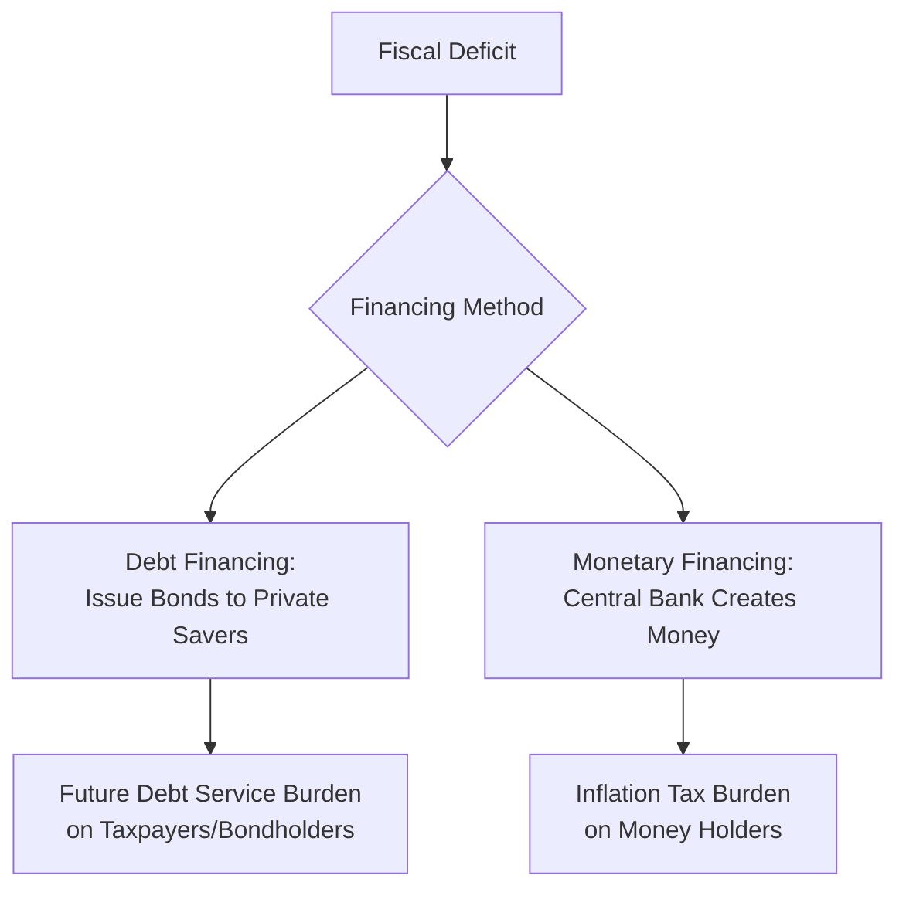

## Monetary Financing Versus Debt Financing of Deficits

### Overview

Governments running fiscal deficits must finance the shortfall between spending and tax revenue through one of two fundamental channels: issuing interest-bearing debt to be repaid (and serviced) with future resources, or having the central bank create money to directly or indirectly fund the deficit (monetary financing, sometimes called "printing money" or, in its direct form, debt monetization). The choice between these financing methods has profound implications for inflation, central bank independence, debt sustainability, and macroeconomic stability, and represents one of the most consequential decisions embedded in the government budget constraint.

### The Two Financing Channels

**Key Points**

- **Debt financing**: the government issues bonds (Treasury securities) purchased by private investors, other governments, or institutions, promising future repayment with interest; the deficit is covered without an immediate increase in the money supply
- **Monetary financing**: the central bank creates new money (increases the monetary base) and uses it to purchase government debt directly, effectively lending to the government without recourse to private savings; this can occur through direct primary-market purchases or, more commonly in modern practice, through large-scale secondary-market asset purchases that indirectly accommodate government borrowing
- Both channels satisfy the same government budget constraint identity, but they differ fundamentally in *who bears the cost*: debt financing shifts the burden to future taxpayers (who must service the debt) or to current bondholders (who bear interest rate/inflation risk), while monetary financing shifts the burden to holders of money and near-money assets through the inflation tax

### Direct Monetary Financing (Debt Monetization)

**Key Points**

- **Direct monetary financing** occurs when a central bank purchases government bonds directly from the treasury in the primary market, effectively printing money to fund government spending with no intermediating private bond market transaction
- Historically common (e.g., many central banks in the 19th and early 20th centuries routinely provided direct advances or overdraft facilities to their treasuries), but is now explicitly prohibited by law in most advanced economies specifically because of its historical association with fiscal abuse and hyperinflation
- For example, Article 123 of the Treaty on the Functioning of the European Union explicitly prohibits the ECB and eurozone national central banks from direct primary-market purchases of member-state government debt or providing overdraft facilities to public authorities
- The US Federal Reserve is similarly generally restricted from purchasing Treasury securities directly from the Treasury in the primary market under normal circumstances, instead conducting open market operations in the secondary market

**[Inference]** The near-universal legal prohibition on direct monetary financing among advanced-economy central banks reflects a broad post-hyperinflation-era institutional consensus (strongly informed by episodes like Weimar Germany's collapse) about the dangers of unconstrained treasury access to the printing press, though the specific legal mechanisms and exceptions vary by jurisdiction.

### Indirect Monetary Financing and Quantitative Easing

**Key Points**

- Modern central banks typically do not engage in direct monetization but can achieve functionally similar outcomes through **large-scale secondary-market asset purchases**, commonly known as **quantitative easing (QE)**
- Under QE, a central bank purchases government bonds from private holders (banks, pension funds, other investors) in the secondary market using newly created bank reserves, expanding the monetary base
- While legally distinct from direct monetization (the government does not receive the money directly; it is exchanged among private and central bank balance sheets), the economic effect can be similar if QE substantially lowers government borrowing costs and effectively absorbs a large share of new debt issuance, particularly if it appears coordinated with the pace of new deficit-driven bond issuance
- Central banks conducting QE generally frame it as serving monetary policy objectives (lowering long-term interest rates, supporting the transmission mechanism, achieving inflation targets) rather than deficit financing, and QE programs implemented by the Fed, ECB, Bank of England, and Bank of Japan following the 2008 financial crisis and during the COVID-19 pandemic were officially justified on these monetary-policy grounds
- The distinction between QE-as-monetary-policy and QE-as-disguised-monetization is a matter of ongoing debate, hinging on the credibility of the central bank's exit strategy and independence: if a central bank retains the willingness and ability to shrink its balance sheet and raise rates independently of fiscal pressure, QE is generally viewed as consistent with monetary independence; if political or fiscal pressures constrain the central bank's ability to reverse course, it more closely resembles fiscal dominance

**[Inference]** Whether specific historical QE episodes (post-2008, post-2020) functioned primarily as independent monetary policy or as de facto deficit accommodation is genuinely disputed among economists and depends partly on unobservable counterfactuals (what would borrowing costs have been absent QE); this content presents the standard analytical distinction rather than a definitive empirical verdict on any specific episode.

### Comparative Effects: Debt Financing vs. Monetary Financing

| Dimension | Debt Financing | Monetary Financing |
| --- | --- | --- |
| Immediate inflation effect | Minimal (no direct money supply increase) | Direct upward pressure via money supply growth |
| Who bears the burden | Future taxpayers / bondholders (interest rate/rollover risk) | Money holders (inflation tax) |
| Effect on interest rates | Can raise rates if crowding out occurs | Can suppress rates in the short run (QE-style effects) |
| Sustainability constraint | Limited by debt-to-GDP dynamics and market willingness to lend | Limited by inflation tax Laffer curve and money demand collapse |
| Institutional safeguards | Market discipline (bond yields, credit ratings) | Central bank independence, legal prohibitions on direct monetization |
| Historical extreme case | Sovereign debt crises, default (e.g., Argentina 2001) | Hyperinflation (Weimar Germany, Hungary, Zimbabwe) |

### The Crowding-Out Debate in Debt Financing

**Key Points**

- Conventional theory suggests that debt-financed deficits can raise real interest rates by increasing the supply of bonds competing for a limited pool of private savings, potentially "crowding out" private investment (the traditional loanable funds mechanism)
- Whether crowding out is empirically significant depends on factors such as the state of the economy (crowding out is theoretically more likely near full employment / potential output, less likely in a liquidity trap or recession with excess saving), the openness of the economy to foreign capital inflows (which can offset domestic crowding out), and the credibility/currency status of the borrowing government (reserve currency issuers like the US face different constraints than smaller open economies)
- **Ricardian equivalence** (associated with Robert Barro) offers a countervailing view: if households are forward-looking and understand that debt-financed deficits imply future tax increases to service that debt, they may increase private saving today in anticipation, offsetting the deficit's effect on aggregate demand and interest rates entirely; empirical support for strict Ricardian equivalence is generally considered weak to partial

### Debt Sustainability Limits on Debt Financing

**Key Points**

- Debt financing is not unlimited: growing debt-to-GDP ratios can eventually trigger rising risk premia, credit rating downgrades, or outright loss of market access, forcing a government toward either fiscal consolidation, monetary financing, or default/restructuring
- The debt dynamics equation is commonly expressed as:

$$\Delta d_t = (r_t - g_t) d_{t-1} - pb_t$$

where $d_t$ is the debt-to-GDP ratio, $r_t$ is the real interest rate on debt, $g_t$ is the real GDP growth rate, and $pb_t$ is the primary balance (surplus) as a share of GDP

- When the interest rate exceeds the growth rate ($r > g$), debt-to-GDP tends to grow automatically unless offset by sufficiently large primary surpluses, creating a "debt snowball" dynamic that can pressure governments toward alternative financing (including monetary financing) if political constraints prevent adequate fiscal adjustment
- This dynamic is central to debates about fiscal space in both advanced economies (post-pandemic debt levels) and emerging markets (currency and rollover risk)

### Monetary Financing Limits: The Inflation Tax Laffer Curve

**Key Points**

- As discussed in the government budget constraint and seigniorage framework, monetary financing faces its own sustainability limit: beyond a revenue-maximizing inflation rate, further money creation reduces real seigniorage revenue because real money demand falls faster than nominal money supply rises
- This explains why monetary financing, when pushed to cover large and persistent deficits, tends to produce accelerating rather than stable high inflation, as observed in all major historical hyperinflation episodes
- Unlike debt financing, which is constrained by market willingness to hold government bonds at a given yield, monetary financing is constrained by the public's willingness to hold real money balances at a given inflation rate—both are ultimately forms of market discipline, operating through different channels

### Institutional Safeguards Against Excessive Monetary Financing

**Key Points**

- Central bank independence is widely viewed in the modern monetary economics literature as the primary institutional safeguard against excessive resort to monetary financing, since an independent central bank can refuse to accommodate treasury financing needs even under political pressure
- Legal prohibitions on direct primary-market central bank purchases of government debt (as in the EU treaty framework) provide an additional formal constraint
- Explicit inflation targets and transparent communication frameworks are intended to anchor expectations and make any drift toward de facto monetary financing more visible and costly to central bank credibility
- **[Inference]** The effectiveness of these safeguards is generally supported by cross-country evidence linking greater central bank independence to lower average inflation, though the causal direction and the role of other confounding institutional factors (rule of law, fiscal institutions) remain subjects of ongoing empirical research.

### Relevance to Monetary Economics

**Key Points**

- This distinction operationalizes the government budget constraint and seigniorage framework into a practical policy choice with direct implications for inflation, central bank credibility, and debt sustainability
- It underlies the Fiscal Theory of the Price Level's active/passive fiscal-monetary regime taxonomy: a government persistently favoring monetary financing over debt financing (or one where debt financing itself becomes unsustainable) is effectively operating in an "active fiscal" regime that can undermine monetary policy independence
- Understanding these financing channels is essential for evaluating contemporary policy debates, including the appropriate limits of quantitative easing, the risks of Modern Monetary Theory-style proposals for expansive monetary financing, and debt sustainability concerns in both advanced and emerging economies

**Related Topics**

- The government budget constraint and seigniorage
- The Fiscal Theory of the Price Level
- Ricardian equivalence and its empirical validity
- Quantitative easing: mechanics and central bank balance sheet policy
- Debt sustainability analysis and the $r$ vs. $g$ debate
- Central bank independence: legal frameworks and measurement
- Modern Monetary Theory (MMT) and its critiques
- Historical hyperinflations: Weimar Germany, Hungary, Zimbabwe