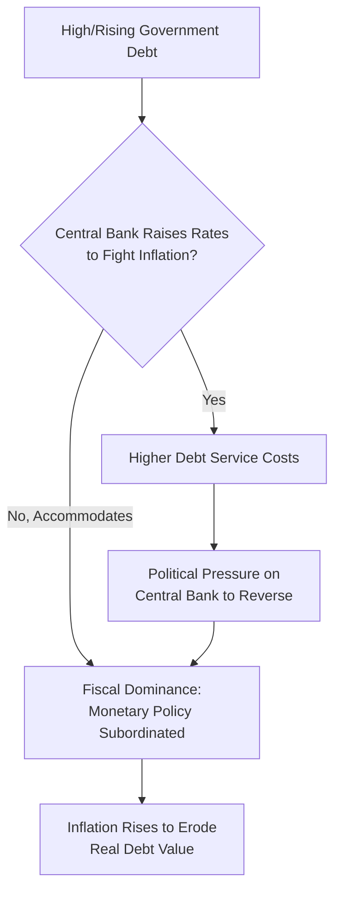

## Central Bank Independence and Fiscal Dominance

### Overview

Central bank independence (CBI) refers to the degree of insulation a central bank has from short-term political and fiscal pressures in setting monetary policy. Fiscal dominance describes the opposite condition: a regime in which fiscal policy needs effectively override monetary policy objectives, forcing the central bank to accommodate government financing requirements even at the cost of its price-stability mandate. The relationship between these two concepts is central to modern monetary economics, connecting institutional design, credibility theory, historical experience with hyperinflation, and ongoing debates about the limits of central bank autonomy in high-debt environments.

### Defining Central Bank Independence

**Key Points**

- CBI is typically decomposed into several dimensions rather than treated as a single binary attribute:
  - **Goal independence**: the central bank's authority to define its own policy objectives (e.g., choosing its own inflation target)
  - **Instrument independence**: the central bank's authority to choose how to achieve a given objective (e.g., setting interest rates) without political interference, even if the objective itself (such as an inflation target) is set externally by government
  - **Personnel independence**: protections such as fixed, staggered terms for central bank leadership, insulation from arbitrary dismissal, and appointment processes designed to reduce short-term political influence
  - **Financial independence**: the central bank's ability to operate without being financially dependent on government appropriations, and legal restrictions preventing the government from compelling the central bank to finance deficits
- Most modern advanced-economy central banks (the Bundesbank historically, the ECB, the Federal Reserve, the Bank of England since 1997) have **instrument independence** but **not full goal independence**—inflation targets or mandates are typically set by government or legislature, with the central bank independently choosing how to hit them

### Measuring Central Bank Independence

**Key Points**

- Several indices have been developed to quantify CBI across countries and time for empirical research, most notably the **Cukierman index** (developed by Alex Cukierman in the late 1980s/early 1990s), which scores central banks on legal characteristics such as appointment procedures, policy formulation authority, objectives, and limitations on lending to government
- Other measures include the **GMT index** (Grilli, Masciandaro, and Tabellini, 1991) and more recent updated indices reflecting post-2000s institutional reforms
- These indices are used extensively in cross-country empirical studies examining the relationship between measured independence and average inflation outcomes
- **[Inference]** While cross-country studies generally find a negative correlation between measured central bank independence and average inflation (particularly among advanced economies), the causal interpretation of this relationship is debated, since more independence-friendly institutional reforms may themselves be a symptom of a broader political commitment to low inflation rather than a wholly separate causal factor; this is a well-known identification challenge in the empirical CBI literature.

### Theoretical Foundations: Time Inconsistency

**Key Points**

- The theoretical case for central bank independence rests heavily on the **time-inconsistency problem** in monetary policy, formalized by Finn Kydland and Edward Prescott (1977) and further developed by Robert Barro and David Gordon (1983)
- The core insight: a government or central bank that can freely reoptimize each period has an incentive to generate surprise inflation to temporarily boost output/employment (via a Phillips-curve-type relationship) or to reduce the real value of outstanding nominal government debt, even though rational agents anticipate this incentive and adjust their inflation expectations upward accordingly, resulting in higher average inflation with no corresponding output gain (the "inflation bias" result)
- Delegating monetary policy to an independent central bank with a strong anti-inflation mandate (sometimes modeled as appointing a "conservative" central banker per Kenneth Rogoff's 1985 model, who weights inflation aversion more heavily than the median voter) is a proposed institutional solution to this credibility problem, since it removes short-term political discretion from the inflation-generating process

$$\pi^{discretion} = \pi^{target} + \frac{\lambda \cdot y^*}{\alpha}$$

where the inflation bias term depends on the weight placed on output objectives ($\lambda$), the desired above-potential output gap ($y^*$), and the slope of the Phillips curve relationship ($\alpha$); a fully time-consistent, credible commitment eliminates this bias term

**[Inference]** The Kydland-Prescott/Barro-Gordon framework is foundational and widely taught, but its precise quantitative predictions depend on specific modeling assumptions (the exact Phillips curve specification, the source of the output-inflation trade-off) that are simplifications of more complex real-world dynamics; the qualitative "inflation bias under discretion" insight is the more robust and widely accepted takeaway.

### Fiscal Dominance: Definition and Mechanisms

**Key Points**

- **Fiscal dominance** occurs when the intertemporal government budget constraint effectively forces monetary policy to accommodate fiscal financing needs, regardless of the central bank's nominal independence or stated objectives
- This can occur through several channels:
  - **Direct pressure**: political pressure on central bank leadership to keep interest rates low to reduce government debt service costs, particularly salient when government debt-to-GDP ratios are high
  - **Balance sheet risk**: if a central bank holds large quantities of government debt (e.g., following extensive QE), rising interest rates to combat inflation could generate central bank losses, creating political friction if the central bank requires government recapitalization
  - **Debt sustainability constraints**: as formalized in Sargent and Wallace's "Unpleasant Monetarist Arithmetic" and the Fiscal Theory of the Price Level, if fiscal policy is unwilling to generate sufficient future primary surpluses, the central bank may be mathematically compelled to accommodate via money creation regardless of its stated independence, since the government budget constraint must hold as an identity
- Fiscal dominance does not require formal loss of legal independence; it can emerge de facto even when a central bank retains full legal authority, if market or political conditions make maintaining price stability practically incompatible with fiscal sustainability

### Historical Illustrations of Fiscal Dominance

**Key Points**

- **Weimar Germany (1921–1923)**: the Reichsbank's accommodation of government financing needs (war reparations, Ruhr occupation resistance payments) represents a textbook case of fiscal dominance culminating in hyperinflation
- **Zimbabwe (2000s)**: the Reserve Bank of Zimbabwe's financing of government spending and quasi-fiscal agricultural subsidies, despite nominal central bank authority, illustrates fiscal dominance in a contemporary emerging-market context
- **Post-WWII United States (1942–1951)**: the Federal Reserve maintained an explicit interest-rate ceiling on government bonds to support wartime and postwar debt financing, a formal, publicly acknowledged period of fiscal dominance that ended only with the 1951 Treasury-Federal Reserve Accord, which restored the Fed's independent authority over interest rates
- The 1951 Accord is frequently cited in monetary economics as a landmark case study of a deliberate institutional transition *away* from fiscal dominance toward monetary independence

**[Inference]** The 1951 Treasury-Fed Accord is well-documented as a formal institutional turning point; characterizing the full extent and consequences of the preceding fiscal dominance period (1942-1951) involves some interpretive judgment about counterfactual monetary policy that would have prevailed absent the ceiling, which is a matter of historical-economic interpretation rather than directly observable fact.

### Fiscal Dominance and the Fiscal Theory of the Price Level

**Key Points**

- Fiscal dominance corresponds closely to Leeper's "passive monetary / active fiscal" (PM/AF) regime classification within the Fiscal Theory of the Price Level framework: fiscal policy sets an independent path (not adjusting to stabilize debt), forcing monetary policy into an accommodative, price-level-equilibrating role
- Under this lens, fiscal dominance is not merely a political-economy description but has a precise formal characterization: the price level becomes determined by fiscal expectations rather than by the central bank's reaction function, even if the central bank nominally retains legal independence
- This connects central bank independence debates directly to the broader intertemporal government budget constraint literature, showing that "independence" in a narrow legal/institutional sense does not guarantee monetary dominance in a deeper economic sense if fiscal policy is fundamentally unsustainable

### Contemporary Relevance: High Public Debt and QE-Era Concerns

**Key Points**

- The large-scale expansion of central bank balance sheets through quantitative easing following the 2008 financial crisis and the COVID-19 pandemic has renewed academic and policy debate about whether major central banks (the Fed, ECB, Bank of England, Bank of Japan) face growing fiscal dominance risk, given historically elevated public debt-to-GDP ratios in many advanced economies
- Concerns center on whether central banks will be able to raise interest rates as needed to control inflation without generating politically untenable increases in government debt service costs or central bank balance sheet losses
- The Bank of Japan is frequently cited as a case where sustained, large-scale government bond purchases and yield curve control (adopted 2016) have raised long-standing questions about the boundary between monetary policy and fiscal accommodation, given Japan's very high public debt-to-GDP ratio
- **[Speculation]** Whether any major advanced-economy central bank is currently operating under genuine fiscal dominance (as opposed to independently chosen accommodative policy) is not empirically settled and is the subject of ongoing academic disagreement; specific real-time claims about any given country's regime status should be treated as contested interpretation rather than established fact.

### Safeguards and Institutional Design Against Fiscal Dominance

**Key Points**

- Legal prohibitions on direct central bank financing of government deficits (e.g., Article 123 TFEU in the EU)
- Formal central bank independence with protected leadership tenure and instrument independence
- Transparent, rules-based fiscal frameworks (fiscal rules, debt ceilings, structural balance targets) intended to keep fiscal policy on a sustainable path that does not require monetary accommodation
- Clear separation of central bank balance sheet risk from fiscal policy (e.g., explicit indemnification agreements between treasuries and central banks for asset purchase program losses, as used by the Bank of England)
- Robust, credible inflation-targeting frameworks intended to anchor expectations and make any drift toward fiscal accommodation more visible and reputationally costly

### Relevance to Monetary Economics

**Key Points**

- The tension between central bank independence and fiscal dominance is a central organizing theme connecting time-inconsistency theory, the government budget constraint, the Fiscal Theory of the Price Level, and historical experience with monetary financing and hyperinflation
- Understanding this relationship clarifies why nominal legal independence does not guarantee actual monetary policy autonomy if underlying fiscal conditions are unsustainable
- These concepts are directly relevant to ongoing policy debates about central bank balance sheet policy, debt sustainability in high-debt advanced economies, and the appropriate institutional boundaries between fiscal and monetary authorities

**Related Topics**

- Time inconsistency and the Kydland-Prescott/Barro-Gordon inflation bias model
- The Fiscal Theory of the Price Level
- The government budget constraint and seigniorage
- Monetary financing versus debt financing of deficits
- The 1951 Treasury-Federal Reserve Accord
- Bank of Japan yield curve control and balance sheet policy
- Rogoff's "conservative central banker" model
- Founding of major central banks