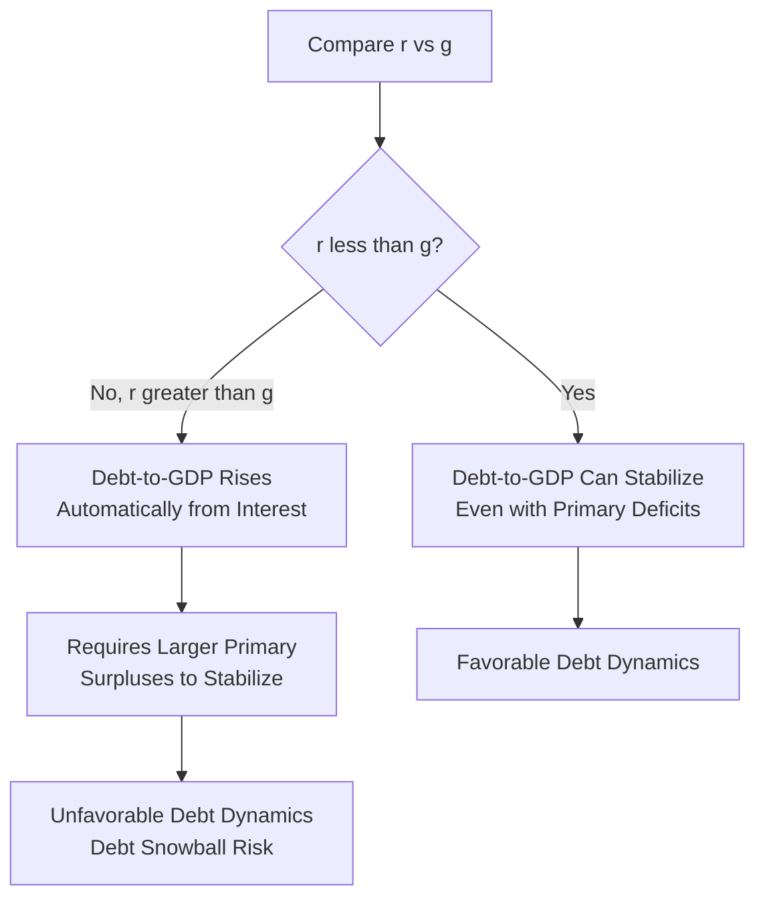
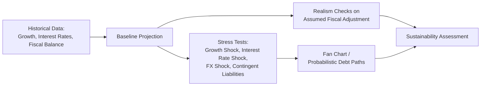

## Public Debt Sustainability Analysis

### Overview

Public debt sustainability analysis (DSA) is the framework used to assess whether a government's current and projected fiscal policies are consistent with a stable or controllable debt-to-GDP trajectory over time, without requiring extraordinary adjustment, monetary financing, or default. DSA combines accounting identities (the debt dynamics equation), macroeconomic projections (growth, interest rates, inflation), and policy assumptions (primary balances) to evaluate long-run fiscal viability. It is used extensively by institutions such as the IMF and World Bank, credit rating agencies, and academic researchers, and connects directly to the government budget constraint, fiscal dominance, and the Fiscal Theory of the Price Level.

### The Core Debt Dynamics Equation

**Key Points**

- The fundamental relationship governing the evolution of the debt-to-GDP ratio is derived from the government budget constraint and is typically written as:

$$d_t - d_{t-1} = \left(\frac{r_t - g_t}{1+g_t}\right) d_{t-1} - pb_t + sfa_t$$

where $d_t$ is the debt-to-GDP ratio, $r_t$ is the effective (real) interest rate on debt, $g_t$ is the real GDP growth rate, $pb_t$ is the primary balance (surplus positive, deficit negative) as a share of GDP, and $sfa_t$ represents "stock-flow adjustments" (factors affecting debt not captured by the deficit, such as valuation effects on foreign-currency debt, privatization proceeds, or the recognition of contingent liabilities)

- A simplified and widely used approximation drops the denominator term for small $g_t$:

$$\Delta d_t \approx (r_t - g_t) d_{t-1} - pb_t$$

- This equation is the analytical backbone of essentially all formal debt sustainability assessments: debt dynamics are favorable (debt-to-GDP tends to fall) when the primary balance is in surplus and/or when growth exceeds the interest rate on debt; debt dynamics are unfavorable (debt-to-GDP tends to rise) when there are primary deficits and/or when the interest rate exceeds growth

### The Critical $r$ vs. $g$ Relationship

**Key Points**

- The relationship between the effective interest rate on government debt ($r$) and the economy's real growth rate ($g$) is often called the single most important parameter in debt sustainability analysis
- When $r < g$ (sometimes summarized as "$r - g$ is negative"), a government can theoretically run a primary deficit indefinitely while keeping debt-to-GDP stable or falling, since growth outpaces the cost of servicing existing debt (a dynamic sometimes referred to in academic and policy discussions, notably by economist Olivier Blanchard in his influential 2019 presidential address to the American Economic Association, as making debt "less costly" than conventionally assumed)
- When $r > g$, debt-to-GDP tends to grow automatically from interest costs alone unless offset by sufficiently large and sustained primary surpluses, creating what is sometimes called a "debt snowball" effect
- Historically, in many advanced economies, $r$ has been below $g$ for extended periods (particularly the low-interest-rate environment of the 2010s), a pattern that generated substantial academic debate about how much this favorable configuration should be relied upon for fiscal planning, especially given interest rate increases seen in the 2022–2023 period

**[Inference]** Blanchard's argument that low $r-g$ substantially reduces the welfare cost of debt is an influential but contested position within the macroeconomics profession; other economists emphasize that $r-g$ can fluctuate unpredictably and that relying on a persistently favorable interest-growth differential carries risk, so this remains an active area of debate rather than settled consensus.

### The Debt-Stabilizing Primary Balance

**Key Points**

- A key DSA output is the **debt-stabilizing primary balance**: the primary balance (as a share of GDP) required to hold the debt-to-GDP ratio constant, given assumed values of $r$ and $g$

$$pb^{*} = \left(\frac{r - g}{1+g}\right) d_{t-1}$$

- If a country's actual (or projected) primary balance falls short of $pb^*$, debt-to-GDP is projected to rise over time; if it exceeds $pb^*$, the ratio is projected to fall
- This metric is frequently used by institutions like the IMF to communicate concisely how much fiscal adjustment (spending cuts or tax increases) would be needed to achieve debt stabilization under given growth and interest rate assumptions

**Example**

If a country has a debt-to-GDP ratio of 100%, a real interest rate of 3%, and real GDP growth of 1%, the debt-stabilizing primary balance is approximately $(0.03 - 0.01)/(1.01) \times 100 \approx 1.98\%$ of GDP—meaning the government would need to run a primary surplus of roughly 2% of GDP just to keep the debt ratio from rising, all else equal.

### Standard DSA Methodology: Baseline and Stress Testing

**Key Points**

- A typical formal DSA (as conducted by the IMF and similar institutions) proceeds through several components:
  - **Baseline scenario**: projects debt dynamics forward under a "most likely" set of assumptions for growth, interest rates, inflation, and the primary balance path, usually over a 5–10 year horizon
  - **Realism of baseline assumptions**: checks whether projected fiscal adjustment (the assumed improvement in primary balance) is plausible given the country's historical track record of fiscal consolidation
  - **Sensitivity/stress tests**: examines how debt dynamics respond to shocks such as lower growth, higher interest rates, currency depreciation (for foreign-currency debt), or contingent liability realization (e.g., bank bailouts, state-owned enterprise losses)
  - **Fan charts / stochastic simulations**: many modern DSAs (particularly IMF frameworks) generate probabilistic debt paths using Monte Carlo-style simulations drawing from historical shock distributions, producing a visual "fan" of possible outcomes rather than a single deterministic path, communicating uncertainty explicitly
- The IMF's DSA framework is formally differentiated between countries with "market access" and those in or at risk of debt distress, applying somewhat different analytical thresholds and requirements accordingly

### Distinguishing Solvency from Liquidity Risk

**Key Points**

- **Solvency** refers to whether a government's debt is sustainable in present-value terms over the long run—essentially, whether the intertemporal government budget constraint can be satisfied given plausible future primary surpluses (directly connecting to the Fiscal Theory of the Price Level's valuation equation)
- **Liquidity risk** refers to a government's ability to meet near-term financing needs (rolling over maturing debt, covering near-term deficits) even if it may be solvent over a longer horizon; a solvent government can still face a liquidity crisis if it cannot access markets to roll over debt at reasonable cost, particularly relevant for governments with debt denominated in foreign currency or with short average debt maturity
- This distinction matters because self-fulfilling liquidity crises (a "bad equilibrium" where fear of default drives up borrowing costs, which itself causes default) are a recognized phenomenon in the sovereign debt literature, distinct from a pure fundamentals-driven solvency problem
- Debt maturity structure, currency composition, and the presence of a domestic vs. foreign investor base for government debt are all important determinants of liquidity risk independent of the underlying solvency picture

### Currency Denomination and "Original Sin"

**Key Points**

- Debt sustainability differs materially depending on whether debt is denominated in domestic or foreign currency
- Countries that borrow extensively in foreign currency face additional risk: currency depreciation directly increases the domestic-currency value of debt service, a phenomenon termed **"original sin"** in the sovereign debt literature (associated with economists Barry Eichengreen and Ricardo Hausmann), historically affecting many emerging market economies unable to borrow internationally in their own currency
- Countries able to borrow in their own currency (as most advanced economies can) have additional flexibility, since they can in principle use monetary policy (including, in extremis, monetary financing) to manage debt service, though this itself raises the fiscal dominance concerns discussed elsewhere
- This distinction is central to why debt sustainability thresholds and analytical frameworks differ substantially between advanced and emerging/developing economies in institutional practice (e.g., IMF frameworks explicitly differ for these country groups)

### Contingent Liabilities and Hidden Debt

**Key Points**

- Formal DSA must account not only for explicit government debt but also **contingent liabilities**: potential future obligations such as state-owned enterprise debt, government guarantees, public pension shortfalls, and banking sector bailout risk, which can materialize suddenly and substantially worsen debt dynamics (as seen in various banking crises where government debt-to-GDP jumped sharply due to bank recapitalization costs, e.g., Ireland and Iceland during 2008–2010)
- Comprehensive DSA frameworks increasingly attempt to stress-test for these contingent risks explicitly, though quantifying unrealized contingent liabilities remains inherently uncertain

### Debt Sustainability and Its Link to Fiscal Dominance and FTPL

**Key Points**

- DSA outputs feed directly into assessments of fiscal dominance risk: a country whose projected primary balances are insufficient to stabilize debt under baseline assumptions ($pb < pb^*$ persistently) is, by construction, at risk of requiring either painful fiscal adjustment, debt restructuring, or central bank accommodation (monetary financing) to resolve the gap
- This connects mechanically to the Fiscal Theory of the Price Level's valuation equation: if markets assess that a government's expected future primary surpluses fall short of what is needed to service outstanding debt at the current price level, FTPL logic suggests the price level itself may need to adjust (generating inflation) to restore the identity, providing a theoretical bridge between conventional DSA and fiscal-theoretic price-level determination
- Conversely, credible fiscal frameworks and demonstrated ability to generate primary surpluses when needed are viewed as key supports for maintaining monetary dominance and central bank independence

### Relevance to Monetary Economics

**Key Points**

- DSA operationalizes the abstract intertemporal government budget constraint into concrete, forward-looking, quantitative assessments used by policymakers, credit markets, and international institutions
- Understanding the $r$ vs. $g$ relationship and the debt-stabilizing primary balance concept is essential for evaluating fiscal space in both advanced and emerging economies, particularly in the current environment of elevated post-pandemic debt levels and higher interest rates than the 2010s
- DSA provides the empirical and analytical link between fiscal policy sustainability and the risks of monetary financing, fiscal dominance, and fiscal-theoretic price-level effects covered elsewhere in this chapter

**Related Topics**

- The government budget constraint and seigniorage
- The Fiscal Theory of the Price Level
- Monetary financing versus debt financing of deficits
- Central bank independence and fiscal dominance
- Sovereign debt crises and restructuring (e.g., Argentina, Greece)
- "Original sin" and emerging market currency mismatch (Eichengreen and Hausmann)
- IMF debt sustainability framework methodology
- Blanchard's "Public Debt and Low Interest Rates" (2019)