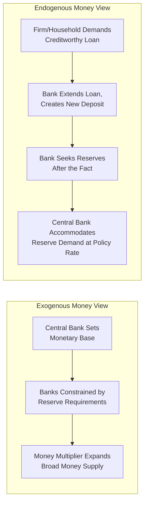

## Post-Keynesian Endogenous Money Theory

### Overview

Post-Keynesian endogenous money theory holds that the money supply is not an exogenous variable controlled directly by the central bank, but rather is created endogenously within the banking system, primarily in response to the demand for credit from firms and households. This stands in sharp contrast to the conventional exogenous money view embedded in traditional monetarist and textbook money-multiplier models, in which the central bank sets the monetary base and the broader money supply expands mechanically through a fixed multiplier. Endogenous money theory, developed primarily by economists including Basil Moore, Nicholas Kaldor, and Victoria Chick, has become increasingly influential in mainstream discussions following the 2008 financial crisis and subsequent central bank research clarifying the mechanics of bank lending and reserve creation.

### The Conventional (Exogenous Money) View

**Key Points**

- The traditional "money multiplier" model, still widely taught in introductory economics, posits a causal sequence: the central bank sets the monetary base (reserves) → banks are constrained by required reserve ratios → bank lending expands the money supply by a predictable multiple of the base → the central bank thereby exogenously controls the total money supply
- Formally: $M = m \times MB$, where $M$ is the broad money supply, $m$ is the money multiplier (typically $1/rr$, where $rr$ is the required reserve ratio), and $MB$ is the monetary base
- This view treats causality as running from reserves to loans: banks must first obtain reserves before they can extend new loans, implying the central bank is the ultimate constraint on credit creation

### The Post-Keynesian Endogenous Money View

**Key Points**

- Endogenous money theorists argue the causal sequence in the conventional model is essentially reversed: banks extend loans first (in response to creditworthy demand from borrowers), which simultaneously creates new bank deposits (new money), and banks subsequently seek any required reserves from the central bank or interbank markets after the lending decision has already been made
- Under this view, the central bank does not directly control the quantity of money; rather, it primarily controls the *price* of reserves (the policy interest rate), and reserves are supplied elastically ("accommodated") by the central bank to meet the payment-system needs generated by banks' prior lending decisions
- This is often summarized by the phrase "loans create deposits, not deposits create loans," directly inverting the textbook multiplier story
- The theory holds that the money supply is thus fundamentally demand-determined (endogenous to the needs of the real economy and the willingness of banks to lend) rather than supply-determined by central bank reserve provision

### Horizontalism vs. Structuralism: Internal Debates

**Key Points**

- Post-Keynesian endogenous money theorists are commonly divided into two broad camps regarding how the central bank's accommodation of reserve demand actually operates:
- **Horizontalist view** (most closely associated with Basil Moore): the central bank sets the short-term interest rate exogenously and then supplies reserves perfectly elastically ("horizontally," i.e., at a fixed price, in whatever quantity banks require) to maintain that target rate and ensure the payment system functions; the money supply curve is effectively horizontal at the policy rate
- **Structuralist view** (associated with economists such as Basil Moore's critics and later refinements, and prominently developed by Marc Lavoie and others): argues that while the central bank does generally accommodate reserve demand to maintain its interest rate target, this accommodation is not entirely passive or costless—banks face increasing liquidity risk premia, changing collateral constraints, and shifting central bank willingness to accommodate under stress, meaning the effective cost of obtaining reserves and credit can still rise with the volume of lending, even without formal reserve requirement constraints
- This distinction matters for how completely "demand-determined" the theory suggests the money supply and credit conditions to be, and remains a subject of ongoing debate within the post-Keynesian tradition itself

**[Inference]** The horizontalist/structuralist distinction is a well-established internal categorization within post-Keynesian monetary theory, but characterizing precisely where any individual theorist's views fall, or how sharply the two camps actually differ in practice, involves some interpretive judgment, as views have evolved and cross-pollinated over subsequent decades of literature.

### Key Theoretical Contributors

**Key Points**

- **Basil Moore**: author of the influential 1988 book *Horizontalists and Verticalists: The Macroeconomics of Credit Money*, widely regarded as the most systematic and best-known statement of the horizontalist endogenous money position
- **Nicholas Kaldor**: an earlier and highly influential critic of monetarism (particularly through his critiques of UK monetary policy in the late 1970s and 1980s), arguing that the money supply could not be treated as an exogenously controllable policy instrument, laying important groundwork for later endogenous money theorizing
- **Victoria Chick**: contributed extensively to post-Keynesian monetary theory, including work on the evolution of banking systems and stages of credit-money development
- **Hyman Minsky**: while primarily known for the Financial Instability Hypothesis, Minsky's work on the endogenous creation of credit and financial fragility over the business cycle is closely related to, and often discussed alongside, endogenous money theory
- **Marc Lavoie**: a leading contemporary post-Keynesian economist who has extensively developed and refined the structuralist perspective and broader post-Keynesian monetary theory (often in collaboration with Wynne Godley on stock-flow consistent modeling)

### Relation to Central Bank Practice and the "Money Multiplier Myth" Debate

**Key Points**

- A significant development validating core elements of endogenous money theory came from mainstream central bank research explicitly describing modern bank lending mechanics in terms consistent with the endogenous money view
- Notably, a widely cited 2014 Bank of England Quarterly Bulletin article, "Money Creation in the Modern Economy," explicitly stated that the conventional textbook money multiplier description does not accurately describe how banks and money creation work in modern economies, affirming that commercial banks create money when they make loans, and that central bank reserves do not act as a hard constraint determining the total quantity of lending in the way the traditional multiplier model implies
- Similar acknowledgments have appeared in research and communications from other central banks (including the German Bundesbank and elements of Federal Reserve research), representing significant mainstream convergence toward positions long argued by post-Keynesian economists, even though many mainstream New Keynesian models continued (and continue) to use reserve-based or interest-rate-based frameworks that do not always explicitly foreground the endogenous money mechanism
- This convergence is frequently cited by post-Keynesian economists as vindication of decades of earlier theoretical work that was, for a long period, considered heterodox and outside mainstream monetary economics discourse

**[Inference]** While the 2014 Bank of England article's description of bank money creation is a documented, direct institutional statement, the broader claim that this represents full mainstream "convergence" toward the complete post-Keynesian endogenous money framework (including its horizontalist/structuralist nuances) is an interpretive characterization by proponents of the theory, and some mainstream economists would characterize the areas of agreement as narrower or as already implicit in more sophisticated versions of conventional models.

### Implications for Monetary Policy

**Key Points**

- If money is endogenously created by bank lending decisions rather than exogenously controlled by the central bank, this has significant implications for how monetary policy is understood to operate: rather than controlling the money supply directly, the central bank primarily influences economic activity by setting the short-term interest rate, which affects the cost of credit and thus the *demand* for loans (and indirectly, the willingness of banks to supply credit)
- This reframing is broadly consistent with how most modern central banks (including the Federal Reserve, ECB, and Bank of England) actually describe their own operational frameworks: setting an interest rate target and supplying reserves to accommodate that target, rather than directly targeting monetary aggregates (a practice largely abandoned by major central banks by the 1980s–1990s after earlier monetarist-inspired experiments with money supply targeting proved difficult to implement effectively)
- Endogenous money theory also implies that quantitative easing's effects on the broader economy operate more through portfolio-balance and interest-rate channels (and possibly signaling effects) than through a direct "money multiplier" expansion of bank lending, since expanding bank reserves does not mechanically force additional lending if creditworthy loan demand is not present—a point often raised by post-Keynesian economists in critiquing simplistic "printing money will cause inflation" arguments made about QE, particularly in the post-2008 period when broad money and lending growth remained subdued despite large reserve expansions

### Critiques of Endogenous Money Theory

**Key Points**

- Some mainstream economists argue that while the operational description of bank lending mechanics (loans creating deposits) is broadly accurate and uncontroversial as a matter of banking mechanics, this does not necessarily overturn the broader quantity-theoretic or monetarist conclusion that sustained excessive money/credit growth is still associated with inflation over longer horizons; the debate, in this view, concerns the short-run *mechanics* of money creation more than the long-run *relationship* between money growth and inflation
- Critics also note that even under endogenous money, the central bank retains substantial influence over credit conditions through its interest rate policy, regulatory/macroprudential tools (capital requirements, loan-to-value limits), and potentially through direct reserve requirement policy in jurisdictions that retain them, suggesting the central bank is not entirely without leverage over the pace of credit and money growth even if it does not mechanically "control" the money supply via a fixed multiplier
- **[Inference]** This critique represents a common mainstream response acknowledging the accuracy of endogenous money's institutional description while questioning its stronger policy implications; whether this response adequately addresses post-Keynesian concerns about central bank policy effectiveness is itself a matter of ongoing theoretical disagreement rather than a resolved question.

### Relevance to Monetary Economics

**Key Points**

- Endogenous money theory offers a fundamentally different lens on monetary policy transmission than conventional exogenous-money or textbook money-multiplier frameworks, with direct implications for how quantitative easing, interest rate policy, and credit cycles should be understood
- It connects to broader post-Keynesian and heterodox critiques of mainstream monetary economics, including Minsky's Financial Instability Hypothesis and modern stock-flow consistent modeling approaches
- Its partial validation by central bank research (notably the Bank of England's 2014 clarification) illustrates an important case where heterodox theory has influenced or aligned with evolving mainstream institutional understanding of monetary mechanics
- Understanding this framework is useful context for evaluating debates about Modern Monetary Theory (which shares significant intellectual overlap with endogenous money theory), quantitative easing effectiveness, and the credit-cycle dynamics underlying financial instability

**Related Topics**

- Basil Moore's horizontalist framework and *Horizontalists and Verticalists*
- Hyman Minsky's Financial Instability Hypothesis
- Modern Monetary Theory (MMT) and its relationship to endogenous money
- Stock-flow consistent modeling (Godley and Lavoie)
- Bank of England's "Money Creation in the Modern Economy" (2014)
- Quantitative easing transmission mechanisms
- Credit cycles and financial instability
- Kaldor's critique of monetarism