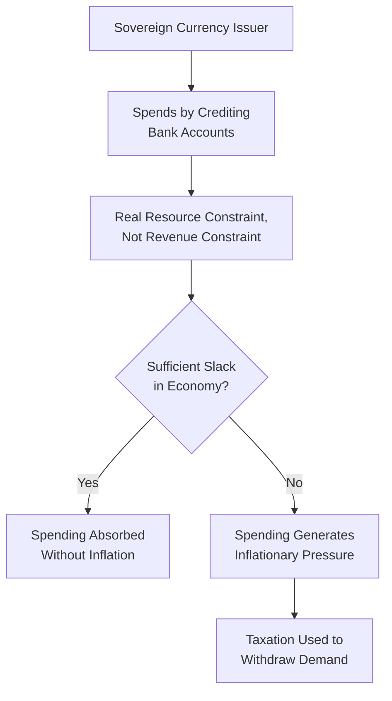

## Modern Monetary Theory: Core Claims and Critiques

### Overview

Modern Monetary Theory (MMT) is a heterodox macroeconomic framework that analyzes the fiscal and monetary options available to sovereign, currency-issuing governments, arguing that conventional constraints on government spending (such as the need to "raise revenue" before spending) are largely a misunderstanding of how fiat monetary systems actually operate. MMT draws heavily on post-Keynesian economics (including chartalism and endogenous money theory) and has gained significant public and policy visibility since the 2010s, particularly through the work of economists such as Warren Mosler, L. Randall Wray, Stephanie Kelton, and Bill Mitchell. It remains highly controversial among mainstream economists, who generally accept some of its descriptive claims about monetary operations while strongly disputing many of its policy conclusions.

### Theoretical Foundations: Chartalism and the State Theory of Money

**Key Points**

- MMT builds on **chartalism**, an older theory of money (associated with economist Georg Friedrich Knapp's early 20th-century work) holding that money derives its value primarily from the state's authority to declare it acceptable for tax payments, rather than from any commodity backing or purely market-based emergence
- Under this view, a government that issues its own fiat currency and imposes tax obligations payable only in that currency creates inherent demand for the currency, since taxpayers must obtain it to meet their obligations, regardless of the currency's lack of intrinsic (commodity) value
- MMT extends this into a broader claim: since the government is the monopoly issuer of its own currency, it cannot be forced into involuntary default on debt denominated in that currency, because it can always create the currency needed to meet nominal obligations—a claim MMT proponents consider a straightforward operational fact rather than a policy recommendation

### Core Claims of MMT

**Key Points**

- **Sovereign currency issuers cannot become insolvent in their own currency**: a government that issues its own fiat currency (and does not peg it to another currency, gold, or borrow extensively in foreign currency) can always meet nominal payment obligations denominated in that currency by creating more of it; MMT proponents argue this makes conventional "government insolvency" fears largely inapplicable to such governments, in sharp contrast to household or firm budget constraints
- **Government spending is not fundamentally constrained by revenue, but by real resources**: MMT argues the binding constraint on government spending is the availability of real productive resources in the economy (labor, capital, materials), not the availability of tax revenue or the ability to borrow, since a currency-issuing government spends by simply crediting bank accounts (effectively "money creation") rather than drawing down a pre-existing pool of funds
- **Taxes function primarily to create currency demand and control inflation, not to "fund" spending**: MMT reverses the conventional sequence, arguing government spending logically precedes taxation (the government must first spend/create money before that money can be taxed back), and that taxation's primary macroeconomic function is to remove money from circulation to prevent excess demand and inflation, and to sustain demand for the currency, rather than to finance expenditure
- **The Job Guarantee (JG)**: many (though not all) MMT proponents advocate a federal job guarantee program, offering employment at a fixed wage to anyone willing to work, intended to serve as an automatic stabilizer and as MMT's preferred inflation-anchoring mechanism (a "buffer stock" of employed labor) in place of the conventional NAIRU/unemployment-based inflation-control approach
- **The primary constraint on government spending is inflation, not solvency**: since MMT holds that a sovereign currency issuer cannot run out of its own money, it argues the appropriate policy question is not "can the government afford this?" but "will this level of spending, combined with existing productive capacity, generate excessive inflation?"

### The Sectoral Balances Framework

**Key Points**

- MMT relies heavily on the **sectoral balances identity**, an accounting framework (with roots in the work of Wynne Godley) stating that, by definition, the sum of the government sector balance, the private domestic sector balance, and the foreign sector balance must equal zero:

$$(G - T) + (S - I) + (M - X) = 0$$

where $(G-T)$ is the government fiscal balance (deficit positive), $(S-I)$ is the private sector's net saving, and $(M-X)$ is the current account balance (imports minus exports, i.e., the foreign sector's surplus)

- MMT proponents use this identity to argue that government deficits are, as an arithmetic necessity, mirrored by surpluses in the private domestic and/or foreign sectors—meaning a government surplus (or reduced deficit) mechanically corresponds to reduced private-sector net saving (or a worsening current account), a relationship MMT economists argue is under-appreciated in conventional fiscal debates emphasizing government deficits as inherently problematic in isolation
- This identity itself is a standard, uncontroversial national accounting relationship also used by many non-MMT economists (including in stock-flow consistent modeling); the distinctive MMT contribution lies in the policy interpretation and emphasis placed on this framework, not the accounting identity itself

### Relationship to Endogenous Money Theory

**Key Points**

- MMT shares substantial intellectual common ground with post-Keynesian endogenous money theory, particularly the view that bank lending creates deposits and that reserve constraints do not mechanically limit the money supply
- MMT extends this logic to the government sector itself: just as commercial banks create deposits "out of nothing" when extending loans (subject to creditworthiness constraints), MMT argues the central bank/treasury consolidated sector similarly creates money when the government spends, subject to real-resource (inflation) constraints rather than a "solvency" constraint analogous to a private borrower

### Mainstream Critiques of MMT

**Key Points**

- **Inflation risk understatement**: many mainstream economists (including prominent critics such as Paul Krugman, Kenneth Rogoff, and Lawrence Summers) argue MMT understates the practical difficulty of accurately identifying the point at which government spending begins generating excessive inflation in real time, given well-documented uncertainty in estimating output gaps and economic slack; critics argue that by the time inflation clearly signals overspending, significant and costly adjustment may already be required
- **Political economy of withdrawal (taxation)**: critics argue that while MMT correctly notes taxation can theoretically be used to control inflation from excessive government spending, raising taxes is politically difficult and slow to implement compared to central bank interest rate adjustments, raising practical concerns about MMT's proposed reliance on fiscal (rather than monetary) tools as the primary inflation-control instrument
- **Currency and exchange rate effects**: critics note MMT's core claims about currency-issuer solvency apply most cleanly to closed economies or those with limited reliance on foreign borrowing/imports; countries with significant foreign-currency-denominated debt, heavy import dependence, or vulnerability to capital flight face constraints (currency depreciation, imported inflation) that MMT's core framework is argued by critics to underemphasize, particularly for smaller open economies and emerging markets (connecting to the "original sin" literature)
- **Central bank independence concerns**: critics argue that MMT's emphasis on coordinated fiscal-monetary action (with the central bank effectively accommodating treasury financing needs) risks undermining central bank independence and could increase fiscal dominance risk, a concern directly connecting to the broader central bank independence and fiscal dominance literature
- **The Job Guarantee's practical feasibility and inflation-control effectiveness**: critics have raised questions about the administrative feasibility, wage-setting effects, and inflation-anchoring effectiveness of a universal job guarantee program at the scale MMT proponents typically envision, an area where even some sympathetic economists express reservations distinct from broader MMT monetary claims

**[Inference]** The characterization of "mainstream critique" above draws on well-documented public exchanges (including widely discussed commentary by economists such as Krugman and Summers), but MMT proponents have published detailed responses to each of these critiques, and the debate remains actively contested in both academic and public policy discourse rather than resolved; this content presents the critique side of an ongoing two-sided debate, not a settled verdict.

### MMT Proponents' Responses to Critiques

**Key Points**

- MMT economists generally respond that they do explicitly acknowledge inflation as the binding real constraint (rejecting characterizations that MMT implies unlimited "free" spending), and argue critics often mischaracterize MMT as claiming deficits never matter, when the actual claim is narrower: deficits matter through their real-resource and inflationary effects, not through a "government running out of money" mechanism
- Proponents argue automatic stabilizers (such as the proposed Job Guarantee) could respond to inflationary pressure more precisely and with less political friction than critics suggest, functioning analogously to how unemployment insurance already operates as an automatic stabilizer in conventional systems
- Proponents generally concede that MMT's core claims about currency-issuer flexibility apply most directly to large, currency-sovereign economies with limited foreign-currency debt exposure (such as the US, Japan, or the UK), and are more explicitly cautious about applying the framework unmodified to smaller open economies or emerging markets with different currency and trade exposure characteristics

### MMT's Relationship to the Fiscal Theory of the Price Level

**Key Points**

- MMT and the Fiscal Theory of the Price Level (FTPL) share a family resemblance in emphasizing the centrality of the government budget constraint and the interconnection between fiscal and monetary policy, but they differ substantially in framing and conclusions
- FTPL is typically presented as a formal, model-based theory of price-level determination that can apply within otherwise mainstream macroeconomic frameworks, generally treating high fiscal deficits without corresponding surplus expectations as inflationary through a price-level valuation mechanism
- MMT is a broader, more explicitly policy-oriented heterodox framework emphasizing operational realities of modern fiat monetary systems and advocating specific policy tools (functional finance, the Job Guarantee); it is generally less formally axiomatized in mainstream mathematical modeling terms than FTPL, and the two frameworks are not identical, despite some economists drawing connections between them
- **[Inference]** The precise theoretical relationship between MMT and FTPL is a matter of ongoing academic discussion; some economists view them as largely compatible perspectives emphasizing similar underlying budget-constraint logic, while MMT proponents and FTPL theorists themselves have generally developed their frameworks largely independently, so treating them as fully equivalent would overstate the connection.

### Relevance to Monetary Economics

**Key Points**

- MMT represents one of the most publicly prominent contemporary heterodox challenges to conventional monetary and fiscal policy orthodoxy, drawing on chartalism, sectoral balances accounting, and post-Keynesian endogenous money theory
- Understanding MMT's core claims and the mainstream critiques provides essential context for contemporary debates about the appropriate use of fiscal deficits, the risks of fiscal dominance, and the proper division of labor between fiscal and monetary policy in managing inflation and economic stabilization
- Regardless of one's assessment of MMT's stronger policy claims, its emphasis on accurately describing modern monetary operations (money creation mechanics, the sectoral balances identity) has contributed to broader mainstream engagement with operational realities of fiat currency systems, paralleling similar developments in the endogenous money literature

**Related Topics**

- Post-Keynesian endogenous money theory
- Chartalism and the state theory of money (Georg Friedrich Knapp)
- Sectoral balances and stock-flow consistent modeling (Wynne Godley)
- The Fiscal Theory of the Price Level
- Central bank independence and fiscal dominance
- The government budget constraint and seigniorage
- Job Guarantee programs and automatic stabilizers
- "Original sin" and emerging market currency constraints