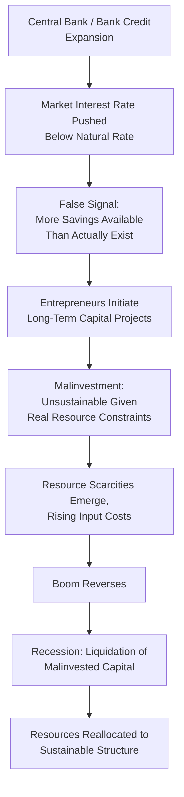

## Austrian Theory of Money and the Business Cycle

### Overview

The Austrian theory of money and the business cycle, developed primarily by Ludwig von Mises and Friedrich Hayek in the early-to-mid 20th century, argues that business cycles—particularly boom-and-bust patterns culminating in recessions—are caused by central bank and fractional-reserve banking system credit expansion that artificially lowers interest rates below their "natural" market-clearing level, distorting the intertemporal allocation of investment and production. Known as **Austrian Business Cycle Theory (ABCT)**, it represents one of the most enduring heterodox alternatives to Keynesian and monetarist explanations of the business cycle, and remains influential in libertarian and free-market economic and policy circles, though it holds limited acceptance within mainstream academic macroeconomics.

### Theoretical Foundations: Capital Theory and Time Preference

**Key Points**

- ABCT is built on Austrian capital theory (developed by earlier economists including Carl Menger and Eugen von Böhm-Bawerk), which emphasizes that production processes are structured in time, involving multiple sequential stages from raw materials/early inputs (higher-order or "capital" goods) to final consumer goods (lower-order goods)
- The theory relies on the concept of **time preference**: the degree to which individuals prefer present consumption to future consumption, which Austrians argue is reflected in the natural (market-clearing) rate of interest, determined by the interaction of voluntary saving (deferred consumption) and investment demand
- In an undistorted market, the interest rate coordinates this intertemporal structure: higher voluntary saving lowers interest rates, signaling to entrepreneurs that resources are available to fund longer, more roundabout (capital-intensive) production processes that individuals are willing to wait longer to consume the output of

### The Core Mechanism: Credit Expansion and Malinvestment

**Key Points**

- ABCT's central claim is that when banks (facilitated by central bank monetary expansion, such as lowering policy rates or expanding reserves) increase credit supply beyond what is backed by genuine voluntary savings, market interest rates are pushed below the "natural rate" that would otherwise prevail
- This artificially cheap credit sends a false signal to entrepreneurs, indicating more resources are available for long-term, capital-intensive investment projects than actually exist in terms of real underlying savings
- Entrepreneurs respond by initiating investment projects that are, in aggregate, unsustainable given the real pool of available savings and resources—a phenomenon termed **malinvestment**: capital is misallocated into projects (often concentrated in longer-term or asset-heavy sectors, such as real estate or capital goods industries) that would not have appeared profitable at the true, undistorted interest rate
- As the boom progresses, resource scarcities and rising input costs eventually reveal the unsustainability of these malinvestments (the "boom" phase reverses), typically once credit expansion slows or interest rates rise (whether from central bank tightening, or the exhaustion of the credit expansion's stimulative effects), precipitating a recession/bust in which the accumulated malinvestments are liquidated
- The recession itself, in the Austrian view, is not the fundamental economic problem but rather the necessary (if painful) *corrective process* through which the economy reallocates misallocated resources back toward a sustainable production structure consistent with actual time preferences and available savings

### Key Theoretical Contributors

**Key Points**

- **Ludwig von Mises**: laid the initial groundwork in his 1912 work *The Theory of Money and Credit*, applying Austrian capital and monetary theory to explain credit-driven business cycles, and later developed these ideas further in works addressing socialist calculation and interventionism
- **Friedrich Hayek**: most closely associated with the fully developed version of ABCT, particularly in works such as *Prices and Production* (1931) and *Monetary Theory and the Trade Cycle*, and received the Nobel Memorial Prize in Economic Sciences in 1974 (shared with Gunnar Myrdal), partly recognized for his work on the interrelation of economic, social, and institutional phenomena, including business cycle theory
- **Murray Rothbard**: extended and popularized ABCT in later works such as *America's Great Depression* (1963), applying the theory specifically to explain the causes of the 1929 stock market crash and subsequent Great Depression as resulting from Federal Reserve credit expansion during the 1920s
- The famous **Hayek-Keynes debates** of the early 1930s, conducted partly through published reviews and correspondence, represent a foundational historical clash between Austrian and what would become Keynesian approaches to understanding the business cycle and appropriate policy responses

### The Structure of Production and Hayekian Triangles

**Key Points**

- Hayek employed a visual heuristic often called the "Hayekian triangle" to represent the time structure of production: a triangle where the horizontal axis represents time (from initial inputs to final consumption) and the vertical axis represents the value of goods at each production stage, illustrating how a longer, more "roundabout" production structure (favored by lower interest rates and higher genuine savings) can support greater final output, but requires sustained resource commitment across a longer time horizon
- ABCT argues that artificial credit expansion causes an economy-wide shift toward a lengthened production structure (the triangle "stretches"), even though the underlying real savings needed to sustain that longer structure through to completion do not actually exist, setting up the conditions for eventual malinvestment revelation and bust

### Application to Historical Episodes

**Key Points**

- **The Great Depression (1929–early 1930s)**: Austrian economists, particularly Rothbard, have argued the Federal Reserve's credit expansion during the 1920s ("the Roaring Twenties") created an unsustainable boom in capital markets and equities, with the 1929 crash and subsequent depression representing the necessary (if severe) liquidation process; this interpretation contrasts sharply with the Friedman-Schwartz monetarist explanation (which emphasizes the Fed's failure to prevent the money supply collapse *after* the crash as the primary depression-deepening cause) and with Keynesian explanations (emphasizing insufficient aggregate demand)
- **The 2008 Global Financial Crisis**: some Austrian economists and commentators have applied ABCT to argue that Federal Reserve monetary policy in the early-to-mid 2000s (relatively low interest rates following the 2001 recession and dot-com bust) fueled unsustainable credit expansion concentrated in the housing sector, representing a contemporary example of credit-driven malinvestment culminating in the 2007–2008 housing bust and financial crisis
- **[Inference]** These applications of ABCT to specific historical episodes are widely cited by Austrian-school economists and commentators as illustrative confirmations of the theory, but mainstream economic historians generally offer competing or more nuanced multi-causal explanations for both the Great Depression and the 2008 crisis (involving factors such as banking regulation, securitization practices, global capital flows, and specific institutional failures); attributing either crisis primarily or solely to Austrian-theorized credit malinvestment is a contested interpretation rather than a consensus historical finding.

### Mainstream Critiques of Austrian Business Cycle Theory

**Key Points**

- **Lack of formal empirical testing and mathematical modeling**: mainstream economists have long criticized ABCT for being difficult to formally test empirically or express in standard mathematical macroeconomic modeling frameworks, given its reliance on qualitative capital-theoretic concepts (such as "roundaboutness" and the unobservable "natural rate of interest") that resist straightforward econometric measurement
- **The "natural rate of interest" concept's ambiguity**: critics (including some who work with related but distinct natural-rate concepts, such as the Wicksellian natural rate used in mainstream New Keynesian models) argue the Austrian natural rate lacks a precise, empirically identifiable definition, undermining claims about how far actual rates have deviated from it at any given time
- **Insufficient attention to aggregate demand effects**: Keynesian-influenced critics argue ABCT focuses almost exclusively on the intertemporal *allocation* effects of credit expansion while providing an inadequate account of aggregate demand collapse during the bust phase, and offers limited policy guidance for addressing unemployment and output losses during a recession beyond advocating that the liquidation process simply be allowed to proceed
- **Empirical difficulty distinguishing malinvestment from ordinary business cycle fluctuations**: critics note that virtually any recession following a period of credit growth can be reinterpreted post hoc as confirming ABCT, raising methodological concerns about the theory's falsifiability
- **Policy implications considered overly austere by critics**: ABCT's traditional policy prescription—allowing the liquidation/recession process to run its course with minimal monetary or fiscal intervention—is criticized by many mainstream economists (particularly those in the Keynesian tradition) as prescribing unnecessarily severe and prolonged economic pain, contrasting with monetarist and Keynesian views that emphasize the desirability of proactive countercyclical policy during downturns

**[Inference]** These critiques represent a broadly accurate summary of mainstream academic economics' general reception of ABCT (which holds minority status within contemporary academic macroeconomics, notwithstanding continued influence in policy commentary and some financial market circles), though individual mainstream economists' specific objections and the intensity of their criticism vary, and Austrian economists have published extensive responses defending the theory's methodology and predictions.

### Austrian School Responses to Critiques

**Key Points**

- Austrian economists generally argue that ABCT's reliance on qualitative, praxeological reasoning (an a priori methodological approach associated with Mises, deriving economic conclusions from the logical implications of purposeful human action rather than primarily from statistical inference) is a deliberate methodological choice, not a weakness, and that mainstream demands for formal econometric testing misapply natural-science methodology to fundamentally social/economic phenomena
- Proponents argue the theory's core qualitative predictions (unsustainable credit-driven booms tend to be followed by corrective recessions concentrated in interest-rate-sensitive sectors) have been repeatedly, if informally, validated by historical experience, even without precise quantitative natural-rate measurement

### Relevance to Monetary Economics

**Key Points**

- ABCT represents one of the most historically significant heterodox alternatives to Keynesian and monetarist business cycle theory, rooted in a distinctive capital-theoretic and time-preference-based framework
- Understanding ABCT provides useful contrast with mainstream New Keynesian and monetarist explanations of business cycles, particularly regarding the role of interest rate distortions, credit expansion, and the appropriate policy response to recessions
- The theory remains influential in certain policy and financial commentary circles (particularly regarding critiques of central bank interest rate policy and quantitative easing) even though it holds limited standing within contemporary mainstream academic macroeconomics

**Related Topics**

- Ludwig von Mises's *The Theory of Money and Credit*
- Hayek's *Prices and Production* and the Hayekian triangle
- The Hayek-Keynes debates of the 1930s
- Rothbard's *America's Great Depression*
- Friedman and Schwartz's monetarist explanation of the Great Depression
- Wicksellian natural rate of interest and New Keynesian models
- Post-Keynesian endogenous money theory
- Modern Monetary Theory: core claims and critiques