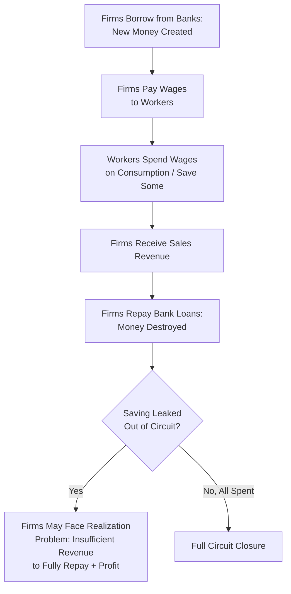

## Circuit Theory of Money and Credit

### Overview

Circuit theory of money and credit (also called Monetary Circuit Theory, or "Circuitisme" in its francophone origins) is a heterodox monetary framework developed primarily by French and Italian economists—most notably Alain Parguez, Augusto Graziani, and Bernard Schmitt—beginning in the 1970s and 1980s. It analyzes the economy as a sequential, circular flow of money initiated by bank credit creation, tracing money's "life cycle" from initial bank lending through production, wage payment, expenditure, and final debt repayment. Circuit theory shares substantial common ground with post-Keynesian endogenous money theory but is generally considered a more explicitly structured, stage-based framework with distinct European intellectual origins, and offers a distinctive perspective on the macroeconomic role of the banking sector, profit realization, and the necessity of bank credit for a monetary production economy to function.

### Core Premise: Money as a Flow, Not a Stock

**Key Points**

- Circuit theory rejects the conventional notion of money as a pre-existing "stock" that circulates among economic agents (the standard textbook view underlying quantity-theory-style analysis); instead, it conceives of money as fundamentally a **flow** created and destroyed within a repeating circuit or cycle
- Money is created *ex nihilo* ("from nothing") by commercial banks when they extend credit to firms, and is subsequently destroyed when that credit is repaid, meaning the money supply is not a fixed quantity in circulation but rather a continuously regenerating flow tied to the rhythm of production and credit cycles
- This flow-based conception is a foundational point of overlap with post-Keynesian endogenous money theory's "loans create deposits" mechanism, though circuit theorists generally develop a more elaborate, sequential, stage-by-stage narrative of how that credit-created money moves through the economy and is ultimately extinguished

### The Basic Structure of the Monetary Circuit

**Key Points**

- Circuit theory typically models the economy through a sequence of logically distinct stages, often summarized as an "initial," "intermediate/production," and "final/closure" phase:
  1. **Initial finance**: firms borrow from banks to finance production costs, primarily wage payments, before any output is sold. This initial bank credit creates new money "from nothing," with no prior saving required—money creation precedes and enables production, rather than resulting from a pre-existing pool of savings
  2. **Production and wage payment**: firms use the borrowed funds to pay wages to workers, who then possess newly created bank deposits corresponding to the credit extended in stage one
  3. **Expenditure and circulation**: workers spend their wages on consumption goods (and/or save some portion), and firms use the resulting sales revenue to attempt to recoup their initial costs and realize a profit
  4. **Closure/repayment**: firms use sales revenue to repay their initial bank loans, at which point the money created in stage one is extinguished (destroyed) as the loan is repaid, closing the circuit

### The Central Banking Role: Initial and Final Finance

**Key Points**

- Circuit theorists distinguish between **initial finance** (the short-term bank credit that funds production before sales occur) and **final finance** (the eventual, more permanent financing—via retained earnings, equity issuance, or longer-term bonds—that firms may use to consolidate their financial position after the production/sales cycle completes)
- Banks play an essential, structurally necessary role in this framework: without bank credit to initiate the circuit, production could not begin at all, since firms need funds to pay wages *before* any output exists to sell—there is no pre-existing pool of savings from which this initial credit can logically be drawn, since the wage income that could constitute such savings does not yet exist until firms pay it out
- This structurally elevates the banking sector's role beyond a passive "intermediary" between savers and borrowers (the conventional view) to an active, indispensable initiator of the entire production process in a monetary economy

### The Profit Realization Problem

**Key Points**

- A central and much-discussed puzzle within circuit theory is the **profit/monetary paradox**: if firms collectively borrow exactly enough money to pay wages equal to their production costs, and workers spend all their wage income back into the economy, how can firms collectively realize a monetary profit (i.e., recoup more revenue than they paid out in costs), since the total money in circulation appears to only equal the initial wage bill?
- Various circuit theorists have proposed different resolutions to this puzzle, including:
  - Emphasizing the role of **additional bank credit extended to entrepreneurs or the household sector** (e.g., credit for capitalist consumption or investment) as an additional net injection of money beyond the initial wage-financing circuit, which can provide the extra spending needed to allow aggregate profit realization
  - Emphasizing that not all wage income needs to be immediately spent (workers can hold some money temporarily), and analyzing the sequential timing effects of spending and saving decisions within the circuit
  - Government deficit spending and international trade surpluses, viewed (similarly to the sectoral balances framework used in Modern Monetary Theory and stock-flow consistent modeling) as additional net injections that can support aggregate profit realization beyond what the private wage-and-consumption circuit alone can generate
- **[Inference]** The "profit paradox" has generated a substantial and still-active theoretical literature within circuit theory without full consensus on a single resolution; different circuit theorists (Graziani, Parguez, Schmitt, and later contributors) have proposed distinct or complementary solutions, so this should be understood as an important open theoretical debate within the tradition rather than a fully settled question.

### Key Theoretical Contributors

**Key Points**

- **Bernard Schmitt**: an early and foundational circuit theorist, developing much of the formal apparatus of money as a flow and the logical structure of bank-financed production circuits, with roots tracing back to French monetary economics traditions from the 1960s onward
- **Alain Parguez**: a prominent French circuit theorist who extended the framework's analysis of the state and fiscal policy's role within the circuit, with significant overlap and mutual influence with the later development of Modern Monetary Theory (Parguez's work is frequently cited by MMT economists as an important intellectual precursor and parallel tradition)
- **Augusto Graziani**: an influential Italian economist whose work, particularly *The Monetary Theory of Production* (2003, English translation), is widely regarded as one of the most systematic and internationally accessible presentations of circuit theory, emphasizing the necessary role of bank credit in initiating production and the analytical primacy of the credit-production-repayment sequence
- The tradition is sometimes collectively referred to as the "Franco-Italian circuit school," reflecting its primarily continental European academic origins, in contrast to the more Anglo-American origins of post-Keynesian endogenous money theory (Moore, Kaldor, Chick)

### Relationship to Post-Keynesian Endogenous Money Theory

**Key Points**

- Circuit theory and post-Keynesian endogenous money theory share the foundational claim that bank credit creates money "from nothing" in response to borrower demand, and both reject the conventional exogenous money/money-multiplier framework
- Circuit theory is generally considered to offer a more explicitly sequential, stage-based ("logical time") narrative structure tracing money through a complete creation-circulation-destruction cycle, while post-Keynesian endogenous money theory (particularly the horizontalist/structuralist debate) focuses more specifically on the mechanics of central bank reserve accommodation and interest rate setting
- The two traditions are generally viewed as closely complementary rather than competing, often cited together in broader discussions of heterodox monetary theory, and some economists work explicitly within both frameworks simultaneously

### Relationship to Modern Monetary Theory

**Key Points**

- MMT and circuit theory share significant intellectual overlap, particularly through the influence of Alain Parguez's work on state finance within the circuit framework, and through shared emphasis on money as fundamentally created "from nothing" rather than drawn from a pre-existing pool of resources
- Both frameworks emphasize that government spending (viewed through a circuit or sectoral-balances lens) can serve as a critical net injection into the economy that supports private-sector profit realization and net saving, a point of substantial conceptual overlap between circuit theory's "profit realization problem" resolution (via state deficit spending) and MMT's sectoral balances framework
- **[Inference]** While the intellectual connections between circuit theory and MMT are well documented through shared contributors and citations (particularly via Parguez), MMT developed with substantial additional influence from Anglo-American post-Keynesian and chartalist traditions as well, so circuit theory should be understood as one significant contributing tradition among several rather than the sole origin of MMT's framework.

### Critiques of Circuit Theory

**Key Points**

- Mainstream economists generally raise similar critiques to those directed at post-Keynesian endogenous money theory: skepticism about whether the sequential, stage-based circuit framework adds meaningfully different predictive content beyond what is captured in more conventional (if less narratively elaborate) models of credit and money creation
- The profit realization puzzle, while an interesting theoretical challenge within the circuit framework, is sometimes viewed by critics as a self-generated puzzle arising from the specific (and debatable) simplifying assumptions of the basic circuit model (e.g., assuming a closed circuit with no other income sources), rather than a fundamental economic paradox requiring the elaborate theoretical machinery developed to resolve it
- The relatively niche academic reception of circuit theory, even within heterodox economics circles (where post-Keynesian and MMT frameworks have achieved comparatively greater visibility, particularly in English-language economics discourse), is sometimes attributed partly to its predominantly French/Italian-language origins and correspondingly limited early translation and dissemination in English-language academic economics

### Relevance to Monetary Economics

**Key Points**

- Circuit theory offers a distinctive, sequential "logical time" framework for understanding money creation and destruction that complements and enriches post-Keynesian endogenous money theory, with particular emphasis on the indispensable, active role of bank credit in initiating production in a monetary economy
- Its profit realization problem provides a useful analytical bridge to broader heterodox discussions of sectoral balances, government deficit spending's macroeconomic role, and the structural necessity of net injections (via state spending, trade surpluses, or additional credit) to support aggregate profit realization—themes echoed and extended in Modern Monetary Theory
- Understanding circuit theory rounds out the broader heterodox monetary theory landscape, illustrating how multiple independent intellectual traditions (French/Italian circuitisme, Anglo-American post-Keynesianism, and later MMT) converged on related critiques of the conventional exogenous money framework from somewhat different starting points and analytical structures

**Related Topics**

- Post-Keynesian endogenous money theory
- Modern Monetary Theory: core claims and critiques
- Graziani's *The Monetary Theory of Production*
- Alain Parguez and the state's role in the circuit
- Sectoral balances and stock-flow consistent modeling
- The profit realization/monetary paradox
- Wynne Godley's stock-flow consistent modeling
- Chartalism and the state theory of money