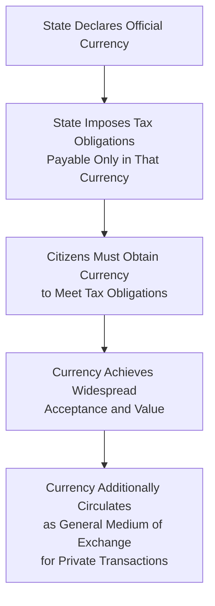

## Chartalism and the State Theory of Money Revisited

### Overview

Chartalism, also known as the state theory of money, holds that money's value and acceptance derive fundamentally from state authority—particularly the state's power to impose and enforce tax obligations payable in a designated currency—rather than from any intrinsic commodity value or purely spontaneous market emergence. Originally formulated by German economist Georg Friedrich Knapp in his 1905 work *Staatliche Theorie des Geldes* (*The State Theory of Money*), chartalism was revived and substantially extended in the late 20th and early 21st centuries, becoming a foundational pillar of Modern Monetary Theory. Revisiting chartalism in depth clarifies the theoretical lineage connecting historical monetary philosophy to contemporary heterodox monetary economics, and highlights its ongoing tension with competing theories of money's origin.

### Knapp's Original Formulation

**Key Points**

- Georg Friedrich Knapp argued that money is fundamentally a **creature of law** (a "chartal" or token-based means of payment, from the Latin *charta*, meaning token or ticket) rather than a commodity whose value derives from its use in barter or its intrinsic material worth
- Knapp's central claim: what makes something function as money is the state's declaration and enforcement of its acceptability for the payment of debts, particularly tax obligations owed to the state itself, not any independent market-based valuation process
- This directly opposed the dominant **metallist** or **commodity theory of money** view prevalent in classical and early neoclassical economics (associated with economists such as Carl Menger), which held that money emerges spontaneously from barter as market participants converge on a widely accepted, useful commodity (historically often a precious metal) to reduce the transaction costs and "double coincidence of wants" problem inherent in direct barter exchange

### Chartalism vs. Metallism: The Origin-of-Money Debate

**Key Points**

- **Metallist/commodity theory** (the mainstream historical narrative, echoed in Carl Menger's influential 1892 analysis and widely repeated in conventional economics textbooks): money emerges organically from decentralized market exchange as traders settle on a commonly accepted, storable, divisible commodity to facilitate trade, with the state's role limited to later standardizing or certifying an already-existing market-selected medium
- **Chartalist/state theory**: money's function and widespread acceptance is fundamentally driven by the state's authority to levy taxes payable only in its chosen currency, creating an artificial but powerful and self-reinforcing demand for that currency independent of any intrinsic commodity value; under this view, the state effectively "monetizes" whatever it designates as legal tender for tax payment, and this state-created demand is what enables the currency to also circulate as a general medium of exchange in private transactions
- This debate has significant anthropological and historical dimensions: chartalist-sympathetic researchers (notably anthropologist David Graeber in his 2011 book *Debt: The First 5,000 Years*, though from outside professional economics) have argued that historical and anthropological evidence does not strongly support the traditional barter-origin story of money, suggesting instead that early monetary systems were more closely tied to credit, debt-recording, and state/temple institutional structures than to spontaneous barter-based commodity selection

**[Inference]** The historical debate over money's true origins (chartalist/state-driven vs. metallist/market-driven) remains genuinely contested among economic historians and anthropologists; neither position has achieved decisive consensus, and the empirical record across different historical societies plausibly supports elements of both narratives depending on the specific time and place examined, so this should be treated as an open interpretive question rather than a matter with a single settled answer.

### The "Taxes Drive Money" Mechanism

**Key Points**

- The core operational mechanism chartalists identify for why a state's fiat currency achieves widespread acceptance, even absent any commodity backing, is often summarized as **"taxes drive money"**: because the state requires its citizens to pay taxes in a specific currency (and imposes legal penalties for failure to do so), citizens must obtain that currency regardless of their personal preferences regarding alternative means of exchange
- This creates a foundational, coercively backed source of demand for the currency that does not depend on voluntary market consensus, distinguishing chartalist logic from purely market-based explanations of currency acceptance
- Once this baseline tax-driven demand is established, the currency can then additionally circulate more broadly as a private medium of exchange for reasons of convenience, network effects, and legal tender status in private contract enforcement—but chartalists argue the *foundational* source of demand remains the state's tax-enforcement power, not organic market selection

### 20th-Century Revival: Abba Lerner and Functional Finance

**Key Points**

- Economist Abba Lerner developed the concept of **functional finance** in the 1940s, arguing that government fiscal policy (taxation and spending) should be evaluated based on its functional macroeconomic effects (managing aggregate demand, employment, and inflation) rather than according to conventional notions of "balanced budgets" or a household-analogy view of government finance
- While not identical to chartalism, Lerner's functional finance shares important conceptual affinities and is frequently cited as an important intellectual bridge between Knapp's original state theory of money and the later, more fully developed Modern Monetary Theory framework, particularly regarding the idea that a sovereign currency issuer's fiscal policy should be judged by real economic outcomes rather than by revenue-expenditure accounting balance per se

### Contemporary Revival: Modern Monetary Theory

**Key Points**

- Chartalism was substantially revived and extended by economists including Warren Mosler, L. Randall Wray, and Stephanie Kelton beginning primarily in the 1990s, forming a foundational theoretical pillar of what became known as Modern Monetary Theory (MMT)
- MMT explicitly builds on the chartalist "taxes drive money" logic to support its broader claims about sovereign currency issuers: because the state can, in principle, always create the currency it has itself declared acceptable for tax payment, MMT argues such a government cannot become involuntarily insolvent in its own currency, extending Knapp's original insight about currency acceptance into a broader claim about the operational constraints (or lack thereof) facing currency-issuing governments
- L. Randall Wray's influential 1998 book *Understanding Modern Money* is often credited with formally reviving and systematizing chartalist theory for a contemporary academic and policy audience, directly linking Knapp's historical framework to modern fiat currency operations and laying substantial groundwork for the subsequent development of MMT as a distinct school of thought

### Chartalism's Relationship to Endogenous Money and Circuit Theory

**Key Points**

- Chartalism is generally considered complementary to, but analytically distinct from, post-Keynesian endogenous money theory and circuit theory: chartalism primarily addresses *why* a state-issued fiat currency achieves acceptance and value (a question of monetary origin and legitimacy), while endogenous money theory and circuit theory primarily address *how* the money supply expands and contracts through bank credit creation (a question of monetary mechanics)
- These frameworks are frequently combined within MMT and broader heterodox monetary economics, with chartalism providing the foundational justification for why fiat currency has value at all, and endogenous money/circuit theory providing the operational mechanics of how that currency is created, circulated, and destroyed within the banking and production system

### Critiques of Chartalism

**Key Points**

- Mainstream and some heterodox economists have questioned whether the "taxes drive money" mechanism, while plausible as a *sufficient* explanation for currency acceptance, is necessarily the sole or even primary historical driver of monetary emergence in all contexts, particularly given documented historical cases of widely used commodity monies (precious metals, cowrie shells, and similar) that circulated extensively in contexts without centralized state tax enforcement of comparable scope
- Critics also note that in practice, many currencies (particularly historically, under gold standard or currency board arrangements) have derived at least part of their acceptance and value from commodity backing or credible convertibility promises rather than purely from tax-driven demand, suggesting that chartalist and metallist mechanisms may have operated simultaneously or with varying relative importance across different historical monetary systems rather than one framework being universally correct
- Some economists argue chartalism, while a useful corrective emphasizing the state's role in modern fiat systems, should be understood as one important explanatory factor among several (alongside network effects, legal tender laws, and historical path dependency) rather than a complete, standalone theory of monetary value and acceptance

**[Inference]** This critique reflects a moderate synthesis position common among monetary historians who view the chartalist/metallist debate as involving genuinely complementary rather than strictly mutually exclusive mechanisms; more committed chartalist or metallist theorists on either side would likely characterize the balance of historical evidence more decisively in favor of their respective positions, so this synthesis framing itself reflects one interpretive stance within an ongoing debate.

### Relevance to Monetary Economics

**Key Points**

- Chartalism provides the foundational theoretical justification underlying Modern Monetary Theory's claims about sovereign currency issuers' fiscal flexibility, making it essential background for understanding contemporary MMT debates
- Revisiting chartalism's historical origins (Knapp) and 20th-century development (Lerner's functional finance, Wray's revival) clarifies the intellectual lineage connecting historical monetary philosophy to contemporary heterodox monetary theory
- Understanding the chartalist/metallist debate over money's origins provides important context for broader discussions of what gives fiat currency value, directly relevant to evaluating claims about currency stability, dedollarization debates, and the theoretical foundations of both mainstream and heterodox monetary economics

**Related Topics**

- Modern Monetary Theory: core claims and critiques
- Georg Friedrich Knapp's *The State Theory of Money*
- Carl Menger's commodity theory of money origins
- Abba Lerner's functional finance
- L. Randall Wray's *Understanding Modern Money*
- David Graeber's *Debt: The First 5,000 Years* (anthropological perspective)
- Post-Keynesian endogenous money theory
- Circuit theory of money and credit