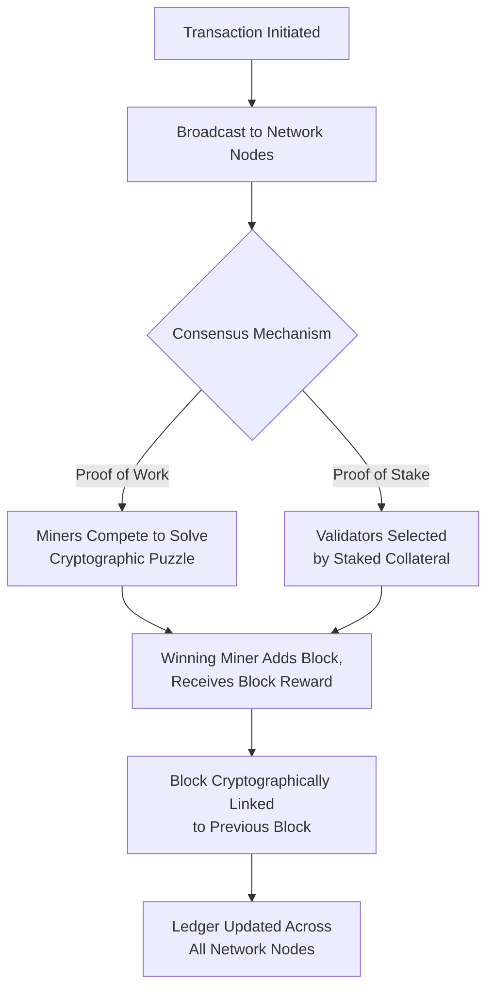

## Cryptocurrencies and Blockchain-Based Money

### Overview

Cryptocurrencies are digital assets designed to function as mediums of exchange, units of account, or stores of value, secured through cryptographic techniques and typically operating on decentralized, distributed ledger systems called blockchains. Beginning with Bitcoin's introduction in 2009, cryptocurrencies have grown into a large and diverse asset class, raising fundamental questions in monetary economics about what constitutes "money," the viability of decentralized alternatives to state-issued fiat currency, and the appropriate regulatory and macroeconomic response to privately created digital monies.

### Blockchain Technology: Core Architecture

**Key Points**

- A **blockchain** is a distributed, append-only digital ledger that records transactions in sequential "blocks," each cryptographically linked to the previous block (forming a "chain"), making retroactive alteration of transaction history computationally impractical without controlling a majority of the network's validating power
- Blockchains are maintained by a decentralized network of participants ("nodes") rather than a single central authority, with new transactions validated and added to the ledger through a **consensus mechanism** that ensures network-wide agreement on the ledger's state without requiring participants to trust each other or a central intermediary
- The two most prevalent consensus mechanisms are:
  - **Proof of Work (PoW)**: used by Bitcoin and (until 2022) Ethereum; validators ("miners") compete to solve computationally intensive cryptographic puzzles, with the first to solve it earning the right to add the next block and receive a block reward; security derives from the substantial computational (and energy) cost required to attack the network
  - **Proof of Stake (PoS)**: used by Ethereum (since its 2022 "Merge" upgrade) and many newer blockchains; validators are selected to propose and validate blocks based on the quantity of cryptocurrency they "stake" (lock up) as collateral, with malicious behavior penalized through stake forfeiture ("slashing"); security derives from the economic cost of acquiring and risking a large stake rather than computational cost

### Bitcoin: The Foundational Cryptocurrency

**Key Points**

- Introduced in a 2008 white paper by the pseudonymous "Satoshi Nakamoto," with the network launching in January 2009, explicitly motivated (per the white paper's framing) as a peer-to-peer electronic cash system that would not require a trusted third party (such as a bank) to prevent double-spending
- Features a fixed, algorithmically predetermined maximum supply of 21 million bitcoin, with new issuance occurring through mining rewards that halve approximately every four years (the "halving"), a deliberately disinflationary supply schedule frequently contrasted by proponents with the potentially unlimited expansion possible under discretionary fiat monetary policy
- Bitcoin's fixed supply schedule and decentralized issuance are central to its framing by proponents as "digital gold" or a hedge against fiat currency debasement, though this framing and its empirical validity remain contested (see critiques below)

### Ethereum and Smart Contract Platforms

**Key Points**

- Ethereum, launched in 2015, extended blockchain technology beyond simple currency transfer by introducing **smart contracts**: self-executing code deployed on the blockchain that automatically executes predefined actions when specified conditions are met, without requiring a trusted intermediary
- This enabled the development of **decentralized applications (dApps)**, decentralized finance (DeFi) protocols (lending, borrowing, trading platforms operating without traditional financial intermediaries), and non-fungible tokens (NFTs), substantially broadening blockchain technology's use cases beyond currency alone
- Ethereum's native cryptocurrency, ether (ETH), functions both as a medium of exchange within its ecosystem and as "gas"—a fee paid to compensate network validators for the computational resources required to execute transactions and smart contracts

### Stablecoins

**Key Points**

- **Stablecoins** are cryptocurrencies specifically designed to maintain a stable value, typically pegged to a fiat currency (most commonly the US dollar), addressing the significant price volatility that limits many cryptocurrencies' practical use as a medium of exchange or unit of account
- Major categories include:
  - **Fiat-collateralized stablecoins**: backed by reserves of the referenced fiat currency (or equivalent assets such as short-term government securities) held by the issuer, with major examples including Tether (USDT) and USD Coin (USDC)
  - **Crypto-collateralized stablecoins**: backed by other cryptocurrencies held as over-collateralized reserve, with mechanisms to manage the reserve asset's own price volatility (e.g., MakerDAO's DAI)
  - **Algorithmic stablecoins**: attempt to maintain their peg through algorithmic supply adjustments rather than direct asset backing; this category suffered a significant credibility blow following the May 2022 collapse of the TerraUSD (UST) stablecoin and its associated Luna token, which lost its dollar peg and rapidly became worthless, erasing tens of billions of dollars in value and prompting substantially increased regulatory scrutiny of the algorithmic stablecoin model
- Stablecoins have become economically significant primarily as infrastructure within cryptocurrency trading and DeFi markets, and are increasingly discussed by regulators and central banks as posing potential financial stability and monetary sovereignty questions given their growing transaction volumes

**[Inference]** The relative long-term viability and regulatory trajectory of different stablecoin models (fiat-collateralized vs. algorithmic) remains an evolving area following the 2022 Terra/Luna collapse; while fiat-collateralized models have generally proven more resilient to date, this is based on limited historical experience with a relatively young asset class, and should not be treated as a permanent or fully settled assessment.

### Is Cryptocurrency "Money"? The Functions-of-Money Framework

**Key Points**

- Conventional monetary economics evaluates candidate monies against three classic functions: **medium of exchange**, **unit of account**, and **store of value**
- **Medium of exchange**: cryptocurrencies (particularly Bitcoin) have seen limited use as an everyday transactional medium of exchange relative to their market capitalization, constrained historically by price volatility, transaction processing speed/scalability limitations on major networks, and variable transaction fees; stablecoins address some of these limitations for exchange purposes but introduce dependency on the issuer's fiat reserve management and trustworthiness
- **Unit of account**: cryptocurrencies are rarely used to denominate prices or contracts in general commerce (most crypto-denominated transactions and DeFi protocols still reference or peg to fiat unit-of-account benchmarks, particularly the US dollar via stablecoins), suggesting limited independent unit-of-account function for most cryptocurrencies
- **Store of value**: this function is the most actively debated; proponents (particularly of Bitcoin) argue its fixed supply and decentralization make it a superior long-term store of value compared to fiat currencies subject to potential debasement, while critics point to substantial historical price volatility, which is generally considered inconsistent with a reliable store-of-value function over shorter time horizons
- **[Inference]** Most monetary economists, even those otherwise favorably disposed toward cryptocurrency technology, generally conclude that most cryptocurrencies (excluding stablecoins, which raise different considerations) currently fulfill the classic functions of money only partially or inconsistently compared to established fiat currencies; this is a widely shared assessment in academic monetary economics literature, though views on cryptocurrencies' future trajectory toward fuller monetary functionality remain more speculative and divided.

### Macroeconomic and Monetary Policy Implications

**Key Points**

- Widespread cryptocurrency adoption as a genuine alternative currency (rather than primarily a speculative asset) would pose significant challenges to conventional monetary policy transmission, since central banks generally rely on control over base money and short-term interest rates to influence broader economic activity—a mechanism that could be undermined if a large share of transactions occurred outside the domestic banking and currency system entirely
- Some economists have drawn analogies between potential widespread cryptocurrency adoption and historical currency substitution/dollarization phenomena in economies with weak domestic monetary credibility, suggesting cryptocurrency adoption could be most pronounced in economies experiencing high inflation or capital controls (with some evidence of elevated cryptocurrency usage in countries experiencing severe currency instability, such as Argentina and, in earlier periods, Venezuela and Zimbabwe)
- Regulatory responses have varied substantially by jurisdiction, ranging from the European Union's Markets in Crypto-Assets (MiCA) regulatory framework (which began phased implementation in 2024) to more restrictive approaches (China's 2021 comprehensive ban on cryptocurrency transactions and mining) to more permissive frameworks in jurisdictions seeking to attract cryptocurrency industry activity

**[Speculation]** The long-run macroeconomic significance of cryptocurrency adoption—whether it remains primarily a speculative asset class and niche payment technology, or eventually achieves broader monetary functionality sufficient to meaningfully affect monetary policy transmission in major economies—is not resolvable with current evidence and remains a genuinely open question among monetary economists, dependent on largely unpredictable future technological, regulatory, and adoption developments.

### Central Bank Digital Currencies as a Related but Distinct Development

**Key Points**

- Partly in response to (and conceptually distinct from) decentralized cryptocurrencies, many central banks have researched or piloted **Central Bank Digital Currencies (CBDCs)**—digital forms of sovereign fiat currency issued and backed directly by the central bank, distinguishing them fundamentally from decentralized cryptocurrencies in that they represent a centralized liability of the state rather than a decentralized, non-sovereign asset
- CBDC development represents a substantively different monetary innovation trajectory than cryptocurrency, addressed separately given its distinct institutional design, motivations (financial inclusion, payment system efficiency, maintaining monetary sovereignty in the face of private digital currency competition), and central bank-controlled architecture

### Critiques and Risks

**Key Points**

- **Price volatility**: most cryptocurrencies (excluding stablecoins) have exhibited substantial price volatility, undermining their practical utility as a stable medium of exchange or unit of account for most everyday economic purposes
- **Energy consumption**: Proof-of-Work cryptocurrencies, particularly Bitcoin, have drawn significant criticism and regulatory attention regarding the substantial energy consumption associated with mining operations, prompting some jurisdictions to restrict or discourage PoW mining activity on environmental grounds
- **Consumer protection and fraud**: the cryptocurrency sector has experienced numerous high-profile instances of fraud, exchange collapses (including the November 2022 collapse of the FTX exchange), and market manipulation concerns, prompting substantially increased regulatory scrutiny globally
- **Illicit use concerns**: the pseudonymous (though not fully anonymous, given blockchain transaction transparency) nature of many cryptocurrency transactions has raised law enforcement concerns regarding potential use in money laundering, sanctions evasion, and other illicit financial activity, though the actual scale of illicit cryptocurrency use relative to total transaction volume is a matter of ongoing empirical study and some dispute
- **Financial stability concerns**: growing interconnection between cryptocurrency markets, stablecoins, and traditional financial institutions has prompted concern among financial regulators (including bodies such as the Financial Stability Board) regarding potential systemic risk transmission channels, particularly following episodes such as the Terra/Luna collapse and the FTX bankruptcy

### Relevance to Monetary Economics

**Key Points**

- Cryptocurrencies raise foundational questions directly relevant to core monetary economics concepts: what constitutes money, how currency value and acceptance are established (connecting to chartalist vs. metallist debates about monetary origins), and the conditions under which decentralized, non-sovereign digital assets might substitute for state-issued fiat currency
- The cryptocurrency phenomenon has directly motivated central bank research and development of CBDCs, representing a significant contemporary institutional response shaping the future evolution of monetary systems
- Understanding cryptocurrency's strengths, limitations, and ongoing regulatory evolution is essential context for evaluating broader debates about the future structure of monetary systems, financial stability, and the appropriate boundaries between private and sovereign money creation

**Related Topics**

- Central bank digital currencies (CBDCs)
- Chartalism and the state theory of money
- Stablecoin design models and the Terra/Luna collapse
- Decentralized finance (DeFi) and financial disintermediation
- Currency substitution and dollarization
- Bitcoin's fixed supply schedule and "digital gold" framing
- Regulatory frameworks: EU MiCA, China's cryptocurrency ban
- Financial stability risks in digital asset markets