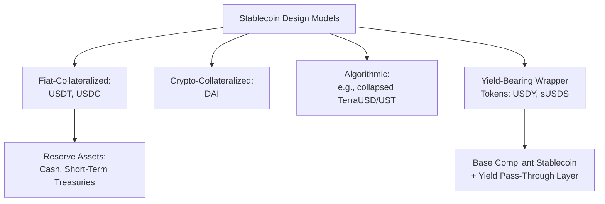
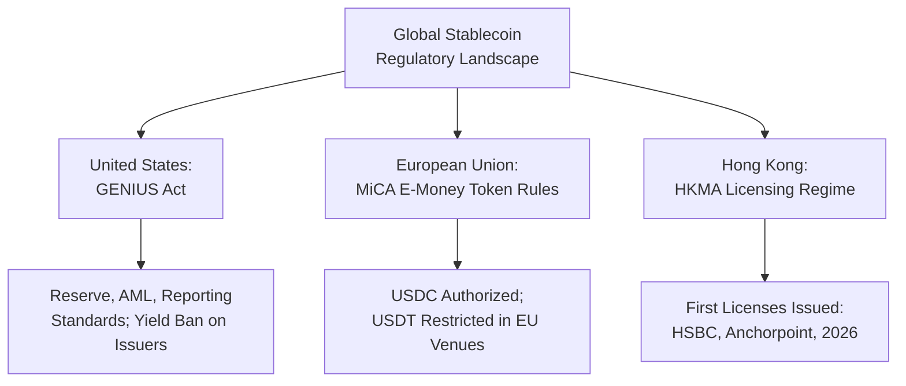

## Stablecoins and Their Monetary Implications

### Overview

Stablecoins are cryptocurrencies specifically engineered to maintain a stable value relative to a reference asset, typically a fiat currency such as the US dollar. By addressing the extreme price volatility that limits most cryptocurrencies' practical monetary usefulness, stablecoins have emerged as critical infrastructure within the broader digital asset ecosystem and are increasingly relevant to core monetary economics questions: what constitutes money, how private digital liabilities interact with sovereign monetary systems, and what risks large-scale stablecoin adoption poses to financial stability and monetary sovereignty. Stablecoins have moved from a niche crypto-trading tool to a regulated, rapidly growing financial instrument, with US regulation formalized through the GENIUS Act.

### Stablecoin Design Models

**Key Points**

- **Fiat-collateralized stablecoins**: backed by reserves of the referenced fiat currency or equivalent low-risk assets (cash, short-term government securities) held by the issuer, redeemable roughly 1:1; dominant examples are Tether (USDT) and USD Coin (USDC)
- **Crypto-collateralized stablecoins**: backed by other cryptocurrencies held in over-collateralized reserve pools to buffer against the collateral's own price volatility (e.g., MakerDAO's DAI)
- **Algorithmic stablecoins**: attempt to maintain a peg through automated supply-and-demand adjustment mechanisms rather than direct asset backing; this model suffered a major credibility blow with the May 2022 collapse of TerraUSD (UST) and its companion token Luna, which lost their peg and became worthless within days, erasing tens of billions of dollars and prompting intensified global regulatory scrutiny of the algorithmic model
- **Yield-bearing stablecoins**: a newer and rapidly growing category (discussed further below) that separates a base, non-yield-bearing compliant stablecoin from a wrapper or sister token that passes through reserve-generated yield (typically from Treasury holdings) to holders

### Market Size and Growth

**Key Points**

- The stablecoin market has grown rapidly, expanding at roughly a 77% compound annual growth rate over the preceding five years to more than $250 billion, with 2024 stablecoin transfer volume surging to $27.6 trillion, exceeding the combined volume of Visa and Mastercard. [State Street](https://www.ssga.com/us/en/intermediary/insights/genius-act-explained-what-it-means-for-crypto-and-digital-assets)
- As of mid-2026, the total stablecoin market capitalization stood at approximately $314.68 billion, having briefly crossed $320 billion in April 2026, with USDT (Tether) holding roughly 59% market dominance at about $186.35 billion and USDC holding about 24% at $74.89–77.0 billion. [Valueaddvc](https://valueaddvc.com/blog/stablecoin-regulation-2026-the-us-framework-and-what-it-means-for-crypto-companies)
- Circle's USDC supply expanded by 220% since late 2023 to roughly $78 billion, including a $2 billion gain in the first quarter of 2026 alone, with USDC now driving close to 80% of total stablecoin transaction volume. [Asset Whisper](https://assetwhisper.com/genius-act-stablecoin-regulation-2026/)
- **[Unverified]** Some 2026 commentary describes the stablecoin market capitalization as having entered a period of contraction or "capital rotation" in early 2026 even as regulatory clarity improved, attributed partly to institutional shifts away from less-regulated offshore issuers; figures across sources for the exact 2026 peak and subsequent trajectory vary somewhat depending on measurement date and methodology, so precise month-to-month levels should be treated as approximate.

### US Regulation: The GENIUS Act

**Key Points**

- The United States passed the Guaranteeing Effective and National Integrity of United States Stablecoins (GENIUS) Act, creating a federal regulatory framework for payment stablecoins that established issuer standards for reserves, supervision, and reporting, along with investor protections. The law was signed in mid-2025. [Bitunix](https://blog.bitunix.com/en/stablecoin-regulation-genius-act-defi-yields-payments/)
- The Act prohibits deceptive statements by issuers, including any implication that a stablecoin is insured or backed by the US government or covered by federal deposit insurance when it is not. [Bitunix](https://blog.bitunix.com/en/stablecoin-regulation-genius-act-defi-yields-payments/)
- A significant provision is a **yield ban**: stablecoin issuers themselves are restricted from offering interest or yield-like returns directly to holders, a design intended to separate payment stablecoins conceptually from investment products and reduce risks associated with shadow-banking-style activity.
- **[Inference]** This direct-issuer yield ban has had a notable unintended effect: because the Act leaves third-party yield arrangements largely unaddressed, a new category of "yield-bearing" wrapper stablecoins has grown rapidly, effectively routing around the spirit of the restriction while remaining within its letter—an evolving regulatory-arbitrage dynamic that appears to still be unfolding as of mid-2026 rather than settled.
- As of mid-2026, implementation has faced delays: various US regulators missed a July 18, 2026 deadline for issuing the final regulations needed to fully implement the GENIUS Act, though the law's overall effective date remained unchanged, slated for January (2027). [State Street](https://www.ssga.com/us/en/intermediary/insights/genius-act-explained-what-it-means-for-crypto-and-digital-assets)
- The Office of the Comptroller of the Currency has been developing implementing rules covering payment stablecoin issuance for entities under its jurisdiction.

### The Yield-Bearing Stablecoin Phenomenon

**Key Points**

- Yield-bearing stablecoins drove more than half of net stablecoin supply growth in the first quarter of 2026, expanding 22% during the quarter and adding around $4.3 billion in market capitalization, with the token USDY jumping 150% in that period and sUSDS pulling in more capital than the next four yield-bearing tokens combined. [Asset Whisper](https://assetwhisper.com/genius-act-stablecoin-regulation-2026/)
- The underlying mechanic is that a non-yield-bearing, GENIUS-compliant stablecoin sits at the base, while a wrapper or sister token captures the Treasury yield generated by the reserve assets and passes it on to holders, effectively separating the regulated payment instrument from the yield-generating investment layer. [Asset Whisper](https://assetwhisper.com/genius-act-stablecoin-regulation-2026/)
- This structure raises open regulatory questions about whether such wrapper tokens should be treated as securities, deposit-like instruments, or a novel category, an area regulators are reportedly monitoring closely.

### Global Regulatory Landscape

**Key Points**

- The European Union's Markets in Crypto-Assets (MiCA) framework has moved into active enforcement, with e-money token issuers required to meet continuous reserve, transparency, and governance standards. MiCA authorized Circle's USDC while effectively excluding Tether from EU-regulated trading venues, resulting in USDT's delisting across major exchanges including Coinbase, Binance, Kraken, and Crypto.com in EU-regulated contexts. [Orochi Network](https://orochi.network/blog/2026-stablecoin-regulatory-expectations-the-future-of-global-payments)
- Hong Kong granted its first stablecoin issuer licenses, notably to HSBC and Anchorpoint, in April 2026, reflecting an active licensing approach in parts of Asia. [Orochi Network](https://orochi.network/blog/2026-stablecoin-regulatory-expectations-the-future-of-global-payments)
- Across jurisdictions, regulators increasingly require real-time reporting capability, reconstructable audit trails, and documented governance evidence, rather than accepting periodic or informal compliance demonstrations. [Orochi Network](https://orochi.network/blog/2026-stablecoin-regulatory-expectations-the-future-of-global-payments)
- **[Inference]** The overall global regulatory trend as of 2026 appears to favor consolidation around large, well-capitalized, compliance-ready issuers (particularly Circle and Tether) at the expense of smaller or offshore issuers facing rising compliance costs; this is described as an expected industry consolidation by market analysts, but represents a forward-looking market prediction rather than a fully realized outcome.

### Monetary Economics Implications: Functions of Money

**Key Points**

- Evaluated against the classic **medium of exchange**, **unit of account**, and **store of value** functions, fiat-collateralized stablecoins fulfill these functions considerably more consistently than volatile cryptocurrencies like Bitcoin, since their design objective is explicitly to minimize price volatility relative to a fiat anchor
- Stablecoins increasingly function as a **dollar-denominated unit of account and settlement medium within crypto markets and cross-border payments**, effectively extending US dollar-based transaction infrastructure into jurisdictions and contexts (DeFi protocols, informal cross-border remittance channels) that would not otherwise have direct access to dollar-based banking
- This raises a distinctive monetary economics question sometimes termed **"digital dollarization"**: widespread stablecoin adoption in economies with weak domestic currency credibility could function analogously to traditional dollarization, potentially undermining local monetary policy transmission and central bank seigniorage revenue, while simultaneously extending de facto US dollar dominance in global digital finance

### Financial Stability and "Shadow Banking" Concerns

**Key Points**

- Large fiat-collateralized stablecoin issuers function in some respects like unregulated (or newly regulated) money market funds or narrow banks: they hold large reserves of short-term government securities and other liquid assets against liabilities that holders can redeem on demand
- This structure raises classic financial stability concerns analogous to bank runs: a loss of confidence in an issuer's reserve adequacy or transparency could trigger a rapid, self-reinforcing redemption wave, with potential spillover effects into the short-term government securities markets where reserves are held, given the now-substantial scale of stablecoin reserve holdings
- The GENIUS Act's reserve, disclosure, and reporting requirements are explicitly designed to mitigate these risks by imposing bank-like prudential standards, though the compliance cost of meeting these standards is viewed by industry analysts as likely to concentrate the market among a small number of well-capitalized issuers
- International bodies such as the Financial Stability Board have flagged growing interconnection between stablecoin markets and traditional finance as a channel for potential systemic risk transmission, particularly following the 2022 Terra/Luna collapse and the 2022 FTX exchange bankruptcy

### Relationship to Central Bank Digital Currencies

**Key Points**

- Stablecoins represent privately issued digital money, in contrast to Central Bank Digital Currencies (CBDCs), which would be direct, centrally issued liabilities of the state
- Some central banks and policymakers view well-regulated private stablecoins as a potentially preferable alternative to direct CBDC issuance (avoiding some of the privacy, disintermediation, and central-bank-balance-sheet-expansion concerns associated with CBDCs), while others view robust stablecoin growth as creating competitive pressure that motivates accelerated CBDC development to preserve monetary sovereignty and public-sector control over payment infrastructure
- **[Inference]** The relative future balance between regulated private stablecoins and public CBDCs as the dominant form of "digital fiat-linked money" is an actively contested policy question across jurisdictions, with the US regulatory approach (favoring a licensed private-issuer model under the GENIUS Act) and other jurisdictions' more CBDC-oriented approaches (e.g., ongoing digital euro exploration) representing different, not-yet-resolved institutional bets rather than a converged global consensus.

### Relevance to Monetary Economics

**Key Points**

- Stablecoins illustrate a practical, large-scale test of chartalist and functions-of-money theory: their stability and adoption derive not from state tax-enforcement (as in chartalist logic) but from credible fiat-asset backing and, increasingly, formal regulatory frameworks that impose bank-like prudential standards on private issuers
- Their rapid growth raises direct questions connected to seigniorage (large-scale private issuance of dollar-referenced liabilities potentially extending de facto dollar seigniorage internationally), financial stability regulation, and the appropriate boundary between public (central bank) and private money creation
- Understanding stablecoin market structure, regulation, and risks is essential context for evaluating ongoing debates about CBDC development, digital dollarization, and the future architecture of both domestic and cross-border payment systems

**Related Topics**

- Central bank digital currencies (CBDCs)
- Cryptocurrencies and blockchain-based money
- Chartalism and the state theory of money
- Currency substitution and dollarization
- The Terra/Luna algorithmic stablecoin collapse (2022)
- The GENIUS Act and US federal stablecoin regulation
- EU Markets in Crypto-Assets (MiCA) framework
- Shadow banking and financial stability regulation