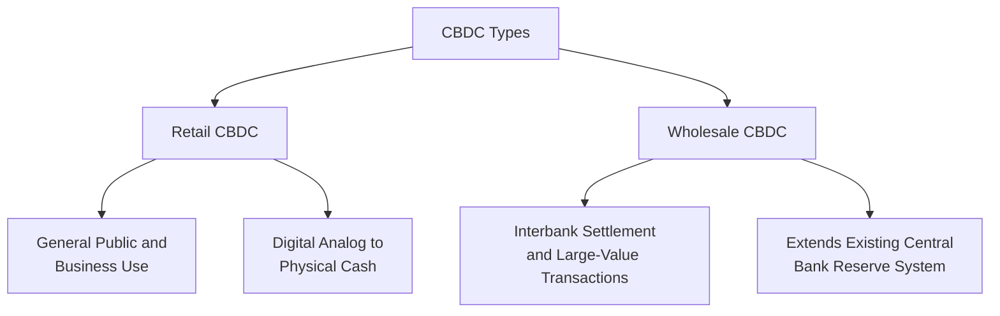
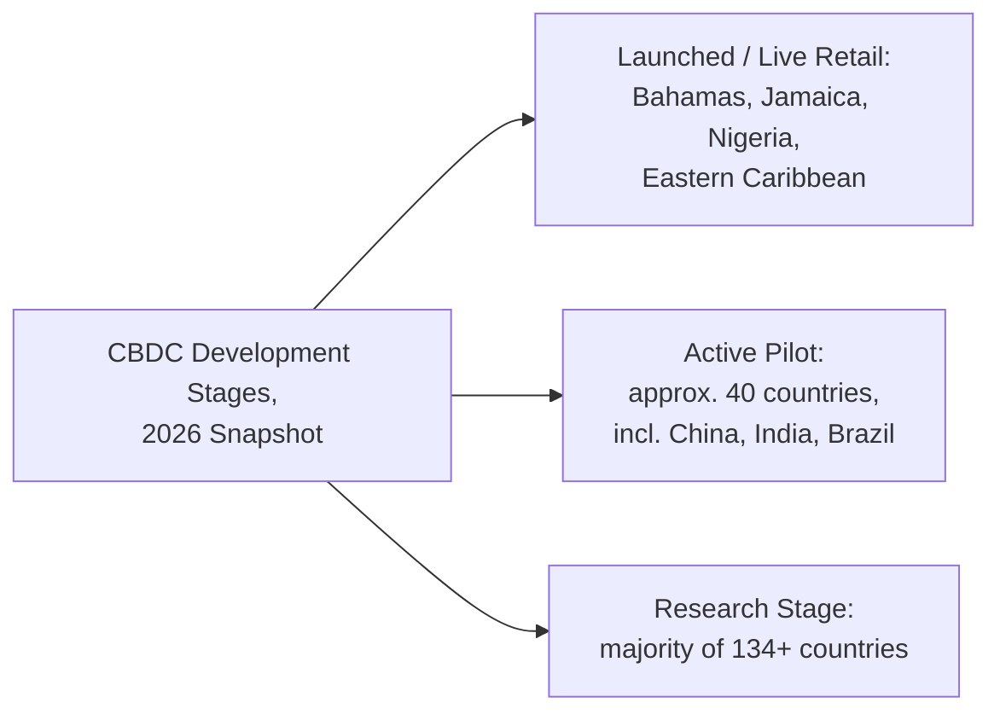

## Central Bank Digital Currencies

### Overview

Central bank digital currencies (CBDCs) are digital forms of a country's fiat currency, issued and backed directly by the central bank as a direct liability of that institution, rather than a liability of a commercial bank or a private company. CBDCs are conceptually distinct from decentralized cryptocurrencies and from privately issued stablecoins, since they represent sovereign, centrally issued money in digital form. As of 2026, CBDC development has evolved from largely conceptual research into a mix of live retail deployments, extensive piloting, and increasingly divergent strategic postures among major economies, particularly following the maturation of US stablecoin regulation.

### Defining Features and Types of CBDCs

**Key Points**

- A CBDC is a direct claim on the central bank, carrying full sovereign backing, in contrast to commercial bank deposits (a claim on a commercial bank) and cryptocurrencies or stablecoins (private, non-sovereign liabilities)
- **Retail CBDCs** are designed for use by the general public and businesses for everyday transactions, functioning as a digital analog to physical cash
- **Wholesale CBDCs** are restricted to use among financial institutions (commercial banks, clearinghouses) for interbank settlement and large-value transactions, generally considered less disruptive to existing financial intermediation since they extend, rather than replace, existing central bank reserve accounts used in interbank settlement
- Most CBDCs maintain a strict 1:1 parity with the underlying national currency, meaning one digital unit equals exactly one physical unit of the currency

### Global Adoption Landscape

**Key Points**

- As of March 2026, over 134 countries representing approximately 98% of global GDP were actively researching, developing, or deploying CBDC solutions, a substantial increase from roughly 35 countries in 2020.
- As of April 2026, three countries have fully launched retail CBDCs domestically—the Bahamas (Sand Dollar), Jamaica (JAM-DEX), and Nigeria (eNaira)—with additional live or quasi-retail deployments including DCash in the Eastern Caribbean, despite generally slow adoption and continued technical challenges across these early launches.
- Roughly 40 additional CBDC projects are in active pilot stages, spanning countries such as China (e-CNY), India (Digital Rupee), Brazil (Drex), Russia (Digital Ruble), South Korea (Digital Won), Hong Kong (e-HKD), Thailand (Digital Baht), the UAE (Digital Dirham), and Sweden (e-Krona), among others.
- **[Unverified]** Precise counts of "live," "pilot," and "research" stage CBDCs vary somewhat across tracking sources (the Atlantic Council, IMF, BIS, and independent trackers) depending on update timing and classification criteria; the figures presented here reflect a reasonable 2026 snapshot but should not be treated as a single universally agreed-upon count.

### China's e-CNY: A Notable Case Study

**Key Points**

- China's digital renminbi (e-CNY) has been among the most closely watched CBDC projects globally, in part due to speculation about its potential role in offering an alternative to US dollar-centric international payment infrastructure.
- In January 2026, the People's Bank of China reclassified e-CNY as deposit liabilities, a shift from its original functional design as digital cash, though the implications of this reclassification for the currency's future role remain unclear.
- **[Inference]** The reclassification's precise motivation and long-term significance for e-CNY's design and international ambitions is not yet well understood from available reporting and should be treated as an open, developing question rather than a settled interpretation.

### Cross-Border Wholesale CBDC Projects

**Key Points**

- Since Russia's 2022 invasion of Ukraine and the subsequent G7 sanctions response, cross-border wholesale CBDC projects have more than doubled, with 13 such projects currently active, including mBridge, described as the fastest-growing CBDC project globally.
- Transaction volume on the mBridge project surged to $55.49 billion, representing a roughly 2,500-fold increase since early 2022 pilots, with the e-CNY accounting for over 95% of total settlement volume on the platform.
- All 11 BRICS members are exploring a CBDC, with nine already in the pilot phase and two (Egypt and Ethiopia) still in the research stage; BRICS countries have actively promoted developing alternative cross-border payment systems to reduce dollar dependence, and India, as host of the 2026 BRICS summit, has reportedly proposed linking member states' digital currencies to facilitate cross-border trade and tourism.
- **[Speculation]** Whether cross-border wholesale CBDC infrastructure like mBridge will meaningfully erode US dollar dominance in international settlement, as some BRICS-aligned commentary suggests, remains a speculative and geopolitically contested question rather than an empirically demonstrated trend, and should be treated as an area of ongoing debate.

### The Digital Euro: Policy Alignment and Persistent Obstacles

**Key Points**

- The digital euro project, launched by the European Central Bank in July 2021, aims to develop a secure electronic payment instrument that would complement physical cash and existing bank deposits, addressing changing payment behavior and the current lack of a pan-European retail digital payment option.
- Throughout 2026, European institutions and financial services firms increasingly aligned on the strategic rationale for the digital euro, with parallel progress across legislative, technical, and political tracks, and the ECB shifting operationally from conceptual work toward rulebook design, infrastructure build-out, and ecosystem integration.
- Despite this alignment, legislation from the European Commission, requiring approval by the European Parliament, remains essential for the digital euro's creation and implementation and had not been finalized as of mid-2026.
- Financial stability and banking disintermediation remain the most significant unresolved issues, with banking industry representatives arguing that the digital euro could draw deposits away from commercial banks toward direct central bank accounts, a concern discussed further below; proposed designs generally emphasize interoperability with tokenized commercial bank deposits rather than full replacement of the existing banking system.
- Both the digital euro and the digital pound (UK) remain years away from a full retail launch and are expected to require bank-intermediated access rather than direct central-bank-to-consumer interfaces.

### The US and UK Posture: Stablecoin-Favoring Alternative

**Key Points**

- Following the passage of comprehensive US stablecoin legislation (the GENIUS Act), the United States and the United Kingdom have each settled into a distinct strategic posture that favors regulated private stablecoins over direct retail CBDC issuance as the primary vehicle for digital dollar/pound-denominated payment innovation.
- This represents a meaningfully different institutional path than the EU, China, and many emerging-market economies, which have prioritized direct central bank digital currency issuance.
- **[Inference]** This apparent US/UK preference for a regulated-private-issuer model over direct retail CBDC development reflects a policy choice that had become more clearly defined by 2026 following the GENIUS Act's passage, though the durability of this posture (versus a future shift toward CBDC development) cannot be assessed with confidence from current information and should be treated as the current, not necessarily permanent, state of policy.

### Motivations for CBDC Development

**Key Points**

- **Modernizing payment infrastructure**: improving the speed, cost, and reliability of both domestic and cross-border payments relative to legacy systems
- **Financial inclusion**: providing access to digital central bank money for populations underserved by the traditional commercial banking system, a particularly emphasized motivation in the Bahamas, Jamaica, and Nigeria's early retail CBDC launches
- **Preserving monetary sovereignty**: responding to the growth of private stablecoins and cryptocurrencies, ensuring the central bank retains a direct role in the digital payment ecosystem rather than ceding this function entirely to private issuers
- **Geopolitical and sanctions-resilience motivations**: particularly relevant to cross-border wholesale CBDC projects such as mBridge, motivated partly by a desire among some countries to reduce dependence on dollar-centric payment infrastructure vulnerable to sanctions
- **Enabling programmable monetary policy**: some CBDC designs are discussed as potentially enabling more targeted or conditional forms of monetary or fiscal transmission (e.g., time-limited stimulus payments), though this remains a more speculative and less-implemented motivation relative to the others

### Financial Stability and Disintermediation Concerns

**Key Points**

- A central concern raised regarding retail CBDCs, particularly prominent in digital euro debates, is the risk of **bank disintermediation**: if individuals and businesses can hold central bank money directly rather than commercial bank deposits, this could reduce the deposit base commercial banks rely on for funding, potentially raising banks' funding costs and reducing credit availability
- This concern is particularly acute during periods of financial stress, where an easily accessible, risk-free retail CBDC could facilitate rapid, large-scale "digital bank runs" out of commercial bank deposits and into central bank money, amplifying rather than dampening financial instability
- Proposed mitigations commonly discussed include holding limits on individual CBDC balances, tiered remuneration structures (e.g., no or negative interest above a certain threshold to discourage large-scale holding), and interoperable design with tokenized commercial bank deposits rather than full CBDC substitution for bank deposits
- **[Inference]** These disintermediation concerns are widely acknowledged across central bank research and policy discussions as a first-order design challenge; however, the practical effectiveness of various mitigation strategies (holding limits, tiered interest) remains largely theoretical or based on limited pilot-scale evidence, since no major advanced economy has yet implemented a full-scale retail CBDC with real-world stress-testing of these mechanisms.

### CBDCs Compared with Stablecoins and Cryptocurrencies

| Dimension | CBDC | Stablecoin | Cryptocurrency (e.g., Bitcoin) |
| --- | --- | --- | --- |
| Issuer | Central bank (sovereign) | Private company | Decentralized network |
| Liability status | Direct central bank liability | Private issuer liability | Not a liability of any entity |
| Price stability | Fixed 1:1 to national currency | Pegged, backed by reserves | Highly volatile |
| Primary current use | Domestic retail/wholesale payments, cross-border settlement pilots | Crypto trading, DeFi, cross-border payments, dollar-linked settlement | Speculative investment, store-of-value narrative |
| Regulatory status (2026) | Directly implemented by central banks | Regulated under frameworks like the GENIUS Act and MiCA | Varies widely; often only lightly regulated as an asset class |

### Relevance to Monetary Economics

**Key Points**

- CBDC development represents a direct institutional response to the growth of both cryptocurrencies and stablecoins, illustrating how private-sector monetary innovation can prompt sovereign monetary authorities to reassert direct digital presence in payment systems
- The divergent strategic postures among major economies (EU and China favoring direct CBDC issuance; the US and UK favoring a regulated private-stablecoin model) represent a live, unresolved institutional experiment in how digital sovereign money might best be structured, with significant implications for monetary policy transmission, financial stability, and international monetary competition
- Cross-border wholesale CBDC projects such as mBridge directly connect to broader monetary economics debates about reserve currency status, the Triffin dilemma, and the potential future architecture of international settlement systems outside traditional dollar-centric infrastructure

**Related Topics**

- Cryptocurrencies and blockchain-based money
- Stablecoins and their monetary implications
- The digital euro and ECB policy design
- China's e-CNY and cross-border wholesale CBDC projects (mBridge)
- Bank disintermediation risk in retail CBDC design
- Monetary sovereignty and digital dollarization
- Reserve currency competition and the Triffin dilemma
- GENIUS Act and US stablecoin-favoring regulatory posture