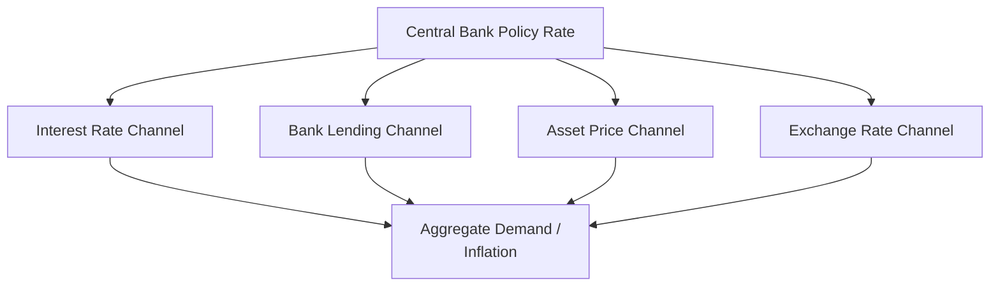
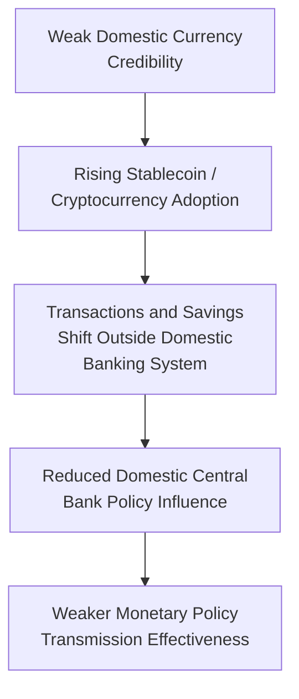

## Implications of Digital Money for Monetary Policy Transmission

### Overview

The rise of digital forms of money—central bank digital currencies (CBDCs), private stablecoins, and cryptocurrencies—raises fundamental questions about how monetary policy transmission mechanisms might evolve. Monetary policy traditionally transmits through central bank control over short-term interest rates and the banking system's balance sheet, propagating through bank lending, asset prices, and exchange rates to affect aggregate demand and inflation. Digital money innovations have the potential to alter multiple links in this transmission chain, offering both new policy tools (particularly for CBDCs) and new risks (particularly around bank disintermediation and currency substitution).

### The Conventional Transmission Mechanism as a Baseline

**Key Points**

- Standard monetary policy transmission operates primarily through the central bank setting a short-term policy interest rate (or, historically, through direct control of monetary aggregates), which propagates through several channels:
  - **Interest rate channel**: changes in the policy rate affect broader market interest rates, influencing borrowing costs for consumption and investment
  - **Bank lending channel**: changes in policy affect banks' funding costs and willingness/capacity to extend credit, particularly relevant given banks' central role as credit intermediaries
  - **Asset price channel**: policy changes affect equity, bond, and real estate valuations, influencing wealth effects on consumption
  - **Exchange rate channel**: policy changes affect the exchange rate, influencing net exports and imported inflation
- This entire framework presumes the central bank's ability to influence the cost and availability of bank-intermediated credit as the primary transmission node—an assumption digital money developments could partially alter

### Retail CBDCs: A New Direct Policy Tool

**Key Points**

- A retail CBDC held directly by households and businesses as a central bank liability could, in principle, provide central banks with a new and more direct transmission channel: the ability to remunerate CBDC holdings at a rate set independently of, or as a floor/ceiling relative to, conventional bank deposit rates
- If a CBDC pays interest, changes in that rate could transmit to the broader economy with potentially greater speed and completeness than the conventional bank-lending-channel-dependent mechanism, since CBDC holders would experience an immediate, direct effect on their money holdings' return without needing bank intermediation to pass through the change
- Some researchers and central bankers have discussed the theoretical possibility of using tiered CBDC remuneration (differing interest rates depending on the size of an individual's holdings) as a tool to more precisely calibrate the incentive to hold versus spend CBDC balances, a capability not available with physical cash or most current bank deposit structures
- **[Inference]** While an interest-bearing retail CBDC is technically capable of enabling a more direct transmission channel, no major advanced economy has yet implemented a full-scale interest-bearing retail CBDC, so claims about its practical transmission effectiveness remain largely theoretical, drawn from monetary theory and limited small-scale pilot evidence rather than large-scale empirical observation.

### The Effective Lower Bound and Digital Money

**Key Points**

- Physical cash has historically been cited as imposing a practical "effective lower bound" on nominal interest rates, since holders can always convert bank deposits to zero-interest physical cash to avoid strongly negative rates, limiting how far central banks can push policy rates below zero to stimulate the economy during severe downturns
- Some monetary economists have discussed how a purely digital monetary system, in which physical cash is substantially reduced or eliminated in favor of CBDCs or digital bank money, could in principle make more deeply negative interest rate policy operationally feasible, since the "escape valve" of converting to zero-interest cash would no longer be readily available
- This possibility has generated both interest (as a potential tool for combating severe deflationary or recessionary episodes) and significant public concern (given the loss of an anonymous, interest-rate-independent store of value that many consider an important feature of cash for both privacy and financial autonomy reasons)
- **[Speculation]** Whether any major central bank would actually deploy substantially negative interest rates enabled by reduced cash usage, given the significant political and public acceptance challenges such a policy would likely face, is a speculative question not resolved by current CBDC designs or stated central bank policy intentions, most of which explicitly disclaim any intention to eliminate cash or pursue deeply negative rates via CBDC design.

### Bank Disintermediation and the Credit Channel

**Key Points**

- If a substantial share of deposits migrates from commercial banks to a retail CBDC (or to stablecoins), this could reduce the deposit funding base available to commercial banks, a phenomenon discussed extensively in digital euro policy debates
- Since commercial bank lending remains a primary transmission channel for monetary policy in most economies, a reduction in bank deposit funding could, depending on how banks respond (raising other funding costs, tightening credit standards), attenuate the bank lending channel's effectiveness, altering the relative importance of different transmission channels
- This risk has driven design choices such as CBDC holding limits and tiered remuneration structures (discussed in central bank digital currency design literature) explicitly intended to limit large-scale deposit migration away from commercial banks
- **[Inference]** The magnitude of likely deposit migration and its effect on bank lending capacity is estimated differently across central bank research and modeling exercises depending on assumed CBDC design parameters (holding limits, remuneration) and household behavioral responses; specific quantitative disintermediation estimates should be treated as model-dependent projections rather than empirically validated outcomes, since large-scale retail CBDCs have not yet been implemented in major advanced economies.

### Stablecoins, Cryptocurrencies, and Currency Substitution Risk

**Key Points**

- Widespread adoption of dollar-denominated (or other major-currency-denominated) stablecoins in economies with their own domestic currency could create a form of "digital dollarization," analogous to traditional currency substitution phenomena, potentially weakening the domestic central bank's ability to influence financial conditions through its own policy rate if a meaningful share of transactions and savings shift to a foreign-currency-denominated digital instrument
- This risk is considered most acute in economies experiencing high inflation, currency instability, or capital controls, where domestic-currency confidence is already weak—paralleling historical dollarization patterns (as seen in Ecuador, Zimbabwe, and elsewhere) but potentially occurring with greater speed and lower transaction friction given the accessibility of stablecoins via smartphone-based crypto wallets, without requiring formal access to foreign banking infrastructure
- For pure decentralized cryptocurrencies (e.g., Bitcoin), the transmission implications are somewhat different: rather than substituting for a foreign sovereign currency, adoption represents substitution toward a non-sovereign asset with no central issuer, potentially removing the relevant transaction volume from any central bank's policy influence entirely, though current adoption levels for transactional (as opposed to speculative/investment) use remain limited

### Cross-Border Payment Speed and Exchange Rate Channel Effects

**Key Points**

- Faster, cheaper cross-border payment infrastructure enabled by wholesale CBDCs (such as the mBridge project) and stablecoins could increase the speed and volume of international capital flows, potentially amplifying exchange rate volatility in response to policy rate differentials between countries, a consideration relevant to the exchange rate transmission channel
- Conversely, some researchers argue improved cross-border settlement efficiency could reduce certain frictions and risk premia currently embedded in exchange rate and cross-border interest rate relationships, potentially improving (rather than degrading) the efficiency of exchange-rate-based policy transmission
- **[Inference]** The net effect of faster digital cross-border settlement infrastructure on exchange rate volatility and policy transmission efficiency is theoretically ambiguous and not yet clearly resolved by empirical evidence, since most wholesale CBDC cross-border projects remain in relatively early-stage piloting as of 2026 rather than full-scale operation.

### Programmability and Targeted Policy Transmission

**Key Points**

- Some CBDC design discussions have explored the theoretical possibility of "programmable money"—CBDC units embedded with conditions restricting their use (e.g., time-limited expiration dates intended to encourage immediate spending, or restrictions to specific categories of goods and services)
- Proponents suggest such features could, in principle, allow more precisely targeted fiscal or monetary stimulus (for example, ensuring stimulus payments are spent within a specific window to maximize near-term demand effects, addressing a common concern that conventional stimulus payments are partly saved rather than spent)
- This capability remains highly controversial and is explicitly disclaimed by most major central banks currently developing CBDCs (including the ECB in its digital euro design), given significant public concern about privacy, financial autonomy, and the precedent such programmability could set for government control over private economic behavior
- **[Inference]** While programmable money features are technically feasible and have been discussed in academic and some policy literature, no major central bank has committed to implementing expiring or use-restricted CBDC as a standard monetary policy tool, and most explicitly reject such designs in current public communications; the "programmable money as policy tool" concept should be understood as a theoretical possibility raised in discourse rather than a materializing policy direction.

### Financial Stability Feedback Effects on Transmission

**Key Points**

- As discussed in the context of retail CBDC design, the potential for rapid, large-scale digital "flight to safety" from commercial bank deposits into CBDC during periods of financial stress could amplify rather than dampen financial instability, with second-order effects on monetary policy transmission if banks respond to deposit outflows by sharply tightening credit conditions beyond what the central bank's policy stance intends
- Similarly, stablecoin reserve holdings' interconnection with short-term government securities markets (discussed in stablecoin monetary implications) creates a potential channel through which stablecoin-specific stress (e.g., a large issuer facing a confidence crisis) could spill over into broader financial conditions and interest rate transmission, independent of the central bank's intended policy stance
- These financial-stability-transmission interactions represent a genuinely new consideration for monetary policymakers, since they did not exist in comparable form prior to the scale of digital money adoption reached by the mid-2020s

### Relevance to Monetary Economics

**Key Points**

- Digital money developments touch every major channel of conventional monetary policy transmission—interest rate pass-through, bank lending, exchange rates, and financial stability feedback—while also introducing genuinely novel considerations (programmability, tiered CBDC remuneration, effective lower bound implications) without clear precedent in pre-digital monetary systems
- Because large-scale retail CBDCs and extensive stablecoin-driven currency substitution remain relatively early-stage phenomena as of 2026, most conclusions about their eventual transmission effects remain substantially theoretical or model-based rather than grounded in extensive empirical observation, an important epistemic caveat for this rapidly evolving area
- Understanding these potential transmission channel effects is essential for evaluating ongoing central bank research, policy design choices (holding limits, remuneration structures), and the broader debate about how monetary policy institutions and tools may need to adapt as digital money adoption continues to grow

**Related Topics**

- Central bank digital currencies
- Stablecoins and their monetary implications
- Cryptocurrencies and blockchain-based money
- The effective lower bound and negative interest rate policy
- Bank disintermediation risk in CBDC design
- Currency substitution and digital dollarization
- Cross-border wholesale CBDC projects (mBridge)
- Financial stability regulation in digital asset markets