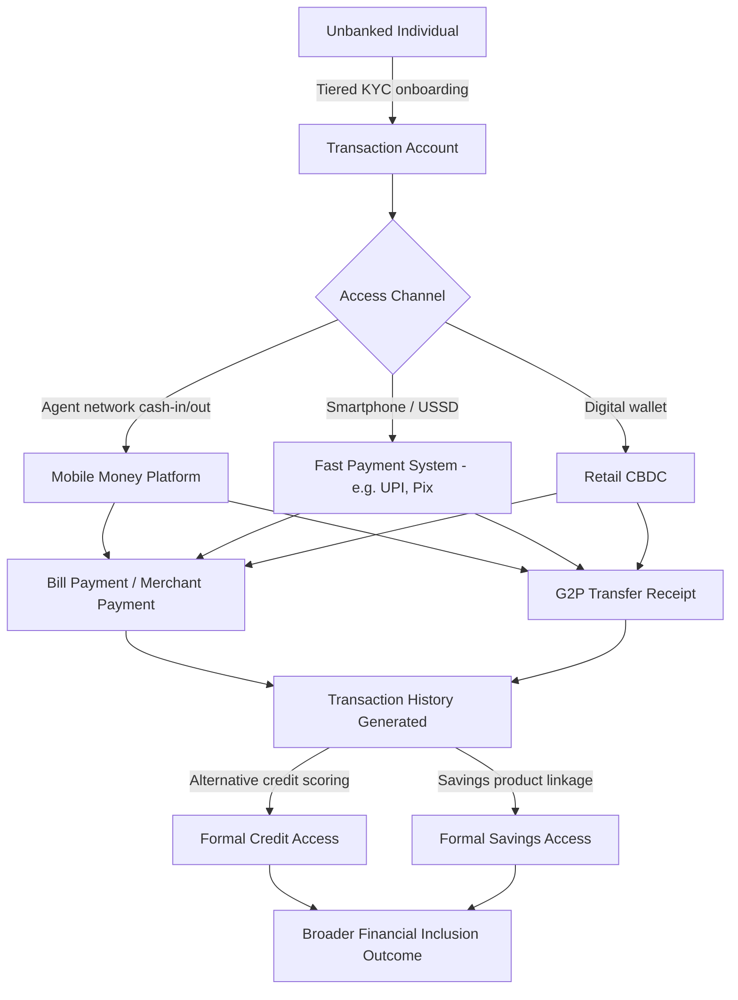

## Payment System Innovation and Financial Inclusion

### Conceptual Framework

**Financial inclusion** refers to the accessibility and usage of formal financial services—payments, savings, credit, insurance—by individuals and firms otherwise excluded from the formal financial system, typically due to cost, distance, documentation requirements, or lack of trust in institutions. Payment systems occupy a unique position in the financial inclusion agenda because a **transaction account** (an account that can send and receive payments) is generally the entry point through which unbanked individuals access the broader financial system: savings products, credit, and insurance are typically layered on top of an existing payment relationship.

The World Bank's Global Findex framework tracks account ownership as its central metric, and the theoretical linkage runs:

$$\text{Payment Access} \rightarrow \text{Transaction Account} \rightarrow \text{Savings Behavior} \rightarrow \text{Credit Access} \rightarrow \text{Welfare Gains}$$

This chain is not strictly linear in practice—mobile money accounts, for instance, often deliver payment and savings functionality without a corresponding increase in formal credit access—but it structures most policy discussions.

### Why Payment Innovation Matters for Inclusion

Traditional banking infrastructure imposes fixed costs (branch networks, KYC compliance, account maintenance) that make serving low-balance, low-transaction customers unprofitable under conventional retail banking models. Payment innovation addresses this primarily through **cost structure transformation**:

- **Agent-based models**: Replace physical branches with a distributed network of small retail agents (shopkeepers, kiosks) who handle cash-in/cash-out, dramatically lowering the fixed capital cost of last-mile access.
- **Mobile-first infrastructure**: Leverages existing telecom infrastructure (SIM cards, USSD, feature phones) rather than requiring new physical or digital infrastructure investment by the end user.
- **Tiered KYC (Know Your Customer)**: Regulatory frameworks that allow lower-value, lower-risk accounts to be opened with reduced documentation, addressing the "documentation barrier" to formal account ownership.
- **Interoperability mandates**: Regulatory or market-driven requirements that different payment providers' systems can transact with one another, preventing walled-garden effects that would otherwise fragment liquidity and reduce network value for smaller providers.

### Major Innovation Categories

#### Mobile Money

Mobile money is a store-of-value and payment mechanism operated typically by a mobile network operator (MNO) or a fintech partnering with one, where value is held in an e-money account linked to a phone number rather than a traditional bank account.

**Key Points**

- Regulatory treatment varies: some jurisdictions require e-money issuers to hold a banking license; others created bespoke e-money issuer licenses (e.g., Kenya's approach under the Central Bank of Kenya, which permitted non-bank-led mobile money).
- The float held by the issuer (aggregate customer balances) is generally required to be held in a trust account at a regulated bank, ring-fenced from the issuer's own balance sheet—a structural safeguard against issuer insolvency.
- Agent liquidity management (ensuring agents have enough e-float and physical cash to service cash-in/cash-out demand) is the primary operational constraint on network scalability. [Inference: liquidity management difficulty scales non-linearly with rural agent density, based on documented agent network studies, though this is not a universal law]

**Example**

M-Pesa (Kenya, launched 2007 by Safaricom) is the canonical case. It began as a person-to-person transfer service and expanded into bill payment, merchant payment, savings-linked products (e.g., M-Shwari, a partnership with Commercial Bank of Africa offering micro-savings and micro-credit), and cross-border remittance corridors. Kenya's Findex account ownership rose from roughly 42% (2011) to over 80% (2021), with mobile money cited as a primary driver, though the counterfactual (what inclusion would have looked like absent mobile money) is not directly observable.

#### Real-Time Payment (RTP) Systems / Fast Payment Systems

Fast payment systems are centrally cleared, typically bank-account-to-bank-account infrastructures that settle payments within seconds, operating continuously (24/7/365).

**Key Points**

- Settlement finality is typically achieved through a central operator (often the central bank or a central-bank-supervised utility) rather than bilateral clearing.
- Design choices affect inclusion outcomes: systems using simple identifiers (phone number, national ID) as payment addresses (rather than requiring account/routing numbers) lower usability barriers for less financially literate users.
- Government-to-person (G2P) payment digitization (social transfers, subsidies, pensions) is frequently the anchor use case that drives initial account opening among excluded populations, since it provides a guaranteed, recurring reason to hold and use an account. [Unverified: the magnitude of G2P-driven account "dormancy reduction" varies significantly by program design and is contested in the literature]

**Example**

India's **Unified Payments Interface (UPI)**, launched 2016 by the National Payments Corporation of India, uses a Virtual Payment Address (VPA, e.g., `name@bank`) layered atop the existing Aadhaar (biometric ID) and Jan Dhan Yojana (zero-balance account) infrastructure—together termed the "India Stack." This combination of digital identity, zero-balance accounts, and free instant payment rails is widely cited as a template for inclusion-oriented infrastructure design, though replication elsewhere has been uneven due to differing ID infrastructure maturity.

Brazil's **Pix**, launched 2020 by the Banco Central do Brasil, similarly mandated participation by large financial institutions, using CPF (tax ID), phone number, or email as payment keys.

#### Central Bank Digital Currency (CBDC)

A CBDC is a direct liability of the central bank issued in digital form, distinguishing it from commercial bank deposits (a liability of the private bank) and from existing e-money/mobile money (typically a liability of a licensed non-bank or bank issuer, itself backed by pooled bank deposits).

**Key Points**

- **Retail CBDC** (general-purpose, for households and firms) is the variant most directly relevant to financial inclusion; **wholesale CBDC** (interbank settlement only) has limited direct inclusion effects.
- Proposed inclusion mechanisms: CBDC could offer a no-fee, central-bank-guaranteed account accessible without a commercial bank relationship, potentially reaching populations excluded due to minimum balance requirements or lack of documentation.
- Offline functionality (enabling transactions without continuous network connectivity) is frequently cited as a design requirement for reaching low-connectivity rural populations, though implementations differ (e.g., NFC-based offline transfer, SMS-based settlement).
- Design tension exists between financial inclusion goals and financial stability concerns: unlimited CBDC holding capacity could, in stress scenarios, accelerate deposit flight from commercial banks ("digital bank run" risk), leading most central bank designs to propose holding limits.

**Example**

The Bahamas' **Sand Dollar** (launched 2020) was explicitly designed with financial inclusion as a primary motivation, targeting the archipelago's geographically dispersed population where physical bank branch access is costly. Nigeria's **eNaira** (2021) similarly cited inclusion, though adoption has been reported as low relative to existing mobile money-style platforms (e.g., OPay). [Inference: low eNaira adoption relative to design goals is documented in multiple central bank and IMF reports, though exact adoption figures should be verified against current data given the pace of change]

#### Stablecoins and Cross-Border Remittances

Stablecoins (privately issued digital tokens pegged to a reference asset, typically a fiat currency) have been proposed as a mechanism to reduce remittance costs, which historically average significantly above the UN Sustainable Development Goal target of 3% of transaction value.

**Key Points**

- The theoretical cost advantage stems from disintermediating correspondent banking relationships, which impose multiple layers of fees and FX spreads in traditional remittance corridors.
- Practical adoption for remittances requires an on-ramp/off-ramp infrastructure (converting local fiat to stablecoin and back) that itself often replicates the cost and friction stablecoins are meant to reduce, unless local cash-out networks are well developed.
- Regulatory uncertainty (classification as e-money, security, or unregulated asset varies by jurisdiction) remains a significant barrier to institutional-scale remittance use. [Speculation: whether stablecoin-based remittance corridors achieve mainstream displacement of traditional money transfer operators, or remain a niche technically-sophisticated-user channel, is not yet resolved by available evidence]

### Barriers to Inclusion Beyond Access

Access to a payment instrument does not guarantee usage. The Findex literature and related empirical work identify several distinct barrier categories:

| Barrier Type | Description | Illustrative Policy Response |
| --- | --- | --- |
| Documentation | Lack of formal ID prevents KYC compliance | Tiered KYC, biometric national ID systems |
| Cost | Account fees, minimum balances, transaction fees | Zero-balance account mandates, fee caps |
| Distance | Physical branch access is costly, especially rural | Agent banking networks |
| Trust | Distrust of formal institutions or documented history of instability | Deposit insurance extension, public sector guarantees |
| Digital/financial literacy | Inability to use digital interfaces or understand product terms | USSD (non-smartphone) interfaces, financial literacy programs |
| Gender gap | Social/legal norms restricting women's independent account access | Gender-disaggregated account targets, mobile money targeting women as primary recipients of G2P transfers |
| Documentation of income | Lack of formal income history impedes graduation from payment access to credit access | Alternative credit scoring using mobile money transaction history |

The **usage-access gap**—where account ownership rises but active usage (measured by transactions per month, or "dormancy rate") remains low—is a persistent empirical finding, indicating that opening an account is necessary but not sufficient for inclusion outcomes. [Inference: dormancy is frequently linked in country-level studies to G2P-driven account opening without a corresponding recurring use case, though this relationship is not uniformly quantified across markets]

### System Architecture Diagram

### Illustrative Diagram: Cost Structure Comparison (svg_diagram)

<svg xmlns="http://www.w3.org/2000/svg" viewBox="0 0 640 300">
<text x="320" y="24" text-anchor="middle" font-size="15" font-weight="bold" fill="#1a1a1a">Per-Customer Cost Structure: Branch Banking vs. Agent/Mobile Model (svg_diagram)</text>
<line x1="60" y1="260" x2="600" y2="260" stroke="#333" stroke-width="1.5" />
<line x1="60" y1="260" x2="60" y2="50" stroke="#333" stroke-width="1.5" />
<text x="30" y="260" font-size="11" fill="#333">0</text>
<text x="20" y="60" font-size="11" fill="#333">High</text>
<text x="18" y="255" font-size="11" fill="#333">Low</text>
<text x="10" y="155" font-size="11" fill="#333" transform="rotate(-90 10,155)">Cost / Customer</text>
<rect x="130" y="80" width="90" height="180" fill="#4a6fa5" opacity="0.85" />
<text x="175" y="270" text-anchor="middle" font-size="12" fill="#1a1a1a">Branch Banking</text>
<text x="175" y="75" text-anchor="middle" font-size="10" fill="#4a6fa5">Fixed infra</text>
<rect x="270" y="150" width="90" height="110" fill="#7ba05b" opacity="0.85" />
<text x="315" y="270" text-anchor="middle" font-size="12" fill="#1a1a1a">Agent Network</text>
<text x="315" y="145" text-anchor="middle" font-size="10" fill="#7ba05b">Variable infra</text>
<rect x="410" y="200" width="90" height="60" fill="#c17b3f" opacity="0.85" />
<text x="455" y="270" text-anchor="middle" font-size="12" fill="#1a1a1a">Mobile-Native</text>
<text x="455" y="195" text-anchor="middle" font-size="10" fill="#c17b3f">Marginal infra</text>

<text x="320" y="292" text-anchor="middle" font-size="10" fill="#555" font-style="italic">Illustrative relative comparison, not calibrated to specific empirical data</text>

</svg>

### Policy Trade-offs and Debates

**Key Points**

- **Interoperability vs. competitive incentive**: Mandating interoperability among payment providers increases network value for consumers but can reduce first-mover incentive for private investment in payment infrastructure, since a dominant platform cannot capture full network effects if forced to interconnect with rivals.
- **Data privacy vs. credit scoring innovation**: Transaction data from digital payments enables alternative credit scoring for the "thin-file" population, but raises data governance and consent questions, particularly where data is held by a private telecom or fintech rather than a regulated bank.
- **CBDC disintermediation risk vs. inclusion goal**: A central-bank-issued account that competes directly with commercial bank deposits could, at scale, reduce banks' deposit funding base, potentially reducing credit supply—a tension most CBDC pilots address through holding limits or non-interest-bearing design, at some cost to the CBDC's attractiveness as a savings vehicle.
- **Agent exclusivity vs. agent network expansion**: Requiring agents to work exclusively with one payment provider (common in early mobile money models) can accelerate that provider's rollout but limits consumer choice and can suppress rural agent density where population is too sparse to support multiple exclusive networks.

### Measurement and Evaluation

The primary empirical instrument for cross-country inclusion measurement is the World Bank's **Global Findex Database**, surveying account ownership, usage frequency, and barriers to access at the individual level, conducted roughly every three years (rounds: 2011, 2014, 2017, 2021, with a 2024/2025 round in progress or recently released depending on publication timing). [Unverified: exact release timing and headline figures of the most recent Findex round should be confirmed against the current publication, as this may postdate readily available training data]

Complementary metrics used in policy evaluation include:

- **Active usage rate**: percentage of accounts with a transaction in the trailing 90 days.
- **Agent density**: number of active cash-in/cash-out agents per 100,000 adults, often disaggregated urban/rural.
- **Gender gap in account ownership**: percentage-point difference in account ownership between men and women, a standard Findex-reported statistic.
- **Cost of remittance corridors**: tracked by the World Bank's Remittance Prices Worldwide database, benchmarked against the SDG 10.c target of 3% average cost.

**Next Steps**

- Agent banking network design and liquidity management economics
- Digital identity systems (Aadhaar, eKYC frameworks) as inclusion infrastructure
- Interoperability standards and API-based open banking frameworks (e.g., PSD2-style regimes)
- Alternative credit scoring using mobile money and utility payment data
- CBDC design trade-offs: account-based vs. token-based models
- Gender gap in financial inclusion: causes and targeted interventions
- Remittance corridor economics and the role of money transfer operators vs. fintech disintermediation
- Regulatory sandboxes as a policy tool for fintech-driven inclusion innovation