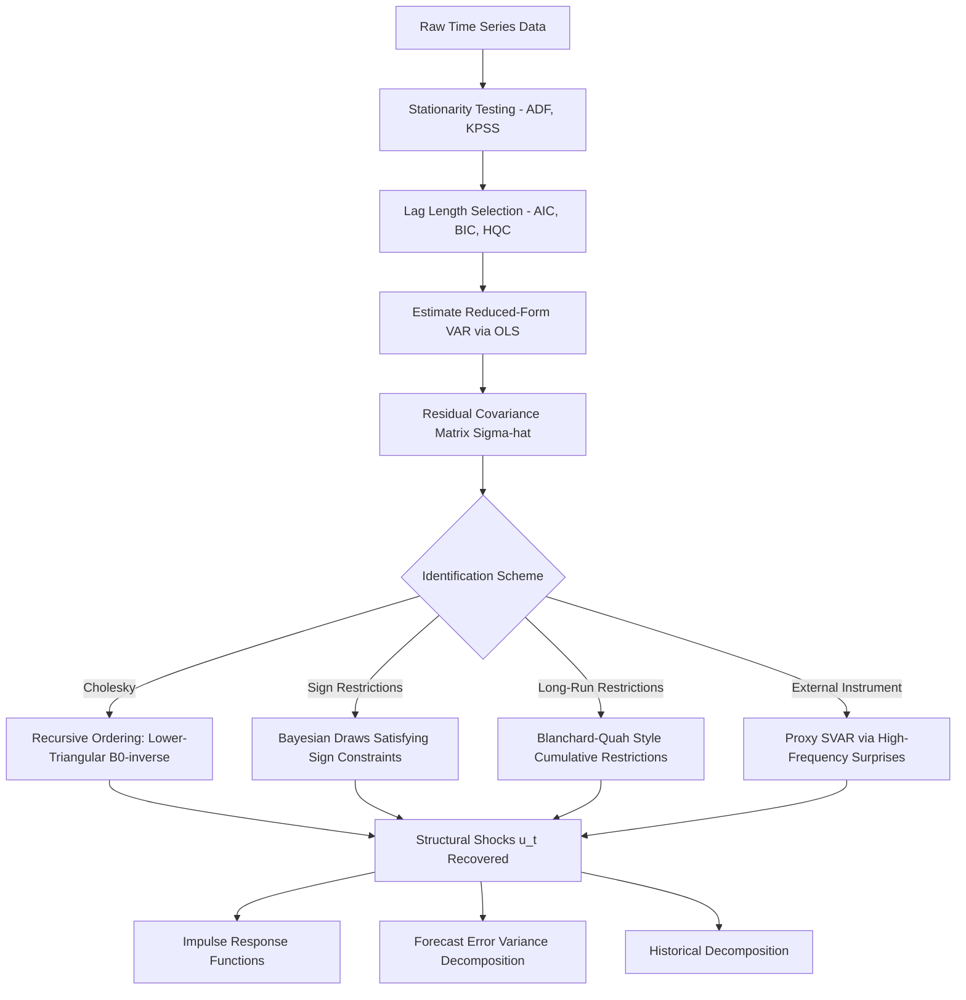

## Vector Autoregression Models

### Definition and Motivation

A **Vector Autoregression (VAR)** model is a multivariate time series framework in which each variable is modeled as a linear function of its own past values and the past values of all other variables in the system. VARs were introduced to macroeconomics primarily as a response to the perceived weaknesses of large structural macroeconometric models, which impose numerous identifying restrictions derived from theory that critics argued were "incredible" (Sims, 1980) and untestable. The VAR approach instead treats all included variables as jointly endogenous, imposing minimal a priori theoretical structure and instead letting the data determine the dynamic relationships among variables.

In monetary economics, VARs are the workhorse tool for tracing the dynamic effects of monetary policy shocks on output, inflation, and other macroeconomic aggregates, and for decomposing the sources of business cycle fluctuations.

### The Reduced-Form VAR

A VAR of order $p$, denoted VAR($p$), for an $n \times 1$ vector of variables $y_t$ is written as:

$$y_t = c + A_1 y_{t-1} + A_2 y_{t-2} + \cdots + A_p y_{t-p} + \varepsilon_t$$

where:

- $y_t$ is an $n \times 1$ vector of endogenous variables (e.g., output, inflation, interest rate)
- $c$ is an $n \times 1$ vector of constants
- $A_i$ are $n \times n$ coefficient matrices for lag $i$
- $\varepsilon_t$ is an $n \times 1$ vector of reduced-form (residual) error terms, with $E[\varepsilon_t] = 0$, $E[\varepsilon_t \varepsilon_t'] = \Sigma$, and $E[\varepsilon_t \varepsilon_s'] = 0$ for $t \neq s$

**Key Points**

- Each equation in the system is estimable by Ordinary Least Squares (OLS) equation-by-equation, since the right-hand-side regressors (lagged values of all variables) are identical across equations and predetermined relative to $\varepsilon_t$—this makes OLS equation-by-equation equivalent to the more general Generalized Least Squares (GLS) estimator, a standard result following from the Seemingly Unrelated Regressions (SUR) literature.
- The reduced-form residuals $\varepsilon_t$ are generally correlated across equations (off-diagonal elements of $\Sigma$ are typically nonzero) because the underlying structural shocks affect multiple variables contemporaneously. This contemporaneous correlation is precisely what prevents direct structural interpretation of reduced-form residuals.
- Stability requires that all roots of the characteristic polynomial $\det(I_n - A_1 z - A_2 z^2 - \cdots - A_p z^p) = 0$ lie outside the unit circle; equivalently, the companion-form matrix must have all eigenvalues with modulus less than 1.

### Lag Length Selection

Lag order $p$ is typically chosen using information criteria, trading off the improved in-sample fit of additional lags against parameter proliferation ($n^2 p$ coefficients in the slope matrices alone, excluding the constant).

Common criteria:

$$\text{AIC}(p) = \ln|\hat{\Sigma}(p)| + \frac{2}{T} p n^2$$

$$\text{BIC}(p) = \ln|\hat{\Sigma}(p)| + \frac{\ln T}{T} p n^2$$

$$\text{HQC}(p) = \ln|\hat{\Sigma}(p)| + \frac{2\ln(\ln T)}{T} p n^2$$

where $\hat{\Sigma}(p)$ is the estimated residual covariance matrix at lag order $p$ and $T$ is the sample size.

**Key Points**

- BIC and HQC impose heavier penalties per parameter than AIC and asymptotically select the true lag order under standard conditions (consistency), whereas AIC tends to overselect the lag order asymptotically.
- In practice, different criteria frequently disagree on the optimal $p$; a common applied procedure is to report results across the range suggested by all criteria, or to select the largest $p$ suggested by any criterion followed by a check for residual autocorrelation via a portmanteau test (e.g., a multivariate Ljung-Box or Portmanteau $Q$-statistic).

### The Identification Problem

The reduced-form VAR is not directly interpretable in terms of structural, economically meaningful shocks because $\varepsilon_t$ is a linear combination of the true structural shocks. The **structural VAR (SVAR)** relates reduced-form residuals to structural shocks $u_t$ via:

$$B_0 y_t = c^* + B_1 y_{t-1} + \cdots + B_p y_{t-p} + u_t$$

with $u_t$ orthogonal (i.e., $E[u_t u_t'] = D$, a diagonal matrix, typically normalized to the identity), and the mapping between reduced-form and structural residuals given by:

$$\varepsilon_t = B_0^{-1} u_t$$

Since $\Sigma = B_0^{-1} D (B_0^{-1})'$, and $\Sigma$ has $n(n+1)/2$ unique elements while $B_0^{-1}$ has $n^2$ elements, the system is underidentified without additional restrictions: exact identification of $B_0^{-1}$ requires $n^2 - n(n+1)/2 = n(n-1)/2$ additional restrictions.

**Key Points**

- This is the central econometric problem of structural VAR analysis: the reduced form is directly estimable, but recovering economically interpretable shocks requires imposing identifying assumptions that are not testable from the reduced-form data alone (they are assumptions, not implications, of the model).
- The choice of identification scheme is the primary source of disagreement in the empirical monetary VAR literature—different identifying assumptions applied to similar data can produce materially different impulse response estimates. [Inference: this sensitivity is extensively documented across the SVAR monetary policy literature, though the degree of sensitivity is model- and dataset-specific]

### Identification Schemes

#### Recursive (Cholesky) Identification

The most common approach imposes a recursive causal ordering, achieved via the Cholesky decomposition of $\hat{\Sigma}$, such that $B_0^{-1}$ is lower triangular. This implies variables ordered earlier in the system do not respond contemporaneously to shocks in variables ordered later, while later variables can respond contemporaneously to all earlier shocks.

**Example**

In a canonical monetary policy VAR with ordering [output, prices, policy rate], the recursive scheme assumes output and prices do not respond within the period to a monetary policy shock (consistent with the assumption that policy actions affect real activity only with a lag), while the policy rate can respond contemporaneously to output and price shocks (consistent with the central bank observing current conditions and reacting within the period, or using nowcasts of the current period).

**Key Points**

- The ordering choice is itself an identifying assumption; different orderings generally yield different structural shock estimates and impulse responses, though results are sometimes robust to reasonable reorderings within a given theoretical framework. [Inference: robustness to reordering is model- and application-specific and should be checked, not assumed]
- Cholesky ordering is computationally simple (it can be obtained directly from the LU/Cholesky decomposition of $\hat{\Sigma}$) but is criticized for imposing a timing structure that may not have strong theoretical justification in all applications.

#### Sign Restrictions

Rather than imposing exact zero restrictions on contemporaneous relationships, sign restrictions constrain the *sign* of impulse responses of certain variables to a given shock over a specified horizon, consistent with theoretical priors (e.g., a contractionary monetary policy shock should not decrease the policy rate, and should not increase prices, over some window).

**Key Points**

- This approach, developed prominently by Uhlig (2005) and Faust (1998), avoids the "incredible" precision of exact zero restrictions but introduces a different problem: the identified set of admissible structural parameter draws is generally not a single point, requiring reporting of a range (or the full posterior distribution under Bayesian implementation) rather than a unique impulse response.
- Sign-restricted VARs are typically estimated using Bayesian methods, drawing orthogonal rotation matrices (via QR decomposition of random matrices) and retaining only those draws satisfying the sign restrictions.

#### Long-Run (Blanchard-Quah) Restrictions

Restrictions are imposed on the long-run (cumulative, $h \to \infty$) impulse responses rather than contemporaneous ones, commonly motivated by neutrality propositions from economic theory (e.g., a nominal shock has no long-run effect on real output, consistent with long-run monetary neutrality).

**Example**

Blanchard and Quah (1989) identify demand and supply shocks in a bivariate output-unemployment VAR by restricting demand shocks to have zero long-run effect on output level, while supply shocks can have permanent effects—an application of the long-run neutrality principle common in monetary theory.

#### External Instruments / Proxy SVAR

An external, theoretically exogenous instrument correlated with the structural shock of interest but uncorrelated with other structural shocks is used to identify the shock, circumventing internal (zero or sign) restrictions.

**Example**

Monetary policy shocks are commonly identified using high-frequency changes in fed funds futures prices around FOMC announcement windows (Gertler and Karadi, 2015) as an instrument, on the premise that such narrow-window price changes isolate the policy surprise component, uncorrelated with other contemporaneous macroeconomic shocks.

**Key Points**

- Instrument relevance (correlation with the shock of interest) and exogeneity (uncorrelated with other structural shocks) are both required and are typically not fully testable, analogous to standard instrumental variables assumptions in cross-sectional econometrics.
- Weak instrument concerns (analogous to weak-IV bias in cross-sectional settings) apply directly and can bias impulse response estimates if instrument relevance is low. [Unverified: the precise finite-sample bias magnitude depends on instrument strength and sample size and should be assessed via instrument relevance diagnostics such as the first-stage F-statistic]

### Impulse Response Functions (IRFs)

The impulse response function traces the dynamic effect of a one-time, one-unit structural shock to variable $j$ on the current and future values of variable $i$, holding all other shocks at zero.

Given the moving average (MA) representation of the VAR (assuming stationarity):

$$y_t = \mu + \sum_{h=0}^{\infty} \Phi_h \varepsilon_{t-h}$$

the structural impulse responses are obtained via $\Theta_h = \Phi_h B_0^{-1}$, where the $(i,j)$ element of $\Theta_h$ gives the response of variable $i$ at horizon $h$ to a unit structural shock in variable $j$ at time 0.

**Key Points**

- Confidence intervals (or credible intervals in Bayesian settings) around IRF point estimates are essential for inference, since point estimates alone can be misleadingly precise-looking; standard approaches include asymptotic delta-method intervals, bootstrap (standard or bias-corrected), and Bayesian posterior credible sets.
- Bootstrap confidence intervals are widely used in applied work but can have coverage distortions in small samples or near-unit-root settings; this is a recognized limitation requiring care in interpretation. [Inference: coverage distortion in small samples is a documented issue in the bootstrap-VAR literature, with severity depending on persistence of the series and sample size]

### Forecast Error Variance Decomposition (FEVD)

FEVD decomposes the forecast error variance of each variable at a given horizon into the proportions attributable to each structural shock, answering "how much of the variation in variable $i$ at horizon $h$ is explained by shock $j$."

**Example**

A typical monetary VAR FEVD might show that at short horizons, output forecast error variance is dominated by demand or supply shocks, with the monetary policy shock's contribution rising at intermediate horizons before potentially receding at very long horizons—consistent with the standard view that policy affects the level and timing of fluctuations but not long-run output trend. [Inference: this qualitative pattern is a common finding but not universal across countries, sample periods, or identification schemes]

### Historical Decomposition

Historical decomposition attributes the actual, realized deviation of each variable from its unconditional forecast (or from a baseline path) at each point in time to the cumulative contribution of each structural shock, useful for narrative-style analysis (e.g., "how much of the 2008 output decline is attributable to identified financial/demand shocks versus other shocks").

### Extensions

#### Bayesian VAR (BVAR)

Standard VARs face a curse of dimensionality: with $n$ variables and $p$ lags, the number of estimated parameters grows with $n^2p$, quickly exhausting degrees of freedom in typical macroeconomic samples (often only 40-60 years of quarterly data, i.e., 160-240 observations). Bayesian VARs address this by imposing prior distributions on coefficients that shrink estimates toward a parsimonious benchmark.

**Key Points**

- The **Minnesota prior** (Litterman, 1986) is the classical benchmark, shrinking coefficients toward a random-walk prior for each variable (own first lag coefficient centered at 1, all other coefficients centered at 0), with prior variance declining as lag length increases (reflecting the belief that more distant lags matter less).
- BVARs allow estimation of larger systems (more variables, more lags) than would be feasible via unrestricted OLS given a fixed sample size, at the cost of introducing the prior as a modeling choice requiring justification and sensitivity analysis.

#### Factor-Augmented VAR (FAVAR)

FAVAR (Bernanke, Boivin, and Eliasz, 2005) augments a standard VAR with latent common factors extracted (typically via principal components) from a large panel of macroeconomic series, addressing the concern that small-scale VARs may suffer from **omitted information bias**—central banks observe far more information than fits in a 3-5 variable VAR, and this larger information set can matter for correctly identifying policy shocks (the "price puzzle," where a contractionary policy shock appears to raise prices in small VARs, is often attributed partly to this omitted-information problem).

#### Time-Varying Parameter VAR (TVP-VAR)

Allows coefficient matrices $A_i$ and/or the residual covariance $\Sigma$ to evolve over time (typically via a random-walk state-space specification estimated with Bayesian methods, e.g., Primiceri, 2005), addressing concerns about structural change or evolving monetary policy regimes (e.g., the Volcker disinflation period versus the subsequent "Great Moderation").

#### Panel VAR

Extends the VAR framework to a panel of cross-sectional units (e.g., multiple countries), allowing for the estimation of common dynamics while accommodating cross-sectional heterogeneity through fixed effects, useful in cross-country monetary policy transmission studies.

### System Diagram: SVAR Identification Workflow

### Diagnostic Checks

**Key Points**

- **Stationarity**: Standard VAR estimation and inference assumes covariance stationarity of $y_t$; unit roots in individual series require either differencing, an alternative framework (e.g., Vector Error Correction Model, VECM, when cointegration is present), or careful interpretation of estimates in levels (Sims, Stock, and Watson, 1990, note that VARs in levels can still be validly estimated and produce consistent estimates of impulse responses under certain conditions even with unit roots, though hypothesis testing on individual coefficients can be non-standard).
- **Cointegration testing** (e.g., Johansen's trace and maximum eigenvalue tests) determines whether a VECM specification is more appropriate than a VAR in differences when variables are individually non-stationary but share a stationary long-run linear combination.
- **Residual autocorrelation**: A multivariate Portmanteau or Lagrange Multiplier (LM) test checks whether the chosen lag order adequately captures the dynamics, with remaining autocorrelation indicating potential misspecification (usually addressed by increasing $p$).
- **Granger causality tests**: Test whether lagged values of one variable improve out-of-sample or in-sample predictive fit for another, providing a statistical (not necessarily structural or economic) notion of "causality" useful for exploratory analysis of the system's dynamic interdependencies.

### Applications in Monetary Economics

**Example**

Christiano, Eichenbaum, and Evans (1999) is a canonical reference establishing the "stylized facts" of monetary policy transmission using recursively identified VARs: following a contractionary monetary policy shock, output declines with a lag of several quarters, prices decline gradually (with limited response on impact, consistent with sticky-price models), and short-term interest rates rise on impact before gradually returning to baseline.

**Key Points**

- VARs are used to evaluate the empirical fit of Dynamic Stochastic General Equilibrium (DSGE) models by comparing DSGE-implied impulse responses to VAR-estimated (typically SVAR or BVAR) impulse responses—a standard model validation exercise in the New Keynesian monetary literature.
- VARs also underpin empirical estimates of the monetary policy "Taylor rule" reaction function parameters and are used in forecasting exercises, where BVARs in particular have demonstrated competitive out-of-sample forecasting performance relative to more heavily parameterized structural models. [Inference: relative forecasting performance is dataset- and horizon-specific, and rankings among BVAR, DSGE, and reduced-form alternatives vary across studies]

### Limitations

**Key Points**

- The **Lucas critique** applies in principle to reduced-form VARs: estimated dynamic relationships may not be policy-invariant if private agents' expectations formation depends on the policy regime, meaning VAR-based policy counterfactuals (e.g., "what if the central bank had followed a different rule historically") require caution.
- Small-scale VARs risk **omitted variable/information bias**, potentially generating counterintuitive results such as the price puzzle noted above.
- Structural identification always rests on assumptions that are not fully testable from the data, meaning reported impulse responses are conditional on the maintained identifying scheme, not unconditional empirical facts.
- Behavior of estimated VAR-based effects may vary meaningfully across sample periods, countries, and specification choices; VAR results describing historical relationships should not be assumed to hold unconditionally into future or structurally different regimes.

**Next Steps**

- Structural VAR sign restriction methodology (Uhlig, Faust, Rubio-Ramírez methods) in depth
- Bayesian estimation methods for BVARs (Minnesota prior, Normal-Inverse-Wishart priors, Gibbs sampling)
- Local projections as an alternative to VAR-based impulse response estimation (Jordà, 2005)
- Cointegration and Vector Error Correction Models (VECM)
- DSGE-VAR comparison methodologies
- High-frequency identification and proxy SVAR construction
- Time-varying parameter and stochastic volatility VAR models