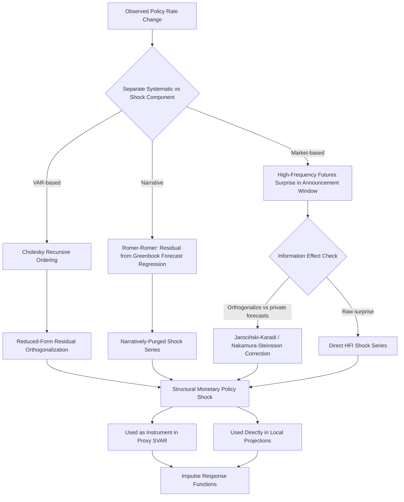

## Identification of Monetary Policy Shocks

### The Core Problem

A **monetary policy shock** is defined as the component of a change in a monetary policy instrument (typically the short-term nominal interest rate, or a central bank balance sheet variable at the zero lower bound) that is orthogonal to the systematic response of policy to the state of the economy. Formally, if the central bank follows a policy rule:

$$i_t = f(\Omega_t) + \sigma_i u_t^{mp}$$

where $i_t$ is the policy instrument, $\Omega_t$ is the central bank's information set (output, inflation, and other relevant state variables), $f(\cdot)$ is the systematic reaction function, and $u_t^{mp}$ is the structural monetary policy shock (assumed orthogonal to $\Omega_t$), the identification problem is to separate $\sigma_i u_t^{mp}$ from the systematic component $f(\Omega_t)$ using only observed data on $i_t$ and other macro variables.

**Key Points**

- This separation is not directly observable: any observed change in the policy rate is a mixture of the central bank's endogenous response to economic conditions and any genuinely exogenous, discretionary deviation from that systematic response.
- The identified shock $u_t^{mp}$ is the object of interest for estimating the causal dynamic effects of monetary policy on output, inflation, and other variables via impulse response analysis; a biased or poorly identified shock series contaminates all downstream causal estimates, making identification the central methodological battleground of empirical monetary economics.
- The problem is a specific instance of the general **simultaneity problem** in macroeconometrics: policy responds to the economy, and the economy responds to policy, within the same time period, so ordinary regression of macro outcomes on the policy rate conflates cause and effect.

### Identification Approaches: Taxonomy

**Key Points**

- Approaches broadly divide into (1) restrictions imposed directly on a VAR system, (2) narrative methods based on historical/textual analysis of policy intentions, (3) high-frequency market-based methods, and (4) hybrid approaches combining elements of the above (notably external-instrument/proxy SVARs).
- No single method commands universal consensus; each carries distinct identifying assumptions with different strengths and vulnerabilities, and much of the empirical monetary policy literature over the past three decades has consisted of methodological refinement in response to critiques of each approach in turn.

### 1. Recursive (Cholesky) VAR Identification

The earliest and still widely used approach orders variables in a VAR system such that policy variables are assumed not to respond contemporaneously to some subset of variables (or vice versa), implemented via Cholesky decomposition of the reduced-form residual covariance matrix (see VAR models for the general mechanics).

**Example**

Christiano, Eichenbaum, and Evans (1996, 1999) order the federal funds rate after output and prices but before financial variables, embedding the assumption that the Federal Reserve observes and reacts contemporaneously to output and prices within the period, but that output and prices do not respond within the period to a policy shock (only with a lag), while financial variables respond immediately.

**Key Points**

- **The price puzzle**: a persistent finding in early recursive VAR studies where a contractionary monetary policy shock is followed by a rise, not a fall, in the price level. The leading explanation is **omitted information bias**: the central bank observes forward-looking inflation forecasts (e.g., anticipating future inflation from commodity price movements) not included in the small-scale VAR, so a policy tightening in response to anticipated inflation is misidentified as an exogenous contractionary shock correlated with subsequently realized higher inflation.
- Standard fixes include adding commodity price indices (Sims, 1992) to proxy for the central bank's forward-looking information set, or using FAVAR methods (Bernanke, Boivin, and Eliasz, 2005) to incorporate a much larger information set via extracted factors.
- The ordering assumption itself is not testable and remains a maintained identifying assumption; robustness checks across alternative orderings are standard practice but do not resolve the fundamental non-testability.

### 2. Narrative Identification

Narrative approaches use historical documentary evidence—central bank meeting minutes, transcripts, internal memoranda, and staff forecasts—to directly identify episodes of policy action and to separate the discretionary shock component from the systematic, forecast-based component.

#### Romer and Romer (1989, 2004) Approach

**Key Points**

- The 1989 Romer and Romer approach identifies discrete historical dates when the Federal Reserve, according to FOMC narrative records, shifted policy specifically to reduce inflation "at the cost of increased unemployment"—a purely narrative, non-regression-based dating exercise producing a binary shock indicator series.
- The 2004 refinement addresses the concern that even narratively-dated policy actions are partly systematic (responding to the Fed's own internal forecasts). The method regresses the intended federal funds rate change around FOMC meetings on the Federal Reserve's *own* real-time Greenbook forecasts of output growth, inflation, and unemployment; the **residual** from this regression is the identified monetary policy shock, explicitly purging the forecastable, systematic component.
- This approach's central strength is its use of the central bank's actual internal, real-time information set (Greenbook/Tealbook forecasts), directly addressing the omitted-information critique that afflicts small-scale recursive VARs. Its central limitation is dependence on the availability and quality of internal forecast data, which for the Federal Reserve is released only with a five-year lag, constraining how current the resulting shock series can be, and the approach requires judgment calls in constructing the underlying intended-rate-change series that involve some degree of researcher discretion. [Inference: the degree of researcher discretion involved and its effect on results has been a subject of methodological debate and replication studies in the literature]

### 3. High-Frequency Identification (HFI)

High-frequency identification exploits the change in financial market prices (typically short-term interest rate futures) within a narrow time window bracketing a monetary policy announcement, on the premise that within such a narrow window, only the policy announcement itself can plausibly explain the price movement, since other macroeconomic news arrives at a much lower frequency.

**Key Points**

- Kuttner (2001) is a foundational reference, using changes in fed funds futures rates in a 24-hour or narrower window around FOMC announcements to isolate the "surprise" component of policy actions, distinguishing it from the fully anticipated component (which markets would have already priced in).
- The core identifying assumption is that **no other economically relevant news arrives within the announcement window**, so that all price movement in the policy-sensitive instrument is attributable to the monetary policy surprise. This assumption can fail around unusually eventful announcement days or when the central bank makes other announcements simultaneously (e.g., forward guidance language changes, balance sheet policy details) that are conceptually distinct shocks bundled into a single price-window measurement. [Inference: window contamination by joint announcements is a recognized methodological concern in this literature, addressed via methods described below]
- HFI surprises are often used directly as the shock series or, more commonly in recent work, as an *external instrument* for a structural shock within a VAR system (see Proxy SVAR below), since the raw high-frequency surprise series is typically too short (limited to the post-inflation-targeting or post-transparency era when real-time market pricing data exists) to estimate a full VAR on its own.

#### Decomposing the Policy Surprise: Target vs. Path (and Beyond)

**Key Points**

- Gürkaynak, Sack, and Swanson (2005) show that a single high-frequency surprise measure conflates at least two economically distinct dimensions: the surprise in the current federal funds rate target ("target factor") and the surprise in the expected future path of policy ("path factor," closely related to forward guidance), extracted via principal components analysis of surprises across multiple maturities of interest rate futures.
- This decomposition matters because target and path surprises can have distinct macroeconomic effects and may be driven by different underlying central bank actions (a rate decision versus communicated future intentions), and treating them as a single undifferentiated shock risks misattributing effects.

#### The "Fed Information Effect" Critique

**Key Points**

- Nakamura and Steinsson (2018) and related work argue that high-frequency policy surprises may partly reflect the **revelation of central bank private information** about the economic outlook, rather than a pure exogenous policy shock. If the Fed raises rates and simultaneously reveals (through the action itself) that its internal forecast of the economy is stronger than the market believed, market participants may revise up their own growth expectations, contaminating the high-frequency surprise measure with a demand-shock-like component rather than a pure contractionary monetary shock.
- Evidence cited for this "information effect" includes the empirical observation that, in response to some measured contractionary policy surprises, stock prices rise and private-sector economic forecasts (e.g., Blue Chip or Survey of Professional Forecasters) are revised *upward*—a pattern inconsistent with a pure exogenous tightening (which should typically lower both) but consistent with an accompanying positive information revelation.
- Proposed remedies include orthogonalizing the high-frequency surprise against private sector forecast revisions around the same announcement window (Nakamura and Steinsson, 2018), or using central bank communication text analysis to separately identify the "information" versus "policy" components (e.g., Jarociński and Karadi, 2020, who use the *sign* of the co-movement between interest rate surprises and stock price surprises within the announcement window to classify surprises into pure monetary policy shocks versus central bank information shocks). [Inference: the relative empirical importance of the information effect versus alternative explanations for the same stylized facts remains actively debated in the literature]

### 4. External Instrument / Proxy SVAR

The Proxy SVAR framework (Mertens and Ravn, 2013; Stock and Watson, 2012) uses an external variable, $z_t$—commonly a high-frequency policy surprise series—as an instrument for the structural monetary policy shock within an otherwise standard VAR, formalizing the combination of high-frequency identification with the full macroeconomic dynamics captured by a VAR system.

**Key Points**

- The instrument $z_t$ must satisfy relevance ($\text{Cov}(z_t, u_t^{mp}) \neq 0$) and exogeneity ($\text{Cov}(z_t, u_t^{j}) = 0$ for all other structural shocks $j \neq mp$) conditions, directly analogous to standard instrumental variables assumptions.
- Gertler and Karadi (2015) is a canonical implementation, using surprises in three-month-ahead fed funds futures around FOMC announcements as the instrument within a monthly VAR including output, prices, and credit spread variables, allowing estimation of the dynamic effects of monetary policy shocks on a richer set of macro-financial variables than the high-frequency surprise series alone would permit.
- Instrument strength (analogous to weak-instrument concerns in cross-sectional IV) should be assessed via the first-stage relevance regression, typically reported as an F-statistic or a partial $R^2$; weak instruments can materially bias impulse response magnitude and widen confidence intervals. [Unverified: acceptable instrument strength thresholds are not as standardized in the macro proxy-SVAR literature as in cross-sectional IV, and practice varies across studies]
- The information effect critique applies equally to proxy SVAR instruments constructed from raw high-frequency surprises, motivating the "orthogonalized" or "poor man's sign restriction" instrument variants noted above.

### Comparative Summary

| Method | Identifying Assumption | Primary Strength | Primary Vulnerability |
| --- | --- | --- | --- |
| Recursive VAR | Contemporaneous zero restrictions via variable ordering | Simple, requires only standard macro time series | Price puzzle; omitted information bias; non-testable ordering |
| Narrative (Romer-Romer) | Fed's own real-time forecasts capture the systematic component | Uses central bank's actual information set | Data lag (~5 years); researcher judgment in construction |
| High-Frequency Identification | No other news in announcement window | Plausibly exogenous, market-based, high-frequency | Contaminated by "Fed information effect"; short sample |
| Proxy SVAR | Instrument relevance and exogeneity | Combines HFI plausibility with full VAR dynamics | Inherits HFI vulnerabilities; weak-instrument risk |
| Sign Restrictions | Theoretically motivated sign patterns on IRFs | Avoids "incredible" exact zero restrictions | Set-identified, not point-identified; sensitive to restriction choice |

### Workflow Diagram

### Local Projections as an Alternative Estimation Framework

Once a shock series $u_t^{mp}$ is identified (by any of the above methods), the dynamic response of an outcome variable can be estimated either within a VAR or via **local projections** (Jordà, 2005), which estimate a separate regression for each forecast horizon $h$:

$$y_{t+h} = \alpha_h + \beta_h u_t^{mp} + \gamma_h(L) X_{t-1} + \epsilon_{t+h}$$

where $\beta_h$ directly gives the impulse response at horizon $h$, and $X_{t-1}$ is a set of control variables (lags of relevant macro variables).

**Key Points**

- Local projections avoid imposing the VAR's implicit assumption that the dynamic system is well-approximated by a finite-order linear VAR, offering robustness to certain forms of misspecification, at the cost of typically wider confidence intervals and reduced efficiency relative to a correctly specified VAR.
- Local projections combined with an external instrument (LP-IV) have become a increasingly common companion or alternative to proxy SVAR estimation in recent applied monetary policy work. [Inference: relative prevalence of LP-IV versus proxy SVAR in current practice reflects an evolving methodological literature and may have shifted further since any fixed reference point]

### Applications and Extensions

**Key Points**

- Identified monetary policy shocks are used to estimate the transmission mechanism (effects on output, inflation, credit spreads, exchange rates, asset prices), test rational expectations and forward-looking behavior in asset pricing (e.g., stock market responses to identified shocks), and validate DSGE model-implied impulse responses against empirically estimated ones.
- Shock identification methods developed for conventional interest-rate policy have been extended, with modification, to **unconventional monetary policy** (quantitative easing, forward guidance) at the zero lower bound, typically using high-frequency surprises in longer-term bond yields (rather than short-term policy rate futures) around QE announcement dates, since the short-term rate is constrained near zero and cannot itself carry a meaningful surprise.
- Cross-country replication of identification methods (particularly narrative approaches, which require rich central bank documentary records) is uneven, since not all central banks provide comparably detailed real-time forecast records or historical transcripts to the Federal Reserve's Greenbook/Tealbook series. [Unverified: the degree of documentary transparency varies significantly by central bank and has itself changed over time, including for the Federal Reserve]

### Limitations and Open Debates

**Key Points**

- No identification method is universally accepted as free of contaminating assumptions; the appropriate choice is generally regarded in the literature as context- and question-dependent rather than resolved by a single dominant method.
- The Fed information effect debate remains active, with disagreement in the literature over its quantitative importance relative to alternative explanations for the same observed co-movements (e.g., risk premium shocks, liquidity effects) [Speculation: whether a broad methodological consensus on quantifying and correcting for the information effect will emerge is not resolved by currently available evidence].
- All identification methods are subject to the general caveat that estimated relationships describe historical policy regimes and data samples; behavior of these relationships may differ under future or structurally different policy regimes (a specific instance of the Lucas critique as applied to policy shock identification).

**Next Steps**

- Vector autoregression models (foundational VAR mechanics and estimation)
- Sign restriction methodology in structural VARs
- The Fed information effect: empirical tests and disentangling methods
- Local projections versus VAR: methodological trade-offs
- Zero lower bound and unconventional monetary policy shock identification
- Taylor rule estimation and monetary policy reaction functions
- DSGE-VAR model validation using identified shocks