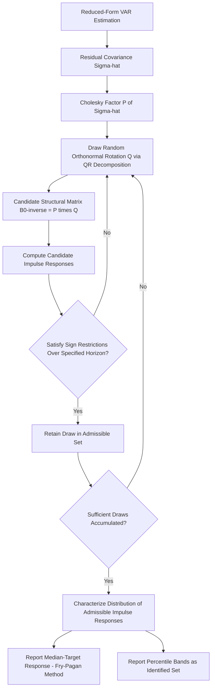

## Structural VARs and Sign Restrictions

### Motivation

The general structural VAR (SVAR) identification problem—recovering economically meaningful structural shocks from reduced-form residuals—requires imposing $n(n-1)/2$ restrictions on the $n^2$ elements of $B_0^{-1}$ (the mapping from structural to reduced-form shocks), since the reduced-form covariance matrix $\Sigma$ contains only $n(n+1)/2$ unique elements (see Structural VAR identification for the general derivation). Zero restrictions, whether contemporaneous (Cholesky/recursive) or long-run (Blanchard-Quah), achieve **exact identification** by fixing specific elements of $B_0^{-1}$ or its long-run counterpart to zero, producing a unique point estimate of the structural shocks conditional on the restriction.

Sign restrictions represent a fundamentally different identification philosophy: rather than imposing that a particular contemporaneous or long-run response equals exactly zero, they impose only that the response has a particular *sign* (or, in richer implementations, a particular sign pattern maintained over a range of horizons), motivated by theoretical priors that are typically more robust to model uncertainty than exact zero restrictions.

**Key Points**

- Sign restrictions were developed largely as a response to the "incredible" precision critique of exact zero restrictions (echoing Sims' original 1980 critique of large structural models): economic theory across a wide range of models agrees on the *direction* of many responses (e.g., a contractionary monetary policy shock should not lower interest rates) far more robustly than it agrees on exact magnitudes or contemporaneous timing.
- The trade-off is that sign restrictions generally deliver **set identification** rather than point identification: many different structural parameter matrices satisfy a given set of sign restrictions, so the method characterizes a *range* of admissible structural models rather than a single one.

### Formal Setup

Starting from the reduced-form VAR with estimated residual covariance $\hat{\Sigma}$, any valid **structural impact matrix** $B_0^{-1}$ satisfying $\hat{\Sigma} = B_0^{-1}(B_0^{-1})'$ can be written as:

$$B_0^{-1} = P \cdot Q$$

where $P$ is the (lower triangular) Cholesky factor of $\hat{\Sigma}$ and $Q$ is any **orthonormal rotation matrix** ($QQ' = I_n$). This follows because for any orthonormal $Q$:

$$(PQ)(PQ)' = PQQ'P' = PP' = \hat{\Sigma}$$

so every orthonormal rotation of the Cholesky factor produces an equally valid decomposition of $\hat{\Sigma}$ consistent with the reduced-form data. The identification problem, from this perspective, is precisely the problem of choosing among the infinite family of valid rotation matrices $Q$.

**Key Points**

- Exact zero-restriction schemes (Cholesky, long-run) effectively select one particular $Q$ (or a small identified set under long-run schemes with additional structure) via the a priori restriction.
- Sign restriction schemes instead search over the space of orthonormal $Q$ matrices (parameterized, for instance, via QR decomposition of randomly drawn matrices, or via Givens rotation angles), retaining only those $Q$ for which the implied impulse responses satisfy the specified sign pattern.

### Implementation via Bayesian Simulation

The dominant practical implementation, following Uhlig (2005) and Rubio-Ramírez, Waggoner, and Zha (2010), proceeds via the following algorithm:

**Key Points**

1. Estimate the reduced-form VAR via OLS (or Bayesian methods with a chosen prior, e.g., Normal-Inverse-Wishart) to obtain $\hat{A}_i$ and $\hat{\Sigma}$ (or draws from their posterior distribution).
2. Compute the Cholesky factor $P$ of $\hat{\Sigma}$ (or of each posterior draw of $\Sigma$).
3. Draw a random orthonormal matrix $Q$, typically by drawing a matrix of independent standard normal entries and applying QR decomposition, retaining the orthonormal $Q$ component.
4. Compute candidate structural impulse responses using $B_0^{-1} = PQ$.
5. Check whether the candidate impulse responses satisfy the imposed sign restrictions over the specified horizon(s); if satisfied, retain the draw (and the associated $Q$, and the reduced-form parameter draw if using Bayesian estimation); if not, discard and return to step 3 (or step 1, if jointly sampling reduced-form parameter uncertainty).
6. Repeat until a sufficient number of admissible draws (satisfying all sign restrictions) have been accumulated.
7. Report the resulting distribution of admissible impulse responses—commonly the median and a specified percentile range (e.g., 16th-84th percentile)—as the identified set, rather than a single point estimate.

**Key Points**

- This procedure, when combined with Bayesian estimation of the reduced-form parameters (rather than treating $\hat{A}_i, \hat{\Sigma}$ as fixed at their OLS point estimates), jointly characterizes both reduced-form parameter uncertainty and structural identification uncertainty (rotation uncertainty) within a unified posterior distribution over admissible impulse responses.
- The reported "median response" across admissible draws is a widely used summary statistic but should not be interpreted as a maximum-likelihood or otherwise privileged point estimate within the identified set—it is a specific normalization choice, and its interpretation as representative of a "central" structural model within the identified set has been the subject of methodological critique (see below).

### Example: Identifying a Monetary Policy Shock via Sign Restrictions

**Example**

Uhlig (2005) identifies a contractionary monetary policy shock in a VAR including output, prices, a commodity price index, nonborrowed reserves, and the federal funds rate, by imposing that following the shock:

- the federal funds rate does not decrease (rises or stays flat),
- prices do not increase,
- nonborrowed reserves do not increase,

over a specified horizon (e.g., 5 months), while *deliberately leaving output's response unrestricted*, so that any resulting decline in output following the identified contractionary shock is a genuine empirical finding of the model rather than an assumption embedded in the identification scheme.

**Key Points**

- Leaving the variable of primary economic interest (here, output) unrestricted is a deliberate and important methodological feature: it allows the sign-restricted approach to produce genuinely informative empirical results about a question not settled by construction, addressing a criticism that could otherwise apply equally to sign restrictions as to exact-restriction schemes (i.e., "the researcher only recovers what they assumed").
- Uhlig's original results found a more muted and less statistically significant output decline following a contractionary shock than contemporaneous recursive-VAR studies, generating discussion over whether earlier recursive-VAR findings were partly an artifact of the identifying restrictions rather than a robust empirical regularity. [Inference: the degree to which these differences reflect identification-scheme sensitivity versus genuine differences in specification (sample period, variable selection) has been examined in follow-up literature and is not fully settled]

### Combining Sign Restrictions with Other Information

#### Sign Restrictions Plus Zero Restrictions

Rubio-Ramírez, Waggoner, and Zha (2010) provide the general algorithm and theoretical conditions for combining sign restrictions with exact zero restrictions (contemporaneous or long-run) within a single identification scheme, allowing researchers to impose exact restrictions where theory is unambiguous (e.g., a long-run neutrality restriction) alongside sign restrictions where only directional theoretical priors are available.

#### Sign Restrictions Plus Narrative Restrictions

Antolín-Díaz and Rubio-Ramírez (2018) extend the sign-restriction framework to incorporate **narrative restrictions**—additional constraints based on historical knowledge of specific episodes (e.g., requiring that the identified monetary policy shock in a specific well-documented historical month, such as October 1979, be of a particular sign or be the dominant contributor to the observed policy rate change in that period), narrowing the identified set beyond what pure sign restrictions on impulse responses alone would achieve, and directly incorporating narrative/historical information (in the spirit of Romer-Romer) within the sign-restriction Bayesian framework rather than as a wholly separate method.

#### Zero and Sign Restrictions on Elasticities

Some applications impose restrictions not directly on impulse response signs but on structural parameter magnitudes or ratios (e.g., restricting the implied short-run price elasticity of oil supply to lie within an empirically plausible range), a variant sometimes termed **restrictions on structural elasticities**, used prominently in oil market SVAR studies (e.g., Kilian and Murphy, 2012) though also applicable to monetary applications with analogous theoretically-bounded elasticities.

### Critiques and Methodological Issues

#### The "Truncation" or "Non-Representative Median" Critique

**Key Points**

- Fry and Pagan (2011) raise a significant critique: because the set of admissible rotation matrices $Q$ satisfying the sign restrictions is generally large and the retained draws come from many different underlying structural models, the commonly reported "median impulse response" at each individual horizon $h$ may not correspond to *any single* structural model in the admissible set—it is a pointwise median across models, not the response profile of one internally coherent model.
- Their proposed remedy is to report the impulse responses of the single admissible model (single $Q$ draw) whose overall response profile is *closest*, by some specified distance metric, to the pointwise median across all horizons—termed the "median-target" model—rather than the pointwise median itself, ensuring the reported response profile corresponds to an actual coherent structural model.

#### Sensitivity to Restriction Choice and the "Model Space" Problem

**Key Points**

- The size and character of the identified set depends materially on which restrictions are imposed, over which horizon, and on how many variables are restricted; imposing restrictions on more variables narrows the identified set, and the tightness of resulting inference is directly a function of how many (and how strong) theoretically-motivated sign restrictions are available and considered credible for the application at hand.
- Baumeister and Hamilton (2015) argue that the standard Bayesian sign-restriction implementation implicitly embeds a specific (and not always innocuous) prior over the rotation space $Q$—the "uniform on the orthonormal group" prior induced by the QR-decomposition sampling algorithm does not necessarily correspond to a uniform or otherwise innocuous prior over the underlying *structural parameters* of economic interest (e.g., contemporaneous elasticities), and they propose an alternative Bayesian approach placing priors directly on structural parameters rather than on the rotation matrix, arguing this produces more transparent and defensible inference. [Inference: the practical quantitative difference this makes varies by application and has been examined in subsequent applied comparisons, with results not uniformly favoring one approach]

### Comparison: Sign Restrictions vs. Exact Restriction Schemes

| Dimension | Exact (Zero) Restrictions | Sign Restrictions |
| --- | --- | --- |
| Identification type | Point identification | Set identification |
| Theoretical burden | Requires precise contemporaneous/long-run zero restriction | Requires only directional theoretical prior |
| Result reporting | Single impulse response with confidence interval | Distribution/range of admissible responses |
| Vulnerability | "Incredible" precision if theory doesn't support exact zero | Prior sensitivity on rotation space; non-representative median risk |
| Typical estimation | OLS (frequentist) or Bayesian | Predominantly Bayesian simulation |
| Combinability | Can nest within sign-restriction framework | Can combine with zero and narrative restrictions |

### Workflow Diagram

### Extensions: Sign Restrictions in Time-Varying and Panel Settings

**Key Points**

- Sign-restriction identification has been extended to time-varying parameter VARs (allowing the identified set itself to evolve with time-varying reduced-form dynamics) and to panel VAR settings across countries, though computational cost scales considerably given the joint requirement of satisfying restrictions across an expanded parameter space at each posterior draw. [Unverified: current computational feasibility for large panel or highly time-varying specifications depends on ongoing developments in Bayesian computation methods and should be checked against current implementations]
- Sign restrictions combined with external instruments ("set-identified proxy SVAR," e.g., using a sign restriction to determine which orthonormal rotations are consistent with both an instrument's relevance and a theoretically motivated sign pattern) represent an active area combining multiple identification strategies within a single framework.

### Applications in Monetary Economics

**Key Points**

- Beyond the canonical monetary policy shock application (Uhlig, 2005), sign restrictions are widely used to jointly identify multiple structural shocks within a single VAR system (e.g., simultaneously identifying supply, demand, and monetary policy shocks via a matrix of sign restrictions across all three shocks and multiple variables), a task considerably more demanding for exact zero-restriction schemes since it requires theoretically defensible zero restrictions across every shock-variable pair.
- Sign-restricted SVARs are used to study the international transmission of monetary policy shocks (e.g., restricting the sign of exchange rate and capital flow responses to a domestic policy shock) and to identify unconventional monetary policy (QE) shocks, where exact zero-restriction schemes are often harder to theoretically justify given the novelty and complexity of transmission channels involved.

**Next Steps**

- Vector autoregression models (foundational mechanics)
- Identification of monetary policy shocks (comparative overview of all identification methods)
- Bayesian VAR estimation methods (priors, Gibbs sampling, Normal-Inverse-Wishart)
- Narrative sign restrictions (Antolín-Díaz and Rubio-Ramírez methodology in depth)
- Proxy SVAR and external instrument identification
- Baumeister-Hamilton structural parameter prior approach
- Panel and time-varying parameter sign-restricted VARs