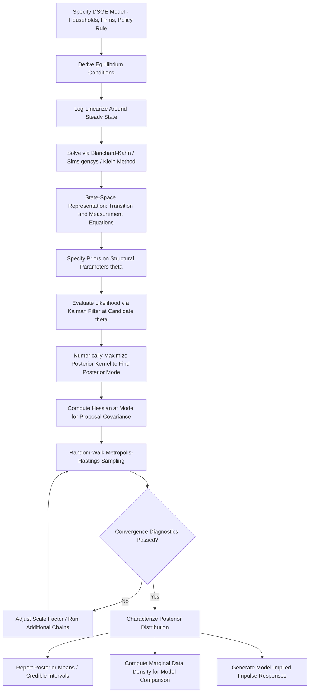

## Bayesian Estimation of DSGE Models

### Motivation and Overview

Dynamic Stochastic General Equilibrium (DSGE) models are structural macroeconomic models derived from optimizing behavior of households, firms, and (in monetary applications) a policy authority, subject to market clearing and technology/preference shock processes. Because these models are fully specified structurally (utility functions, production technology, nominal rigidities, policy rules), they in principle permit direct estimation of deep structural parameters, in contrast to VARs, which impose minimal theoretical structure and instead summarize reduced-form dynamic relationships in the data.

**Key Points**

- Early DSGE evaluation relied heavily on **calibration**—fixing parameters to match long-run averages or values from microeconomic studies, then assessing model fit informally via simulated moments (the Real Business Cycle tradition of Kydland and Prescott). Bayesian estimation emerged as a formal alternative allowing structural parameters to be estimated using the full likelihood implied by the model and observed data, combined with prior information.
- The Bayesian approach to DSGE estimation was substantially popularized by Smets and Wouters (2003, 2007), whose estimated New Keynesian model of the euro area and U.S. economy, respectively, became a benchmark reference model still widely used and extended in central bank research departments. [Inference: the specific degree of continued use as an active policy-relevant benchmark within particular institutions may have evolved and should be checked against current central bank practice]
- Bayesian estimation is preferred over classical maximum likelihood estimation (MLE) in DSGE applications primarily because DSGE likelihood functions are frequently poorly behaved (multimodal, with flat regions, or with parameters that are weakly identified by the data alone), and because Bayesian priors provide a principled mechanism to incorporate information from microeconometric studies or theoretical restrictions that would otherwise be unavailable to a pure likelihood-based approach given typical macro sample sizes.

### The State-Space Representation

A log-linearized (around steady state) DSGE model's equilibrium conditions can generally be written in state-space form, comprising a **transition (state) equation** and a **measurement (observation) equation**.

**Transition equation:**

$$s_t = T(\theta) s_{t-1} + R(\theta) \eta_t$$

**Measurement equation:**

$$x_t = Z(\theta) s_t + D(\theta) + \omega_t$$

where:

- $s_t$ is the vector of (generally unobserved) model state variables
- $\theta$ is the vector of deep structural parameters (preference parameters, technology parameters, nominal rigidity parameters, policy rule coefficients)
- $\eta_t$ is the vector of structural (exogenous) shocks, typically assumed $\eta_t \sim N(0, Q)$
- $x_t$ is the vector of observed data series used in estimation (e.g., output growth, inflation, interest rate)
- $Z(\theta)$ maps model states to observables, and $D(\theta)$ contains constants (e.g., steady-state means)
- $\omega_t$ is an optional measurement error term (some implementations set $\omega_t = 0$, requiring $x_t$ to be exactly spanned by the model states)

**Key Points**

- The matrices $T(\theta)$, $R(\theta)$, and $Z(\theta)$ are nonlinear functions of the deep structural parameters $\theta$, obtained by solving the model's log-linearized rational expectations equilibrium conditions (typically via standard solution algorithms such as Blanchard-Kahn, Sims' `gensys`, or Klein's generalized Schur decomposition method), meaning each evaluation of the likelihood requires re-solving the full model at the candidate parameter vector.
- This state-space structure allows application of the **Kalman filter** to construct the likelihood of the observed data $x_{1:T}$ given $\theta$, since the Kalman filter provides the exact Gaussian likelihood for linear state-space systems with Gaussian shocks.

### The Kalman Filter and Likelihood Evaluation

Given the state-space system, the Kalman filter recursively computes the one-step-ahead prediction and update of the state vector's conditional mean and covariance, and delivers the **prediction error decomposition** of the log-likelihood:

$$\ln L(\theta \mid x_{1:T}) = -\frac{1}{2}\sum_{t=1}^{T}\left[n\ln(2\pi) + \ln|F_t(\theta)| + v_t(\theta)' F_t(\theta)^{-1} v_t(\theta)\right]$$

where $v_t(\theta)$ is the one-step-ahead forecast error and $F_t(\theta)$ is its covariance, both outputs of the Kalman filter recursion at parameter vector $\theta$.

**Key Points**

- The Kalman filter provides an exact likelihood only under linearity and Gaussianity; for models solved with higher-order (nonlinear) perturbation methods or featuring occasionally binding constraints (e.g., the zero lower bound), the **particle filter** or other nonlinear filtering methods are required instead, at substantially greater computational cost, since the particle filter approximates the likelihood via simulation (sequential importance resampling) rather than closed-form recursion.
- Stochastic singularity is a technical concern: if the number of observed series in $x_t$ exceeds the number of structural shocks in $\eta_t$, the model-implied covariance of observables becomes singular, and the likelihood is degenerate. Standard practice adds either measurement error or ensures the number of observables equals the number of structural shocks, a specific accounting discipline required in DSGE estimation that has no direct analogue in unrestricted VAR estimation.

### Bayesian Estimation: The Posterior

Given the likelihood $L(\theta \mid x_{1:T})$ from the Kalman filter and a prior density $p(\theta)$, Bayes' theorem gives the posterior:

$$p(\theta \mid x_{1:T}) \propto L(\theta \mid x_{1:T}) \cdot p(\theta)$$

**Key Points**

- The prior $p(\theta)$ is typically specified parameter-by-parameter using standard distributions chosen to respect each parameter's theoretical support: Beta distributions for parameters bounded on $(0,1)$ (e.g., the Calvo price-stickiness probability, habit persistence), Gamma or Inverse-Gamma distributions for parameters bounded below at zero (e.g., shock standard deviations, the elasticity of substitution), and Normal distributions for parameters unrestricted in sign (e.g., some policy rule coefficients).
- Prior means and standard deviations are typically calibrated using a combination of microeconometric evidence (e.g., price-stickiness estimates from micro price-setting studies), values from prior DSGE estimation studies, and researcher judgment about the degree of confidence warranted; this calibration process is a documented point of researcher discretion and a frequent target of sensitivity analysis and critique in the literature.
- Because the posterior is generally analytically intractable (the mapping from $\theta$ to the likelihood via model solution and Kalman filtering is highly nonlinear), it must be characterized numerically via simulation methods.

### Posterior Mode-Finding and MCMC Sampling

**Key Points**

- The standard estimation procedure first numerically maximizes $\ln L(\theta \mid x_{1:T}) + \ln p(\theta)$ over $\theta$ (using a gradient-based or derivative-free numerical optimizer) to find the **posterior mode**, and computes the Hessian at the mode to obtain an approximate covariance matrix for the proposal distribution used in subsequent sampling.
- The dominant sampling algorithm is the **Random-Walk Metropolis-Hastings (RWMH)** algorithm: starting from the posterior mode, a candidate draw $\theta^*$ is proposed as $\theta^* = \theta^{(i-1)} + \epsilon$, $\epsilon \sim N(0, c \cdot \hat{\Sigma}_{mode})$, where $\hat{\Sigma}_{mode}$ is the mode-based Hessian approximation and $c$ is a scale factor tuned to achieve a target acceptance rate (commonly cited target range: roughly 20-40%). The candidate is accepted with probability $\min\left(1, \frac{p(\theta^* \mid x_{1:T})}{p(\theta^{(i-1)} \mid x_{1:T})}\right)$.
- Convergence diagnostics (e.g., multiple-chain comparison via the Brooks-Gelman-Rubin statistic, visual inspection of trace plots, and comparison of recursive posterior moments across the chain) are standard practice to assess whether the MCMC chain has adequately explored the posterior distribution and can be treated as a reliable characterization of it; poor mixing or apparent non-convergence undermines the validity of resulting posterior inference. [Inference: acceptable convergence diagnostic thresholds involve some degree of applied judgment and are not governed by a single universally agreed numerical criterion]

### Software Implementation

**Key Points**

- **Dynare** (a MATLAB/Octave/Julia-based toolbox) is the dominant software platform for DSGE model solution and Bayesian estimation in both academic and central bank research settings, providing built-in routines for model log-linearization, solution via generalized Schur decomposition, Kalman filtering, posterior mode-finding, and Metropolis-Hastings sampling.
- Central banks maintain institution-specific extensions and model suites (e.g., the Federal Reserve's FRB/US and EDO models, the ECB's New Area-Wide Model, the Bank of Canada's ToTEM), often built on similar underlying Bayesian estimation principles but with substantial model-specific customization. [Unverified: the precise current model suite names, versions, and institutional maintenance status should be checked against current central bank documentation, as these are periodically revised or replaced]

### Model Evaluation

#### Marginal Data Density and Bayes Factors

**Key Points**

- Models estimated via Bayesian methods can be formally compared using the **marginal data density** (also termed marginal likelihood), $p(x_{1:T}) = \int L(\theta \mid x_{1:T}) p(\theta) \, d\theta$, which integrates out parameter uncertainty and provides a natural Bayesian model comparison metric via **Bayes factors** (ratios of marginal data densities across competing model specifications), commonly approximated via the Geweke (1999) modified harmonic mean estimator or Chib's method based on the MCMC output.
- This provides a principled way to compare, for instance, alternative nominal rigidity specifications or alternative monetary policy rule formulations within the same estimated dataset, in a manner not directly available to classically estimated or calibrated models.

#### DSGE-VAR Comparison

**Key Points**

- Del Negro and Schorfheide (2004) develop the **DSGE-VAR** methodology, which uses the DSGE model's cross-equation restrictions as a Bayesian prior for an otherwise unrestricted VAR, with a hyperparameter $\lambda$ controlling the tightness of the DSGE-implied prior relative to the unrestricted data (as $\lambda \to \infty$, the DSGE-VAR converges to the pure DSGE model; as $\lambda \to 0$, it converges to an unrestricted VAR).
- This framework provides a formal statistical test of DSGE model misspecification: the value of $\lambda$ favored by the marginal data density indicates how much weight the data assigns to the DSGE model's restrictions relative to a flexible, unrestricted alternative, offering a more nuanced evaluation than simply comparing point-estimated impulse responses between a DSGE model and a separately estimated SVAR (as discussed under VAR applications).

### Prior Sensitivity and Identification Concerns

**Key Points**

- A well-documented concern in the Bayesian DSGE literature is that posterior estimates can be substantially influenced by prior choice when the likelihood is relatively flat or uninformative about certain parameters ("weak identification"), meaning the posterior in such cases may largely reflect the prior rather than genuine information extracted from the data. Standard diagnostic practice includes comparing the prior and posterior densities directly (typically plotted together) and conducting prior sensitivity analysis (re-estimating under alternative reasonable priors) to assess robustness.
- Canova and Sala (2009) and related identification literature formally examine **DSGE parameter identification failure**, showing that certain combinations of structural parameters (rather than individual parameters) may be poorly identified even asymptotically, given the specific set of observables typically used in estimation—a deeper problem than simple weak identification, since it implies no amount of additional data of the same type would resolve the ambiguity without either additional observable series or tighter priors. [Inference: the practical severity of this problem is model- and specification-dependent, and diagnosing it in a given applied model generally requires dedicated identification analysis rather than being assumable a priori]

### Workflow Diagram

### Applications in Monetary Economics

**Example**

Smets and Wouters (2007) estimate a medium-scale New Keynesian DSGE model for the U.S. economy incorporating habit formation in consumption, investment adjustment costs, variable capital utilization, Calvo price and wage stickiness with partial indexation, and a Taylor-type monetary policy rule, using seven macroeconomic time series (output, consumption, investment, hours, wages, inflation, and the federal funds rate) as observables, with the estimated model used both for historical shock decomposition (attributing observed business cycle fluctuations to underlying structural shocks) and for forecasting.

**Key Points**

- Estimated DSGE models are used extensively for **counterfactual policy analysis**, simulating the model's response to alternative monetary policy rule specifications, and for **forecasting**, where DSGE-based forecasts are commonly compared against BVAR and other reduced-form forecasting benchmarks in real-time forecasting competitions conducted by central bank research departments.
- The estimated structural shocks and parameters from DSGE models are also used in **historical decomposition** exercises directly comparable in spirit to the SVAR historical decomposition described under VAR applications, but interpreted through the lens of the model's specific structural shock taxonomy (e.g., separately identified productivity, price markup, wage markup, monetary policy, and risk premium shocks).

### Limitations

**Key Points**

- The overall validity of Bayesian DSGE parameter estimates and resulting policy conclusions is conditional on the correctness of the underlying model specification; misspecification (a commonly cited concern, particularly regarding the adequacy of representative-agent, linear, and rational-expectations assumptions for capturing crisis-period or financial-sector dynamics) can bias estimated structural parameters even though the estimation procedure itself is internally coherent given the assumed model. [Inference: the practical consequences of specification error for policy conclusions are model- and context-dependent and are the subject of ongoing methodological research, including within DSGE models with financial frictions developed partly in response to this concern]
- Behavior of estimated DSGE-implied relationships, like VAR-implied relationships, may vary across sample periods and structural regimes, and standard log-linearized DSGE models are not designed to capture strongly nonlinear dynamics (e.g., large financial crises, occasionally binding constraints) without specific extensions (higher-order perturbation, particle filtering, or explicit constraint-handling methods).

**Next Steps**

- Vector autoregression models and DSGE-VAR comparison methodology
- New Keynesian model structure: Calvo pricing, the New Keynesian Phillips Curve
- Kalman filtering and state-space methods in macroeconometrics
- Particle filtering for nonlinear/non-Gaussian DSGE estimation
- DSGE identification analysis (Canova-Sala methodology)
- Central bank policy model suites and their estimation approaches
- Zero lower bound modeling in estimated DSGE frameworks