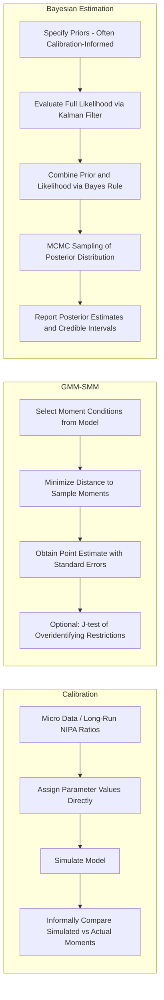

## Calibration versus Estimation of Structural Models

### Conceptual Distinction

**Calibration** and **estimation** are two distinct methodological philosophies for assigning numerical values to the parameters of a structural macroeconomic model. The distinction is not merely technical but reflects differing views on the appropriate evidentiary basis for parameter values and on the primary purpose a structural model is meant to serve.

**Key Points**

- **Calibration** assigns parameter values using external sources of information—long-run averages of relevant macroeconomic ratios, microeconometric studies estimated on disaggregated data outside the model, or values from prior related studies—rather than by fitting the model's aggregate time-series implications to the same aggregate data the model is meant to explain.
- **Estimation** (classical/frequentist or Bayesian) instead treats parameters as objects to be inferred from the fit of the model's predictions to observed aggregate time series, using formal statistical criteria (maximum likelihood, method of moments, or Bayesian posterior estimation).
- The distinction is a matter of degree rather than a strict dichotomy in practice: calibration exercises are often informally checked for their ability to match a chosen set of second moments (variances, covariances) of the data, and Bayesian estimation explicitly incorporates calibration-style external information via priors, so many modern DSGE applications occupy a middle ground sometimes termed "estimation with informative priors."

### Historical Origins of Calibration

**Key Points**

- Calibration as a methodological stance was formalized and defended prominently by Kydland and Prescott (1982, 1996) within the Real Business Cycle (RBC) research program, motivated partly by the view that formal statistical estimation and hypothesis testing were the wrong evaluative framework for a model explicitly understood to be a deliberate abstraction ("all models are false") rather than a candidate for being the literally true data-generating process.
- Under this view, the appropriate question is not "does the model pass a formal statistical test against the data" but rather "does the model, calibrated using independent microeconomic and long-run evidence, generate simulated aggregate fluctuations that quantitatively resemble observed business cycle moments," evaluated via informal comparison of model-simulated and actual business cycle statistics (standard deviations, relative volatilities, and correlations with output—collectively termed "stylized facts").
- Kydland and Prescott explicitly argued that using the same aggregate time series both to select parameter values and to evaluate the model's fit to those same series would constitute a form of overfitting or circularity, favoring instead the use of genuinely independent information sources (steady-state ratios, labor supply elasticities from microeconomic labor studies, capital shares from national accounts) for parameter assignment.

### Typical Calibration Targets

**Key Points**

- **Steady-state (long-run average) ratios**: e.g., the capital share of income $\alpha$ calibrated to the long-run average labor share observed in national accounts data (implying $\alpha \approx 1 - \text{labor share}$, commonly cited historically as approximately 0.33-0.36 for the U.S., though this ratio has been the subject of ongoing measurement debate); the discount factor $\beta$ calibrated to match a target steady-state real interest rate via the steady-state Euler equation relationship, $\beta = 1/(1+r^*)$.
- **Microeconometric estimates**: e.g., the Frisch labor supply elasticity calibrated using estimates from microeconomic labor supply studies (a parameter for which macro-calibrated values and micro-estimated values have historically diverged substantially, a specific and well-documented tension within the RBC/calibration tradition, sometimes termed the "micro-macro labor supply elasticity puzzle").
- **Depreciation rates, capital-output ratios, and consumption-output ratios**: typically calibrated to long-run National Income and Product Accounts (NIPA) averages.
- **Shock process persistence and volatility**: in the RBC tradition, calibrated by fitting an autoregressive process to Solow-residual-based measures of total factor productivity, itself constructed from the same national accounts data used for other calibration targets.

### Formal Estimation Approaches

#### Generalized Method of Moments (GMM)

**Key Points**

- GMM estimates structural parameters by choosing $\theta$ to minimize the (weighted) distance between theoretical moment conditions implied by the model's first-order (Euler equation) conditions and their sample analogues, without requiring full specification or solution of the complete dynamic equilibrium system.
- This approach, associated prominently with Hansen and Singleton's (1982) estimation of consumption Euler equations, allows estimation of specific structural parameters (e.g., the coefficient of relative risk aversion, the discount factor) using a subset of the model's implications, without committing to the full model solution required for likelihood-based estimation—a substantial practical advantage when the complete model is difficult to solve or when the researcher wishes to remain agnostic about auxiliary model features not directly relevant to the parameters of interest.
- A recognized limitation is that GMM estimates can be sensitive to the choice of instruments and moment conditions used, and weak identification (analogous to weak instruments in cross-sectional IV) has been a documented concern in applications to consumption Euler equations specifically. [Inference: the severity of this weak-identification concern is application- and dataset-specific and has been examined extensively in the Euler-equation estimation literature]

#### Simulated Method of Moments (SMM)

**Key Points**

- SMM estimates $\theta$ by choosing parameter values such that model-simulated moments (generated by solving and simulating the full model at candidate parameter values) most closely match a chosen set of empirical target moments, useful when the model is too complex for closed-form moment conditions (e.g., models with occasionally binding constraints, heterogeneous agents, or highly nonlinear features) but can still be simulated.
- This method sits methodologically between pure calibration (informal moment matching) and formal likelihood-based estimation (formal statistical inference with standard errors), since SMM delivers formal asymptotic standard errors for $\hat{\theta}$ under stated regularity conditions, unlike traditional calibration, while still relying on a chosen (and to some extent researcher-selected) set of target moments rather than the full likelihood.

#### Maximum Likelihood and Bayesian Estimation

**Key Points**

- Full-information maximum likelihood (FIML) and Bayesian estimation (see Bayesian estimation of DSGE models) use the complete likelihood implied by the model's state-space representation and the full time series of observables, in principle extracting more information from the data than moment-based methods (which use only a chosen, finite set of moments) but requiring the full model to be correctly specified and solved, and requiring the likelihood to be well-behaved enough for reliable numerical optimization or MCMC sampling.
- Bayesian estimation with informative priors is often described as a formalized hybrid of calibration and estimation: priors can directly encode calibration-style external information (e.g., a tightly concentrated Beta prior on the capital share centered at a NIPA-implied value), while still allowing the likelihood (i.e., the aggregate time-series data) to update these priors where the data are informative, with the posterior representing a data-and-prior-weighted compromise.

### Comparative Table

| Dimension | Calibration | GMM/SMM | Bayesian Estimation |
| --- | --- | --- | --- |
| Parameter source | External (micro data, long-run ratios) | Selected moment conditions from model + data | Full likelihood + prior |
| Formal standard errors | Generally not produced | Yes (asymptotic) | Yes (posterior credible intervals) |
| Evaluation criterion | Informal moment-matching / stylized facts | Formal minimization of moment distance | Formal posterior probability / marginal likelihood |
| Risk of overfitting to sample | Lower (uses independent information) | Moderate (moment selection is a researcher choice) | Present but mitigated by prior discipline |
| Model comparison | Informal | Possible via overidentification tests (J-test) | Formal via Bayes factors / marginal data density |
| Typical DSGE application era | RBC tradition (1980s-1990s) | Selective Euler-equation estimation | New Keynesian medium-scale models (2000s-present) |

### The Overidentification Test (J-test) in GMM

When the number of moment conditions exceeds the number of parameters to be estimated, GMM permits a formal specification test:

$$J = T \cdot \hat{g}(\hat{\theta})' \hat{W} \hat{g}(\hat{\theta}) \sim \chi^2(q - k)$$

where $\hat{g}(\hat{\theta})$ is the vector of sample moment conditions evaluated at the GMM estimate $\hat{\theta}$, $\hat{W}$ is the (efficient) weighting matrix, $q$ is the number of moment conditions, and $k$ is the number of estimated parameters. Rejection of this test provides formal statistical evidence against the model's overidentifying restrictions—a form of model evaluation with no direct analogue in pure calibration, which lacks a comparable formal statistical rejection criterion.

### Methodological Debate: Which Approach Is Appropriate?

**Key Points**

- Proponents of calibration (in the original Kydland-Prescott spirit) argue that formal statistical estimation and testing presuppose a view of the model as a candidate description of the true data-generating process, a presupposition they regard as inappropriate for models explicitly understood as stylized abstractions; under this view, informal quantitative comparison of simulated and actual business cycle moments is the methodologically correct evaluative standard, not formal hypothesis testing.
- Critics of pure calibration (e.g., within the tradition represented by Hansen and Heckman, 1996, in their exchange with Kydland and Prescott, and more broadly by proponents of likelihood-based DSGE estimation) argue that calibration provides no formal quantification of parameter uncertainty, no principled criterion for adjudicating between competing calibrated models beyond informal, potentially selective moment comparison, and no transparent accounting of how sensitive conclusions are to specific calibrated parameter choices. Formal estimation, by contrast, delivers standard errors or credible intervals directly quantifying parameter uncertainty and its consequences for downstream model-based conclusions.
- In practice, contemporary central bank DSGE modeling has substantially shifted toward Bayesian estimation with informative priors (following Smets-Wouters and related work) rather than either pure informal calibration or unrestricted classical maximum likelihood, reflecting a practical synthesis: informative priors preserve the ability to incorporate calibration-style external information for parameters weakly identified by aggregate time series, while the likelihood component allows genuine data-based updating and permits formal quantification of parameter and model uncertainty unavailable under pure calibration. [Inference: the degree and pattern of this practical shift is documented in the methodological literature surveying DSGE modeling practice, though the balance may continue to evolve and current practice at specific institutions should be checked directly]

### Illustrative Workflow Comparison

### Applications in Monetary Economics

**Example**

Early RBC-tradition monetary models (e.g., limited-participation and cash-in-advance monetary models of the 1980s-1990s) were predominantly calibrated, with monetary policy parameters and money demand elasticities set to match long-run velocity and interest-elasticity evidence from separate empirical money demand studies, evaluated via simulated moment comparison against observed monetary aggregate volatility.

**Example**

Contemporary medium-scale New Keynesian models used for policy analysis (in the tradition of Smets and Wouters) predominantly use Bayesian estimation, with priors on nominal rigidity parameters informed by microeconomic price-setting studies (e.g., surveys of price-change frequency) and priors on the monetary policy rule informed by prior Taylor-rule estimation studies, while allowing the likelihood (based on aggregate time series including inflation, output, and the policy rate) to update these priors and to formally estimate shock processes that would be difficult to calibrate directly from independent data sources.

### Limitations of Each Approach

**Key Points**

- Calibration's central limitation is the absence of a formal, transparent metric for parameter and model uncertainty, and the risk that "successful" moment matching may reflect selective reporting of the specific moments chosen for comparison (a critique sometimes termed the risk of an implicit, informal, and not fully disclosed specification search).
- Formal estimation's central limitation is that its results are conditional on correct model specification in a way that is sometimes obscured by the apparent rigor of reported standard errors or credible intervals: a well-estimated but misspecified model can produce precise-looking but structurally invalid parameter estimates, and estimation does not by itself resolve concerns about whether the underlying model structure (e.g., representative-agent assumptions, specific nominal rigidity mechanisms) is an adequate approximation to the relevant economic mechanisms.
- Neither approach resolves the more fundamental Lucas-critique-related concern that estimated or calibrated "deep" parameters, while intended to be policy-invariant structural objects (in contrast to reduced-form VAR coefficients), may themselves not be fully invariant to policy regime changes if the underlying microeconomic environment (e.g., degree of price stickiness, which may itself respond to the inflation environment) is not truly structural in the required sense. [Speculation: the degree to which commonly estimated "deep" parameters are genuinely policy-invariant, versus themselves being regime-dependent reduced-form objects, is not fully resolved by available evidence and remains a subject of theoretical and empirical discussion]

**Next Steps**

- Bayesian estimation of DSGE models (detailed treatment)
- Vector autoregression models and DSGE-VAR comparison
- Generalized Method of Moments in macroeconomic applications
- Real Business Cycle theory and the Kydland-Prescott calibration debate
- Microeconomic versus macroeconomic labor supply elasticity estimates
- Identification of monetary policy shocks
- The Lucas critique and policy-invariant structural parameters