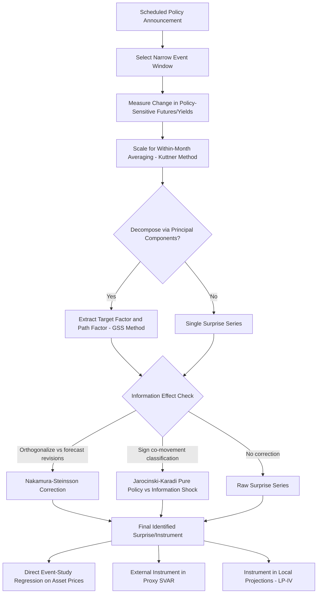

## High-Frequency Identification and Event-Study Methods

### Core Idea

**High-frequency identification (HFI)** exploits asset price movements within narrow time windows surrounding a discrete, scheduled information event (most commonly a central bank policy announcement) to isolate the causal, unanticipated component of that event. **Event-study methods** are the broader statistical framework of which HFI is a specific macro-finance application, originally developed in corporate finance (e.g., studying stock price reactions to earnings announcements or merger news) and adapted to monetary economics primarily for identifying monetary policy shocks and for measuring the transmission of central bank communication to asset prices more generally.

**Key Points**

- The foundational identifying assumption common to both approaches is that, within a sufficiently narrow window around the event, the *only* systematically relevant information reaching the market is the event itself, so that any observed asset price change over that window can be attributed to the market's reaction to the event's surprise (unanticipated) component, net of any confounding news arriving in the same window.
- This addresses the simultaneity problem central to monetary policy shock identification more generally (see Identification of monetary policy shocks): observing that interest rates and output move together over a calendar quarter cannot establish causal direction, but observing an asset price jump precisely coincident with, and only with, a policy announcement provides much stronger grounds for a causal interpretation, since the timing itself pins down the direction of causation.
- The narrower the event window, the more credible the "no other news" assumption, but also the more the resulting surprise measure is dominated by market microstructure noise (bid-ask bounce, illiquidity-driven price movements) unrelated to the fundamental information content of the announcement, creating a bias-noise trade-off in window width selection.

### Constructing the Surprise Measure

For monetary policy applications, the canonical instrument is built from federal funds futures (in the U.S. context) or equivalent short-term interest rate derivatives in other jurisdictions.

**Key Points**

- Kuttner (2001) constructs the unanticipated component of a federal funds target change using the **scaled change in the current-month federal funds futures rate** around the FOMC announcement:

$$\Delta i_t^u = \frac{D}{D-d}\left(f_{d,m}^{0} - f_{d-1,m}^{0}\right)$$

where $f_{d,m}^0$ is the current-month futures rate on day $d$ of month $m$ (with $D$ days in the month), and the scaling factor $\frac{D}{D-d}$ corrects for the fact that the current-month futures contract's rate is an average of the realized daily effective fed funds rate over the *entire* month, so a rate change occurring partway through the month is diluted in the futures price by the number of days before versus after the change.

- For announcements late in the month (where the scaling factor $\frac{D}{D-d}$ becomes very large, amplifying any noise in the futures price change), it is standard practice to instead use the **next-month futures contract** to construct the surprise, since it is unaffected by this within-month averaging distortion.
- The event window itself has evolved over the literature: early studies used daily-frequency data (comparing futures rates on the announcement day versus the prior day), while more recent studies (following Gürkaynak, Sack, and Swanson, 2005, and subsequent work) increasingly use much narrower **intraday windows** (e.g., 30 minutes before to 20 minutes after the announcement), substantially tightening the "no other news" assumption at the cost of requiring intraday, tick-level financial market data.

### Decomposing the Surprise: Target, Path, and Beyond

**Key Points**

- Gürkaynak, Sack, and Swanson (2005) demonstrate that a single-instrument surprise measure (e.g., based only on the current-month futures contract) does not fully capture the information content of an announcement, since central bank communication routinely affects market expectations of the *future path* of policy separately from the *current* policy action.
- Their method extracts **two orthogonal factors** via principal components analysis applied to the surprise changes across a range of instruments spanning different maturities (fed funds futures, and Eurodollar futures at various horizons): a "target factor" (capturing the surprise in the current policy decision, dominant in explaining short-maturity instrument surprises) and a "path factor" (capturing the surprise in the expected future policy trajectory, dominant in explaining longer-maturity instrument surprises, closely related to what is now commonly termed "forward guidance" shocks).
- This decomposition matters substantively because target and path surprises have been found to have distinct effects on asset prices and, in subsequent work, potentially distinct macroeconomic transmission effects, and later literature (e.g., Swanson, 2021) has further extended this to a three-factor decomposition separately identifying a distinct "quantitative easing" (asset purchase) factor relevant for the post-2008 unconventional monetary policy period.

### The Federal Reserve Information Effect

**Key Points**

- Nakamura and Steinsson (2018) provide an influential critique arguing that high-frequency policy surprises may be contaminated by the **revelation of central bank private information** about the economic outlook, distinct from a pure exogenous policy action: because the central bank possesses a superior real-time information set (as established in the narrative-identification literature, e.g., Romer and Romer's use of Greenbook forecasts), any policy action can simultaneously reveal information about the Fed's own view of the economy, and market participants may update their own expectations accordingly.
- Their key supporting evidence is that measured "contractionary" high-frequency policy surprises are, in the data, frequently associated with *upward* revisions to private-sector forecasts of output growth (and other real activity measures) and with *increases* in stock prices—a pattern difficult to reconcile with a pure exogenous demand-dampening monetary tightening (which standard theory predicts should lower both growth expectations and equity valuations) but consistent with the tightening simultaneously signaling unexpectedly strong underlying economic conditions.
- Proposed remedies include: (1) constructing an orthogonalized surprise measure by regressing the raw high-frequency surprise on contemporaneous private-sector forecast revisions and retaining only the residual (Nakamura and Steinsson, 2018); and (2) the sign-restriction-based classification approach of Jarociński and Karadi (2020), which classifies each announcement's joint interest-rate and stock-price surprise by sign co-movement—a rate increase accompanied by a stock price *decline* is classified as a "pure monetary policy shock," while a rate increase accompanied by a stock price *increase* is classified as a "central bank information shock," reflecting the differing theoretical sign predictions of each underlying explanation. [Inference: the relative empirical importance of the information-effect explanation, versus competing explanations for the same observed co-movement patterns (e.g., risk-premium or liquidity-related mechanisms), remains actively debated in the literature]

### Using High-Frequency Surprises: Three Estimation Strategies

#### Direct Event-Study Regression

The most direct application regresses the change in an asset price of interest (e.g., a long-term bond yield, an exchange rate, or a stock index) on the constructed policy surprise, over the same narrow event window:

$$\Delta y_t = \alpha + \beta \cdot \Delta i_t^u + \epsilon_t$$

**Key Points**

- Because both the dependent variable and the surprise are measured over the identical narrow window, this specification directly estimates the asset price's sensitivity to policy surprises, without requiring a fully specified macro model, and is the standard approach in event-study analyses of financial market responses to monetary policy communication.
- This approach is well suited to studying the transmission of policy to *financial* variables (which respond essentially instantaneously) but is not directly usable for studying the transmission to slower-moving *real* variables (output, employment), which do not have a well-defined "surprise window" response, motivating the following two extensions.

#### Proxy SVAR / External Instruments

As detailed under Structural VARs and monetary policy shock identification, the high-frequency surprise series can be used as an **external instrument** for the structural monetary policy shock within a lower-frequency (typically monthly) VAR system (Gertler and Karadi, 2015; Mertens and Ravn, 2013), permitting estimation of the dynamic effects of the identified shock on macro variables (output, prices, credit spreads) that are not observed at high frequency and do not have a meaningful contemporaneous "surprise window" response of their own.

**Key Points**

- This requires temporal aggregation of the high-frequency (daily/intraday) surprise series to the VAR's lower frequency (e.g., summing all surprises within a given month to construct a monthly instrument series), and requires that the instrument satisfy the standard relevance and exogeneity conditions at the *aggregated* frequency used in the VAR.

#### Local Projections with High-Frequency Instrument (LP-IV)

**Key Points**

- An increasingly common alternative to proxy SVAR estimation combines the high-frequency surprise instrument directly with the local projections framework (Jordà, 2005; see Identification of monetary policy shocks for the general local projections specification), estimating impulse responses horizon-by-horizon via instrumental variables regression rather than embedding the instrument within a full VAR system.
- This LP-IV approach shares the general local-projections advantage of not imposing a specific finite-order VAR lag structure on the dynamic system, at the cost of the usual local-projections efficiency loss relative to a correctly specified VAR. [Inference: the relative prevalence of LP-IV versus proxy SVAR implementation in current applied practice reflects an evolving methodological literature]

### Event-Study Applications Beyond Policy Rate Surprises

**Key Points**

- **Quantitative easing (QE) announcement studies**: at the zero lower bound, where short-term policy rate futures cannot register a meaningful surprise, event-study methods instead use surprises in longer-term bond yields (e.g., the 2-year or 10-year Treasury yield) around QE announcement dates to measure the "signaling" and "portfolio balance" effects of asset purchase programs.
- **Central bank communication and forward guidance studies**: event-study regressions of asset price changes around press conferences, speeches, or minutes releases (rather than only the headline rate decision) are used to separately measure the market impact of central bank communication distinct from the policy action itself, an area of substantial recent methodological development given the increased role of explicit forward guidance in post-2008 monetary policy. [Unverified: the specific current-generation methodological refinements in this fast-moving sub-literature should be checked against recent publications given the pace of development]
- **Textual and sentiment analysis combined with event studies**: recent work combines natural language processing of central bank communication text (FOMC statements, minutes, speeches) with high-frequency asset price event-study regressions, using text-derived sentiment or topic measures as either the "surprise" regressor itself or as a control for the content of the communication accompanying a given price movement.

### Methodological Concerns and Robustness Checks

**Key Points**

- **Window contamination**: when multiple pieces of policy-relevant information are released simultaneously (e.g., a rate decision accompanied by a statement revision, a press conference, and updated Summary of Economic Projections on the same day), a single announcement-window surprise measure conflates the effects of conceptually distinct communications, motivating sub-window decomposition approaches (e.g., separately measuring the surprise around the initial statement release versus the subsequent press conference).
- **Endogenous timing/scheduling concerns**: while scheduled announcements (FOMC meetings) largely avoid the concern that the timing of the event itself is a response to market conditions (since meeting dates are set well in advance), unscheduled or intermeeting policy actions raise a distinct identification concern, since their timing itself may be correlated with contemporaneous economic news.
- **Market pricing efficiency assumption**: the entire HFI approach implicitly assumes that financial markets efficiently and rapidly incorporate the announcement's information content within the specified window; violations of this assumption (e.g., due to market frictions, limited investor attention, or delayed price discovery) could bias the surprise measure, though this concern is generally considered of secondary importance relative to the information-effect and window-contamination issues in the dedicated methodological literature. [Speculation: the practical quantitative importance of market efficiency violations for HFI-based surprise measures, relative to other identified concerns, is not resolved by consistently available evidence]

### Workflow Diagram

### Comparison with Other Identification Approaches

| Dimension | High-Frequency Identification | Recursive VAR | Narrative (Romer-Romer) |
| --- | --- | --- | --- |
| Data frequency | Intraday/daily | Monthly/quarterly | Meeting-level (narrative dating) |
| Core assumption | No other news in narrow window | Contemporaneous zero restrictions | Fed's own forecasts capture systematic response |
| Sample length constraint | Limited to era with liquid futures markets and available tick data | Full available macro time series | Limited by Greenbook release lag (~5 years) |
| Key vulnerability | Fed information effect; window contamination | Price puzzle; ordering non-testability | Researcher discretion in constructing shock series |
| Typical direct use | Financial market transmission studies | Full macro dynamic system estimation | Historical monetary policy shock dating |

**Next Steps**

- Identification of monetary policy shocks (comprehensive comparative treatment)
- Structural VARs and sign restrictions
- Proxy SVAR / external instruments methodology in depth
- The Federal Reserve information effect: further evidence and debate
- Forward guidance and unconventional monetary policy transmission
- Local projections methodology (Jordà, 2005)
- Textual analysis of central bank communication