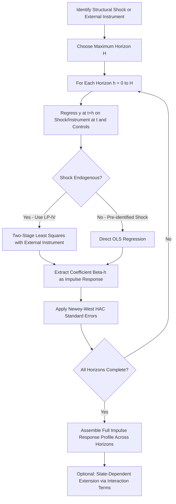

## Local Projections for Impulse Response Estimation

### Core Idea

**Local projections (LP)**, introduced by Jordà (2005), are an alternative to the VAR-based approach for estimating impulse response functions. Rather than estimating a single dynamic system (the VAR) and deriving the entire impulse response horizon profile from that one estimated model via iterated forecasting, local projections estimate a **separate linear regression for each forecast horizon** $h$, directly regressing the future value of the outcome variable on the current shock (or its proxy) and controls. The horizon-$h$ regression coefficient on the shock variable directly delivers the impulse response at horizon $h$, without requiring iteration through an estimated dynamic system.

**Key Points**

- The VAR-based impulse response at horizon $h$ is a highly nonlinear function of the estimated VAR coefficient matrices $A_1, \ldots, A_p$ (obtained by iterating the estimated one-step-ahead dynamics forward $h$ times), meaning any misspecification in the underlying VAR's functional form or lag structure compounds and propagates through the iteration. Local projections instead estimate each horizon directly and separately from the data, avoiding this iterative compounding of any single-equation misspecification.
- This distinction is often summarized as VARs being an efficient but potentially fragile (misspecification-sensitive) approach, versus LP being a more robust but less efficient (higher-variance) approach—a direct analogue of the general econometric trade-off between imposing more structure (higher efficiency, greater fragility to misspecification) versus imposing less structure (lower efficiency, greater robustness).

### The Baseline Specification

For an outcome variable $y$ and a shock or policy variable $x$, the local projection at horizon $h = 0, 1, \ldots, H$ is:

$$y_{t+h} = \alpha_h + \beta_h x_t + \Gamma_h(L) W_{t-1} + \epsilon_{t+h}$$

where:

- $\beta_h$ is the coefficient of interest, directly interpretable as the impulse response of $y$ at horizon $h$ to a unit change in $x_t$
- $\Gamma_h(L) W_{t-1}$ represents a set of control variables (typically including lags of $y$, $x$, and other relevant variables) intended to absorb the systematic, predictable component of $x_t$, isolating the response to its exogenous or shock component
- A separate regression, with a separate estimated coefficient vector $(\alpha_h, \beta_h, \Gamma_h)$, is run for each horizon $h$ from 0 up to the maximum horizon of interest $H$

**Key Points**

- The full impulse response profile $\{\hat{\beta}_0, \hat{\beta}_1, \ldots, \hat{\beta}_H\}$ is assembled by collecting the $\hat{\beta}_h$ coefficient from $H+1$ separately estimated regressions, in contrast to the single VAR estimation that simultaneously (implicitly) delivers the entire impulse response profile via iteration.
- If $x_t$ is a raw (non-orthogonalized) variable rather than an already-identified structural shock, the specification requires the same identification assumptions discussed elsewhere (recursive ordering-equivalent restrictions, or external instruments) to interpret $\beta_h$ causally; local projections are a method of *estimating* impulse responses given an identification scheme, not themselves a method of identification (with the exception of the direct incorporation of external instruments, discussed below).

### Local Projections with Instrumental Variables (LP-IV)

When $x_t$ is potentially correlated with the regression error $\epsilon_{t+h}$ (i.e., not itself already a clean structural shock), an external instrument $z_t$ satisfying standard relevance and exogeneity conditions can be used within an instrumental-variables version of the local projection:

$$y_{t+h} = \alpha_h + \beta_h x_t + \Gamma_h(L) W_{t-1} + \epsilon_{t+h}, \quad x_t \text{ instrumented by } z_t$$

**Key Points**

- This combines the local projections estimation framework directly with the external-instrument identification strategy used in Proxy SVAR estimation (see Identification of monetary policy shocks and High-frequency identification), estimated via two-stage least squares (2SLS) at each horizon separately.
- Stock and Watson (2018) formally establish the asymptotic equivalence between LP-IV and Proxy SVAR estimators under correct specification of both, showing that the two approaches, despite their different estimation mechanics, are estimating the same underlying object and converge to it under standard regularity conditions; their practical differences in finite samples relate to efficiency and robustness to misspecification rather than to fundamentally different target parameters.
- Instrument relevance diagnostics (first-stage F-statistics) remain important at each horizon in LP-IV, and in principle instrument strength can vary across horizons within the same estimation exercise, a feature with no direct analogue in a single-instrument Proxy SVAR (where a single first-stage relevance condition is typically assessed once, not horizon-by-horizon), though in practice a common single first-stage specification is often used across horizons.

### Inference and Standard Errors

Because the dependent variable $y_{t+h}$ overlaps across horizons (i.e., $y_{t+1}, y_{t+2}, \ldots$ all draw on overlapping realizations of future shocks relative to $y_{t+h-1}$), and because the regression errors $\epsilon_{t+h}$ are constructed to be serially correlated by the overlapping-horizon structure of the estimating equation itself, standard OLS standard errors are generally invalid.

**Key Points**

- **Newey-West (HAC) standard errors**, which are robust to heteroskedasticity and autocorrelation up to a specified lag order, are the standard correction applied in local projections estimation, with the required autocorrelation-correction lag order generally increasing with the horizon $h$ (since the degree of induced serial correlation in $\epsilon_{t+h}$ scales with how far ahead the projection horizon reaches).
- Confidence intervals constructed at each horizon separately (rather than derived from a single jointly estimated dynamic system, as in a VAR) can in principle be less smooth across horizons than VAR-implied confidence bands, since each horizon's regression is estimated independently rather than jointly, though this is generally viewed as a genuine reflection of horizon-specific estimation uncertainty rather than a defect requiring correction. [Inference: whether horizon-to-horizon "roughness" in LP-based confidence bands reflects genuine estimation uncertainty versus an artifact of the horizon-by-horizon estimation approach is a point noted in methodological comparisons, without a fully settled resolution]
- Small-sample simulation studies comparing LP and VAR-based confidence interval coverage have found mixed results depending on the true underlying data-generating process, sample size, and horizon considered, with neither approach uniformly dominant in coverage accuracy across all documented simulation designs. [Unverified: specific quantitative coverage comparison results are sensitive to simulation design choices and should be checked against the specific comparative study of interest if precise figures are needed]

### Nonlinear and State-Dependent Extensions

A substantial practical advantage frequently cited for local projections is the ease with which the baseline linear specification can be extended to allow impulse responses to depend on the state of the economy at the time of the shock, without requiring the researcher to specify and solve a fully nonlinear dynamic system (as would generally be required for an analogous extension of the VAR framework).

**Key Points**

- **State-dependent local projections** (Auerbach and Gorodnichenko, 2012, in the context of fiscal multipliers; widely adapted to monetary applications) interact the shock variable with an indicator (or smooth transition function) for the prevailing economic state (e.g., recession versus expansion, or above- versus below-average financial stress), allowing the estimated impulse response $\beta_h$ to differ across states:

$$y_{t+h} = \alpha_h + I_t \cdot \beta_h^{R} x_t + (1-I_t) \cdot \beta_h^{E} x_t + \Gamma_h(L) W_{t-1} + \epsilon_{t+h}$$

where $I_t$ is an indicator for the "recession" state and $\beta_h^R, \beta_h^E$ are separately estimated state-dependent impulse responses.

- This state-dependence extension is one of the most commonly cited practical motivations for preferring local projections over a standard linear VAR in applied monetary policy work, since it directly addresses hypotheses of asymmetric monetary policy transmission (e.g., the hypothesis that policy transmission is stronger during periods of financial distress or during recessions than during expansions) with a comparatively simple linear-regression-based extension, rather than requiring a fully specified nonlinear or regime-switching VAR (e.g., a Markov-switching VAR or a smooth-transition VAR), both of which are considerably more complex to estimate and to characterize analytically.
- Smooth transition specifications (replacing the discrete indicator $I_t$ with a continuous weighting function, e.g., a logistic function of a state variable) are also used to avoid the arbitrariness of a hard threshold defining the "state," at the cost of requiring an additional functional-form and calibration choice for the transition function's steepness parameter.

### Comparison: Local Projections versus VAR

| Dimension | Local Projections | VAR |
| --- | --- | --- |
| Estimation approach | Separate regression per horizon | Single system, iterated forward |
| Robustness to misspecification | Higher (each horizon estimated directly) | Lower (misspecification compounds through iteration) |
| Statistical efficiency | Lower (does not exploit cross-horizon restrictions implied by a single dynamic system) | Higher (if VAR is correctly specified) |
| Ease of nonlinear/state-dependent extension | Straightforward (interaction terms) | Requires substantially more complex nonlinear model (e.g., Markov-switching, TVP-VAR) |
| Standard error construction | HAC/Newey-West correction required per horizon | Delta-method, bootstrap, or Bayesian posterior from single system |
| Relationship to structural identification | Requires external identification (instrument or pre-identified shock); not itself an identification method (except via LP-IV) | Same requirement; identification via zero, sign, or long-run restrictions applies equally |
| Typical confidence interval shape | Can appear less smooth across horizons | Generally smoother, by construction of the iterated system |

### Workflow Diagram

### Applications in Monetary Economics

**Example**

Ramey and Zubairy (2018) apply state-dependent local projections to estimate government spending fiscal multipliers separately during periods of slack (high unemployment) versus normal economic conditions, a methodology directly transferable to, and widely adapted for, monetary policy transmission studies examining whether policy shocks have larger or smaller effects during periods of economic slack, financial stress, or at the effective lower bound on interest rates.

**Key Points**

- Local projections combined with high-frequency policy surprise instruments (LP-IV, as discussed under High-frequency identification) have become a common estimation framework in recent monetary transmission studies, particularly for examining transmission to variables (credit spreads, exchange rates, firm-level investment) where researchers wish to avoid committing to a specific, possibly restrictive, VAR lag-order and functional-form specification. [Inference: the degree to which LP-IV has displaced Proxy SVAR as the dominant estimation choice in specific recent sub-literatures reflects an evolving methodological landscape and may have shifted further since any fixed reference point]
- Local projections are also used in panel settings (panel local projections), combining cross-sectional variation (e.g., across countries, regions, or firms) with the horizon-by-horizon estimation approach, useful for studying heterogeneous monetary policy transmission across different types of economic units with a comparatively tractable econometric framework relative to a full panel VAR.

### Limitations

**Key Points**

- The efficiency loss relative to a correctly specified VAR means local projections generally produce wider confidence intervals for a given sample size, a real cost when the underlying VAR is in fact well-specified (in which case local projections needlessly sacrifice precision to purchase robustness that, in that specific case, was not needed).
- The choice of maximum horizon $H$ and of control variable lag length $\Gamma_h(L)$ remain researcher choices analogous to VAR lag-length selection, and results can be sensitive to these choices, a concern not fully eliminated by moving from the VAR to the local projections framework. [Unverified: the degree of sensitivity to horizon and control specification choices is application-specific and should be assessed via robustness checks in any given applied study]
- As with any impulse response estimation approach, local projections estimates describe historical relationships in the estimation sample and are subject to the same general Lucas-critique caveat regarding policy-invariance as VAR-based estimates; local projections' greater robustness to misspecification within a given sample does not itself address concerns about the stability of estimated relationships across different policy regimes.

**Next Steps**

- Vector autoregression models (comparative baseline framework)
- Identification of monetary policy shocks
- High-frequency identification and event-study methods (LP-IV construction)
- Structural VARs and sign restrictions
- State-dependent and nonlinear monetary policy transmission
- Panel local projections in cross-country monetary studies
- Stock and Watson's LP-IV/Proxy SVAR equivalence result