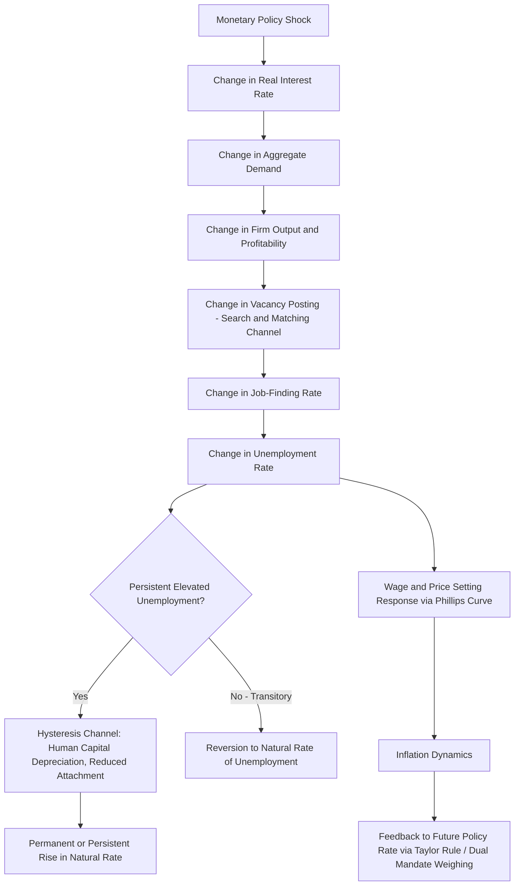

## Monetary Policy and Unemployment Dynamics

### Theoretical Foundation: The Phillips Curve Tradition

The relationship between monetary policy and unemployment is theoretically mediated through the **Phillips curve**, the empirical and theoretical relationship linking inflation (or wage growth) to labor market slack. The original Phillips (1958) finding documented an empirical negative relationship between wage inflation and unemployment in UK data, later reinterpreted by Samuelson and Solow (1960) as an apparent inflation-unemployment trade-off available to policymakers.

**Key Points**

- The **expectations-augmented Phillips curve** (Friedman, 1968; Phelps, 1967) fundamentally revised this interpretation, arguing that any exploitable trade-off is only *short-run* and depends on inflation surprises relative to expectations:

$$\pi_t = \pi_t^e + \kappa(u^* - u_t) + \epsilon_t$$

where $\pi_t$ is inflation, $\pi_t^e$ is expected inflation, $u_t$ is unemployment, $u^*$ is the **natural rate of unemployment** (or non-accelerating inflation rate of unemployment, NAIRU), and $\kappa > 0$ governs the sensitivity of inflation to the unemployment gap.

- Under rational or adaptive expectations, if the central bank persistently attempts to hold unemployment below $u^*$ via expansionary policy, expected inflation $\pi_t^e$ eventually adjusts upward to match realized inflation, eliminating the transitory trade-off and leaving unemployment at $u^*$ but at a permanently higher inflation rate—the theoretical basis for the claim that monetary policy cannot achieve a *permanent* reduction in unemployment below its natural rate, only transitory deviations exploiting inflation surprises.
- This friedman-phelps natural rate hypothesis was substantially validated by the U.S. stagflation experience of the 1970s, where rising inflation coincided with rising, not falling, unemployment—a pattern inconsistent with a stable exploitable Phillips curve trade-off but consistent with the natural rate hypothesis combined with adverse supply shocks (oil price shocks) and accommodative monetary policy that allowed inflation expectations to become unanchored.

### The New Keynesian Phillips Curve

Modern DSGE-based monetary models embed a forward-looking **New Keynesian Phillips Curve (NKPC)**, derived from optimizing firm behavior under Calvo (1983) nominal price rigidity:

$$\pi_t = \beta E_t[\pi_{t+1}] + \kappa \cdot mc_t$$

where $mc_t$ is real marginal cost (in monetary applications frequently proxied by, or theoretically linked to, a measure of the output gap or labor market slack via the relationship between marginal cost and labor's share of income), and $\kappa$ is a function of the underlying Calvo price-stickiness parameter and other structural elasticities.

**Key Points**

- The NKPC's forward-looking structure (inflation depends on *expected future* inflation, in contrast to the adaptive-expectations, backward-looking specification implicit in earlier Phillips curve formulations) implies that a credible commitment to future disinflation can, in principle, lower current inflation with less unemployment cost than under backward-looking expectations, since expected future inflation directly enters the current inflation determination.
- Empirical estimation of the NKPC using aggregate marginal cost or labor share measures has produced mixed results regarding the model's fit to observed inflation dynamics, particularly regarding the "inflation persistence puzzle"—observed inflation exhibits more persistence than the purely forward-looking baseline NKPC predicts, motivating hybrid specifications incorporating a backward-looking (lagged inflation) term, often justified via partial price indexation to past inflation (Christiano, Eichenbaum, and Evans, 2005) or a fraction of "rule-of-thumb" firms that set prices based on recent inflation rather than fully rational expectations (Galí and Gertler, 1999). [Inference: the relative empirical support for competing explanations of inflation persistence remains a subject of ongoing research and is not fully settled]

### Sacrifice Ratio: Quantifying the Disinflation-Unemployment Trade-off

The **sacrifice ratio** quantifies the cumulative unemployment (or output) cost of achieving a permanent reduction in inflation, typically expressed as the cumulative percentage-point-years of excess unemployment (relative to the natural rate) required per percentage-point permanent reduction in inflation:

$$\text{Sacrifice Ratio} = \frac{\sum_t (u_t - u^*)}{\Delta \pi^{\text{permanent}}}$$

**Key Points**

- Estimated sacrifice ratios vary substantially across studies, time periods, and countries, with estimates for the U.S. historically ranging widely depending on methodology and sample period; a commonly cited illustrative range from the disinflation literature is on the order of several points of cumulative unemployment-years per percentage point of permanent disinflation, though specific point estimates depend heavily on model specification and estimation window. [Unverified: precise current-consensus sacrifice ratio estimates should be checked against recent dedicated studies, as this parameter is not a fixed structural constant and estimates have varied considerably across the literature]
- Sacrifice ratios are theoretically predicted to be smaller when disinflation is credible and clearly communicated (since credible commitment lowers expected inflation more quickly, reducing the required realized unemployment cost under expectations-augmented or forward-looking Phillips curve mechanics) relative to disinflation achieved via unexpected, non-credible policy tightening—a key argument for the value of central bank credibility and transparent communication strategies in reducing the real costs of disinflation.
- The Volcker disinflation (1979-1982) is the canonical U.S. historical episode used to estimate sacrifice ratios, involving a substantial, sustained increase in unemployment (peaking above 10%) accompanying the successful reduction of inflation from double-digit rates to the 3-4% range by the mid-1980s.

### Hysteresis: Persistent Effects of Monetary Policy on Unemployment

**Key Points**

- The standard natural rate hypothesis implies unemployment returns to $u^*$ regardless of the path of monetary policy, with policy affecting only the transitory deviation, not the long-run level. **Hysteresis** theories challenge this by proposing mechanisms through which temporarily elevated unemployment (e.g., from a monetary policy tightening or a demand shock the central bank fails to offset) can *permanently* or persistently raise the natural rate itself.
- Blanchard and Summers (1986) propose insider-outsider labor market models in which prolonged unemployment erodes the bargaining power, skills, and labor market attachment of the unemployed ("outsiders"), permanently shifting wage-setting dynamics and the effective natural rate even after the initial shock dissipates.
- More recent hysteresis mechanisms emphasize **human capital depreciation** during extended unemployment spells, reduced labor force attachment and discouraged-worker effects, and reduced capital investment (and consequent reduced future labor demand) during prolonged downturns—collectively implying that monetary policy's response to a demand shock is not merely about smoothing a transitory fluctuation but can have consequences for the economy's medium-to-long-run productive capacity.
- This hysteresis channel has been an influential argument for **asymmetric or more aggressive monetary policy easing** during downturns (relative to a symmetric natural-rate-targeting benchmark), on the grounds that allowing unemployment to remain elevated for an extended period risks permanently damaging labor market outcomes in a way that a purely transitory-shock framework would not capture. [Inference: the quantitative importance of hysteresis effects, and the appropriate policy response calibration implied by them, remains an active area of research and is not uniformly agreed upon across studies]

### Empirical Estimation Approaches

**Key Points**

- **VAR-based estimation** (see Vector autoregression models and Identification of monetary policy shocks) of the dynamic response of unemployment to identified monetary policy shocks is a standard empirical approach, typically finding a hump-shaped unemployment response—little immediate effect, a peak effect after several quarters (commonly cited illustrative lag structures in the literature run on the order of one to two years for the peak unemployment response), and gradual reversion thereafter, consistent with the general "long and variable lags" characterization of monetary policy transmission (Friedman, 1961).
- **State-dependent local projections** (see Local projections for impulse response estimation) have been used to test whether unemployment responds asymmetrically to policy shocks depending on the state of the labor market (e.g., whether tightening shocks during already-tight labor markets have different effects than easing shocks during slack labor markets), addressing hypotheses of asymmetric monetary policy transmission not captured by a standard linear VAR.
- **Estimated DSGE models** incorporating search-and-matching labor market frictions (following Mortensen and Pissarides, 1994, integrated into New Keynesian DSGE frameworks, e.g., by Christiano, Eichenbaum, and Trabandt, 2016) provide a structural framework for jointly modeling monetary policy transmission and unemployment dynamics (rather than treating unemployment as residually related to an output gap), allowing estimation of structural parameters governing job creation, job destruction, and matching efficiency alongside standard New Keynesian nominal rigidity parameters.

### Search-and-Matching Framework

**Key Points**

- Search-and-matching DSGE models explicitly model unemployment as an equilibrium outcome of a matching function combining vacancies (posted by firms) and job-seekers, governed by a matching efficiency parameter and congestion externalities, in contrast to reduced-form or Walrasian labor market clearing assumed in earlier RBC and basic New Keynesian models.
- These models generate a distinct **unemployment volatility puzzle** (Shimer, 2005): standard calibrations of the search-and-matching model, when hit by realistically-sized productivity shocks, generate far less volatility in vacancies and unemployment than observed in the data, motivating a substantial subsequent literature on wage rigidity mechanisms (e.g., Hall, 2005, proposing sticky real wages as a resolution) needed to amplify the model's implied labor market volatility to match empirical magnitudes.
- Monetary policy shocks, once embedded within a search-and-matching framework, transmit to unemployment via their effect on firms' vacancy-posting incentives (a contractionary shock reduces expected firm profitability, reducing vacancy posting, which lowers the job-finding rate and raises unemployment with the specific dynamic lag structure implied by the matching function and vacancy posting costs).

### Policy Framework Implications: Dual Mandate and the Sacrifice Ratio Trade-off

**Key Points**

- Central banks with an explicit **dual mandate** (most notably the U.S. Federal Reserve, statutorily required to pursue both maximum employment and price stability) must formally weigh the unemployment costs of disinflationary policy against the costs of allowing inflation to run persistently above target, an explicit policy trade-off with no single objectively "correct" resolution, reflecting a genuine value judgment about the relative social costs of inflation versus unemployment.
- The **Taylor rule** and its variants formalize this weighing by specifying the policy rate as a function of both the inflation gap and the output (or unemployment) gap, with the relative coefficients on each gap reflecting the central bank's (or the researcher's estimated) relative weight placed on the corresponding objective.
- Flexible average inflation targeting frameworks and other recent monetary policy framework innovations have explicitly incorporated considerations of labor market outcomes—for instance, adjusting the standard Taylor-rule response to focus on "shortfalls from" rather than "deviations from" maximum employment, altering the framework's implied asymmetric treatment of tight versus slack labor market conditions. [Unverified: the specific current operational status and any subsequent revisions to such framework language should be checked against current central bank policy statements, as monetary policy frameworks are periodically reviewed and revised]

### Workflow / Conceptual Diagram

### Applications in Monetary Economics

**Example**

The Volcker disinflation is frequently analyzed as a natural experiment illustrating the short-run Phillips curve trade-off and the sacrifice ratio concept in practice: the sharp, sustained monetary tightening of 1979-1982 produced a severe recession and a peak unemployment rate above 10%, accompanying the successful, durable reduction of U.S. inflation from double-digit levels, an episode used extensively in both the empirical sacrifice-ratio literature and in discussions of the credibility-related channel through which monetary policy commitment affects the real costs of disinflation.

**Key Points**

- Estimated DSGE models with search-and-matching frictions and estimated Phillips curve relationships are used by central banks for real-time assessment of labor market slack (e.g., estimating the current output or unemployment gap relative to its natural-rate benchmark) as an input to policy rate-setting decisions, though these gap estimates are subject to substantial real-time measurement uncertainty and are frequently revised as more data becomes available, a well-documented practical challenge in operationalizing Phillips-curve-based or dual-mandate policy frameworks. [Inference: the magnitude of this real-time measurement uncertainty for natural rate and output gap estimates is extensively documented in the relevant literature, with the degree of revision varying by methodology and time period]

### Limitations and Ongoing Debates

**Key Points**

- The apparent **flattening of the Phillips curve** in recent decades (a weaker estimated relationship between unemployment and inflation than in earlier historical periods) has been a subject of substantial empirical and theoretical debate, with proposed explanations including improved central bank credibility and better-anchored inflation expectations (reducing the pass-through from slack to realized inflation), globalization and reduced pricing power of domestic labor markets, and possible mismeasurement of the relevant slack variable. [Speculation: which of these competing explanations, or what combination, best accounts for the observed flattening is not resolved by currently available evidence and remains actively debated]
- The appropriate quantitative calibration of any hysteresis-based argument for more aggressive counter-cyclical policy remains contested, since it requires taking a position on the magnitude of a channel (permanent natural-rate effects of transitory unemployment) that is inherently difficult to identify empirically, given that observing a "permanently" elevated natural rate requires distinguishing it from other concurrent supply-side or demographic factors that could independently explain a change in estimated $u^*$ over the same period.
- As with other monetary transmission relationships discussed in this material, all Phillips-curve- and unemployment-related empirical relationships describe historical regularities in specific historical samples and policy regimes, and their behavior may vary in future or structurally different circumstances (a specific instance of the general Lucas-critique caveat applicable to any reduced-form or even structurally estimated relationship whose "deep" parameters may not be fully policy-invariant).

**Next Steps**

- New Keynesian Phillips Curve derivation and empirical estimation
- Search-and-matching labor market models (Mortensen-Pissarides framework)
- The unemployment volatility puzzle and wage rigidity resolutions
- Sacrifice ratio estimation methodology
- Natural rate of unemployment and NAIRU estimation
- Dual mandate policy frameworks and Taylor rule variants
- Hysteresis and the natural rate: theory and evidence
- Inflation expectations anchoring and Phillips curve flattening