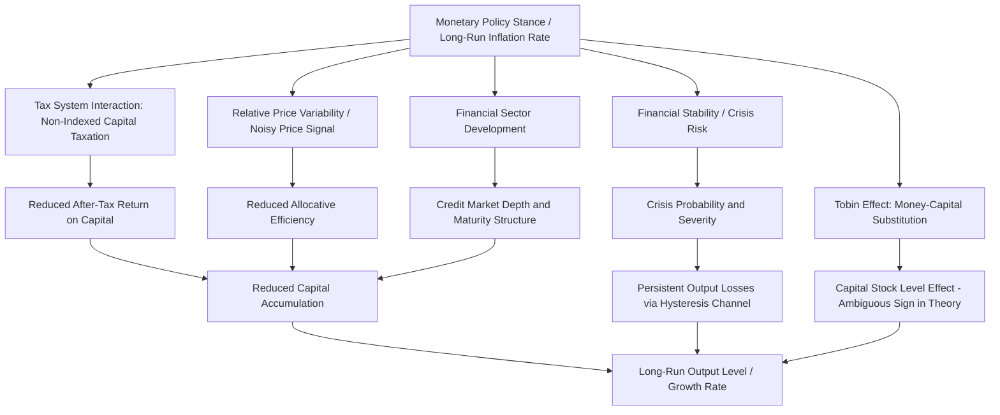

## Monetary Policy and Long-Run Economic Growth

### The Classical Dichotomy and Long-Run Monetary Neutrality

The theoretical starting point for analyzing monetary policy's relationship to long-run growth is the **classical dichotomy**: the proposition that real variables (output, employment, the real interest rate, and by extension the long-run growth rate) are determined independently of nominal variables (the money supply, the price level) in the long run, with monetary policy affecting only nominal outcomes once full price adjustment has occurred.

**Key Points**

- **Long-run monetary neutrality** holds that a permanent, once-and-for-all change in the money supply level produces, after full adjustment, a proportional change in the price level with no lasting effect on real output, employment, or the real interest rate—a proposition with substantial theoretical support across a wide range of models (classical, monetarist, and New Keynesian alike agree on long-run neutrality, differing primarily on short-run non-neutrality mechanisms and adjustment speed).
- **Superneutrality** is the stronger, more restrictive proposition that even the long-run *growth rate* of the money supply (as opposed to a one-time level change) has no effect on real variables, including the long-run growth rate of output itself; this is theoretically more contested than simple neutrality, since money growth affects the inflation rate, and various theoretical channels (discussed below) predict inflation can have real long-run effects even if a one-time price-level change does not.
- Standard Real Business Cycle and most New Keynesian DSGE models impose long-run neutrality by construction (nominal variables do not enter the model's long-run steady-state real equilibrium conditions), meaning these frameworks are generally not well suited to directly modeling a long-run causal channel from monetary policy to the growth *rate*, and analysis of such channels typically requires models with specific frictions that break superneutrality.

### Channels Through Which Monetary Policy Could Affect Long-Run Growth

#### The Tobin Effect

**Key Points**

- Tobin (1965) proposes a channel through which higher steady-state inflation, by raising the nominal interest rate (via the Fisher relationship) and thus the opportunity cost of holding non-interest-bearing money, induces households to substitute from money toward physical capital in their portfolios, raising the steady-state capital stock and, along the transition path, temporarily raising the growth rate (though not the long-run growth *rate* itself in the basic neoclassical growth model framework, since the model's long-run growth rate is exogenously determined by the rate of technological progress, with the level effect on the capital stock affecting the transition path and steady-state level of output, not its long-run growth rate).
- This "Tobin effect" implies a *positive* long-run relationship between inflation and the capital stock (and hence the level of steady-state output), a prediction that has received limited empirical support and stands in tension with the alternative growth channels discussed below, which generally predict *negative* effects of inflation on capital accumulation and growth.

#### Inflation and Capital Accumulation via Distortionary Effects

**Key Points**

- An alternative and more empirically supported theoretical tradition emphasizes that inflation, particularly at higher rates, introduces **distortions** that reduce capital accumulation and productivity growth rather than raising them, operating through several distinct mechanisms: (1) interaction with a non-indexed tax system, where nominal capital gains and nominally-measured depreciation allowances are taxed or calculated without full inflation adjustment, raising the effective tax rate on capital income as inflation rises (Feldstein, 1997, emphasizes this channel); (2) increased relative price variability and noise in the price signal that firms rely on for resource allocation decisions, reducing the informational efficiency of the price system and thus allocative efficiency; (3) increased menu costs and price-adjustment frictions that divert real resources to administrative price-setting activity rather than productive investment; and (4) increased uncertainty about future inflation (particularly at higher and more variable inflation rates), which can raise risk premia on long-duration investments and depress capital formation.
- Empirical cross-country growth regressions (e.g., Barro, 1995, Fischer, 1993, and subsequent related work) have generally found a **negative relationship between inflation and long-run growth**, though the relationship has frequently been found to be **nonlinear**, with the negative effect concentrated at higher inflation rates (some studies suggest a threshold in the range of high single digits to low double digits, above which the negative growth effect becomes more pronounced) and a comparatively weak, sometimes statistically insignificant, relationship at low-to-moderate inflation rates typical of most developed-economy monetary policy regimes in recent decades. [Unverified: precise threshold estimates vary substantially across studies, samples, and estimation methods, and should not be treated as a precisely established structural constant]

#### Financial Development and Monetary Stability

**Key Points**

- A distinct channel operates through the relationship between price stability and **financial sector development**: high and volatile inflation is theoretically and empirically associated with underdeveloped financial intermediation (shorter loan maturities, reduced credit-to-GDP ratios, dollarization/currency substitution in economies with a history of high inflation), since inflation volatility raises the risk premium demanded by lenders and shortens the horizon over which nominal contracts remain informative, impeding the financial sector's capacity to efficiently allocate capital to productive long-term investment—a channel connecting monetary stability to growth indirectly via the financial development channel emphasized in the broader finance-and-growth literature (King and Levine, 1993).
- This provides a theoretical rationale for viewing central bank price stability mandates as growth-supportive not merely by avoiding the direct distortionary costs of inflation but by supporting the institutional and financial infrastructure (well-functioning long-term credit and capital markets) that underpins capital accumulation and productivity growth over long horizons.

### Endogenous Growth Models and Monetary Policy

**Key Points**

- In contrast to exogenous (Solow-type) growth models, where the long-run growth rate is determined by an exogenously given rate of technological progress unaffected by monetary variables, **endogenous growth models** (e.g., models in the tradition of Romer, 1990, and Aghion and Howitt, 1992, where growth arises endogenously from R&D investment, human capital accumulation, or learning-by-doing) provide a theoretical channel through which monetary policy *could* affect the long-run growth rate itself, not merely the level of output or the transition path, since anything affecting the incentive to invest in R&D or human capital (e.g., inflation-induced distortions to the after-tax return on such investment, or credit market frictions affecting the financing of R&D) can, within these models, alter the steady-state growth rate.
- This theoretical possibility is more contested and less robustly empirically established than the level effects discussed above, since identifying a genuine long-run growth-*rate* effect (as opposed to a level effect that resembles a growth-rate effect only during a long transition period) is empirically demanding, requiring long time-series samples and careful distinction between transitional dynamics and permanent growth-rate shifts. [Speculation: whether monetary policy has a genuine long-run growth-rate effect, as opposed to a level effect with an extended transition, is not conclusively resolved by available empirical evidence, and the two are often difficult to distinguish in practice given finite historical samples]

### Financial Stability, Crises, and Long-Run Output Effects

**Key Points**

- A separate and increasingly emphasized channel operates through the relationship between monetary policy, financial stability, and the incidence and severity of financial crises: episodes of excessively accommodative monetary policy sustained over long periods have been argued (e.g., in narratives associated with the "search for yield" and credit-boom literatures following the 2008 global financial crisis) to contribute to asset price bubbles and excessive leverage, raising the probability or severity of subsequent financial crises, which in turn can generate substantial and, per the hysteresis discussion (see Monetary policy and unemployment dynamics), potentially *persistent* output losses well beyond the crisis episode itself.
- This channel implies that monetary policy's relationship to long-run growth may operate not primarily through the mechanisms discussed above (inflation-driven distortions to capital accumulation) but through its role in influencing systemic financial risk and the probability of costly crisis episodes with persistent output effects—a consideration underlying the post-2008 expansion of macroprudential policy frameworks as a complement to, and in some proposals as partially substituting for, using the policy interest rate itself to address financial-stability-related risks (the "lean versus clean" debate over whether monetary policy should "lean against the wind" of asset price booms versus "clean up" after the fact). [Unverified: the empirical magnitude of any long-run growth cost attributable specifically to monetary-policy-induced financial instability, as distinct from other contributing factors to financial crises, is difficult to isolate and remains a subject of ongoing research]

### Empirical Evidence: Cross-Country Growth Regressions

**Key Points**

- The dominant empirical approach to this question has been cross-country growth regressions relating long-run average growth rates to average inflation rates (and other controls), in the tradition of Barro (1991, 1995) and related work; a general empirical finding across this literature is a statistically significant negative relationship between inflation and growth, concentrated at higher inflation levels, though the precise functional form (linear versus threshold/nonlinear) and the size and stability of the estimated coefficient vary across studies, samples, and time periods. [Inference: this qualitative summary reflects the general thrust of the empirical growth-inflation literature but specific quantitative results should be checked against the specific study of interest given documented sensitivity to sample and specification choices]
- A well-documented methodological concern with this literature is potential **reverse causality and omitted variable bias**: countries experiencing poor institutional quality, political instability, or weak fiscal discipline may simultaneously experience both high inflation (a symptom of weak monetary institutions) and low growth (a consequence of the same weak institutions), making it difficult to cleanly attribute the observed correlation to a causal effect of inflation itself, as opposed to both variables being jointly determined by underlying institutional quality.
- Cross-country panel studies with country and time fixed effects, and studies exploiting specific policy regime changes (e.g., adoption of inflation targeting) as quasi-natural experiments, represent attempts to address this identification concern, though the fundamental difficulty of establishing clean causal identification in cross-country macro growth contexts (a broader, well-recognized challenge in the growth empirics literature generally, not specific to the inflation-growth question) remains a persistent limitation.

### Diagram: Channels from Monetary Policy to Long-Run Growth

### Policy Implications

**Key Points**

- The dominant practical conclusion drawn from this literature by most central banks is that **price stability** (low and stable inflation, rather than either high inflation or aggressive deflationary policy) is generally growth-supportive, primarily by avoiding the documented distortionary costs of high inflation and by supporting financial development and stability, providing a long-run-growth-based complement to the more commonly emphasized short-run stabilization rationale for price stability mandates.
- This conclusion does not, however, imply that monetary policy should be the primary tool for promoting long-run growth: the consensus view distinguishes between monetary policy's role in *avoiding growth-detracting distortions* (via price stability) and the separate, generally much larger role of structural, fiscal, and institutional factors (productivity growth, human capital investment, institutional quality, R&D policy) as the primary determinants of long-run growth rates, with monetary policy's growth-relevant contribution generally viewed as more about removing an impediment than about actively driving growth.
- The financial-stability-related growth channel has motivated increased attention to macroprudential policy as a complement to monetary policy specifically aimed at mitigating the long-run growth costs associated with financial-crisis-related output losses, reflecting a view that this channel may be quantitatively more significant for long-run growth outcomes than the more traditional inflation-distortion channels, particularly for economies with well-developed price-stability-oriented monetary frameworks already in place. [Speculation: the relative quantitative importance of the financial-stability channel versus the traditional inflation-distortion channel for long-run growth is not conclusively established and reflects an evolving area of research and policy debate, particularly since the 2008 financial crisis]

**Next Steps**

- Monetary policy and unemployment dynamics (short-run real effects and Phillips curve mechanics)
- Endogenous growth theory (Romer, Aghion-Howitt frameworks)
- Financial development and the finance-growth nexus (King-Levine tradition)
- Macroprudential policy and the "lean versus clean" debate
- Inflation targeting regime adoption and growth outcomes
- Optimal long-run inflation rate and the costs of low inflation / disinflation
- Cross-country growth regression methodology and identification challenges