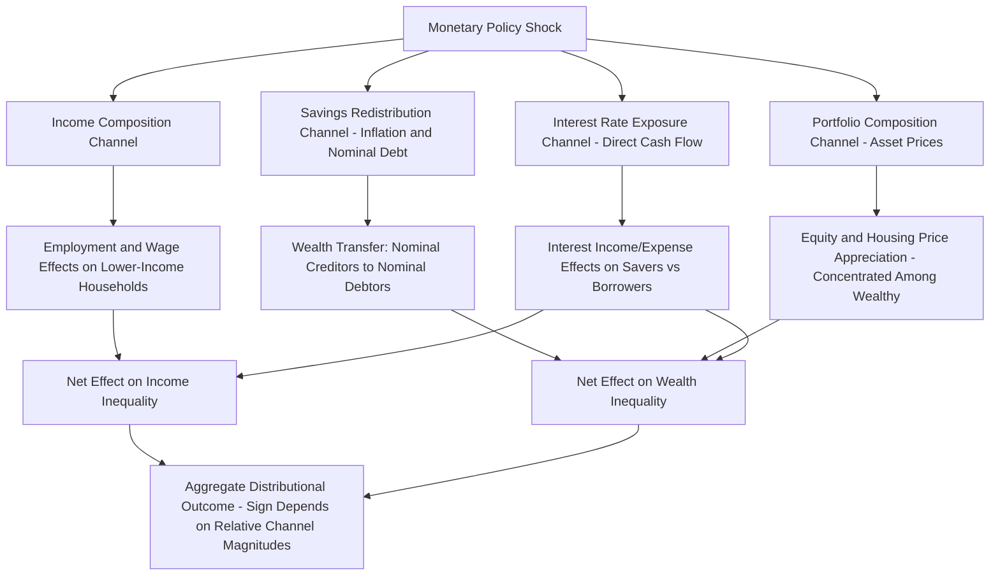

## Monetary Policy and Income and Wealth Inequality

### Conceptual Framework: Why Monetary Policy Could Affect Inequality

Monetary policy, traditionally analyzed through an aggregate, representative-agent lens focused on output, inflation, and employment, has received substantially increased attention regarding its **distributional consequences** since the 2008 financial crisis, driven partly by the unprecedented scale of unconventional monetary policy (near-zero rates, large-scale asset purchases) and partly by a broader academic and policy shift toward heterogeneous-agent modeling frameworks capable of speaking to distributional questions that representative-agent models are, by construction, unable to address.

**Key Points**

- The analytical starting point is that households differ systematically along dimensions that determine how monetary policy affects them differently: the composition of their balance sheets (net saver versus net borrower status, asset holdings by type—equity, housing, fixed-income), their labor market position (employed versus unemployed, skill level, industry), and their income sources (wage income versus capital income versus transfer income).
- Because monetary policy operates through channels that affect asset prices, borrowing costs, and aggregate employment simultaneously, and because households are heterogeneously exposed to each of these channels, even a monetary policy action with a *neutral* or *stabilizing* aggregate objective can have systematically non-neutral distributional consequences—a feature invisible in representative-agent frameworks by construction, since such frameworks assume away the heterogeneity through which distributional effects operate.
- Distinguishing this question from a purely academic curiosity, decisions makers has increasingly needed to consider not only whether policy achieves its aggregate objectives efficiently, but also who bears the costs and who receives the benefits along the transmission path, since these distributional consequences carry both normative and political-economy significance for central bank legitimacy and mandate design.

### Taxonomy of Channels

Coibion, Gorodnichenko, Kueng, and Silvia (2017) and subsequent literature organize the transmission channels from monetary policy to inequality into several broad categories, useful as an organizing taxonomy for this material.

#### The Income Composition Channel

**Key Points**

- Households differ in the composition of their income across labor income, business/capital income, and transfer income; monetary policy easing that stimulates aggregate demand and reduces unemployment disproportionately benefits households whose income is more heavily weighted toward labor earnings (particularly lower-income households, for whom labor income constitutes a larger share of total income and for whom unemployment risk is empirically higher), a channel that, in isolation, would suggest accommodative monetary policy tends to be **inequality-reducing** via its effect on labor market outcomes.
- This channel operates specifically through the employment and wage effects discussed under Monetary policy and unemployment dynamics: to the extent monetary easing reduces unemployment (with unemployment risk concentrated among lower-income and lower-skill workers, an empirically well-documented pattern), the income-composition channel implies a disproportionate benefit to lower-income households from expansionary policy relative to the aggregate average effect.

#### The Financial Segmentation / Savings Redistribution Channel

**Key Points**

- Because inflation redistributes wealth from nominal creditors to nominal debtors (unanticipated inflation erodes the real value of fixed nominal debt obligations, benefiting borrowers at the expense of lenders), and because net creditor/debtor status is empirically correlated with age, income, and wealth (with net debtor status often more prevalent among younger and middle-income households holding mortgage debt, and net creditor status more prevalent among older, wealthier households holding fixed-income financial assets), monetary policy actions that generate inflation surprises have a direct, mechanical redistributive effect operating through this nominal-debt-revaluation channel, independent of any effect on aggregate employment or output.
- Doepke and Schneider (2006) provide an influential quantitative analysis of this channel using U.S. household balance sheet data, finding economically meaningful redistribution from older creditor households toward younger debtor households following an inflation shock, illustrating that the sign and magnitude of this channel's distributional effect depends critically on the empirical joint distribution of net nominal asset positions across the population, not merely on a theoretical presumption.

#### The Portfolio Composition / Asset Price Channel

**Key Points**

- Monetary easing, through standard transmission mechanisms, tends to raise the prices of financial assets (equities, bonds) and often housing, and because asset ownership—particularly equity ownership—is empirically highly concentrated among higher-wealth households (a well-documented feature of wealth distribution data in most advanced economies), monetary-policy-driven asset price appreciation disproportionately increases the *wealth* of already wealthier households, a channel that, in isolation, is generally understood to operate in an **inequality-increasing** direction for wealth (as distinct from income) inequality.
- This channel has received particular attention regarding unconventional monetary policy (quantitative easing) following the 2008 crisis, given the scale of asset purchases and the associated substantial appreciation in equity and, in many economies, housing prices during the subsequent expansion, with critics arguing that QE's primary distributional effect operated through this asset-price-driven wealth channel. [Inference: this critique is prominently represented in both academic and public policy debate, though its quantitative significance relative to the income-composition channel's offsetting effect is empirically contested, as discussed below]
- The net distributional effect of this channel depends on the specific asset ownership distribution in the economy under study, the relative magnitude of equity versus housing price effects (since housing wealth is more broadly, if unevenly, distributed across the middle of the wealth distribution than equity wealth, which is heavily concentrated at the top), and the time horizon considered.

#### The Interest Rate Exposure Channel (Saving Redistribution)

**Key Points**

- Beyond the debt-revaluation channel above (which concerns unanticipated inflation's effect on the real value of nominal balances), a distinct channel concerns the direct effect of policy-rate changes on interest income and expense: lower policy rates directly reduce the interest income earned by net savers (disproportionately older and wealthier households holding interest-bearing deposits and fixed-income assets) while reducing the interest expense faced by net borrowers (disproportionately younger and middle-income households with mortgage or other variable-rate debt), a channel operating independently of any inflation surprise, purely through the direct cash-flow effect of the policy rate itself on interest-bearing balance sheet positions.

### Empirical Evidence

**Key Points**

- Coibion, Gorodnichenko, Kueng, and Silvia (2017), using a proxy-SVAR/local-projections approach (see Identification of monetary policy shocks) applied to U.S. Consumer Expenditure Survey micro data, find that contractionary monetary policy shocks are associated with increases in income and consumption inequality, driven primarily by the income composition channel (disproportionate employment and wage effects on lower-income households) rather than by the financial channels discussed above, an empirical finding suggesting the income-composition channel dominates in their specific U.S. sample and specification.
- Other studies, using different countries, sample periods, and empirical methodologies, have reached varying conclusions regarding the relative magnitude and even the direction of the net distributional effect of monetary policy, reflecting the genuinely offsetting nature of the different channels described above (income-composition effects and asset-price effects often point in opposite directions for a given policy action) and the sensitivity of the net empirical result to the specific inequality measure used (income versus wealth, and specific percentiles or summary statistics such as the Gini coefficient examined), the specific country and time period studied, and the specific empirical methodology employed. [Unverified: given the genuinely mixed and evolving state of this empirical literature, any single quantitative summary risks overstating the degree of consensus; specific current studies should be consulted for up-to-date quantitative findings]
- Given that the various channels discussed operate in different directions and depend on country-specific institutional features (homeownership rates, pension system structure, wage-setting institutions, the prevalence of fixed- versus variable-rate mortgage debt), a robust general conclusion applicable across all economies and time periods is not well supported by the available evidence; findings are better understood as context- and channel-dependent rather than pointing to a single universal directional relationship between monetary policy stance and inequality. [Speculation: whether a more unified, generally applicable theoretical and empirical resolution of the net direction of this relationship will emerge from ongoing research, or whether the relationship is inherently and irreducibly context-dependent, is not resolved by currently available evidence]

### Heterogeneous-Agent New Keynesian (HANK) Models

**Key Points**

- The theoretical modeling response to this literature has been the development of **Heterogeneous-Agent New Keynesian (HANK)** models (Kaplan, Moll, and Violante, 2018, being a foundational reference), which embed the standard New Keynesian nominal rigidity and monetary transmission apparatus within a Bewley-Huggett-Aiyagari-style heterogeneous-household framework featuring idiosyncratic income risk, incomplete markets, and a realistic (calibrated to match empirical data) distribution of household liquid and illiquid wealth holdings.
- A central finding of the HANK literature is that the presence of a substantial share of **hand-to-mouth households** (households holding little or no liquid savings buffer, who consume essentially their entire current income regardless of the interest rate, in contrast to the smooth intertemporal consumption-smoothing behavior of a representative agent in standard models) substantially alters both the magnitude and the transmission channel of monetary policy's aggregate effects: in HANK models, the primary channel through which monetary policy affects aggregate consumption is often the **indirect general equilibrium channel** (monetary policy's effect on aggregate income and employment, which then affects hand-to-mouth households' consumption directly through the income-composition-like mechanism), rather than the **direct intertemporal substitution channel** emphasized in representative-agent models (households directly adjusting saving/consumption in response to the interest rate itself).
- This reallocation of the dominant transmission channel has direct distributional modeling implications, since it provides a fully micro-founded structural framework within which to jointly analyze the aggregate and distributional effects of monetary policy shocks, rather than requiring separate reduced-form empirical analysis of distributional effects as a supplement to a representative-agent aggregate model.

### Housing Wealth and Homeownership Heterogeneity

**Key Points**

- Given housing represents the largest component of wealth for a substantial share of middle-wealth households in many advanced economies, and given mortgage debt (frequently at variable rates in some countries, though predominantly fixed-rate in others such as the U.S.) constitutes the largest liability for these same households, monetary policy transmission through the housing channel has distinct distributional implications that depend heavily on country-specific mortgage market institutions (variable- versus fixed-rate mortgage prevalence, loan-to-value regulatory constraints, homeownership rates across the income and wealth distribution).
- Cloyne, Ferreira, and Surico (2020) provide evidence that mortgagor (particularly variable-rate mortgage) households exhibit substantially larger consumption responses to monetary policy shocks than outright homeowners or renters, consistent with a cash-flow-based transmission channel operating specifically through household debt-servicing costs, a finding with direct relevance to understanding which households bear the largest consumption-smoothing burden (or benefit) from a given monetary policy action.

### Diagram: Channels from Monetary Policy to Inequality

### Policy and Mandate Implications

**Key Points**

- Central banks with narrow price-stability or dual (price stability plus employment) mandates generally do not have an explicit legal mandate to target inequality directly, and most central bank officials and researchers have generally argued that monetary policy is a blunt instrument poorly suited to addressing inequality directly relative to targeted fiscal policy tools (progressive taxation, targeted transfers), even while acknowledging that monetary policy has *incidental* distributional consequences worth understanding and monitoring as a by-product of pursuing its primary mandated objectives.
- This has not prevented growing central bank research attention to distributional analysis (reflected in a substantial expansion of central bank research department work using HANK models and household-level microdata) as a matter of understanding transmission mechanisms more fully (since heterogeneous household responses affect the aggregate transmission mechanism itself, as HANK models demonstrate) and as a matter of public accountability and communication, even without a formal inequality-targeting mandate. [Unverified: the degree to which any specific central bank's operational framework has formally incorporated distributional considerations into policy-setting, as opposed to research and communication, varies by institution and should be checked against current institutional practice]
- The unconventional monetary policy experience following 2008 (persistently low rates, large-scale asset purchases) intensified public and academic debate regarding the distributional consequences of "extraordinary" policy measures specifically, given the scale and duration of these interventions relative to conventional interest-rate policy, though disentangling the distributional effects specifically attributable to the *unconventional* nature of the policy from those attributable to the underlying accommodative *stance* (which could in principle have been achieved, absent the zero lower bound constraint, via conventional rate cuts) remains a nontrivial empirical and conceptual challenge. [Speculation: whether unconventional policy tools carry systematically different distributional implications than conventional rate policy achieving an equivalent macroeconomic stance, as opposed to merely reflecting the unusual macroeconomic circumstances under which they were deployed, is not conclusively resolved by available evidence]

**Next Steps**

- Heterogeneous-Agent New Keynesian (HANK) models in depth
- Monetary policy and unemployment dynamics (income composition channel foundations)
- Household balance sheet heterogeneity and monetary transmission
- Quantitative easing and asset price effects
- Identification of monetary policy shocks (methodology underlying distributional VAR/LP studies)
- Fiscal versus monetary policy tools for addressing inequality
- Central bank mandates and the scope of monetary policy objectives