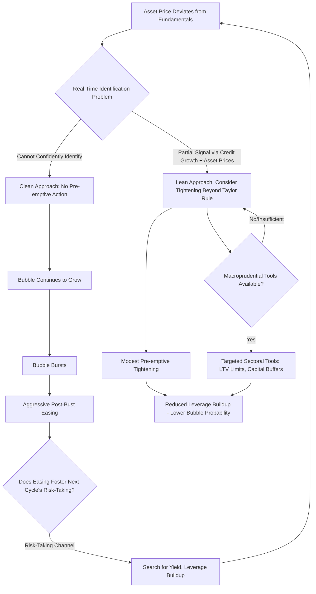

## Asset Price Bubbles and Monetary Policy

### Defining an Asset Price Bubble

An **asset price bubble** is generally defined as a sustained deviation of an asset's market price from its fundamental value, where fundamental value is conventionally understood as the present discounted value of the asset's expected future cash flows (dividends, rents, or other income streams) under an appropriate discount rate.

$$P_t = \underbrace{\sum_{s=0}^{\infty} E_t\left[\frac{D_{t+s}}{(1+r)^{s+1}}\right]}_{\text{Fundamental value}} + \underbrace{B_t}_{\text{Bubble component}}$$

where $B_t$ is the bubble component, and in the canonical **rational bubble** framework (Blanchard and Watson, 1982; Tirole, 1985), $B_t$ must satisfy $E_t[B_{t+1}] = (1+r)B_t$—the bubble is expected to grow at the discount rate, making it consistent with rational expectations and the absence of arbitrage even though it represents a persistent deviation from fundamentals.

**Key Points**

- The rational bubble framework highlights a foundational identification problem: because fundamental value itself depends on expectations of a long, uncertain future cash flow stream and an appropriate discount rate (both unobservable with precision in real time), a bubble cannot in general be identified with confidence *while it is occurring*—the presence of a bubble is typically only confirmed, if at all, after its collapse reveals a price correction inconsistent with any plausible revision to fundamentals.
- This identification problem is central to the entire policy debate discussed in this material: policymakers must decide how to respond to asset price movements without being able to reliably distinguish, in real time, a bubble from a fundamentals-justified price increase (e.g., driven by a genuine, if perhaps optimistic, revision to expected future productivity or cash flows).
- Alternative, non-rational-bubble theoretical frameworks explaining sustained price deviations from fundamentals include heterogeneous-beliefs models (where short-sale constraints prevent pessimistic investors' views from being reflected in prices, per Harrison and Kreps, 1978, and Scheinkman and Xiong, 2003), and behavioral finance frameworks emphasizing extrapolative expectations, herding, and other departures from full rationality in price formation (Shiller, 2000, and related behavioral finance literature).

### The "Lean versus Clean" Debate

The central monetary policy debate regarding asset price bubbles is conventionally framed as a choice between two broad strategic postures.

#### "Clean" (React After the Fact)

**Key Points**

- The "clean" approach, historically associated with the pre-2008 Federal Reserve consensus view (often linked to Alan Greenspan and articulated formally by Bernanke and Gertler, 2001), holds that monetary policy should not attempt to actively identify and deflate asset price bubbles in real time, but should instead focus the policy rate on its standard mandate (price stability, output/employment stabilization) and stand ready to aggressively ease policy to mitigate the macroeconomic damage *after* a bubble bursts, cleaning up the aftermath rather than attempting the more difficult (and potentially counterproductive) task of identification and pre-emptive deflation.
- Arguments for this approach include: (1) the real-time identification problem discussed above makes pre-emptive action highly risky, since acting against what turns out to be a fundamentals-justified price increase imposes real economic costs (higher interest rates depress genuine investment and consumption) without any corresponding benefit; (2) the policy rate is a blunt instrument affecting the entire economy, whereas a bubble may be concentrated in a specific asset class or sector, making the interest rate a poor targeted tool relative to the collateral damage it would inflict on the broader economy in the process of attempting to address a sector-specific concern; (3) historically, central banks have had more experience and demonstrated more capability in mitigating the aftermath of a bursting bubble (via aggressive rate cuts and liquidity provision) than in successfully identifying and pre-emptively deflating one without triggering the very crash the policy sought to avoid.

#### "Lean" (Pre-emptive Action)

**Key Points**

- The "lean against the wind" approach argues that monetary policy should incorporate financial stability risks—including asset price developments that raise concerns about the sustainability of asset valuations and associated leverage—directly into policy rate decisions, potentially tightening policy modestly beyond what a pure inflation/output-gap-based Taylor rule would prescribe, in order to restrain excessive risk-taking, leverage buildup, and asset price appreciation before they reach a scale posing systemic risk.
- This view gained substantial support following the 2008 global financial crisis, which many observers viewed as having validated concerns that the "clean" approach's aggressive post-bubble easing (following the dot-com bust in the early 2000s) itself contributed to the subsequent housing and credit boom that preceded the 2008 crisis, an argument sometimes summarized as persistently accommodative policy fostering a "search for yield" and excessive risk-taking (via the risk-taking channel of monetary policy, discussed further below), thereby increasing systemic financial fragility over successive cycles.
- Borio and Lowe (2002) and subsequent work associated with the Bank for International Settlements have been prominent proponents of incorporating credit growth and asset price developments into policy considerations, partly motivated by evidence that rapid credit growth combined with asset price booms is a more empirically robust leading indicator of subsequent financial crises than either indicator alone, providing a partial, if imperfect, empirical handle on the otherwise difficult real-time bubble identification problem.

### The Risk-Taking Channel of Monetary Policy

**Key Points**

- Borio and Zhu (2012) formalize the **risk-taking channel**, the proposition that monetary policy affects not only the *quantity* of credit and asset prices through conventional interest-rate and balance-sheet channels, but also the *risk appetite and risk-pricing behavior* of financial intermediaries themselves—persistently low interest rates can induce financial institutions (particularly those with return targets or liability structures sensitive to the level of rates, such as insurance companies and pension funds with fixed nominal obligations) to search for yield by taking on additional credit or duration risk, potentially loosening lending standards and inflating leverage in ways not fully captured by standard monetary transmission models.
- Empirical evidence for this channel has drawn on bank-level and loan-level microdata studies finding that periods of low policy rates are associated with looser bank lending standards and increased risk-taking in loan portfolios (e.g., Jiménez, Ongena, Peydró, and Saurina, 2014, using Spanish credit registry data), providing micro-level evidence complementary to the more aggregate, macro-level "lean versus clean" policy debate. [Inference: the specific quantitative magnitude of the risk-taking channel, and its relative importance compared to other transmission channels, varies across the empirical studies examining it and is not fully settled as a single agreed structural parameter]

### Macroprudential Policy as an Alternative or Complementary Tool

**Key Points**

- A substantial post-2008 policy development has been the emphasis on **macroprudential policy**—regulatory tools targeted specifically at the financial sector and specific asset markets (e.g., countercyclical capital buffers, loan-to-value and debt-to-income limits on mortgage lending, sectoral capital requirements)—as a more targeted alternative to using the economy-wide policy interest rate to address financial-stability or asset-price-bubble concerns.
- The theoretical appeal of this approach follows directly from the Tinbergen principle (the general macroeconomic policy design principle that the number of independent policy instruments should at least match the number of independent policy objectives): if monetary policy has one instrument (the policy rate) but two distinct objectives (price/output stability and financial stability), assigning financial stability to a separate, dedicated macroprudential instrument in principle allows both objectives to be pursued more effectively than attempting to achieve both with the single interest-rate instrument, avoiding the collateral damage to the broader economy that "leaning" with the policy rate would entail.
- In practice, most major central banks and financial regulators have adopted institutional frameworks incorporating macroprudential tools (with varying institutional arrangements regarding whether the central bank itself, a separate regulator, or a joint financial stability committee controls these tools) as at least a partial complement to conventional monetary policy for addressing asset-price and credit-related financial stability risks, reflecting broad, if not universal, acceptance of the Tinbergen-principle-based argument for tool separation. [Unverified: the specific current institutional macroprudential arrangements vary considerably by jurisdiction and are subject to ongoing reform, so current arrangements in any specific jurisdiction should be checked against current regulatory documentation]
- Debate continues regarding whether macroprudential tools alone are sufficient to address systemic risks that may span multiple sectors or take forms not well captured by the specific targeted tools available (e.g., risk migrating to less-regulated "shadow banking" sectors in response to tightened regulation of traditional banks), a concern sometimes invoked as a residual argument for retaining some role for the policy rate in addressing financial-stability concerns even in a macroprudential-tool-equipped framework. [Speculation: whether macroprudential tools can fully substitute for a monetary-policy-rate response to asset price and credit risks, or whether some residual "leaning" role for the policy rate remains necessary given macroprudential tool limitations and potential regulatory arbitrage, is not conclusively resolved by available evidence]

### Historical Episodes

**Example**

The Japanese asset price bubble of the late 1980s (encompassing both equity and, especially, commercial and residential real estate prices reaching valuations widely regarded in retrospect as unsustainable) and its subsequent collapse beginning in 1990-1991, followed by an extended period of low growth, deflationary pressure, and financial sector distress (Japan's "Lost Decade[s]"), is frequently cited as a canonical historical case illustrating both the severity of the macroeconomic costs that can follow a major asset price bust and as a case study in the debate over whether more aggressive pre-emptive monetary tightening during the bubble's formation, or a different post-bust policy response, could have mitigated the subsequent prolonged downturn. [Inference: specific counterfactual claims about what alternative policy would have achieved are inherently speculative and contested in the historical literature examining this episode]

**Example**

The U.S. dot-com equity bubble (surging technology-sector valuations through the late 1990s, peaking in early 2000) and its subsequent collapse is frequently cited as a comparatively successful illustration of the "clean" approach: the Federal Reserve did not attempt to pre-emptively address the equity valuations during the boom, but responded to the bust with aggressive rate cuts, and the subsequent recession was comparatively mild relative to the scale of the preceding equity market decline—though this episode's aftermath (accommodative policy through the mid-2000s) is itself implicated in the subsequent housing-credit boom narrative discussed above, illustrating the interconnected, multi-cycle nature of the policy debate.

**Example**

The 2008 global financial crisis, following the U.S. housing price boom and associated mortgage credit expansion of the mid-2000s, is the primary historical episode motivating the post-crisis shift in professional and policy opinion toward greater consideration of financial stability and asset-price/credit developments in monetary policy frameworks, and toward the substantial expansion of macroprudential regulatory tools and institutional arrangements described above.

### Workflow / Conceptual Diagram

### Applications and Current Framework Implications

**Key Points**

- Post-2008 monetary policy strategy reviews at major central banks have generally incorporated explicit language regarding financial stability monitoring as a complement to, though generally not a formal primary objective equal to, the traditional price-stability and employment mandates, with the policy rate reserved primarily for its traditional objectives while macroprudential tools are assigned primary responsibility for financial-stability objectives under the Tinbergen-principle-based institutional design discussed above. [Unverified: specific current strategic framework language varies by institution and is subject to periodic review, so current framework documents should be consulted directly for precise current commitments]
- The COVID-19 pandemic period's extraordinarily accommodative monetary policy response, followed by substantial asset price appreciation across equity and, in many economies, housing markets during 2020-2021, renewed public and academic debate regarding the lean-versus-clean question and the risk-taking channel in a fresh contemporary context, illustrating the recurring and unresolved nature of this policy debate across successive monetary policy cycles. [Inference: the degree to which this specific episode will be retrospectively characterized as validating either the lean or clean perspective is a matter of ongoing analysis and is not yet settled with the same degree of historical consensus as earlier episodes discussed above]

### Limitations and Open Questions

**Key Points**

- The fundamental real-time identification problem discussed at the outset remains, despite decades of research and policy debate, without a fully satisfactory resolution: available leading indicators (rapid credit growth combined with asset price appreciation) improve but do not eliminate the risk of false positives (tightening in response to a fundamentals-justified boom) and false negatives (failing to identify a genuine bubble in time for pre-emptive action to be effective).
- The appropriate institutional division of labor between monetary policy and macroprudential policy, and the degree to which macroprudential tools can be relied upon as a full substitute for monetary-policy-rate considerations of financial stability, remains an active area of research and policy design rather than a settled question, particularly given the risk of regulatory arbitrage and risk migration to less-regulated sectors of the financial system.
- As with the other topics in this material, historical episodes and empirical relationships regarding asset price bubbles and monetary policy describe specific historical circumstances and policy regimes; behavior of these relationships, and the relative merits of "lean" versus "clean" strategies, may differ under different future institutional, technological, or macroeconomic circumstances, and should not be assumed to generalize unconditionally.

**Next Steps**

- The risk-taking channel of monetary policy in depth
- Macroprudential policy tools and institutional design
- Monetary policy and income and wealth inequality (asset price channel overlap)
- Financial crisis prediction and early-warning indicator literature
- The Tinbergen principle and optimal assignment of policy instruments
- Japan's Lost Decade(s): monetary policy retrospective
- 2008 global financial crisis: monetary policy antecedents and response