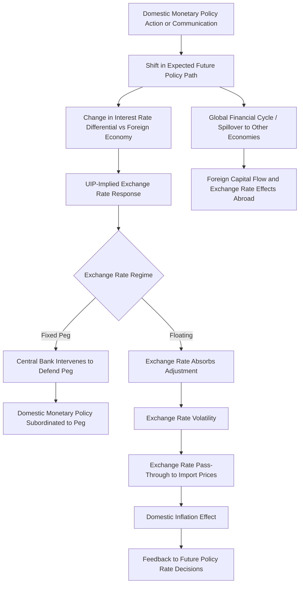

## Monetary Policy and Exchange Rate Volatility

### Theoretical Foundation: Interest Rate Parity

The primary theoretical channel linking monetary policy to exchange rate determination is **uncovered interest rate parity (UIP)**, which states that the expected return on domestic and foreign currency-denominated assets should be equalized once expected exchange rate changes are accounted for:

$$i_t - i_t^* = E_t[s_{t+1}] - s_t$$

where $i_t$ is the domestic nominal interest rate, $i_t^*$ is the foreign nominal interest rate, and $s_t$ is the log nominal exchange rate (domestic currency per unit of foreign currency). UIP implies that a currency with a higher interest rate is expected to *depreciate* over the holding period by an amount that exactly offsets the interest rate differential, so that expected returns are equalized across currencies in the absence of arbitrage.

**Key Points**

- Under UIP, a monetary policy tightening (raising $i_t$ relative to $i_t^*$) that is *not* accompanied by a change in the long-run expected exchange rate implies an immediate **appreciation** of the domestic currency, since $s_t$ must fall (appreciate) relative to the unchanged expected future value $E_t[s_{t+1}]$ to satisfy the parity condition given the now-higher interest differential—this is the standard textbook channel through which monetary policy affects the exchange rate: unexpected tightening relative to the rest of the world causes immediate currency appreciation, and unexpected easing causes immediate depreciation.
- The **UIP puzzle** (or "forward premium puzzle," Fama, 1984) is one of the most robust and extensively documented empirical anomalies in international finance: regressions of realized exchange rate changes on interest rate differentials frequently produce a coefficient with the *wrong sign* relative to the UIP prediction (a coefficient significantly less than 1, and often negative, rather than the value of 1 implied by UIP), implying that, empirically, high-interest-rate currencies have tended to *appreciate* further on average rather than depreciate as UIP would predict—a finding underlying the well-known "carry trade" strategy (borrowing in low-interest-rate currencies to invest in high-interest-rate currencies) that has historically generated positive average excess returns inconsistent with simple UIP.
- Proposed explanations for the UIP puzzle include time-varying risk premia (compensation for bearing currency risk that varies systematically with economic conditions, rather than the constant or zero risk premium assumed in the simplest UIP formulation), peso problems (small-sample bias from rare but large realized depreciation events not adequately represented in typical estimation samples), and departures from full rational expectations in exchange rate forecasting; no single explanation commands full consensus, and this remains an active area of international finance research. [Inference: the relative empirical support for competing explanations of the UIP puzzle is not fully settled and reflects an active area of ongoing research]

### Monetary Policy Divergence and Exchange Rate Volatility

**Key Points**

- Because exchange rates are forward-looking asset prices reflecting the *expected* future path of relative monetary policy (not merely the current interest rate differential, per the UIP relationship's dependence on $E_t[s_{t+1}]$, which itself depends on the entire expected future policy path in both economies), exchange rates are theoretically highly sensitive to *changes in expectations* about relative monetary policy trajectories—including changes driven by central bank communication, forward guidance, and data surprises that shift market expectations of the future policy path, not only by realized changes in the current policy rate itself.
- This sensitivity to shifting expectations is a primary reason exchange rates are empirically among the most volatile major asset prices, and why **monetary policy divergence** (situations where major central banks are expected to move their policy rates in different directions or at different speeds, e.g., one central bank tightening while another maintains or eases policy) has been repeatedly associated with periods of pronounced exchange rate volatility and large cumulative currency movements in specific bilateral exchange rates, as market participants continuously revise their expectations of the relative future policy paths.
- High-frequency identification methods (see High-frequency identification and event-study methods) are directly applicable to studying exchange rate responses to monetary policy surprises, since exchange rates, like other financial asset prices, respond essentially instantaneously to policy announcements, making narrow-window event-study regressions of exchange rate changes on policy surprises (both "target" and "path" factor surprises, per the Gürkaynak-Sack-Swanson decomposition) a standard empirical approach for measuring this specific transmission channel.

### Exchange Rate Regimes and Monetary Policy Autonomy

**Key Points**

- The **Mundell-Fleming "impossible trinity" (trilemma)** is the foundational theoretical framework for this topic: a country cannot simultaneously maintain (1) a fixed exchange rate, (2) free capital mobility, and (3) independent monetary policy; at most two of these three can be sustained simultaneously, with the choice among trilemma configurations directly determining the relationship between monetary policy and exchange rate volatility in a given country.
- Under a **fixed exchange rate regime** combined with open capital markets, domestic monetary policy is effectively subordinated to the exchange rate target (interest rates must be set to defend the peg rather than to address domestic macroeconomic objectives), meaning exchange rate volatility is by design minimized (absent a speculative attack forcing a regime change) but at the cost of forfeiting independent monetary policy as a domestic stabilization tool—a trade-off starkly illustrated by historical fixed-exchange-rate crisis episodes (e.g., the 1992 European Exchange Rate Mechanism crisis, where the UK and other countries were forced to abandon their pegs under speculative pressure).
- Under a **floating exchange rate regime**, monetary policy retains full domestic autonomy (interest rates can be set purely according to domestic objectives), but the exchange rate is left to absorb the resulting fluctuations in relative monetary conditions and shifting expectations, generally implying greater exchange rate volatility as the "shock absorber" for the trilemma's inherent tension, a trade-off central to the choice of exchange rate regime made by most emerging and advanced economies.
- **Managed float** and intermediate regimes (adjustable pegs, currency bands, "dirty floats" involving periodic but not systematic central bank intervention) represent attempts to partially retain elements of both exchange rate stability and monetary autonomy, generally at the cost of the regime's own credibility and sustainability being more fragile and more susceptible to speculative pressure than either polar case, a widely discussed theme in the international macroeconomics literature on exchange rate regime choice (sometimes summarized as the "bipolar view," holding that intermediate regimes are inherently less stable than either hard pegs or fully floating regimes, though this view has itself been contested). [Unverified: the degree of current consensus around the bipolar view specifically has evolved in the literature and should be checked against current international macroeconomics scholarship if precision on this specific debate is required]

### Spillovers and Global Monetary Policy Transmission

**Key Points**

- Monetary policy actions in large, financially central economies (particularly U.S. Federal Reserve policy, given the dollar's role as the dominant global reserve and invoicing currency) generate substantial **spillover effects** on exchange rates and financial conditions in other economies, a phenomenon extensively documented in the international finance literature and formalized in frameworks such as the "Global Financial Cycle" (Rey, 2013), which argues that U.S. monetary policy (and associated global risk appetite and capital flow conditions) exerts a common influence on financial conditions and exchange rates across many economies simultaneously, potentially constraining the effective monetary policy autonomy even of countries operating under nominally floating exchange rate regimes.
- This "Global Financial Cycle" argument represents a challenge to, or at minimum a significant qualification of, the standard Mundell-Fleming trilemma's presumption that floating exchange rates alone are sufficient to preserve full monetary policy autonomy under open capital markets: if global risk appetite and capital flows are driven substantially by a dominant center-economy's monetary policy regardless of a given country's own exchange rate regime choice, floating may not fully insulate domestic monetary conditions from foreign monetary policy shocks, an idea sometimes summarized as a shift from a "trilemma" to a "dilemma" (only two configurations genuinely available: open capital markets with policy subordinated to global conditions, or capital controls that restore fuller autonomy, with the exchange rate regime choice itself mattering less than the trilemma framework implies). [Inference: the degree to which the dilemma reframing fully supersedes, versus meaningfully qualifies, the traditional trilemma framework is a subject of ongoing debate in the international macroeconomics literature]
- Emerging market economies have been found to be particularly exposed to these spillover effects, given typically higher reliance on foreign-currency-denominated debt (creating direct balance sheet exposure to exchange rate depreciation, distinct from the aggregate demand and competitiveness channels operating in advanced economies with predominantly domestic-currency-denominated debt) and generally less deep and liquid domestic financial markets, amplifying the exchange rate and capital flow volatility associated with shifts in center-economy monetary policy.

### Exchange Rate Pass-Through to Domestic Inflation

**Key Points**

- **Exchange rate pass-through** refers to the degree to which exchange rate movements are reflected in domestic import and consumer prices, a parameter of direct relevance to monetary policy since it determines how much a given currency depreciation (whether resulting from domestic monetary easing or from external shocks) directly feeds into domestic inflation, complicating the central bank's inflation-stabilization task in economies with high pass-through.
- Empirical estimates of exchange rate pass-through have generally found substantially **incomplete** pass-through (a given percentage exchange rate change translates into a smaller percentage change in domestic prices) in most advanced economies, and have documented a general **decline in the degree of pass-through** over recent decades in many advanced economies, an empirical pattern often attributed to improved central bank credibility and better-anchored inflation expectations (limiting the degree to which firms adjust prices in response to what they expect to be a transitory exchange rate movement), though pass-through remains generally higher in emerging market economies and in economies with less well-anchored inflation expectations or greater reliance on imported inputs. [Unverified: specific current pass-through magnitude estimates vary by country, time period, and estimation methodology, and should be checked against current dedicated studies for precise figures]
- This pass-through channel provides an additional mechanism through which exchange rate volatility directly complicates monetary policy conduct, particularly in smaller open economies with substantial trade exposure, since exchange-rate-driven inflation volatility (from causes potentially unrelated to domestic demand conditions) must be distinguished from domestically-generated inflation pressures when setting policy, a real-time diagnostic challenge analogous to, though distinct from, the general output-gap and natural-rate measurement uncertainty discussed in relation to Phillips-curve-based policy frameworks.

### Foreign Exchange Intervention as a Complementary Tool

**Key Points**

- Beyond conventional interest-rate policy, some central banks (particularly in emerging markets and smaller open economies) employ direct **foreign exchange market intervention** (buying or selling foreign currency reserves) as a distinct tool for managing exchange rate volatility, either to smooth short-term volatility without necessarily targeting a specific exchange rate level, or to lean against what the authority judges to be excessive or disorderly currency movements.
- The effectiveness of sterilized intervention (intervention that offsets its effect on the domestic money supply via an accompanying open-market operation, so as to leave domestic monetary conditions unaffected while still influencing the exchange rate) has been a subject of extensive empirical debate, with evidence generally suggesting intervention can influence exchange rate volatility and, under some circumstances, the level of the exchange rate, but with effects that are frequently found to be more temporary and less reliable than conventional interest-rate policy's effects on domestic macroeconomic variables. [Inference: the specific channels through which sterilized intervention operates (portfolio-balance versus signaling channels) and their relative empirical importance remain subjects of ongoing research without full consensus]

### Diagram: Monetary Policy Transmission to Exchange Rate Volatility

### Applications in Monetary Economics

**Example**

The 2013 "Taper Tantrum" episode, in which market anticipation of a reduction in the pace of U.S. Federal Reserve asset purchases (following communication interpreted as signaling an earlier-than-expected withdrawal of accommodation) triggered a sharp, broad-based depreciation of several emerging market currencies and a rise in emerging market bond yields, is frequently cited as an illustration of both the high-frequency sensitivity of exchange rates to shifts in expected monetary policy trajectories (operating through the path-factor-type channel discussed above) and of the Global-Financial-Cycle-type spillover of center-economy monetary policy communication to exchange rate and financial conditions abroad, independent of any change in the affected countries' own domestic monetary policy stance.

**Key Points**

- Central banks in small open economies (e.g., inflation-targeting central banks in economies with substantial trade exposure) frequently incorporate the exchange rate explicitly into their policy analysis and communication, both because of its direct inflation pass-through relevance and because of its role in the broader monetary transmission mechanism (a depreciation, beyond its inflationary pass-through effect, also stimulates net exports and aggregate demand through the standard expenditure-switching channel), requiring these central banks to jointly consider the exchange rate's competing roles in transmission and inflation risk when calibrating policy.

### Limitations and Open Debates

**Key Points**

- The persistent and well-documented UIP puzzle means that even the foundational theoretical relationship between interest rate differentials and exchange rate movements does not hold reliably in the data at the frequencies and horizons relevant for typical policy analysis, a significant qualification to any confident real-time prediction of exchange rate responses to a given monetary policy action.
- The relative merits of the traditional trilemma versus the "dilemma"/Global-Financial-Cycle reframing of monetary policy autonomy under floating exchange rates remain actively debated, with direct implications for how much genuine monetary policy independence floating-exchange-rate emerging market economies in particular can expect to retain in an environment of open capital markets and a dominant global reserve currency.
- As with the other transmission relationships discussed in this material, empirical exchange rate relationships (pass-through magnitudes, UIP deviations, spillover magnitudes) describe historical regularities specific to particular samples, country groups, and monetary policy regimes, and their behavior may differ under different future circumstances, including potential shifts in the international monetary system's structure (e.g., changes in the dominant reserve currency's role) that could alter the specific transmission patterns documented in the existing literature.

**Next Steps**

- Identification of monetary policy shocks (methodology for exchange rate event studies)
- High-frequency identification and event-study methods (target/path factor decomposition applied to FX)
- The Mundell-Fleming trilemma and exchange rate regime choice
- The Global Financial Cycle and monetary policy spillovers
- Exchange rate pass-through estimation methodology
- Foreign exchange intervention: portfolio-balance and signaling channels
- Emerging market monetary policy and foreign-currency debt exposure