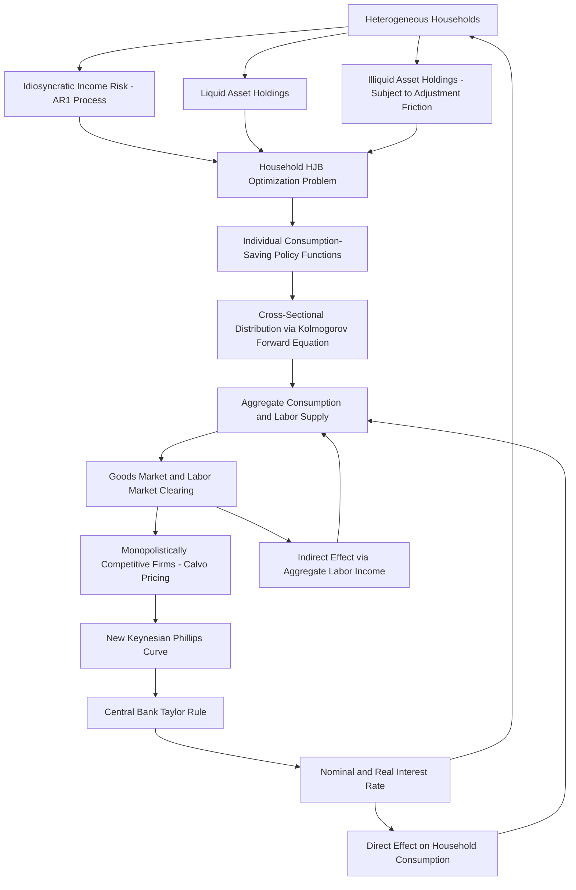

## Heterogeneous Agent New Keynesian Models

### Motivation: Beyond the Representative Agent

Standard New Keynesian DSGE models (see Bayesian estimation of DSGE models) rely on a **representative agent** assumption: all households are identical, face no uninsurable idiosyncratic risk, and effectively hold complete-markets access allowing full consumption smoothing. **Heterogeneous Agent New Keynesian (HANK)** models relax this assumption by embedding the standard New Keynesian nominal rigidity apparatus (Calvo pricing, monopolistic competition, a Taylor-type policy rule) within a framework of ex-ante identical but ex-post heterogeneous households facing uninsurable idiosyncratic income risk and incomplete asset markets, in the tradition of the Bewley-Huggett-Aiyagari incomplete-markets literature.

**Key Points**

- The representative-agent New Keynesian (RANK) framework implies, via the consumption Euler equation, that all households smooth consumption perfectly in response to income fluctuations by adjusting saving, meaning the direct, mechanical link between current income and current consumption emphasized in the traditional Keynesian consumption function is effectively absent for any individual household in the model.
- This assumption is strongly at odds with a substantial body of microeconomic evidence documenting that a significant fraction of households exhibit **hand-to-mouth** behavior—consuming close to their entire current income with little buffer-stock saving—a finding robustly documented across household survey and administrative microdata in many countries, and directly relevant to understanding the transmission of both monetary and fiscal policy, since the aggregate consumption response to a given income or policy shock depends heavily on what fraction of households behave this way.
- Kaplan, Moll, and Violante (2018) is the foundational reference formalizing the HANK framework, introducing the influential distinction between **"wealthy hand-to-mouth"** households (households holding substantial *illiquid* wealth, such as housing equity or retirement accounts, but little or no *liquid* wealth, and therefore behaving in a hand-to-mouth manner with respect to their liquid, spendable resources despite not being poor in a total-wealth sense) and **"poor hand-to-mouth"** households (holding little wealth of any kind), a distinction with direct empirical support and substantial implications for monetary transmission, since the two groups can respond very differently to policies operating through illiquid- versus liquid-asset channels.

### Model Structure

**Key Points**

- The household side of a HANK model embeds a standard incomplete-markets household problem: households face idiosyncratic, uninsurable earnings risk (typically modeled as a persistent stochastic process, e.g., an AR(1) or richer process in log earnings), can save in one or more asset types subject to a borrowing constraint, and choose consumption and saving to maximize expected discounted utility subject to their budget constraint—this is the standard Aiyagari (1994) incomplete-markets consumption-saving problem, embedded within an otherwise standard New Keynesian general equilibrium environment.
- The **two-asset HANK** variant (Kaplan, Moll, and Violante, 2018) distinguishes a **liquid asset** (e.g., a government bond or bank deposit, with a relatively low return but no adjustment friction) from an **illiquid asset** (e.g., capital or housing equity, offering a higher return but subject to a transaction cost or adjustment friction limiting the frequency or speed with which households can convert it to liquid resources)—this two-asset structure is specifically designed to generate the wealthy-hand-to-mouth phenomenon, since households can rationally choose to hold substantial illiquid wealth (for its higher return) while keeping little liquid buffer-stock saving, leaving them liquidity-constrained and consumption-sensitive to current income despite not being poor in a total-net-worth sense.
- The production and price-setting side of the model retains the standard New Keynesian apparatus largely unchanged from representative-agent models: monopolistically competitive firms set prices subject to Calvo-style nominal rigidity, generating a New Keynesian Phillips Curve relationship (see Monetary policy and unemployment dynamics for the NKPC derivation), and a central bank sets the nominal interest rate according to a Taylor-type rule responding to inflation and an output or activity gap.
- Because individual household consumption and saving decisions depend on the entire distribution of household wealth and income (not merely aggregate averages, since the marginal propensity to consume varies systematically across the wealth distribution given the borrowing constraint and buffer-stock saving motives), the model's aggregate dynamics require solving for, and tracking the evolution of, the full cross-sectional distribution of household states—a substantially more computationally demanding problem than the representative-agent case, where a single "typical" household's decision rule suffices.

### Computational Methods

**Key Points**

- HANK models are typically solved using continuous-time methods and the associated **Hamilton-Jacobi-Bellman (HJB)** equation for the household's optimal consumption-saving policy, combined with a **Kolmogorov Forward Equation (KFE)** describing the evolution of the cross-sectional distribution of household wealth and income states over time—continuous-time formulation is often preferred in this literature (following Achdou, Han, Lasry, Lions, and Moll, 2022) because it substantially simplifies the numerical treatment of the borrowing constraint (avoiding certain discretization complications that arise in discrete-time incomplete-markets models near the constraint) and because efficient finite-difference numerical methods exist for solving the resulting coupled HJB-KFE system.
- Aggregate dynamics (the response of aggregate variables to an unanticipated, one-time monetary policy shock) are computed via a **sequence-space** solution method (Auclert, Bardóczy, Rognlie, and Straub, 2021, developing the widely used "Sequence-Space Jacobian" method), which computes the full general equilibrium impulse response of the model to a shock by directly characterizing how each aggregate variable's entire time path responds to a shock in each other aggregate variable's entire time path, without requiring the more traditional state-space/perturbation-based solution methods used for representative-agent DSGE models (which are considerably more difficult to apply directly given the very high dimensionality of the household wealth-and-income distribution as a "state variable" for the aggregate model).
- This method has substantially reduced the computational burden of solving and estimating HANK-class models relative to earlier heterogeneous-agent New Keynesian implementations, contributing to a rapid expansion of applied HANK research and central bank research department adoption of these methods following the publication of accessible, standardized solution toolkits. [Unverified: the specific current state of software toolkit availability and standardization should be checked against current published resources, given the active and ongoing development of this computational literature]

### Key Findings: Monetary Transmission Channels

#### The Direct versus Indirect Effects Decomposition

**Key Points**

- Kaplan, Moll, and Violante (2018) decompose the aggregate consumption response to a monetary policy shock into a **direct effect** (the response of consumption to the interest rate change holding aggregate labor income fixed, capturing standard intertemporal substitution and income effects operating through the household's own asset holdings and the interest rate they face) and an **indirect effect** (the response of consumption arising from the general equilibrium change in aggregate labor income and wages induced by the monetary policy shock's effect on aggregate output and employment).
- Their central and widely cited finding is that the **indirect effect dominates** the aggregate consumption response in their calibrated HANK model—the majority of the aggregate consumption response to a monetary policy shock operates through the general equilibrium change in labor income (which directly affects hand-to-mouth and near-hand-to-mouth households' consumption, given their high marginal propensity to consume out of current income) rather than through the direct intertemporal-substitution channel emphasized in representative-agent New Keynesian models, in which the entire transmission mechanism operates through the direct effect by construction (since a representative agent's income response and consumption response operate through a single, complete-markets-implied Euler equation).
- This finding has substantial implications for how monetary policy is understood to "work": it suggests the primary channel of monetary transmission to aggregate consumption is not primarily via households directly and individually responding to the interest rate (as emphasized in textbook representative-agent expositions), but rather via the interest rate's effect on aggregate demand, output, and labor income, which is then transmitted to consumption disproportionately through liquidity-constrained households with high marginal propensities to consume. [Inference: the precise quantitative decomposition between direct and indirect effects is sensitive to model calibration (particularly the calibrated share of hand-to-mouth households and the specific asset market structure assumed) and should not be treated as a single universally agreed numerical split]

#### Marginal Propensity to Consume (MPC) Heterogeneity

**Key Points**

- A central calibration target and validation exercise for HANK models is matching the empirically documented distribution of household marginal propensities to consume (MPCs) out of transitory income shocks, which micro-empirical studies (e.g., analyses of household responses to fiscal stimulus payments and tax rebates) have found to be substantially higher on average, and considerably more heterogeneous across the wealth distribution, than the very low, near-uniform MPCs implied by a representative-agent, complete-markets consumption-smoothing framework.
- Successfully matching this empirical MPC distribution is viewed as an important internal consistency check for HANK models, since a model that fails to replicate the well-documented degree and heterogeneity of MPCs would be poorly suited to speaking credibly to the income-composition-based transmission channels the framework is specifically designed to capture (directly connecting to the Income Composition Channel discussed under Monetary policy and income and wealth inequality).

### Fiscal-Monetary Interactions in HANK

**Key Points**

- Because HANK models feature a substantial share of consumption-constrained households with high MPCs, they generate systematically **larger fiscal multipliers** for government spending and transfer policies than representative-agent models, since transfers to liquidity-constrained households are consumed at a much higher rate than transfers to unconstrained households (who would largely save an equivalent transfer under complete-markets consumption smoothing), an important application of the HANK framework to the broader question of fiscal-monetary policy interaction and the relative effectiveness of fiscal versus monetary countercyclical policy tools, particularly at the zero lower bound where conventional monetary policy space is constrained.
- HANK models have also been used to reexamine the transmission of **forward guidance**, with some HANK-class results suggesting a resolution to the "forward guidance puzzle" documented in representative-agent New Keynesian models (the puzzling implication of standard RANK models that announcements of future interest rate changes have implausibly large effects on current consumption and output, growing without bound the further in the future the announced change occurs)—the presence of hand-to-mouth households in HANK models, who do not respond to future interest rate changes via direct intertemporal substitution (since they have no relevant liquid saving margin to adjust), can substantially dampen this implausible amplification relative to the RANK benchmark. [Inference: whether HANK models fully or only partially resolve the forward guidance puzzle, and the specific mechanism's relative contribution compared to other proposed resolutions (e.g., models featuring bounded rationality or incomplete common knowledge), remains a subject of ongoing research and is not fully settled]

### Diagram: HANK Model Structure

### Empirical Validation and Estimation

**Key Points**

- Unlike representative-agent DSGE models, which are commonly estimated via full-information Bayesian likelihood methods (see Bayesian estimation of DSGE models) using aggregate time series alone, HANK model calibration and validation typically relies heavily on **matching microdata moments** (the empirical distribution of household wealth, the empirical distribution of MPCs, the empirical share of hand-to-mouth households) in addition to, or sometimes instead of, matching aggregate time-series dynamics, reflecting the model's explicit design purpose of jointly speaking to both aggregate and distributional/cross-sectional empirical evidence.
- Full likelihood-based Bayesian estimation of HANK models using aggregate time series, analogous to standard DSGE estimation, remains computationally demanding given the high dimensionality of the underlying heterogeneous-agent state space, though the sequence-space Jacobian methods discussed above have made such estimation increasingly tractable and are an active area of ongoing methodological development. [Unverified: the current state of the art regarding full likelihood-based HANK estimation feasibility and its degree of adoption in applied and central bank research should be checked against current publications, given the pace of development in this computational sub-literature]

### Applications and Extensions

**Key Points**

- HANK frameworks have been extended to incorporate firm heterogeneity (heterogeneous-firm New Keynesian models, analyzing firm-level investment and pricing responses to monetary policy alongside household heterogeneity), housing market heterogeneity (directly modeling mortgagor versus outright-owner versus renter household types, connecting to the housing-channel distributional evidence discussed under Monetary policy and income and wealth inequality), and open-economy extensions examining exchange rate and international transmission with heterogeneous households.
- The framework has become an increasingly standard tool in central bank research departments for jointly analyzing the aggregate and distributional consequences of both monetary and fiscal policy, reflecting the broader post-2008 shift toward heterogeneous-agent modeling noted in the discussion of monetary policy and inequality. [Unverified: the specific degree and pattern of HANK model adoption for operational (as opposed to research) policy analysis varies by institution and should be checked against current institutional practice]

### Limitations

**Key Points**

- HANK models, despite their substantially richer household-side heterogeneity relative to RANK models, generally retain many of the same simplifying assumptions on the production and price-setting side (representative or homogeneous firms, standard Calvo pricing) as representative-agent New Keynesian models, meaning they do not by themselves address separate critiques of the standard New Keynesian production-side apparatus (e.g., concerns about the empirical adequacy of the Calvo pricing mechanism itself, discussed under the New Keynesian Phillips Curve).
- The computational demands of solving and especially of formally estimating HANK models remain substantially greater than for representative-agent DSGE models, which has practical implications for the speed and scope with which such models can currently be deployed for the type of rapid, iterative policy scenario analysis that representative-agent models support more readily. [Inference: the practical magnitude of this computational gap has been narrowing given the sequence-space Jacobian and related methodological developments, though it has not been eliminated as of the most recent developments reflected in the available literature]
- As with representative-agent DSGE models, HANK model conclusions remain conditional on the correctness of the specific structural assumptions embedded in the model (the specific income process, asset market structure, and adjustment friction assumptions chosen), and the model's relatively recent development relative to the decades-long representative-agent DSGE tradition means the profession's collective experience validating and stress-testing HANK models against a wide range of historical episodes and alternative specifications is comparatively more limited. [Speculation: the degree to which HANK-specific findings, such as the direct-versus-indirect effect decomposition, will prove robust across the broader range of specifications and applications that the representative-agent tradition has already been subjected to is not yet resolved by the currently available body of evidence]

**Next Steps**

- Bayesian estimation of DSGE models (representative-agent baseline for comparison)
- Monetary policy and income and wealth inequality (empirical motivation and channel overlap)
- Monetary policy and unemployment dynamics (New Keynesian Phillips Curve foundations)
- Sequence-space Jacobian methods and computational solution techniques
- Fiscal multipliers and fiscal-monetary policy interaction
- The forward guidance puzzle and proposed resolutions
- Heterogeneous-firm extensions to New Keynesian models