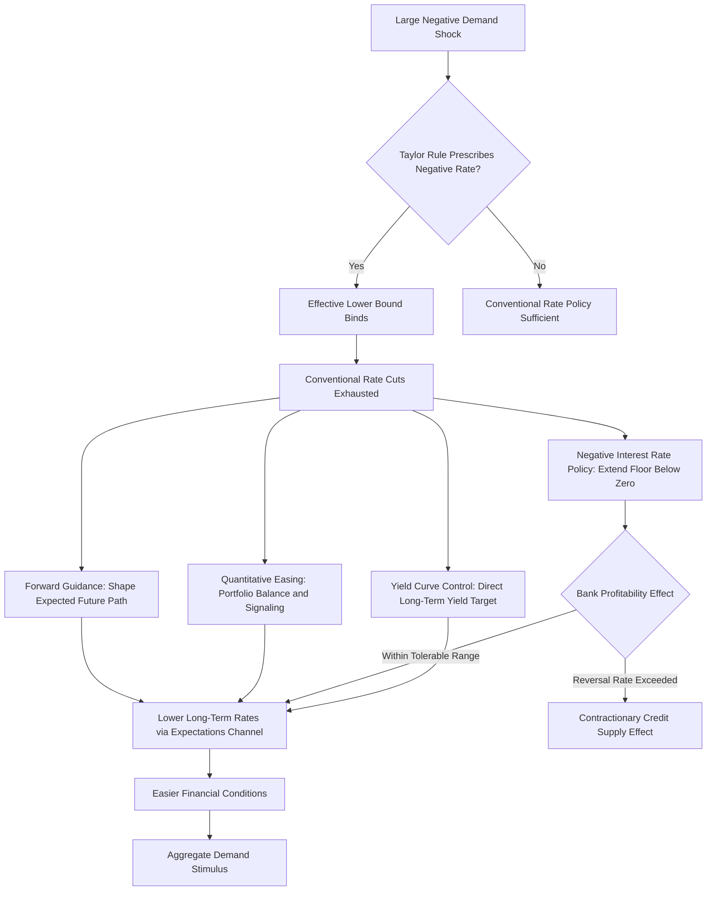

## Monetary Policy at the Effective Lower Bound

### The Zero/Effective Lower Bound Constraint

The **zero lower bound (ZLB)**, more precisely termed the **effective lower bound (ELB)** in recent literature, refers to the practical constraint that the nominal short-term policy interest rate cannot be reduced substantially below zero, since economic agents retain the option of holding physical currency (which pays a zero nominal return but avoids a negative one), placing an approximate floor on how negative deposit and short-term market rates can practically become before triggering large-scale currency hoarding.

**Key Points**

- The terminological shift from "zero" to "effective" lower bound reflects the empirical experience of several central banks (the European Central Bank, the Swiss National Bank, the Bank of Japan, and Sveriges Riksbank, among others) successfully implementing modestly *negative* policy rates in the 2010s, demonstrating that the true practical floor lies somewhat below exactly zero, though how far below zero rates can be pushed before triggering significant currency substitution or other disruptive effects (e.g., adverse effects on bank profitability, discussed below) remains empirically constrained and is generally understood to be a comparatively modest negative range rather than an arbitrarily large one. [Unverified: the specific effective floor varies by financial system structure, and precise current estimates of how far negative rates can practically go should be checked against current central bank experience and research]
- The constraint binds because standard monetary policy transmission operates by adjusting the short-term nominal rate to influence the real interest rate (given inflation expectations) and thereby aggregate demand; once the nominal rate reaches its effective floor, conventional interest-rate policy loses its primary instrument for further easing even if the central bank's assessment of appropriate policy would otherwise call for additional accommodation (e.g., because a **Taylor rule**, evaluated given prevailing inflation and output conditions, would prescribe a negative nominal rate).
- The ELB became a first-order practical concern for monetary policy following the 2008 global financial crisis, when major central banks (the Federal Reserve, the Bank of England, subsequently the ECB and Bank of Japan even more extensively) reduced policy rates to near zero and found conventional rate cuts exhausted well before the assessed degree of needed monetary accommodation was achieved, motivating the subsequent development and large-scale deployment of the unconventional policy tools discussed below.

### Why the ELB Matters: Amplified Recession Risk

**Key Points**

- Standard New Keynesian models predict that, once a negative demand shock is large enough to push the policy rate to its lower bound, the economy loses the conventional monetary stabilization mechanism precisely when it may be most needed, implying deeper and more prolonged output and employment declines than would occur absent the constraint, since the central bank cannot deliver the full degree of accommodation a standard Taylor rule would otherwise prescribe.
- The ELB additionally interacts with expectations in a way that can amplify contractionary dynamics: in New Keynesian models, expectations of future deflation (or persistently low inflation) *raise* the real interest rate at the ELB even while the nominal rate is fixed at its floor (via the Fisher relationship, $r_t = i_t - E_t[\pi_{t+1}]$), potentially generating a self-reinforcing dynamic sometimes termed a **deflationary spiral** or, in New Keynesian model simulations under certain calibrations, contributing to multiple-equilibria or indeterminacy concerns in some theoretical treatments of the ELB. [Inference: the practical empirical relevance and severity of such amplification mechanisms, as opposed to their presence as a theoretical possibility in stylized models, is debated and depends on model specification and calibration]
- Extended ELB episodes (Japan since the late 1990s, the U.S. and eurozone for substantial periods following 2008) have generated a large applied and theoretical literature specifically examining "secular stagnation" hypotheses (Summers, 2014, reviving concepts originally proposed by Hansen, 1939)—the possibility that structural factors (demographic aging, elevated desired saving, reduced investment demand, or slower trend productivity growth) have durably lowered the **natural rate of interest** ($r^*$, the real interest rate consistent with output at potential and stable inflation) to levels making ELB episodes a more frequent and persistent feature of the monetary policy landscape than in earlier historical experience. [Unverified: the specific current assessed level of $r^*$ in major economies is subject to ongoing estimation and revision and should be checked against current central bank and academic estimates]

### Unconventional Monetary Policy Tools

#### Forward Guidance

**Key Points**

- **Forward guidance** involves the central bank communicating explicit information about the likely future path of policy (e.g., committing to keep the policy rate at its lower bound for an extended, specified period, or conditioning future rate increases on specific economic thresholds being met) as a substitute for the now-unavailable further reduction in the *current* policy rate, operating by influencing the expected future path of short rates, and hence longer-term interest rates (via the expectations hypothesis of the term structure) and current financial conditions, even while the current short rate remains fixed at its floor.
- Standard New Keynesian theory (per the analysis underlying the forward guidance puzzle discussed under Heterogeneous agent New Keynesian models) predicts forward guidance can be a powerful tool precisely because expectations of future policy directly affect current consumption and investment decisions via forward-looking Euler equations, but this same theoretical mechanism generates the well-documented "forward guidance puzzle" (implausibly large and ever-growing effects of guidance about further-distant future rate changes in standard representative-agent models), a concern motivating substantial theoretical work (including the HANK-based resolution discussed previously, as well as alternative resolutions invoking bounded rationality, incomplete information, or discounting in Euler equations) aimed at reconciling the theoretical amplification with more empirically plausible estimated magnitudes.
- Forward guidance is typically categorized as either **Odyssean** (a genuine policy commitment, potentially binding the central bank to a course of action it might not otherwise choose ex post, analogous to Odysseus binding himself to the mast, intended to enhance credibility and thus effectiveness) or **Delphic** (merely an informative forecast or communication of the central bank's own expectation of future conditions and its likely policy response, without any binding commitment)—this distinction matters because Delphic guidance, by revealing central bank information about the economic outlook, is subject to the same "information effect" concern discussed under High-frequency identification and event-study methods, whereas Odyssean guidance's effectiveness depends more directly on the credibility of the stated commitment.

#### Large-Scale Asset Purchases (Quantitative Easing)

**Key Points**

- **Quantitative easing (QE)** involves central bank purchases of longer-term government bonds (and, in some programs, private-sector assets such as mortgage-backed securities or corporate bonds) financed by the creation of central bank reserves, intended to directly influence longer-term interest rates and broader financial conditions even when the short-term policy rate is constrained at its lower bound.
- The primary theoretically proposed transmission channels are: (1) the **portfolio balance channel** (Tobin, 1969-tradition), whereby central bank purchases of long-duration bonds reduce the outstanding supply of duration risk available to private investors, compressing the term premium and thus longer-term yields, particularly relevant if investors do not view short- and long-term bonds as perfect substitutes (a departure from the strict expectations hypothesis of the term structure); and (2) the **signaling channel**, whereby QE announcements themselves convey information about the central bank's future policy intentions (functioning similarly to a form of forward guidance), reinforcing market expectations that short rates will remain low for an extended period.
- Extensive event-study evidence (using the high-frequency identification methods discussed earlier, applied to QE announcement dates) has generally found statistically significant reductions in longer-term government bond yields around major QE announcements in the U.S., UK, and eurozone programs, though disentangling the relative quantitative contribution of the portfolio-balance versus signaling channels, and assessing the degree to which announcement-window yield effects persist and translate into durable macroeconomic stimulus (as opposed to being partially reversed or offset by other factors), remains an active area of empirical research without full consensus. [Inference: while the qualitative direction of the yield effect is relatively well established in the event-study literature, the precise decomposition and persistence of effects varies across studies, programs, and countries]

#### Negative Interest Rate Policy (NIRP)

**Key Points**

- Several central banks (notably the ECB, Bank of Japan, Swiss National Bank, Danmarks Nationalbank, and Sveriges Riksbank) implemented modestly negative policy rates during the 2010s, typically applied to a portion of bank reserves held at the central bank, intended to push the effective ELB constraint modestly below exactly zero and to provide additional easing beyond what a strict zero floor would allow.
- A key concern specific to NIRP is its potential effect on **bank profitability and the transmission of policy through the banking sector**: because banks are generally reluctant to pass negative rates through to retail depositors (fearing large-scale cash withdrawal in response, given depositors' currency-holding alternative), negative policy rates can compress bank net interest margins (banks pay negative rates on reserves but cannot symmetrically charge negative rates on retail deposits), potentially weakening bank capital and lending capacity in a manner that could, beyond some threshold, work at cross-purposes with the intended easing effect on credit supply—a concern sometimes framed as the possibility of a "reversal rate" (Brunnermeier and Koby, 2018) below which further rate cuts become contractionary rather than expansionary for aggregate credit and demand, due to this bank-profitability channel dominating the conventional transmission mechanism. [Inference: the existence, magnitude, and empirical relevance of a reversal rate specifically is a theoretically motivated concept with mixed and evolving empirical support, and remains a subject of ongoing research rather than a settled empirical finding]

#### Yield Curve Control

**Key Points**

- **Yield curve control (YCC)**, most notably implemented by the Bank of Japan beginning in 2016 (and used by the Reserve Bank of Australia for a period during the COVID-19 pandemic before its discontinuation), involves the central bank committing to purchase whatever quantity of a specific-maturity government bond is necessary to maintain its yield at or near a targeted level, rather than announcing a fixed *quantity* of asset purchases (as under standard QE) and allowing the resulting yield effect to be market-determined.
- The theoretical rationale is that a credible yield target can, in principle, achieve the desired suppression of longer-term yields with a potentially smaller central bank balance sheet expansion than an open-ended quantity-based QE program, since a sufically credible commitment may reduce the actual quantity of bonds the central bank needs to purchase to defend the target (analogous to the general principle that a fully credible exchange-rate peg, discussed under Monetary policy and exchange rate volatility, may require less active intervention than an initially less credible one). [Unverified: the specific quantitative balance-sheet implications of YCC relative to standard QE depend on the specific program's credibility and market conditions and have varied across the specific implementing episodes]
- The Bank of Japan's extended experience with YCC, including periodic adjustments to the targeted yield band and eventual policy normalization steps, provides the most extensive real-world evidence on this tool's operational challenges and effectiveness, though the broader applicability and effectiveness of YCC in other monetary and financial contexts remains less thoroughly tested by comparable long-run experience. [Unverified: the Bank of Japan's YCC framework has been subject to periodic modification and eventual adjustment as part of broader monetary policy normalization steps, and its precise current status should be checked against current Bank of Japan policy statements given the pace of change in this specific policy area]

### Comparative Summary of ELB Tools

| Tool | Primary Mechanism | Key Vulnerability |
| --- | --- | --- |
| Forward Guidance | Shapes expected future policy path | Forward guidance puzzle; credibility/time-inconsistency of Odyssean commitments |
| Quantitative Easing | Portfolio-balance and signaling effects on long-term yields | Uncertain persistence of effects; balance sheet exit/normalization challenges |
| Negative Interest Rate Policy | Extends effective floor modestly below zero | Bank profitability compression; possible "reversal rate" |
| Yield Curve Control | Direct commitment to a targeted long-term yield | Balance-sheet cost if credibility is imperfect; exit/adjustment challenges |

### Diagram: ELB Constraint and Policy Response

### Empirical Evidence on Effectiveness

**Key Points**

- The overall body of empirical evidence assembled since 2008 generally supports the conclusion that unconventional monetary policy tools (particularly QE and forward guidance) have had statistically identifiable easing effects on financial conditions and, with somewhat greater estimation uncertainty, on macroeconomic outcomes (output and inflation), though most studies find these effects to be **smaller in magnitude, and subject to greater estimation uncertainty**, than the effects typically estimated for conventional interest-rate policy of a comparable notional size (e.g., a given basis-point-equivalent easing achieved via QE is frequently estimated to have smaller macroeconomic effects than an equivalent conventional rate cut, though quantifying the appropriate "equivalent" comparison itself involves substantial methodological judgment). [Unverified: precise current-consensus magnitude comparisons vary substantially across studies, countries, and specific programs, and should be checked against recent dedicated meta-analyses or literature reviews for current quantitative summaries]
- Cross-country comparison of ELB experiences (the U.S. and UK's earlier and comparatively more decisive exit from near-zero rates following 2008 relative to Japan's multi-decade ELB experience and the eurozone's comparatively prolonged post-2008 and post-eurozone-crisis ELB period) has been used to examine whether specific institutional, structural, or policy-design factors (the scale and speed of QE deployment, fiscal policy coordination, financial sector health at the onset of the ELB episode) help account for the differing durations and apparent effectiveness of ELB-era policy across these experiences, though isolating specific causal factors from this necessarily small number of distinct historical episodes is an inherently data-limited exercise. [Speculation: given the small number of genuinely distinct historical ELB episodes available for comparison, confident causal attribution of cross-country differences in ELB outcomes to specific policy design choices, as opposed to other concurrent structural or historical differences, is not well supported by the available evidence]

### Recent Developments: Flexible Average Inflation Targeting

**Key Points**

- Partly motivated by ELB-related concerns (specifically, the risk that a standard inflation-targeting framework, by aiming for a fixed inflation target going forward regardless of past misses, may generate insufficiently accommodative policy expectations following a period of below-target inflation commonly associated with ELB episodes), some central banks have adopted **flexible average inflation targeting (FAIT)** or related "make-up" strategies, committing to allow inflation to run moderately above target for a period following a period of below-target inflation, so as to achieve average inflation at target over time.
- The theoretical rationale connects directly to the forward guidance literature: a credible make-up strategy is intended to raise expected future inflation (and hence lower expected future real rates) during and following an ELB episode, providing additional stimulus through the expectations channel without requiring the nominal rate itself to move below its effective floor, functioning as a specific, rules-based form of history-dependent forward guidance. [Unverified: the specific current operational status and any subsequent reviews or modifications of such frameworks at specific central banks should be checked against current policy framework documentation, as these frameworks are subject to periodic strategic review]

### Limitations and Open Debates

**Key Points**

- The overall quantitative effectiveness of the various unconventional tools, both individually and combined, remains less precisely established than the effectiveness of conventional interest-rate policy away from the ELB, given the comparatively limited historical sample of ELB episodes available for empirical estimation and the substantial identification challenges (many unconventional policy actions were taken during unusually turbulent financial and macroeconomic conditions, complicating clean identification of the policy's specific causal contribution relative to other concurrent developments).
- Central bank balance sheet expansion associated with large-scale QE programs raises separate normalization and exit-strategy considerations (the pace and market impact of eventual balance sheet reduction, or "quantitative tightening") that are themselves an active area of policy design and research, with implications for financial market functioning distinct from the initial easing-phase considerations discussed above.
- As with the broader natural-rate and secular-stagnation discussion, whether ELB episodes will become a more frequent and persistent feature of the monetary policy landscape going forward (due to a durably lower natural rate of interest) or will prove to be a comparatively unusual feature specific to the 2008-era and subsequent historical circumstances remains genuinely uncertain and is not resolved by currently available evidence. [Speculation: the future frequency and persistence of ELB episodes depends on the future evolution of the natural rate of interest and other structural factors that are inherently difficult to forecast with confidence, and this question is not resolved by currently available evidence]

**Next Steps**

- Heterogeneous agent New Keynesian models (forward guidance puzzle resolution)
- Monetary policy and long-run economic growth (natural rate of interest and secular stagnation)
- Identification of monetary policy shocks (applied to unconventional policy announcements)
- High-frequency identification and event-study methods (QE and yield curve control event studies)
- Central bank balance sheet normalization and quantitative tightening
- Flexible average inflation targeting frameworks
- Cross-country comparison of effective lower bound policy experiences