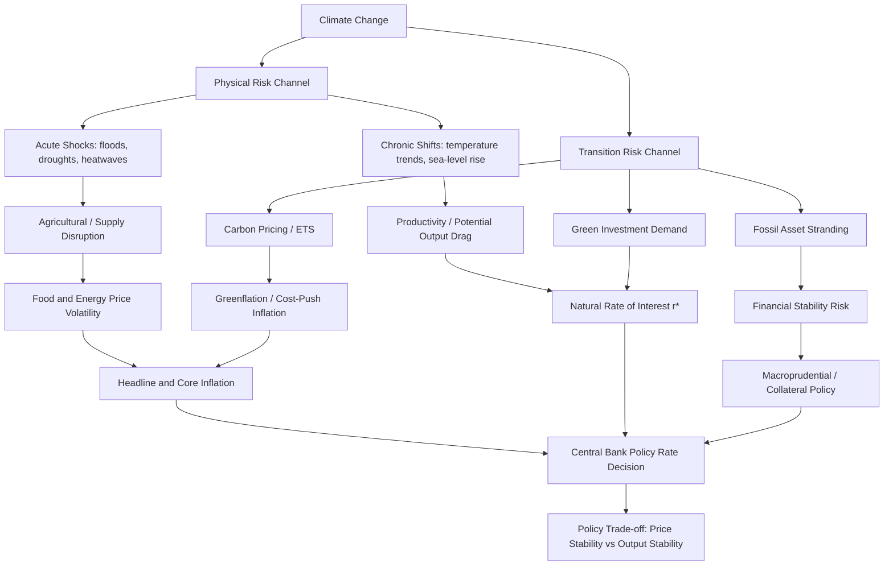

## Climate change and monetary policy

### Overview

Climate change has become a core research and policy frontier in monetary economics because it introduces new sources of macroeconomic shocks, alters the structural relationships central banks rely on (Phillips curve, natural rate of interest, output gap), and raises questions about whether and how monetary authorities should incorporate climate considerations into their mandates, models, and operations. The field sits at the intersection of macroeconomics, environmental economics, and financial stability analysis, and has moved rapidly from a niche topic to mainstream central bank research since the mid-2010s.

Two broad transmission channels are typically distinguished:

- **Physical risk**: damage from climate change itself — acute events (floods, hurricanes, heatwaves, droughts) and chronic shifts (sea-level rise, temperature trends) that disrupt production, destroy capital, and shift relative prices.
- **Transition risk**: the economic effects of the policies, technologies, and behavioral shifts required to decarbonize — carbon pricing, stranded fossil-fuel assets, green investment reallocation, and shifts in energy costs.

Both channels can generate inflationary and output effects that differ from conventional demand or supply shocks in persistence, predictability, and policy tractability, which is why they have generated a distinct research literature.

### Why Climate Change Matters for Monetary Policy

**Key Points**

- Climate change affects the two variables central banks are mandated to stabilize — inflation and output (and, for dual-mandate banks, employment) — through channels outside the direct control of monetary policy.
- It can alter the *natural rate of interest* ($r^*$), the *slope and stability of the Phillips curve*, and the *variance of supply shocks*, all of which are structural inputs to standard monetary policy frameworks (Taylor rules, DSGE-based forecasting, output-gap estimation).
- Unlike typical demand shocks, climate shocks are frequently **supply-side, asymmetric, and increasingly persistent**, which complicates the standard central bank response of "looking through" transitory shocks.

Formally, in a New Keynesian framework, climate change can be represented as adding a stochastic wedge to the supply side. A simplified augmented Phillips curve might be written as:

$$\pi_t = \beta E_t[\pi_{t+1}] + \kappa x_t + \gamma c_t + u_t$$

where $\pi_t$ is inflation, $x_t$ is the output gap, $c_t$ is a climate-related cost-push term (e.g., carbon price pass-through or climate-driven food/energy price shocks), and $u_t$ is a residual disturbance. The coefficient $\gamma$ captures the sensitivity of inflation to climate factors, and empirical estimation of $\gamma$ is itself an active area of research [Inference: the specific functional form varies substantially across papers and central bank models; this is a stylized representation, not a single canonical equation used uniformly across the literature].

### Physical Risk Channel

**Key Points**

- Acute physical shocks (droughts, floods, heatwaves, storms) damage capital stock, disrupt agricultural output, and can create localized but increasingly synchronized supply shortages.
- Chronic physical changes (rising average temperatures, sea-level rise, shifting precipitation patterns) act more like slow-moving supply-side drags on potential output and productivity.
- The primary monetary-relevant transmission is through **food and energy price volatility**, which feeds into headline inflation and can de-anchor inflation expectations if persistent.

Recent empirical work using long-run historical datasets has examined how temperature shocks specifically affect the macroeconomy through a lens directly relevant to monetary policymakers. Research covering multiple European countries over roughly a century finds that summer temperature anomalies function as identifiable shocks that can be analyzed within conventional monetary frameworks, asking whether they behave as supply shocks or demand shocks and how central banks historically responded to them. Central bankers have expressed concern over whether the increased frequency and amplitude of climate shocks create new trade-offs for monetary policy, and the literature notes that the demand for research into climate change related trade-offs is met only partially by academic supply, reflecting the field's youth relative to its policy urgency. [CEPR](https://cepr.org/voxeu/columns/climate-change-central-banks-and-monetary-policy-trade-offs)[CEPR](https://cepr.org/voxeu/columns/climate-change-central-banks-and-monetary-policy-trade-offs)

Central banks have also identified concrete transmission mechanisms into financing conditions. For example, research on the bank lending channel finds that climate factors do not only add background macro variation — they also change how firms and households experience monetary policy itself, and banks with greater transition-risk exposure face measurably higher borrowing costs in interbank markets, particularly during periods of financial stress banks with higher exposure to transition risk face elevated borrowing costs in interbank repo markets, a premium that intensifies during periods of financial stress. [European Central Bank](https://www.ecb.europa.eu/press/key/date/2026/html/ecb.sp260505_1~2e47b4c747.en.html)

**Example**

A simplified illustration of the physical-risk transmission chain:

1. A severe drought reduces wheat and corn yields in a major exporting region.
2. Global agricultural commodity prices rise sharply (a negative supply shock).
3. Food price inflation rises in import-dependent economies.
4. If the central bank has a strict inflation target and the shock is perceived as persistent (due to recurring climate events), it may need to tighten policy despite weak underlying demand — a **stagflationary trade-off**.
5. If instead the shock is treated as transitory ("looked through"), inflation expectations may still drift upward if climate shocks recur frequently enough that households and firms begin to expect them.

### Transition Risk Channel

**Key Points**

- Transition risk arises from policies and structural shifts needed to reach net-zero emissions: carbon taxes, emissions trading schemes, phase-out of fossil fuel subsidies, and reallocation of capital toward green technology.
- These can be inflationary in the short-to-medium run ("**greenflation**") even though the long-run goal is to reduce climate damage.
- Transition risk also creates **financial stability risk** through potential stranding of fossil-fuel-related assets held by banks, insurers, and pension funds.

The European Central Bank's ongoing macroeconomic assessment work illustrates how central banks now formally track transition-related policy in their projection exercises. Since 2022, the effects of climate policy measures in the near-term and medium-term are regularly assessed in the context of the ECB macroeconomic projections exercises, with the most recent assessment based on the models and data maintained by the national central banks – point[ing] to relatively small effects on growth and inflation over 2026-2028 from changes in nationally-implemented green discretionary fiscal policy measures. Carbon pricing mechanisms are incorporated directly into forecasting: as regards the existing EU Emissions Trading Scheme (EU ETS1), assumptions on its prices are included in the information set underpinning the staff projections, with effects materializing indirectly by raising production costs, particularly in the electricity sector. [Climate change and monetary policy - European Central Bank +3](https://www.ecb.europa.eu/press/key/date/2026/html/ecb.sp260505_1~2e47b4c747.en.html)

**"Greenflation" — the core transition-risk concept**

Greenflation describes inflationary pressure arising specifically from the low-carbon transition: rising demand for transition metals (lithium, copper, cobalt), carbon price pass-through into energy and industrial goods prices, and temporary capacity constraints as green infrastructure is built out faster than supply chains can accommodate. It is distinct from "flexflation" (temporary energy price spikes from fossil fuel disruptions) though the two can compound each other during an incomplete transition.

### Theoretical Modeling Approaches

**Environmental DSGE (E-DSGE) Models**

A growing strand of research extends standard New Keynesian DSGE models to include climate and environmental policy variables explicitly, enabling formal analysis of how monetary and climate policy interact. One influential theoretical framework introduces a **"climate-augmented" monetary policy rule**, embedding an environmental policy variable directly into an extended DSGE structure. This research theoretically investigates the mix of monetary and climate policy and provides insights for central banks who are considering their engagement in the climate change issue, with the "climate-augmented" monetary policy...pioneeringly proposed and studied via an extended Environmental Dynamic Stochastic General Equilibrium (E-DSGE) model. A central finding of this strand is that the making process of monetary policy should consider the existing climate policy since it is a factor that can influence price level and inflation. [Engaging central banks in climate change? The mix of monetary and climate policy - ScienceDirect +3](https://www.sciencedirect.com/science/article/abs/pii/S0140988321004096)

This literature traces back to earlier qualitative work connecting monetary policy and climate change mechanisms, including contributions including Haavio (2010), Campiglio (2016), Ma (2017), Bolton et al. (2020) and Svartzman et al. (2020), which have qualitatively explained the linking mechanism between monetary policy and climate change. Subsequent work has emphasized policy coordination: the mix of macroeconomic and financial policies for climate change mitigation needs further investigation, while other researchers argue that central banks should anticipate and respond to inflation increases stemming from climate-related shocks rather than treating them purely as exogenous noise. [Engaging central banks in climate change? The mix of monetary and climate policy - ScienceDirect +3](https://www.sciencedirect.com/science/article/abs/pii/S0140988321004096)

**Financial Stability–Monetary Policy Interaction Models**

A parallel strand, associated with post-Keynesian and stock-flow-consistent modeling traditions, has explored how climate change interacts with financial stability and monetary policy jointly, rather than treating price stability and financial stability as separable objectives. This work — beginning with foundational papers explicitly titled around this nexus — treats climate risk as a systemic financial variable requiring integrated regulatory and monetary response, not merely a forecasting input. [Inference: characterization of "post-Keynesian tradition" reflects the theoretical lineage cited in specialist commentary rather than a universally agreed taxonomic label across all researchers in the field.]

### Effects on Core Monetary Policy Variables

**The Natural Rate of Interest ($r^*$)**

Climate change plausibly affects $r^*$ through multiple offsetting channels:

$$r^*_t = f(\text{productivity growth}, \text{demographics}, \text{risk premia}, \text{climate damages}, \text{green investment demand})$$

- Physical damages reduce productive capital and labor productivity, which — all else equal — pushes $r^*$ **down** (weaker growth, higher precautionary saving).
- Large-scale green investment (renewable energy, grid infrastructure, adaptation capital) raises investment demand, which pushes $r^*$ **up**.
- Increased uncertainty and climate-related risk premia can raise required returns on climate-exposed assets while lowering the risk-free rate demanded for safe assets — a "flight to safety" effect.

The net effect is theoretically ambiguous and empirically unsettled, making $r^*$ estimation — already difficult — even more uncertain in a climate-affected economy. [Inference: net sign and magnitude of climate effects on $r^*$ remain an open empirical question without established consensus estimates.]

**The Phillips Curve**

Climate shocks are hypothesized to flatten or destabilize the traditional output-gap–inflation relationship by injecting recurring, correlated supply shocks that are not well captured by demand-side output gap measures alone. Central banks incorporating climate variables into their core inflation models are, in effect, trying to reduce residual variance ($u_t$ in the earlier equation) that would otherwise be misattributed to noise or misjudged as transitory.

### Policy Tools and Operational Adjustments

**Key Points**

Central banks and the Network for Greening the Financial System (NGFS) — a coalition of over 140 central banks and supervisors — have moved from conceptual analysis toward cataloguing concrete operational changes.

The Network for Greening the Financial System (NGFS), a group of over 140 central banks and supervisors, reviewed eight prominent examples of central banks having adjusted their monetary policy operations to account for climate factors, building on its earlier, conceptual work on this topic. This body of work focuses on the practical aspects of those actions, examining why central banks have taken action in the first place. [The rising tide of climate action: Adjustments to central banks’ monetary policy operations | CEPR +3](https://cepr.org/voxeu/columns/rising-tide-climate-action-adjustments-central-banks-monetary-policy-operations)

Separately, the NGFS has published a strategy-level guide framing how climate considerations map onto the core monetary mandate. Climate change and the transition to net zero emissions can have significant implications for monetary policy as they may affect prices and growth, and the guide examines how climate change and the transition to net zero affect monetary policymakers' core price-stability mandates. [Ngfs](https://www.ngfs.net/en/publications-and-statistics/publications/climate-change-and-monetary-policy-strategy-guide-central-banks)[Ngfs](https://www.ngfs.net/en/publications-and-statistics/publications/climate-change-and-monetary-policy-strategy-guide-central-banks)

**Categories of Operational Tools Under Discussion**

1. **Collateral framework adjustments** — tilting eligible collateral pools or haircuts to account for climate-transition risk exposure of issuers.
2. **Asset purchase tilting** — during QE programs, skewing corporate bond purchases away from carbon-intensive issuers toward lower-carbon issuers (most prominently discussed and partially implemented by the ECB in its corporate sector purchase programme).
3. **Climate risk disclosure requirements** — for counterparties and collateral issuers, improving the information central banks have on climate exposure.
4. **Climate stress testing** — incorporating physical and transition risk scenarios into micro- and macro-prudential stress tests, distinct from monetary policy per se but informing the same institutions.
5. **Refinancing operations with green conditionality** — targeted longer-term lending operations that offer preferential terms tied to green lending by counterparty banks (conceptually similar to existing targeted lending schemes but climate-conditioned).

[Inference: the relative adoption and effectiveness of each tool varies significantly by jurisdiction and mandate; not all NGFS member central banks have implemented all categories, and some (e.g., asset purchase tilting) remain contested as exceeding a narrow price-stability mandate.]

### Institutional and Mandate Debates

A recurring tension in the literature and in policy debate is whether climate action falls within central banks' existing mandates or requires new legislative mandates:

- **Narrow mandate view**: Central banks should treat climate change purely as a source of shocks to forecast and respond to, without taking an active role in allocating credit toward green sectors, in order to preserve independence and avoid mission creep into fiscal/industrial policy territory.
- **Broad mandate view**: Given that climate change poses first-order risks to price and financial stability, central banks are already implicitly exposed and should actively use available tools (collateral policy, asset purchases) to support the transition, particularly where market failures (carbon externalities) are not being corrected by fiscal policy alone.

Commentary examining central bank readiness on this front notes a gap between institutional statements and executional capacity: while monetary authorities exhibit environmental and climate change stewardship in their operations and some have well-established green banking practices, the attempts for many central banks around the globe are in planning stages which prevents monetary policy from being as climate-responsive in practice as institutional rhetoric might suggest. This debate connects to a broader political-economy literature on how central banks navigate contested, quasi-political mandates while preserving technocratic legitimacy — sometimes described in terms of strategic communication choices central banks make when operating in politically sensitive domains. [IDEAS/RePEc](https://ideas.repec.org/a/pal/jbkreg/v27y2026i1d10.1057_s41261-025-00300-2.html)[IDEAS/RePEc](https://ideas.repec.org/a/pal/jbkreg/v27y2026i1d10.1057_s41261-025-00300-2.html)

### Empirical Findings and Ongoing Research Questions

**Key Points**

- Empirical work increasingly uses granular regional and historical data to isolate climate effects from other macro shocks.
- Findings generally support **small-to-moderate but statistically significant and growing** effects of climate variables on inflation and growth, with effects expected to intensify as physical climate change accelerates.
- A recognized research gap exists between the scale of policy interest and the depth of rigorous causal empirical evidence, particularly outside advanced economies with long central bank histories.

Regional climate-impact studies exemplify the empirical frontier, examining how extreme events affect economic outcomes at a sub-national level over multi-year horizons — work explicitly framed as informing macro-financial risk assessment relevant to monetary authorities. Related occasional-paper research has examined the risk of extreme drought events (specifically framed around a drought event with a one-in-a-hundred-year risk of occurring) and their implications for euro area financial stability, reflecting how central bank research departments now model tail climate risk using return-period framing analogous to traditional financial risk management. [European Central Bank](https://www.ecb.europa.eu/press/key/date/2026/html/ecb.sp260505~936c9c11b5.en.html)

**Open Research Questions**

- What is the appropriate monetary policy response function when climate shocks are frequent, persistent, but individually unpredictable (a "shock to the shock distribution" rather than a discrete event)?
- How should central banks weight climate-related inflation against employment/output objectives when the shocks are structurally asymmetric (climate damages are typically negative supply shocks, rarely positive)?
- Can collateral and asset-purchase tilting materially accelerate the transition without compromising monetary policy neutrality and independence?
- How do climate transition dynamics interact with the zero lower bound and unconventional monetary policy tools during periods when both climate investment needs and disinflationary pressure coincide?
- What is the correct empirical specification for incorporating climate variables into standard DSGE and Phillips curve models used for policy forecasting?

### Diagram: Climate–Monetary Policy Transmission Map

### Conceptual Diagram: Climate Risk Channels (svg_diagram)

<svg xmlns="http://www.w3.org/2000/svg" viewBox="0 0 800 420">
<text x="400" y="30" text-anchor="middle" font-size="18" font-weight="bold" fill="#1a1a1a">Climate Risk Channels into Monetary Policy (svg_diagram)</text>
<rect x="30" y="60" width="330" height="90" rx="8" fill="#dbe9f5" stroke="#2c5f8a" stroke-width="1.5" />
<text x="195" y="90" text-anchor="middle" font-size="15" font-weight="bold" fill="#1a1a1a">Physical Risk</text>
<text x="195" y="112" text-anchor="middle" font-size="12" fill="#333">Acute events + chronic shifts</text>
<text x="195" y="130" text-anchor="middle" font-size="12" fill="#333">Damages capital, output, food supply</text>
<rect x="440" y="60" width="330" height="90" rx="8" fill="#dff0db" stroke="#3a7d32" stroke-width="1.5" />
<text x="605" y="90" text-anchor="middle" font-size="15" font-weight="bold" fill="#1a1a1a">Transition Risk</text>
<text x="605" y="112" text-anchor="middle" font-size="12" fill="#333">Carbon pricing, decarbonization</text>
<text x="605" y="130" text-anchor="middle" font-size="12" fill="#333">Reallocates capital, raises input costs</text>
<line x1="195" y1="150" x2="195" y2="200" stroke="#2c5f8a" stroke-width="2" marker-end="url(#arrow1)" />
<line x1="605" y1="150" x2="605" y2="200" stroke="#3a7d32" stroke-width="2" marker-end="url(#arrow2)" />
<rect x="30" y="200" width="330" height="70" rx="8" fill="#f5e6d3" stroke="#a5672a" stroke-width="1.5" />
<text x="195" y="228" text-anchor="middle" font-size="13" font-weight="bold" fill="#1a1a1a">Food / Energy Price Volatility</text>
<text x="195" y="248" text-anchor="middle" font-size="12" fill="#333">Cost-push supply shocks</text>
<rect x="440" y="200" width="330" height="70" rx="8" fill="#f5e6d3" stroke="#a5672a" stroke-width="1.5" />
<text x="605" y="228" text-anchor="middle" font-size="13" font-weight="bold" fill="#1a1a1a">Greenflation</text>
<text x="605" y="248" text-anchor="middle" font-size="12" fill="#333">Transition-driven cost-push</text>
<line x1="195" y1="270" x2="380" y2="320" stroke="#a5672a" stroke-width="2" marker-end="url(#arrow3)" />
<line x1="605" y1="270" x2="420" y2="320" stroke="#a5672a" stroke-width="2" marker-end="url(#arrow4)" />
<rect x="270" y="320" width="260" height="70" rx="8" fill="#f0dbe9" stroke="#8a2c6f" stroke-width="1.5" />
<text x="400" y="348" text-anchor="middle" font-size="14" font-weight="bold" fill="#1a1a1a">Inflation Dynamics</text>
<text x="400" y="368" text-anchor="middle" font-size="12" fill="#333">Central bank policy response</text>
</svg>

### Behavioral Caveat

Central bank responses to climate shocks, and the magnitude of estimated coefficients ($\gamma$, effects on $r^*$, greenflation pass-through rates) discussed above, are derived from historical and model-based analysis. Actual future central bank behavior may vary depending on evolving mandates, political constraints, the pace of the energy transition, and the frequency/severity of realized physical climate events, none of which can be guaranteed to follow past patterns.

### Key Institutions and Reference Bodies

- **Network for Greening the Financial System (NGFS)** — coalition of 140+ central banks and supervisors; publishes scenario analyses and operational guides.
- **European Central Bank (ECB)** — has published extensively on climate-augmented macroeconomic projections and speeches specifically on climate and monetary policy.
- **Bank for International Settlements (BIS)** — hosts cross-country research on climate-related financial stability.
- **IPCC (Intergovernmental Panel on Climate Change)** — primary source of physical climate scenario data used in central bank stress testing.

**Related Topics**

- Greenflation and carbon pricing pass-through to inflation
- Green quantitative easing and central bank balance sheet tilting
- Climate stress testing and macroprudential regulation
- The natural rate of interest ($r^*$) estimation under structural uncertainty
- Stranded assets and financial stability risk
- Central bank independence and mandate expansion debates
- Environmental DSGE (E-DSGE) modeling techniques
- Temperature shocks and historical monetary policy responses (cliometric approaches)
- Carbon Border Adjustment Mechanisms (CBAM) and international monetary spillovers
- Developing economy exposure to climate-driven terms-of-trade shocks