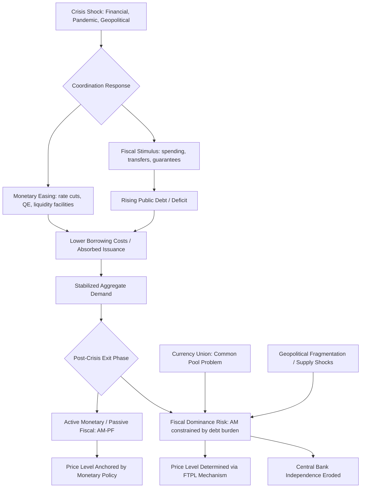

## Monetary-fiscal policy coordination in crises

### Overview

Monetary-fiscal policy coordination refers to the ways in which central banks (monetary authorities) and treasuries/governments (fiscal authorities) align — or fail to align — their respective policy tools, especially during periods of acute macroeconomic stress such as financial crises, pandemics, wars, or sovereign debt crises. In normal times, most advanced-economy frameworks assume a separation of roles: monetary policy targets inflation and output stability via interest rates, while fiscal policy manages spending, taxation, and debt issuance independently. Crises repeatedly disrupt this separation, because the scale of shocks often exceeds what either authority can address alone, and because the tools of one policy domain start to constrain the feasible actions of the other.

The research area sits at the intersection of macroeconomic theory (the Fiscal Theory of the Price Level, game-theoretic policy interaction), monetary institutional design (central bank independence), and empirical macro-econometrics (regime-switching models of policy interaction). It has become especially prominent following the 2007–09 Global Financial Crisis (GFC), the COVID-19 pandemic, and the subsequent 2021–2023 global inflation surge, each of which tested the boundaries of monetary-fiscal separation in different ways.

### Core Theoretical Framework: Active and Passive Policy Regimes

**Key Points**

The canonical way economists formalize monetary-fiscal interaction is through the distinction between **"active" and "passive"** policy, originating in the Leeper (1991) framework and central to the **Fiscal Theory of the Price Level (FTPL)**.

- A central bank is **active** when it sets its policy rate primarily to stabilize inflation, independent of the government's debt burden.
- A central bank is **passive** when it uses the policy rate (or balance sheet) to keep government interest costs low, even at the expense of its inflation target — put simply, fiscal dominance is a macroeconomic condition where fiscal policy...effectively dictates a country's monetary policy rather than the other way around, arising when there is a coordination failure between a country's monetary and fiscal agents, including instances of surprise fiscal expenditures that unexpectedly increase deficits and debt well beyond their existing trends.
- A fiscal authority is **passive** when it adjusts primary surpluses to ensure long-run debt sustainability regardless of the price level.
- A fiscal authority is **active** when it sets spending and taxes without regard to the intertemporal government budget constraint, effectively requiring the price level (via monetary financing or inflation) to adjust to keep debt sustainable — as summarized directly: a fiscal agent is passive when it spends sustainably; it is active when it spends unsustainably with no clear aim of eventually balancing the budget.

For a stable macroeconomic equilibrium with a well-anchored price level, the standard prescription is **"Active Monetary / Passive Fiscal" (AM/PF)** — to properly coordinate, the central bank must be active, and the fiscal agent must be passive. The problematic alternative regime, where fiscal considerations override monetary independence, is termed **fiscal dominance**: fiscal dominance refers to situations in which monetary policy is constrained by the public sector's budget constraint.

### The Fiscal Theory of the Price Level (FTPL)

**Key Points**

FTPL provides the formal mechanism by which fiscal behavior can determine inflation even when the central bank nominally controls the policy rate. The government's intertemporal budget constraint can be written as:

$$\frac{B_{t-1}}{P_t} = \sum_{j=0}^{\infty} E_t\left[\frac{s_{t+j}}{\prod_{k=0}^{j} R_{t+k}}\right]$$

where $B_{t-1}$ is nominal debt outstanding, $P_t$ is the price level, $s_{t+j}$ are future real primary surpluses, and $R_{t+k}$ are discount factors. Under FTPL, if the fiscal authority is "active" (surpluses $s_{t+j}$ do not adjust to satisfy the constraint at the prevailing price level), then $P_t$ itself must adjust to equate the real value of outstanding debt to the present value of surpluses — meaning fiscal policy, not monetary policy, becomes the anchor determining the price level. This literature traces to foundational work: Lucas RJ, Stokey NL. 1983...Optimal fiscal and monetary policy in an economy without capital, and has been substantially extended in subsequent decades, including work formalizing fiscal dominance as arising as the outcome of strategic interactions between the government and the central bank, characterized in the literature as a "game of chicken" between the two authorities.

[Inference: the precise empirical relevance of strict FTPL mechanics — as opposed to more conventional debt-sustainability channels — remains contested among macroeconomists; this equation represents the theoretical mechanism, not a settled empirical description of any specific economy.]

### Historical Pattern: Crisis-Driven Coordination

**Key Points**

Historically, monetary-fiscal coordination has intensified sharply during major crises, often temporarily overriding normal-times separation.

Economic downturns, such as the 1997 Asian financial crisis and the 2007–09 Global Financial Crisis, magnified fiscal and monetary policies['] complementary roles: governments stepped up to take responsibility for the losses through stimulus packages and countercyclical fiscal policies, and central banks acted as lenders of last resort. The resulting fiscal costs were subsequently managed through a mix of instruments — the losses absorbed by the government and central banks were funded through taxation (e.g., inflation tax), borrowing, and sales of government assets to avoid large fiscal deficits and default.

The COVID-19 pandemic represented an even more extreme case of deliberate, explicit coordination: governments provided stimulus packages such as tax and contribution deferrals, rate reductions, and healthcare and income subsidies, while central banks also intervened in the form of liquidity support, direct long-term lending, and credit creation. This period is widely regarded in the literature as the most pronounced peacetime episode of de facto monetary-fiscal coordination in advanced economies, given the scale of central bank asset purchases used to accommodate expanded government borrowing.

**Example: Stylized Crisis Coordination Sequence**

1. A large negative shock (financial crisis, pandemic) hits aggregate demand and threatens deflation/depression.
2. The treasury launches large discretionary fiscal stimulus (transfers, unemployment support, credit guarantees), sharply increasing the deficit and debt issuance.
3. The central bank cuts policy rates toward the zero lower bound and/or launches large-scale asset purchases (quantitative easing), partly absorbing the increased government bond issuance.
4. This combination lowers borrowing costs for the government while supporting aggregate demand — a mutually reinforcing "policy mix."
5. As the crisis recedes, the critical challenge becomes **unwinding** coordination: does the central bank raise rates and shrink its balance sheet even though this raises the government's borrowing costs and interest bill? This handoff period is precisely where fiscal dominance risk is highest.

### Empirical Regime Identification: Markov-Switching Approaches

**Key Points**

A growing empirical literature identifies which policy regime (monetary dominance, fiscal dominance, coordination, or conflict) prevailed during specific historical episodes, typically using Markov-switching estimation of joint monetary and fiscal policy rules.

One such study estimates a system of fiscal and monetary policy rules with Markov-switching interaction regimes to study policy coordination and conflict in the United States and the Euro Area during the Global Financial Crisis and the COVID-19 crisis, finding that policy regime shifts align with historical turning points and crisis responses. The results reveal meaningful cross-country heterogeneity: in the United States, the study finds shifts between policy coordination regimes, with both crises occurring under fiscal dominance, whereas the Euro Area displays persistent monetary dominance, despite temporary crisis-induced deviations. Within the eurozone itself, member states diverge: Germany follows the aggregate Euro Area pattern, while France and Italy exhibit policy conflict regimes, reflecting heterogeneity within the monetary union — a finding with direct implications for the stability of currency unions lacking centralized fiscal capacity.

Separate research applying forward-looking, expectations-based tests for fiscal dominance similarly finds that evidence varies systematically by country type and monetary regime: fiscal dominance evidence varies across countries and debt configurations, with higher ratios of public debt-to-GDP may appear associated with lower policy interest rates in advanced economies, though a declining natural rate of interest largely explains [this pattern] rather than dominance per se in many such cases. Critically, the most robust evidence of fiscal dominance lies among emerging markets under non-inflation-targeting regimes, composed mostly of exchange rate targeters, where policy rates respond non-linearly to public debt levels depending on debt currency composition (hard-currency exposure being a key risk amplifier).

### Common Pool Problems in Monetary Unions

**Key Points**

Coordination challenges are structurally more severe in currency unions where a single central bank faces multiple independent fiscal authorities. Research examining the European debt crisis specifically highlights the **common pool problem**: individual member states have an incentive to run larger deficits because the inflationary or interest-rate consequences are partly borne collectively by the union, while the benefits of spending accrue nationally.

The literature concludes that durable coordination solutions require institutional commitment devices rather than discretionary agreement: rules are unlikely to exist unless they come with supporting institutions — a finding directly relevant to debates over EU fiscal rules (Stability and Growth Pact reform), Eurobond issuance, and centralized fiscal capacity as complements to the ECB's single monetary policy.

### Contemporary Policy Concerns (2025–2026)

**Key Points**

Current market and policy commentary reflects renewed concern about fiscal dominance risk in major advanced economies, driven by elevated post-pandemic public debt levels and rising interest costs.

Market analysts note that government-bond yield curves of developed economies are steepening... with concerns over government debt and fiscal sustainability, and that fiscal dominance and institutional risk are key factors in global rates performance in the medium term for fixed-income investors to consider. Specific concern has been raised about the United States: market volatility may rise if Federal Reserve policy is overtly driven by managing the federal deficit, while structural analysis of U.S. debt dynamics highlights compounding refinancing risk — with the average maturity of federal debt at about six years,...due to a wave of short-term borrowing during the pandemic, about one-third of marketable federal debt matures in 2025 and again in 2026, adding to interest rate sensitivity.

Central bank normalization paths across major economies illustrate the tension directly: several major central banks continued tightening or holding rates through late 2025/early 2026 even amid elevated government debt loads, including the Bank of Japan continuing its policy normalization that started in 2024 by raising its short-term rate to a three-decade high, a move accompanied by a roughly 100 basis point rise in 10-year Japanese government bond yields over 2025 — illustrating how monetary normalization interacts directly with sovereign borrowing costs in a highly indebted advanced economy.

Institutionally, some policy commentary has argued that fiscal dominance risk is best addressed through central bank governance reform, framing the objective explicitly: within such a world, the ideal outcome is a monetary-dominant regime, i.e., preserving active, independent monetary policy insulated from pressure to accommodate fiscal financing needs.

### Post-Bretton Woods Fragmentation and Coordination Under Supply Shocks

**Key Points**

Recent theoretical and policy commentary argues that the classic post-GFC coordination playbook may no longer transfer cleanly to the current environment, because today's shocks are increasingly supply-side and geopolitically driven rather than pure demand shortfalls.

After the global financial crisis, the monetary-fiscal policy mix was the key to preventing a more severe and persistent downturn, success that rested on two specific conditions: first, both policies pushed in the same direction, stimulating aggregate demand without destabilizing the fiscal outlook, while countering deflationary pressure, and second, international relations still largely echoed the postwar cooperation of Bretton Woods. Contemporary commentary argues this second condition may no longer hold, and that the policy mix model doesn't work as well given today's frequent and large supply disturbances, which stem from, or are amplified by, policy decisions that deepen trade fragmentation and geopolitical imbalances and challenge the postwar global economic and monetary order.

This creates a distinct new risk channel: in such an environment, monetary-fiscal coordination may weaken central bank independence and thus threaten macroeconomic stability — inverting the traditional view that coordination is unambiguously stabilizing, and suggesting instead that the *type* of coordination (demand-stabilizing versus accommodating fiscally-driven supply-side inflation) matters critically for whether coordination helps or harms macroeconomic stability. Addressing this structural risk, in this view, requires geopolitical stability upheld by enhanced international cooperation, widespread adherence to accepted legal norms, and effective international institutions — a notably broader prescription than traditional domestic institutional design solutions (independent central banks, fiscal rules).

### Institutional Design Responses

**Key Points**

The literature and policy community have proposed several institutional mechanisms to preserve beneficial crisis-time coordination while limiting fiscal dominance risk once the crisis recedes:

1. **Fiscal rules with escape clauses** — numerical deficit/debt limits that can be legally suspended during declared emergencies, then automatically reinstated.
2. **Central bank independence with explicit mandate clarity** — legal insulation of the policy rate decision from treasury influence, paired with transparent communication distinguishing temporary liquidity support from permanent monetary financing.
3. **Sunset clauses on emergency facilities** — explicit termination dates or automatic unwind mechanisms for crisis-era asset purchase and lending programs, reducing the risk that "temporary" fiscal-monetary coordination calcifies into permanent fiscal dominance.
4. **Debt management office coordination protocols** — formal (but arm's-length) communication channels between treasury debt managers and central bank operations desks to avoid market-disrupting surprises, without creating a presumption of accommodation.
5. **Centralized fiscal capacity in monetary unions** — as implied by the common-pool-problem literature, joint fiscal instruments (common safe assets, centralized stabilization funds) can reduce the coordination failures that arise when many fiscal authorities share one monetary authority.

[Inference: the relative effectiveness of these design responses is theoretically motivated and supported by historical case comparison rather than by a single decisive controlled empirical test, since crisis institutional reforms cannot be randomly assigned across countries.]

### Diagram: Policy Regime Interaction

### Conceptual Diagram: Active/Passive Policy Matrix (svg_diagram)

<svg xmlns="http://www.w3.org/2000/svg" viewBox="0 0 720 480">
<text x="360" y="30" text-anchor="middle" font-size="18" font-weight="bold" fill="#1a1a1a">Monetary-Fiscal Regime Matrix (svg_diagram)</text>
<line x1="180" y1="70" x2="180" y2="420" stroke="#888" stroke-width="1.5" />
<line x1="450" y1="70" x2="450" y2="420" stroke="#888" stroke-width="1.5" />
<line x1="180" y1="245" x2="720" y2="245" stroke="#888" stroke-width="1.5" />

<text x="315" y="60" text-anchor="middle" font-size="13" font-weight="bold" fill="#333">Fiscal: Passive</text>

<text x="585" y="60" text-anchor="middle" font-size="13" font-weight="bold" fill="#333">Fiscal: Active</text>

<text x="90" y="155" text-anchor="middle" font-size="13" font-weight="bold" fill="#333" transform="rotate(-90 90 155)">Monetary: Active</text>

<text x="90" y="330" text-anchor="middle" font-size="13" font-weight="bold" fill="#333" transform="rotate(-90 90 330)">Monetary: Passive</text>

<rect x="180" y="70" width="270" height="175" fill="#dff0db" stroke="#3a7d32" stroke-width="1.5" />
<text x="315" y="145" text-anchor="middle" font-size="14" font-weight="bold" fill="#1a1a1a">Stable Equilibrium</text>
<text x="315" y="165" text-anchor="middle" font-size="12" fill="#333">(AM / PF)</text>
<text x="315" y="185" text-anchor="middle" font-size="12" fill="#333">Standard inflation-</text>
<text x="315" y="203" text-anchor="middle" font-size="12" fill="#333">targeting regime</text>
<rect x="450" y="70" width="270" height="175" fill="#f5e6d3" stroke="#a5672a" stroke-width="1.5" />
<text x="585" y="145" text-anchor="middle" font-size="14" font-weight="bold" fill="#1a1a1a">FTPL Regime</text>
<text x="585" y="165" text-anchor="middle" font-size="12" fill="#333">(AM / AF)</text>
<text x="585" y="185" text-anchor="middle" font-size="12" fill="#333">Price level adjusts</text>
<text x="585" y="203" text-anchor="middle" font-size="12" fill="#333">to fiscal surpluses</text>
<rect x="180" y="245" width="270" height="175" fill="#dbe9f5" stroke="#2c5f8a" stroke-width="1.5" />
<text x="315" y="320" text-anchor="middle" font-size="14" font-weight="bold" fill="#1a1a1a">Rare / Unstable</text>
<text x="315" y="340" text-anchor="middle" font-size="12" fill="#333">(PM / PF)</text>
<text x="315" y="358" text-anchor="middle" font-size="12" fill="#333">No nominal anchor</text>
<rect x="450" y="245" width="270" height="175" fill="#f0dbe9" stroke="#8a2c6f" stroke-width="1.5" />
<text x="585" y="320" text-anchor="middle" font-size="14" font-weight="bold" fill="#1a1a1a">Fiscal Dominance</text>
<text x="585" y="340" text-anchor="middle" font-size="12" fill="#333">(PM / AF)</text>
<text x="585" y="358" text-anchor="middle" font-size="12" fill="#333">CB accommodates debt</text>
<text x="585" y="376" text-anchor="middle" font-size="12" fill="#333">service, loses inflation control</text>
</svg>

### Behavioral Caveat

Regime classifications discussed above (fiscal dominance, monetary dominance, coordination, conflict) are derived from historical estimation using Markov-switching and related empirical models; actual prevailing regimes in any given country or period are inferred probabilistically from observed policy behavior and can shift with changes in political leadership, debt composition, external shocks, or central bank governance, and identified historical patterns do not guarantee how a given economy will behave in a future crisis.

### Related Topics

- Fiscal Theory of the Price Level (FTPL): formal derivation and critiques
- Central bank independence: legal design and empirical erosion indicators
- Quantitative easing and government debt monetization distinctions
- Currency union fiscal architecture: Eurobonds, centralized stabilization funds
- Sovereign debt sustainability analysis (debt-to-GDP dynamics, $r - g$ conditions)
- Yield curve control as a coordination mechanism (historical and contemporary cases)
- Emerging market fiscal dominance and exchange rate regime interactions
- Lender-of-last-resort doctrine versus fiscal bailout boundaries
- Political economy of central bank governance reform
- Debt management office and central bank communication protocols