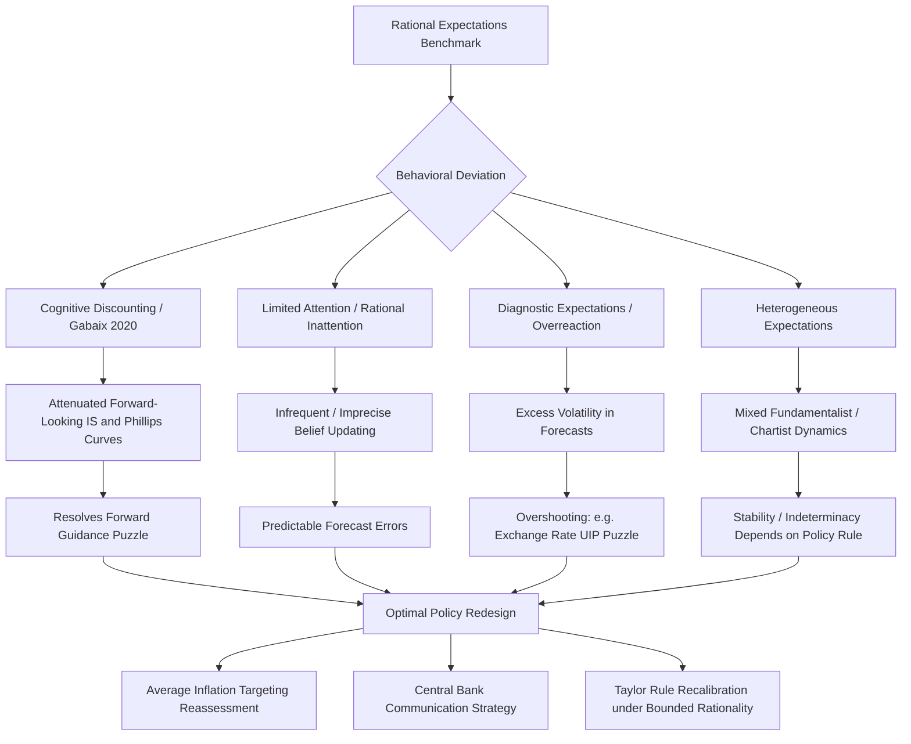

## Behavioral approaches to monetary economics

### Overview

Behavioral approaches to monetary economics relax the assumption of full rationality that underlies standard New Keynesian (NK) models, replacing rational expectations (RE) and unlimited cognitive capacity with more empirically grounded assumptions about how households, firms, and financial market participants actually form expectations and make decisions. The motivating observation is that survey and experimental data on inflation expectations, forecast errors, and consumption/investment responses systematically deviate from what rational-expectations models predict — deviations that are too large and too persistent to attribute to measurement noise alone.

This research frontier matters directly for monetary policy design because the transmission mechanism of interest rate changes, forward guidance, and inflation targeting frameworks depends critically on *how* expectations are formed. If expectations are behavioral rather than rational, policies calibrated under RE assumptions (e.g., the strength of forward guidance, the design of inflation-targeting regimes) can be systematically mis-sized or even counterproductive.

### Core Behavioral Mechanisms Modeled

**Key Points**

The literature has converged on a handful of tractable, microfounded behavioral mechanisms that can be embedded into otherwise-standard NK models:

1. **Bounded rationality / cognitive discounting (Gabaix, 2020)** — agents discount their expectations of future variables, attenuating the effect of distant future events on current decisions relative to full rational expectations.
2. **Level-k thinking / finite-horizon planning** — agents plan only a limited number of periods ahead and approximate value functions beyond that horizon rather than solving the full infinite-horizon rational expectations problem.
3. **Limited attention / rational inattention** — agents update their information sets and forecasts infrequently or imprecisely because attention itself is scarce and costly, so this behavior [is] both a behavioral and a structural phenomenon, responding to institutional factors and economic conditions.
4. **Diagnostic expectations / overreaction** — agents overweight recent news relative to its true statistical importance, producing systematic overreaction rather than underreaction in forecasts, in contrast to models built purely on underreaction/inattention.
5. **Heterogeneous expectations** — different agents (e.g., "fundamentalists" vs. "chartists," or high- vs. low-attention households) use different forecasting rules simultaneously, generating aggregate dynamics distinct from a representative-agent RE model.

**Formal Representation: Cognitive Discounting**

A standard behavioral New Keynesian IS curve and Phillips curve, following the Gabaix (2020) "behavioral New Keynesian" framework, replace the standard forward-looking terms with attenuated (discounted) expectations:

$$x_t = \bar{m} E_t[x_{t+1}] - \sigma(i_t - E_t[\pi_{t+1}] - r^n_t)$$

$$\pi_t = \beta \bar{m} E_t[\pi_{t+1}] + \kappa x_t$$

where $x_t$ is the output gap, $\pi_t$ is inflation, $i_t$ is the nominal rate, and $\bar{m} \in (0,1]$ is the **cognitive discounting parameter**: $\bar{m} = 1$ recovers the standard rational-expectations NK model exactly, while $\bar{m} < 1$ implies agents underweight the future relative to full rationality. This single parameter has become the workhorse device for embedding bounded rationality into otherwise standard monetary models, because it nests full rationality as a special case and is empirically estimable.

### Empirical Estimation of Behavioral Parameters

**Key Points**

A substantial and growing empirical literature estimates cognitive discounting and related attention parameters directly from macro and survey data, moving the behavioral NK framework from a theoretical curiosity to an empirically disciplined tool.

One cross-country study provides the first cross-country estimation of both micro- and macro-level attention parameters using a structurally identified behavioral New Keynesian model, employing Bayesian techniques on harmonized data from 22 OECD countries (1996–2019). The central empirical finding is substantial heterogeneity: the study document[s] substantial heterogeneity in behavioral inattention across countries, with cognitive discounting estimates rang[ing] from 0.76 to 0.98, with higher values indicating greater attention (i.e., closer to full rationality). Importantly, this heterogeneity is not random noise — these findings reveal that attention is both a behavioral and a structural phenomenon, responding to institutional factors and economic conditions, meaning central bank communication quality, transparency, and macroeconomic volatility itself can shape how attentive agents are.

A directly relevant implication follows for policy design: the results...yield important implications for the design and transmission of monetary policy under bounded rationality, showing that policy effectiveness may systematically vary with the macroeconomic environment — meaning a forward guidance or inflation-targeting strategy calibrated for a high-attention economy may transmit very differently in a low-attention one.

Related open-economy empirical work has extended this behavioral logic to expectations-driven puzzles in international finance: research examining exchange rate dynamics finds that when decision-makers have limited foresight, planning only up to a finite horizon and approximating continuation values with coarse value functions learned from past experiences, this behavior generates an initial underreaction, followed by an overreaction in beliefs, leading to dynamic overshooting of exchange rate forecast errors — a mechanism proposed specifically to help resolve the long-standing uncovered interest rate parity (UIP) puzzle, since the coexistence of forward- and backward-looking components in expectation formation breaks the forecast-horizon invariance implied from rational expectations.

### Overreaction Versus Underreaction: Two Competing Behavioral Traditions

**Key Points**

A key internal tension within behavioral macroeconomics is that different well-supported behavioral mechanisms predict opposite directions of expectational error:

- **Underreaction/inattention tradition** (rational inattention, cognitive discounting, level-k models): predicts agents respond too little to new information, producing forecast errors that are *predictable from past information* in a way consistent with sluggish updating.
- **Overreaction/diagnostic expectations tradition**: building on work showing systematic overreaction in professional forecasters' macroeconomic expectations, this tradition models agents as overweighting recent, salient news — producing excessive volatility in expectations relative to fundamentals, particularly in response to salient shocks.

[Inference: reconciling these two traditions — both empirically supported in different contexts and datasets — remains an active area of debate, and some recent models attempt to nest both mechanisms (e.g., initial underreaction followed by subsequent overreaction, as in the exchange rate finding above) rather than treating them as mutually exclusive.]

### Behavioral Expectations and Monetary Policy Design

**Key Points**

Introducing behavioral expectations changes the optimal design of monetary policy rules and frameworks in several specific, well-studied ways.

**1. Forward Guidance Effectiveness**

Under full rational expectations, New Keynesian models famously generate the "forward guidance puzzle" — announcements about interest rates far in the future have implausibly large effects on current output and inflation. Behavioral/bounded-rationality models with cognitive discounting or finite planning horizons directly resolve this puzzle: because $\bar{m} < 1$ attenuates the weight placed on distant future expectations, announcements about the far future have muted, more empirically plausible effects on current behavior compared to the standard RE benchmark. [Inference: general mechanism widely cited in the literature as motivation for behavioral NK models; not a claim that every behavioral model calibration exactly matches empirical forward guidance effect sizes.]

**2. Optimal Monetary Policy Rules Under Bounded Rationality**

Formal welfare analysis under bounded rationality finds that the optimal policy response to shocks differs from the fully rational benchmark, with research on optimal monetary policy under bounded rationality explicitly deriving how central banks should adjust standard Taylor-type rules when agents are boundedly rational rather than fully rational — a strand with a substantial dedicated literature including foundational contributions and subsequent extensions incorporating open-economy dimensions, cost channels, and central bank communication design under limited information (e.g., work on central bank objectives, monetary policy rules, and limited information).

**3. Average Inflation Targeting (AIT) and Price-Level Targeting (PLT)**

Behavioral expectations formation directly bears on the case for **make-up strategies** such as Average Inflation Targeting and Price-Level Targeting, which commit the central bank to compensate for past inflation misses (undershoots offset by future overshoots, and vice versa). Under full rational expectations, such commitments work primarily by shaping expectations of future policy; research examining boundedly rational expectations and the optimality of flexible average inflation targeting investigates whether and how this makeup logic survives when agents do not fully internalize the central bank's forward-looking commitment — directly relevant to real-world adoption of such frameworks, since some policymakers advocate the appropriateness of PLT as a measure to overcome the challenges brought by the Zero Lower Bound.

**4. Heterogeneous Expectations and Macroeconomic Stability**

Models incorporating a mix of forecasting rules across agents (rather than a single representative behavioral parameter) find that the *coexistence* of different expectation types has independent implications for stability: research on bounded rationality, monetary policy, and macroeconomic stability examines how the specific monetary policy rule in place interacts with the degree and type of bounded rationality present in the economy to determine whether the system remains stable or becomes prone to endogenous fluctuations/indeterminacy.

**Example: Behavioral vs. Rational Forward Guidance Response**

Consider a central bank announcing today that it will hold rates at zero for eight additional quarters beyond what standard rules would imply:

- **Rational expectations model**: households and firms immediately and fully incorporate the entire eight-quarter path into current spending/pricing decisions, producing a large, immediate jump in current output and inflation (the "puzzle").
- **Behavioral model ($\bar{m} = 0.85$, illustrative)**: households partially discount guidance about quarters 5–8 because they are cognitively "distant," producing a more muted, front-loaded response concentrated on the nearer-term portion of the guidance — closer to what is empirically observed in forward guidance event studies.

### Open-Economy Extensions

**Key Points**

Behavioral expectations have been extended into two-country and open-economy New Keynesian frameworks to jointly study monetary and fiscal policy interactions and exchange rate dynamics when expectations are not fully rational.

Two-country behavioral NK models examine how monetary and fiscal policies (in particular their open-economy dimensions) are affected by expectations being behavioral in the spirit of Gabaix (2020), with empirical work in this vein finding that the data strongly favor this [behavioral] setting compared with the standard rational expectations assumption — a direct empirical rejection of full rationality in favor of the behavioral alternative in cross-country data, alongside several novel findings regarding cross-border monetary and fiscal policy spillovers under behavioral expectations. Separately, cost-channel extensions of the behavioral NK model examine how the effect of a cost channel on monetary policy transmission changes when firms' financing-cost pass-through interacts with bounded rationality in price-setting decisions.

### Diagnostic Expectations and Inflation Perceptions

**Key Points**

A related but distinct strand focuses specifically on the gap between measured/official inflation and *perceived* inflation, which behavioral models treat as a first-order friction in its own right rather than pure measurement noise. Central bank research has directly modeled this gap in work on inflation perceptions and monetary policy, treating households' subjective inflation perceptions (as opposed to statistical inflation) as the object that actually drives consumption and wage-setting behavior — with direct implications for how central banks should interpret and respond to survey-based inflation expectations data, since these perceptions can deviate systematically and persistently from official inflation statistics due to attention allocation, salient price categories (e.g., groceries, fuel), and diagnostic overreaction to recent price news.

### Diagram: Behavioral Expectations Transmission

### Conceptual Diagram: Cognitive Discounting Spectrum (svg_diagram)

<svg xmlns="http://www.w3.org/2000/svg" viewBox="0 0 780 320">
<text x="390" y="30" text-anchor="middle" font-size="18" font-weight="bold" fill="#1a1a1a">Cognitive Discounting Parameter m̄ (svg_diagram)</text>
<line x1="80" y1="160" x2="700" y2="160" stroke="#444" stroke-width="2" />
<line x1="80" y1="150" x2="80" y2="170" stroke="#444" stroke-width="2" />
<line x1="700" y1="150" x2="700" y2="170" stroke="#444" stroke-width="2" />

<text x="80" y="190" text-anchor="middle" font-size="13" fill="#333">m̄ = 0</text>

<text x="80" y="210" text-anchor="middle" font-size="11" fill="#666">Extreme myopia</text>

<text x="390" y="190" text-anchor="middle" font-size="13" fill="#333">m̄ ≈ 0.76–0.98</text>

<text x="390" y="210" text-anchor="middle" font-size="11" fill="#666">Estimated OECD range</text>

<text x="700" y="190" text-anchor="middle" font-size="13" fill="#333">m̄ = 1</text>

<text x="700" y="210" text-anchor="middle" font-size="11" fill="#666">Full rational expectations</text>

<rect x="290" y="145" width="200" height="30" fill="#dbe9f5" stroke="#2c5f8a" stroke-width="1.5" rx="4" />
<circle cx="80" cy="160" r="6" fill="#a5672a" />
<circle cx="390" cy="160" r="6" fill="#2c5f8a" />
<circle cx="700" cy="160" r="6" fill="#3a7d32" />

<text x="390" y="250" text-anchor="middle" font-size="12" fill="#333">Higher m̄ = greater attention = closer to standard NK model</text>

<text x="390" y="270" text-anchor="middle" font-size="12" fill="#333">Lower m̄ = stronger behavioral attenuation of forward-looking terms</text>

</svg>

### Behavioral Caveat

The behavioral parameter estimates, model mechanisms, and policy design implications discussed above are drawn from a specific and still-developing empirical and theoretical literature. Estimated cognitive discounting values, attention parameters, and their policy implications may vary across countries, time periods, and model specifications, and actual central bank forecasting and policy design in any specific jurisdiction may not fully incorporate these behavioral frameworks, since standard rational-expectations models remain the dominant operational baseline at most central banks.

### Related Topics

- Rational inattention theory (Sims, 2003) and its macroeconomic applications
- The forward guidance puzzle and its proposed resolutions
- Diagnostic expectations and belief overreaction (Bordalo, Gennaioli, Shleifer)
- Survey-based inflation expectations measurement (Michigan Survey, NY Fed SCE)
- Average Inflation Targeting and Price-Level Targeting design
- Heterogeneous agent New Keynesian (HANK) models
- Central bank communication and forward guidance credibility
- Adaptive learning models as an alternative to full rational expectations
- Uncovered interest rate parity (UIP) puzzle and behavioral resolutions
- Experimental and survey-based tests of macroeconomic expectation formation