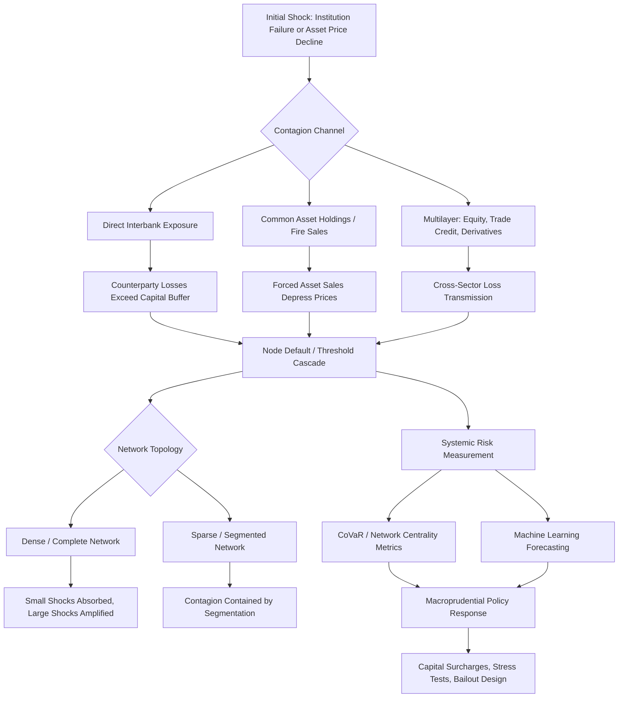

## Network models of financial contagion

### Overview

Network models of financial contagion apply graph-theoretic and complex-systems methods to study how financial distress propagates through interconnected institutions — banks, firms, insurers, and other intermediaries — following an initial shock. Rather than treating the financial system as a collection of independent institutions, these models represent it as a network of nodes (institutions) connected by edges (exposures: interbank loans, common asset holdings, cross-shareholdings, trade credit, derivatives contracts), and study how the *topology* of these connections shapes the amplification, spread, and eventual containment of shocks.

This modeling paradigm has become central to macroprudential policy and monetary economics because central banks are increasingly mandated (post-Global Financial Crisis) to monitor and mitigate systemic risk, not merely the safety and soundness of individual institutions. Complex network theory has been applied to the financial domain to study interconnections within the financial system, aiming to better simulate the characteristics of financial risk contagion, reflecting a deliberate methodological shift from institution-level risk assessment toward system-level, network-aware risk assessment.

### Foundational Theory: Network Structure and Contagion

**Key Points**

The modern literature on financial contagion began with foundational work demonstrating a structural, and initially counter-intuitive, result about network completeness: the modern literature on financial contagion began with Allen and Gale (2000), who demonstrated that while complete interbank networks are more resilient to small shocks, they can amplify large shocks through widespread exposure. This finding — that dense interconnection is a double-edged sword, providing diversification against small shocks but creating amplification channels for large shocks — became the central organizing puzzle of the field. Subsequent theoretical work extended this insight directly to network topology: research showed how network structure determines contagion patterns, with incomplete (segmented) networks potentially limiting cascade effects through segmentation, establishing that *how* institutions are connected (not just *how much* they are connected) is a first-order determinant of systemic fragility.

A second foundational strand adapted tools from network science and epidemiology/social-contagion modeling to formalize default cascades. Pioneers of this approach...exploited the social cascade model of Watts, applying threshold-based cascade dynamics (originally developed to model the spread of behaviors or opinions through social networks) to model how bank failures propagate through interbank exposure networks — an approach that, by imposing a zero-recovery assumption (a defaulting bank recovers nothing for its creditors), allows financial contagion to be analyzed using established combinatorial and probabilistic tools from network science.

### Core Contagion Channels

**Key Points**

Financial contagion is generally understood to propagate through several distinct but interacting channels:

**1. Direct interbank exposure (credit contagion)**

The first channel is direct interbank exposure: banks lend to and borrow from each other, and if one bank cannot repay, partner banks suffer losses, and the shock can spread through the network. This is the most literal network channel — a direct edge in the exposure graph represents a claim that can transmit default risk from one node to its neighbors. Related early modeling work constructed an endogenous interbank lending network and found that bank losses and failures can propagate through the network, establishing the basic cascade mechanic still used across the literature.

**2. Common asset holdings / price-mediated contagion (fire sales)**

The second channel is common asset holdings: many banks hold similar bonds, loans, or stocks, and if prices fall and many banks simultaneously attempt to sell, prices may fall further, and losses will increase — a mechanism often referred to as price-mediated contagion or fire sales. Unlike direct interbank exposure, this channel operates *without any direct contractual link* between affected institutions: two banks holding the same asset class are effectively "connected" through the market price of that asset, meaning distress at one institution can transmit to a completely unrelated institution purely through forced asset sales depressing a shared mark-to-market valuation. Because these hidden linkages are not visible in standard interbank exposure data, the literature emphasizes that modeling the hidden interbank linkages formed through cross asset holdings is then important to understand systemic risk, and this channel has become a major focus of dedicated theoretical work, including formal stochastic treatments explicitly modeling *price-mediated contagion in stochastic financial networks*.

**3. Multilayer / cross-sector linkages**

More recent research recognizes that real financial networks are not single-layer: banks are connected through multiple types of linkages simultaneously (lending, equity cross-holdings, derivatives, trade credit), and studying any one layer in isolation risks materially underestimating systemic risk. Extended multilayer bank-firm network models explicitly incorporate channels beyond simple interbank lending: while existing studies on risk contagion in bank-firm networks often consider complex interconnections among entities, relatively little attention has been given to trade credit linkages among firms and cross-shareholding relationships between banks and firms, with the literature noting explicitly that the omission of these connections may result in an underestimation of systemic risk. This has motivated a shift from single-layer interbank models toward genuinely multilayer frameworks, including empirically calibrated dual-layer bank-firm networks and models finding that multilayer structures can materially change systemic outcomes (e.g., studies asking directly whether multilayer networks amplify systemic risk in specific sectors such as real estate).

### Formal Modeling Frameworks

**Key Points**

**Threshold Cascade Models**

Building on the Gai-Kapadia/Watts tradition, a bank $i$ defaults if cumulative losses from defaulted counterparties exceed its capital buffer:

$$\text{Default}_i \iff \sum_{j \in N(i)} L_{ij} \cdot \mathbb{1}[\text{Default}_j] > K_i$$

where $N(i)$ is the set of $i$'s network neighbors (counterparties), $L_{ij}$ is $i$'s loss-given-default exposure to $j$, and $K_i$ is $i$'s capital buffer. This generates a cascading, round-by-round default process that terminates when no further nodes cross their threshold — directly analogous to bootstrap percolation and threshold models of social contagion.

**Probability-of-Default (PD) Contagion Models**

An alternative, credit-risk-based approach treats contagion as a continuous increase in default probability rather than a discrete cascade of failures: a contagion process increases the PD of banks exposed toward distressed counterparties, with systemic risk measured by statistics of the loss distribution, while the contribution of each node is quantified by dedicated node-level risk-attribution measures (in one prominent formulation, termed *PDRank* and *PDImpact*). This class of model produces a striking, policy-relevant result that overturns standard portfolio-theory intuition: for a certain range of the banks' capital and of their assets volatility,...results reveal the emergence of a strong contagion regime where lower default correlation between banks corresponds to higher losses — the opposite of the diversification benefits postulated by standard credit risk models used by banks and regulators, who could therefore underestimate the capital needed to overcome a period of crisis, thereby contributing to the financial system instability. [This is explicitly flagged in the source literature as counter-intuitive: as far as we are aware, this fact is not known within the financial risk management community that is used to think that a diversified (less correlated) portfolio always require less capital.]

**CoVaR and Systemic Risk Network Construction**

Empirical multilayer systemic risk measurement frequently uses variants of Conditional Value-at-Risk to construct the network itself from market data rather than assuming a structural exposure network. One approach employ[s] the LASSO-ΔCoVaR model to establish multilayered risk networks encompassing [a country's] banking, insurance and securities industries and construct[s] novel indicators to measure risk volatility and contagion, an approach that infers network connectivity statistically from co-movements in institutions' risk measures rather than from directly observed balance-sheet exposures — useful precisely because true bilateral exposure data is often unavailable to researchers and even to some regulators.

### Machine Learning and Modern Computational Extensions

**Key Points**

Recent literature increasingly combines network-theoretic contagion models with machine learning and reinforcement learning techniques for both prediction and policy optimization:

- **Systemic risk forecasting**: work using textual data from financial news, employing multiple machine learning models to forecast systemic risk in the banking sector, applying explainability methods (SHAP) to interpret which features drive predicted risk — with such studies finding that interest rate policies and related monetary-policy-adjacent features rank among the most important predictive signals.
- **Temporal graph neural networks (TGNNs)**: applied to detect anomalous structural changes in evolving bank networks — for example, a framework combining dynamic time warping to construct evolving bank networks from balance-sheet data, a temporal graph neural network to detect anomalous changes in the bank network's structural relationships, and agent-based model simulations to measure the impact of anomalous changes on network stability, with such frameworks used to study geopolitical and cross-border shocks in large emerging-market banking systems.
- **Reinforcement learning for bailout policy**: newer work frames government intervention itself as a sequential decision problem, using a reinforcement learning algorithm...for decision support in government bailout strategies during interbank risk contagion, alongside related multi-objective optimization approaches for optimal bailout allocation in large-scale banking systems under risk contagion.

[Inference: the ML/RL-augmented contagion literature is comparatively recent and rapidly evolving; the specific model architectures and their out-of-sample forecasting performance should be treated as an active research area rather than a settled methodological consensus.]

### Empirical Findings on Real-World Network Structure

**Key Points**

Empirical mapping of actual interbank and bank-firm networks has produced several robust stylized facts used to calibrate theoretical contagion models:

- Networks constructed from real financial market data reveal that systemic risk mainly spreads through creditor-debtor relationships among financial institutions, reinforcing the centrality of the direct-exposure channel even amid growing attention to price-mediated channels.
- Size and centrality matter more than idiosyncratic anomaly: simulation-based studies of large emerging-market banking networks find that the failure of the largest banks can cause more systemic damage than that of financially vulnerable or anomalous banks due to panic effects, a finding with direct relevance for "too big to fail" and G-SIB (Global Systemically Important Bank) surcharge regulatory frameworks.
- Cross-border network exposure is a growing structural feature of emerging-market systemic risk: major banks from large emerging economies have built extensive multi-country networks (with some individual institutions reaching operations in over 60 countries), meaning domestic distress in a systemically important emerging economy could trigger a large-scale emerging market crisis and create systemic risk through cross-border connections.

### Policy Applications

**Key Points**

Network contagion models directly inform several macroprudential policy tools used by central banks and financial regulators:

1. **Systemic risk capital surcharges** (e.g., G-SIB buffers) — informed by node-centrality and network-impact measures identifying which institutions would cause the largest cascade if they failed.
2. **Stress testing with network amplification** — regulatory stress tests increasingly incorporate second-round (network) effects rather than treating institutions as isolated in the stress scenario.
3. **Macroprudential policy calibration** — empirical network studies directly evaluate policy effectiveness; for example, findings that adjustments in monetary policy yield short-term reductions in financial sector risk, and that stricter macroprudential policies initially elicit negative market responses, yet markets adjust and stabilize over time, and that combined ("two-pillar") macroprudential and monetary approaches complement each other in enhancing financial stability.
4. **Optimal bailout design** — network models are used to determine the minimum-cost or minimum-cash-injection intervention that arrests a cascade, an active operations-research-adjacent literature area (e.g., work on optimal bailout strategy with cash injection bound under different network[]s).

### Diagram: Contagion Channels and Cascade Mechanics

### Conceptual Diagram: Interbank Exposure Network (svg_diagram)

<svg xmlns="http://www.w3.org/2000/svg" viewBox="0 0 760 420">
<text x="380" y="30" text-anchor="middle" font-size="18" font-weight="bold" fill="#1a1a1a">Interbank Exposure Network and Cascade (svg_diagram)</text>
<circle cx="380" cy="120" r="30" fill="#f0dbe9" stroke="#8a2c6f" stroke-width="2" />
<text x="380" y="125" text-anchor="middle" font-size="12" font-weight="bold" fill="#1a1a1a">Bank A</text>
<text x="380" y="160" text-anchor="middle" font-size="11" fill="#8a2c6f">Initial Default</text>
<circle cx="180" cy="230" r="28" fill="#f5e6d3" stroke="#a5672a" stroke-width="2" />
<text x="180" y="235" text-anchor="middle" font-size="12" font-weight="bold" fill="#1a1a1a">Bank B</text>
<circle cx="580" cy="230" r="28" fill="#f5e6d3" stroke="#a5672a" stroke-width="2" />
<text x="580" y="235" text-anchor="middle" font-size="12" font-weight="bold" fill="#1a1a1a">Bank C</text>
<circle cx="380" cy="340" r="28" fill="#dff0db" stroke="#3a7d32" stroke-width="2" />
<text x="380" y="345" text-anchor="middle" font-size="12" font-weight="bold" fill="#1a1a1a">Bank D</text>
<circle cx="80" cy="340" r="24" fill="#dbe9f5" stroke="#2c5f8a" stroke-width="2" />
<text x="80" y="345" text-anchor="middle" font-size="11" font-weight="bold" fill="#1a1a1a">Firm 1</text>
<circle cx="680" cy="340" r="24" fill="#dbe9f5" stroke="#2c5f8a" stroke-width="2" />
<text x="680" y="345" text-anchor="middle" font-size="11" font-weight="bold" fill="#1a1a1a">Firm 2</text>
<line x1="380" y1="150" x2="180" y2="205" stroke="#8a2c6f" stroke-width="2.5" />
<line x1="380" y1="150" x2="580" y2="205" stroke="#8a2c6f" stroke-width="2.5" />
<line x1="180" y1="255" x2="380" y2="320" stroke="#a5672a" stroke-width="2.5" />
<line x1="580" y1="255" x2="380" y2="320" stroke="#a5672a" stroke-width="2.5" />
<line x1="180" y1="255" x2="80" y2="320" stroke="#a5672a" stroke-width="1.5" stroke-dasharray="4,3" />
<line x1="580" y1="255" x2="680" y2="320" stroke="#a5672a" stroke-width="1.5" stroke-dasharray="4,3" />

<text x="380" y="400" text-anchor="middle" font-size="12" fill="#333">Solid lines: direct interbank exposure — Dashed: trade credit / cross-holding</text>

</svg>

### Behavioral Caveat

The cascade mechanics, node-risk rankings, and policy-effectiveness findings summarized above are derived from specific model calibrations, historical datasets, and simulation exercises; actual contagion dynamics during a live financial crisis may vary depending on real-time market liquidity conditions, regulatory intervention, counterparty behavior, and network structures not fully captured by any single model, and none of the frameworks described guarantee accurate prediction of the timing, size, or path of an actual future contagion event.

### Related Topics

- Fire sales and price-mediated contagion modeling
- CoVaR and other conditional systemic risk measures
- Global Systemically Important Bank (G-SIB) designation and capital surcharges
- Macroprudential stress testing with network second-round effects
- Central counterparty (CCP) risk and derivatives network exposure
- Sovereign-bank "doom loop" contagion channels
- Temporal graph neural networks for financial network anomaly detection
- Optimal bailout and cash-injection mechanism design
- Cross-border banking network exposure and emerging market systemic risk
- Multilayer network centrality measures (PDRank, PDImpact, and related node-risk metrics)