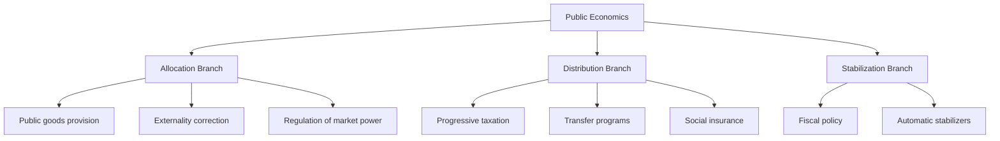

## Definition and Scope of Public Economics

### Definition

Public economics (also called public finance) is the branch of economics that studies the role of government in the economy — how governments raise revenue, allocate resources, and influence the distribution of income, and how these interventions interact with market outcomes. It examines both the **positive** question (what governments actually do and what effects this has) and the **normative** question (what governments should do to improve social welfare).

Formally, public economics analyzes:

$$W = f(\text{resource allocation}, \text{income distribution}, \text{economic stabilization})$$

where government policy instruments (taxes, expenditures, regulation) are evaluated by their effect on social welfare $W$, subject to informational, political, and administrative constraints.

### Core Subject Matter

**Key Points**

- **Market failure analysis**: identifying conditions (externalities, public goods, information asymmetries, market power) under which unregulated markets fail to achieve Pareto efficiency
- **Public goods and externalities**: goods characterized by non-rivalry and non-excludability, and spillover effects not reflected in market prices
- **Taxation theory**: incidence, efficiency costs (deadweight loss), optimal tax design
- **Public expenditure theory**: cost-benefit analysis, provision of social insurance, transfer programs
- **Income redistribution**: equity-efficiency tradeoffs, poverty alleviation, social welfare functions
- **Fiscal federalism**: division of taxing and spending responsibilities across levels of government
- **Political economy**: how political institutions and voting mechanisms shape fiscal outcomes

### The Two Branches: Allocation and Distribution

Public economics is traditionally organized around Musgrave's three-branch taxonomy of government's economic functions:

1. **Allocation branch** — corrects market failures and ensures efficient provision of goods and services (e.g., public goods like national defense, correcting externalities like pollution)
2. **Distribution branch** — adjusts the distribution of income and wealth to accord with society's conception of "fair" distribution (e.g., progressive taxation, transfer payments)
3. **Stabilization branch** — uses fiscal policy to maintain macroeconomic stability (full employment, price stability, growth) — though this function is increasingly treated as part of macroeconomics rather than public economics proper

### Positive vs. Normative Public Economics

| Dimension | Positive Public Economics | Normative Public Economics |
| --- | --- | --- |
| Question asked | What are the effects of a policy? | What policy *should* be adopted? |
| Method | Empirical estimation, theoretical prediction | Welfare economics, social welfare functions |
| Example | "A cigarette tax reduces consumption by X%" | "A cigarette tax is justified because it internalizes an externality" |
| Value judgments | Minimized | Explicit and central |

Both branches are necessary: normative analysis defines the criteria for good policy (efficiency, equity), while positive analysis determines whether real-world policies meet those criteria, accounting for behavioral responses, incidence, and general equilibrium effects.

### Rationale for Government Intervention

**Example**

Consider a chemical factory that pollutes a river used by downstream fishermen. The factory's private marginal cost $MC_{private}$ excludes the pollution damage, so the market produces quantity $Q_{market}$ where $MC_{private} = MB$. The socially optimal quantity $Q_{social}$ accounts for the external cost:

$$MC_{social} = MC_{private} + MEC$$

where $MEC$ is the marginal external cost. Since $Q_{market} > Q_{social}$, the market over-produces relative to the social optimum — a canonical justification for government intervention (a Pigouvian tax, regulation, or a Coasean bargaining solution).

Standard justifications for intervention include:

- **Public goods**: non-excludable, non-rival goods are under-provided by private markets due to free-riding
- **Externalities**: costs or benefits not borne by the transacting parties (pollution, vaccination, education spillovers)
- **Natural monopoly**: high fixed costs relative to marginal costs make single-firm provision efficient but requires price regulation
- **Information asymmetry**: adverse selection and moral hazard (e.g., insurance markets) may require mandates or public provision
- **Merit goods and paternalism**: goods society deems individuals may under-consume (education, healthcare) even absent classic market failure
- **Distributional concerns**: even efficient markets can generate unacceptable inequality, motivating redistribution independent of efficiency arguments

### Scope: What Public Economics Studies

**Key Points**

- **Revenue side**: tax theory (income tax, consumption tax, corporate tax, property tax), tax incidence, optimal taxation, tax compliance and enforcement, international taxation
- **Expenditure side**: social insurance (unemployment, disability, pensions), welfare programs, public goods provision, education and healthcare financing, infrastructure investment
- **Debt and deficits**: intertemporal government budget constraints, sustainability of public debt, generational accounting
- **Institutions**: fiscal federalism, budget processes, political constraints on policy (public choice theory)
- **Applied microeconomics tools**: general equilibrium modeling, behavioral economics, econometric program evaluation (natural experiments, regression discontinuity, difference-in-differences)

### Relationship to Other Fields

| Field | Relationship to Public Economics |
| --- | --- |
| Microeconomics | Provides the welfare-theoretic foundation (efficiency, Pareto optimality) |
| Macroeconomics | Overlaps in fiscal policy and stabilization analysis |
| Political economy / Public choice | Studies how political institutions determine which policies are actually chosen |
| Development economics | Applies public finance tools to developing-country institutional contexts |
| Law and economics | Studies legal rules (property rights, liability) as alternative correction mechanisms to fiscal tools |
| Econometrics | Supplies empirical methods for estimating behavioral responses to taxes/transfers |

### Efficiency-Equity Tradeoff

A central organizing tension in the field is the **efficiency-equity tradeoff**: redistributive policies (progressive taxes, transfers) that improve distributional equity often distort incentives, generating deadweight loss. This is formalized in optimal tax theory, e.g., the Mirrlees optimal income tax problem, where the social planner maximizes a social welfare function

$$SW = \int_0^\infty G(u(y - T(y))) \, dF(y)$$

subject to incentive-compatibility constraints on labor supply, where $T(y)$ is the tax schedule and $G(\cdot)$ reflects social preferences for equality. [Inference: The precise functional forms and parameter values used in applied optimal-tax models vary substantially by study and calibration assumptions.]

### Illustrative Diagram: Scope of Public Economics

<svg xmlns="http://www.w3.org/2000/svg" viewBox="0 0 720 420">
<text x="360" y="30" font-size="18" font-weight="bold" text-anchor="middle" fill="#1a1a1a">Scope of Public Economics (svg_diagram)</text>
<circle cx="360" cy="230" r="150" fill="#e8f0fe" stroke="#3366cc" stroke-width="2" />
<text x="360" y="230" font-size="16" font-weight="bold" text-anchor="middle" fill="#1a1a1a">Public Economics</text>
<circle cx="200" cy="140" r="90" fill="#fce8e6" stroke="#cc3333" stroke-width="1.5" fill-opacity="0.7" />
<text x="150" y="110" font-size="13" text-anchor="middle" fill="#1a1a1a">Taxation</text>
<text x="150" y="128" font-size="11" text-anchor="middle" fill="#333">Incidence, Efficiency</text>
<circle cx="520" cy="140" r="90" fill="#e6f4ea" stroke="#33994d" stroke-width="1.5" fill-opacity="0.7" />
<text x="570" y="110" font-size="13" text-anchor="middle" fill="#1a1a1a">Expenditure</text>
<text x="570" y="128" font-size="11" text-anchor="middle" fill="#333">Public Goods, Transfers</text>
<circle cx="260" cy="320" r="90" fill="#fff4e5" stroke="#cc9933" stroke-width="1.5" fill-opacity="0.7" />
<text x="220" y="350" font-size="13" text-anchor="middle" fill="#1a1a1a">Redistribution</text>
<text x="220" y="368" font-size="11" text-anchor="middle" fill="#333">Equity, Welfare</text>
<circle cx="460" cy="320" r="90" fill="#f3e6f9" stroke="#8833cc" stroke-width="1.5" fill-opacity="0.7" />
<text x="500" y="350" font-size="13" text-anchor="middle" fill="#1a1a1a">Institutions</text>
<text x="500" y="368" font-size="11" text-anchor="middle" fill="#333">Federalism, Political Economy</text>
</svg>

### Historical Evolution of the Field

- **Classical foundations**: Adam Smith's canons of taxation (equity, certainty, convenience, economy) in *The Wealth of Nations*
- **Marginalist welfare economics** (late 19th–early 20th century): Pigou's welfare economics and theory of externalities
- **Musgrave synthesis** (1959): *The Theory of Public Finance* formalized the three-branch framework
- **Optimal tax theory** (1970s onward): Mirrlees, Diamond, Ramsey-based models of optimal commodity and income taxation
- **Public choice revolution**: Buchanan and Tullock incorporated political incentives and institutional constraints
- **Behavioral public economics** (2000s onward): integrates behavioral biases (present bias, inattention) into tax and welfare analysis
- **Empirical/credibility revolution**: growing reliance on quasi-experimental and experimental methods (Saez, Chetty, and others) to estimate behavioral elasticities underlying policy design

### Common Misconceptions

**Key Points**

- Public economics is *not* limited to government budgeting or accounting — it is a welfare-theoretic analytical framework
- Market failure does not automatically imply government intervention is efficient; **government failure** (rent-seeking, regulatory capture, information constraints) can also produce inefficiency, an insight central to public choice theory
- Efficiency and equity are not always in conflict — some policies (e.g., correcting a genuine externality) can improve both simultaneously

### Conclusion

Public economics provides the analytical toolkit for evaluating when, why, and how government should intervene in a market economy. It integrates efficiency-based market-failure arguments with normative welfare judgments about distribution, using formal microeconomic modeling, applied econometrics, and institutional analysis to inform both positive predictions and normative policy design.

**Related Topics**

- Market Failure and the Case for Government Intervention
- Musgrave's Three-Branch Framework in Depth
- Pareto Efficiency and the First/Second Welfare Theorems
- Public Goods: Theory and Free-Rider Problem
- Externalities and Pigouvian Taxation
- Social Welfare Functions and Interpersonal Utility Comparisons
- Positive vs. Normative Analysis in Economic Policy
- Public Choice Theory and Government Failure
- History of Public Finance Thought