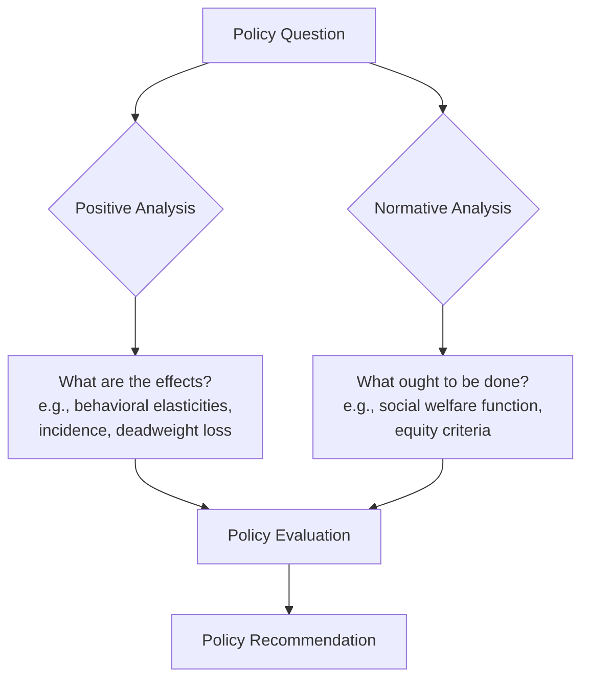

## Positive versus Normative Analysis

### Definition

Positive and normative analysis represent two distinct modes of economic reasoning applied throughout public economics. **Positive analysis** describes and predicts economic phenomena as they are — testable, fact-based statements about cause and effect. **Normative analysis** prescribes what economic outcomes or policies *ought to be* — statements that necessarily embed value judgments about what is desirable or fair.

The distinction, formalized by John Neville Keynes (1891) and later emphasized by Milton Friedman (1953), is foundational to how public economists separate scientific analysis from policy advocacy.

### Core Distinction

| Dimension | Positive Analysis | Normative Analysis |
| --- | --- | --- |
| Nature of claim | Descriptive / predictive | Prescriptive / evaluative |
| Testability | Empirically falsifiable | Not falsifiable (value-based) |
| Example question | "What happens to labor supply when the income tax rate rises?" | "Should the income tax rate rise?" |
| Underlying logic | Cause-and-effect, "if-then" | "Should," "ought," welfare judgments |
| Role of values | Value-free in principle | Value judgments are explicit and central |
| Methodology | Econometrics, theoretical modeling, experiments | Welfare economics, social welfare functions, ethical frameworks |

### Positive Statements: Structure and Examples

A positive statement takes the form: *"If policy X is implemented, then outcome Y will occur, with magnitude Z."* It can, in principle, be verified or refuted using data.

**Example**

- "A 10% increase in the cigarette excise tax reduces cigarette consumption by approximately 3–5%, implying a price elasticity of demand between $-0.3$ and $-0.5$." [Inference: exact elasticity estimates vary across studies, populations, and time periods]
- "Corporate tax incidence falls partly on labor through reduced wages, with estimates of the labor share of the burden ranging widely across studies."
- "Raising the minimum wage from $w_0$ to $w_1$ reduces employment by $\Delta L$ in a competitive labor market, where $\Delta L = \varepsilon_L \cdot \frac{w_1 - w_0}{w_0} \cdot L_0$" and $\varepsilon_L$ is the labor demand elasticity.

Positive public economics relies on:

- **Theoretical models**: general equilibrium, partial equilibrium, game-theoretic frameworks predicting behavioral responses
- **Empirical estimation**: natural experiments, difference-in-differences, regression discontinuity, instrumental variables, and randomized controlled trials to estimate elasticities and treatment effects
- **Tax incidence analysis**: determining who actually bears the economic burden of a tax, independent of statutory liability

### Normative Statements: Structure and Examples

A normative statement takes the form: *"Policy X is desirable/undesirable because it produces outcome Y, which is judged good/bad according to criterion C."*

**Example**

- "The government should tax carbon emissions because doing so internalizes the externality and improves social welfare" — this embeds the value judgment that welfare maximization (Pareto or Kaldor-Hicks efficiency) is the appropriate criterion.
- "Income should be redistributed from high-income to low-income households" — this embeds a value judgment about the social desirability of equality, often formalized via a concave social welfare function.
- "A flat tax is fairer than a progressive tax" — a value claim about the definition of fairness (horizontal vs. vertical equity), not a testable proposition.

Normative public economics relies on:

- **Social welfare functions (SWF)**: $SW = f(u_1, u_2, \ldots, u_n)$ aggregating individual utilities according to explicit ethical weights
- **Welfare theorems**: First and Second Fundamental Theorems of Welfare Economics as benchmarks for efficiency
- **Equity criteria**: horizontal equity (equal treatment of equals) and vertical equity (appropriate differential treatment of unequals)
- **Optimal tax and expenditure theory**: deriving policy prescriptions from an assumed SWF and behavioral constraints

### The Interdependence of Positive and Normative Analysis

**Key Points**

- Sound policy analysis requires *both*: normative analysis defines the *criteria* for a good policy (e.g., maximize welfare, minimize deadweight loss, achieve a target Gini coefficient); positive analysis supplies the *empirical inputs* needed to evaluate whether a given policy meets those criteria
- Optimal tax theory illustrates this fusion directly: the Mirrlees model combines a normative objective (maximize $SW = \int G(u(c)) \, dF$) with positive constraints (incentive compatibility given behavioral labor supply responses estimated empirically)
- Disagreements framed as "positive" disputes are sometimes actually normative disagreements in disguise, and vice versa — a key source of confusion in real-world policy debate

### Application: Optimal Taxation as a Fusion Case

Consider evaluating a proposed increase in the top marginal income tax rate.

**Positive component**: Estimate the elasticity of taxable income (ETI) $e$, which determines the revenue-maximizing top rate via the Saez formula:

$$\tau^* = \frac{1}{1 + a \cdot e}$$

where $a$ is the Pareto parameter of the income distribution and $e$ is the ETI — both empirically estimable parameters.

**Normative component**: Whether the government should set the rate at the *revenue-maximizing* level, below it (to preserve efficiency/liberty), or use revenue for redistribution depends on the assumed social welfare function and the weight placed on the marginal utility of income to top earners — an ethical judgment, not an empirical one.

This example shows why public economists typically report positive parameters (elasticities, incidence shares) *separately* from normative policy conclusions, allowing readers with different value judgments to reach different policy conclusions from the same evidence.

### Common Pitfalls and Misconceptions

**Key Points**

- **The naturalistic fallacy**: inferring "ought" directly from "is" (e.g., "the market allocates efficiently, therefore the market outcome is what we should have") — this smuggles in an implicit normative premise (that efficiency is the only relevant criterion)
- **False positivity**: presenting normative claims using positive-sounding language (e.g., "wasteful government spending" presupposes a value judgment about what counts as "waste")
- **Value-neutrality is a methodological ideal, not a guarantee**: economists' choice of models, assumptions, and even which questions to study can be influenced by implicit values [Inference: the extent of this influence is itself contested among philosophers of economics]
- Positive analysis can inform but never fully resolve normative debates, because different reasonable people can hold different ethical premises even when they agree on all empirical facts

### Illustrative Diagram: The Positive-Normative Pipeline in Policy Analysis

<svg xmlns="http://www.w3.org/2000/svg" viewBox="0 0 720 320">
<text x="360" y="28" font-size="17" font-weight="bold" text-anchor="middle" fill="#1a1a1a">Positive-Normative Pipeline (svg_diagram)</text>
<rect x="30" y="70" width="180" height="80" rx="8" fill="#e8f0fe" stroke="#3366cc" stroke-width="1.5" />
<text x="120" y="100" font-size="13" font-weight="bold" text-anchor="middle" fill="#1a1a1a">Positive Analysis</text>
<text x="120" y="120" font-size="11" text-anchor="middle" fill="#333">Elasticities, incidence,</text>
<text x="120" y="136" font-size="11" text-anchor="middle" fill="#333">behavioral responses</text>
<rect x="270" y="70" width="180" height="80" rx="8" fill="#fff4e5" stroke="#cc9933" stroke-width="1.5" />
<text x="360" y="100" font-size="13" font-weight="bold" text-anchor="middle" fill="#1a1a1a">Welfare Criterion</text>
<text x="360" y="120" font-size="11" text-anchor="middle" fill="#333">Social welfare function,</text>
<text x="360" y="136" font-size="11" text-anchor="middle" fill="#333">equity weights</text>
<rect x="510" y="70" width="180" height="80" rx="8" fill="#e6f4ea" stroke="#33994d" stroke-width="1.5" />
<text x="600" y="100" font-size="13" font-weight="bold" text-anchor="middle" fill="#1a1a1a">Normative Conclusion</text>
<text x="600" y="120" font-size="11" text-anchor="middle" fill="#333">Optimal tax rate,</text>
<text x="600" y="136" font-size="11" text-anchor="middle" fill="#333">policy recommendation</text>
<path d="M210 110 L270 110" stroke="#666" stroke-width="2" marker-end="url(#arrow1)" />
<path d="M450 110 L510 110" stroke="#666" stroke-width="2" marker-end="url(#arrow1)" />
<text x="360" y="220" font-size="12" text-anchor="middle" fill="#555">Both inputs are required: positive facts alone cannot generate a policy recommendation,</text>
<text x="360" y="238" font-size="12" text-anchor="middle" fill="#555">and normative criteria alone cannot predict real-world effects.</text>
</svg>

### Why the Distinction Matters for Public Economics

- **Transparency in policy debate**: separating empirical disagreement from value disagreement clarifies what kind of evidence would resolve a dispute
- **Comparative policy evaluation**: allows economists with different normative priors (e.g., utilitarian vs. libertarian) to use the same positive estimates (e.g., the same ETI) while reaching different conclusions
- **Institutional design**: informs how economists should present findings to policymakers — reporting positive estimates with uncertainty, while flagging normative assumptions explicitly (e.g., "under a utilitarian SWF with parameter $\gamma$...")
- **Avoiding overreach**: reminds economists that technical expertise confers authority on positive questions (what will happen) but not automatically on normative ones (what should happen)

### Conclusion

The positive-normative distinction structures how public economists build policy analysis: positive analysis generates falsifiable predictions about behavioral and market responses to policy, while normative analysis supplies the ethical criteria by which those responses are judged desirable or undesirable. Rigorous public economics keeps these two modes analytically separate while recognizing that real-world policy recommendations always require both.

**Related Topics**

- Social Welfare Functions and Interpersonal Utility Comparisons
- The First and Second Fundamental Theorems of Welfare Economics
- Horizontal and Vertical Equity
- Tax Incidence Analysis
- Elasticity of Taxable Income and Optimal Top Tax Rates
- Pareto Efficiency vs. Kaldor-Hicks Efficiency
- Behavioral Public Economics and Bounded Rationality
- The Role of Value Judgments in Economic Policy Analysis