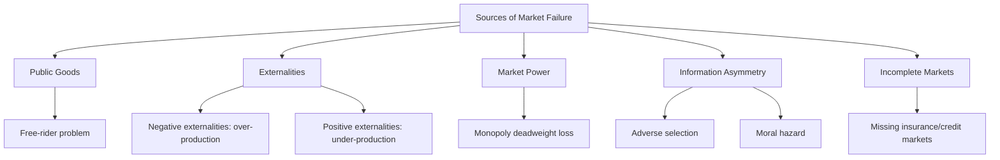

## Rationale for Government Intervention in Markets

### Definition

The rationale for government intervention in markets refers to the set of theoretical justifications — rooted primarily in market failure and distributional concerns — for why an unregulated competitive market may fail to achieve efficient or socially desirable outcomes, and how government action (taxation, regulation, provision, redistribution) can in principle improve upon the market outcome.

The starting benchmark is the **First Fundamental Theorem of Welfare Economics**: under a complete set of competitive markets, perfect information, no externalities, and no market power, a competitive equilibrium is Pareto efficient. Government intervention is justified, in the standard efficiency framework, precisely when one or more of these conditions fail.

### Categories of Market Failure

**Key Points**

- **Public goods**: non-rivalrous and non-excludable goods, under-provided by private markets due to free-riding
- **Externalities**: costs or benefits imposed on third parties not reflected in market prices
- **Market power**: monopoly, oligopoly, and monopsony that generate deadweight loss and prices above marginal cost
- **Information asymmetry**: adverse selection and moral hazard preventing efficient market clearing
- **Incomplete markets**: absence of markets for certain risks or goods (e.g., missing insurance markets)
- **Coordination failures and macroeconomic instability**: multiple equilibria, business cycle fluctuations

### 1. Public Goods

A pure public good satisfies:

- **Non-rivalry**: one person's consumption does not reduce availability to others, $MC_{additional\ user} = 0$
- **Non-excludability**: no one can be feasibly excluded from consuming the good

Because private producers cannot charge non-payers, private provision falls below the socially efficient level. The efficient provision condition (Samuelson condition) requires:

$$\sum_{i=1}^{n} MRS_i = MRT$$

i.e., the sum of individuals' marginal rates of substitution (marginal willingness to pay) across all $n$ consumers must equal the marginal rate of transformation (marginal cost of production) — unlike private goods, where each individual's $MRS_i = MRT$ separately.

**Example**: National defense, lighthouses, basic scientific research, and (with partial excludability) public parks. Since no private firm can capture the full social value, public provision or subsidization is the standard remedy, financed through general taxation.

### 2. Externalities

An externality exists when an economic actor's decision imposes uncompensated costs or benefits on third parties.

**Negative externality (over-production)**: Private marginal cost excludes external damage:

$$MC_{social} = MC_{private} + MEC$$

Market equilibrium occurs where $MC_{private} = MB$, yielding $Q_{market} > Q_{social}$.

**Positive externality (under-production)**: Private marginal benefit excludes external benefit:

$$MB_{social} = MB_{private} + MEB$$

Market equilibrium occurs where $MB_{private} = MC$, yielding $Q_{market} < Q_{social}$.

**Example**

- Negative: Factory pollution imposes health costs on downstream residents not reflected in the firm's production costs — remedied via a **Pigouvian tax** set at $t^* = MEC$ evaluated at the social optimum, or via a cap-and-trade permit system.
- Positive: Vaccination generates herd-immunity benefits to non-vaccinated individuals — remedied via subsidies or mandates.

**Coase Theorem** offers an alternative, market-based solution: if property rights are clearly defined and transaction costs are negligible, private bargaining between affected parties can achieve the efficient outcome regardless of the initial allocation of rights, making government intervention (beyond enforcing property rights) unnecessary. [Inference: the practical applicability of the Coase theorem is widely regarded as limited by transaction costs, bargaining frictions, and the large number of affected parties in most real-world externality cases.]

### 3. Market Power

Monopoly and oligopoly restrict output below the competitive level and price above marginal cost ($P > MC$), generating deadweight loss:

$$DWL = \frac{1}{2}(P_m - MC)(Q_c - Q_m)$$

where $P_m$ and $Q_m$ are the monopoly price and quantity, and $Q_c$ is the competitive quantity.

**Example**: Utility companies (natural monopolies with high fixed, low marginal costs) are typically regulated via rate-of-return regulation or price caps rather than left unregulated, since duplicating the fixed infrastructure (e.g., electricity grids) is inefficient.

### 4. Information Asymmetry

- **Adverse selection**: pre-contractual private information leads to inefficient market unraveling (Akerlof's "market for lemons"; unraveling of private health insurance markets when insurers cannot distinguish high-risk from low-risk individuals)
- **Moral hazard**: post-contractual hidden action, where insured parties take on more risk because they do not bear the full consequences

**Example**: Absent intervention, adverse selection in health insurance markets can lead to a "death spiral," where only high-risk individuals purchase insurance, premiums rise, and low-risk individuals exit — justifying mandates (to widen the risk pool) or public provision.

### 5. Incomplete Markets

Certain risks (e.g., long-term unemployment, longevity risk, catastrophic health events) lack private insurance markets due to adverse selection, moral hazard, or lack of actuarial data — providing a rationale for public social insurance programs (unemployment insurance, public pensions, disability insurance).

### Distributional Rationale (Beyond Efficiency)

**Key Points**

- Even a perfectly efficient competitive equilibrium can produce a distribution of income/wealth that society deems unacceptably unequal
- The **Second Fundamental Theorem of Welfare Economics** shows that any Pareto-efficient allocation can, in principle, be achieved as a competitive equilibrium given an appropriate initial redistribution of endowments — implying that redistribution and efficiency are theoretically separable, though in practice redistributive taxes and transfers introduce their own distortions
- Redistribution rationale rests on a social welfare function reflecting society's aversion to inequality, e.g., a Rawlsian (maximin) or utilitarian SWF

$$SW_{utilitarian} = \sum_i u_i(y_i) \qquad SW_{Rawlsian} = \min_i u_i(y_i)$$

**Example**: Progressive income taxation, means-tested transfers (e.g., food assistance, cash transfers), and public healthcare provision are justified primarily on distributional rather than efficiency grounds.

### Merit Goods and Paternalistic Rationale

Some interventions are justified not by classic market failure but by the judgment that individuals systematically under- or over-consume certain goods relative to their own long-run welfare (merit goods/demerit goods), often informed by behavioral economics (present bias, limited attention, self-control problems).

**Example**: Mandatory retirement savings (addressing present bias in saving decisions), sin taxes on tobacco/alcohol/sugary drinks (addressing self-control problems and internalities), and compulsory education.

### Government Failure: The Countervailing Case

**Key Points**

- Market failure is a *necessary but not sufficient* condition for beneficial intervention — government intervention itself can be inefficient
- **Regulatory capture**: regulated industries may influence regulators to serve producer rather than consumer interests
- **Rent-seeking**: resources spent by interest groups to secure favorable policy rather than productive activity
- **Information constraints**: government may lack the information needed to set optimal Pigouvian taxes, price caps, or public goods quantities
- **Political economy distortions**: electoral incentives, lobbying, and bureaucratic incentives may lead to policy that diverges from the social optimum
- Public choice theory (Buchanan, Tullock) formalizes these concerns, implying that the case for intervention must weigh expected government failure against the market failure being corrected

### Comparative Table: Market Failure and Standard Remedies

| Market Failure Type | Mechanism | Standard Remedy |
| --- | --- | --- |
| Public goods | Free-riding, non-excludability | Public provision, tax financing |
| Negative externality | Uncompensated third-party costs | Pigouvian tax, cap-and-trade, regulation |
| Positive externality | Uncompensated third-party benefits | Subsidies, mandates |
| Market power | Price above marginal cost | Antitrust enforcement, price regulation |
| Adverse selection | Hidden pre-contract information | Mandates, pooling regulation, public insurance |
| Moral hazard | Hidden post-contract action | Co-payments, deductibles, monitoring |
| Incomplete markets | Missing risk markets | Public social insurance |
| Distributional inequity | Unequal endowments/outcomes | Progressive taxation, transfers |

### Illustrative Diagram: Negative Externality and the Pigouvian Correction

<svg xmlns="http://www.w3.org/2000/svg" viewBox="0 0 620 420">
<text x="310" y="26" font-size="16" font-weight="bold" text-anchor="middle" fill="#1a1a1a">Negative Externality Correction (svg_diagram)</text>
<line x1="70" y1="360" x2="560" y2="360" stroke="#333" stroke-width="1.5" />
<line x1="70" y1="360" x2="70" y2="50" stroke="#333" stroke-width="1.5" />
<text x="560" y="378" font-size="12" text-anchor="middle" fill="#333">Quantity</text>
<text x="45" y="50" font-size="12" text-anchor="middle" fill="#333">Price</text>
<line x1="90" y1="330" x2="540" y2="90" stroke="#cc3333" stroke-width="2" />
<text x="545" y="88" font-size="11" fill="#cc3333">MC_private</text>
<line x1="90" y1="290" x2="540" y2="50" stroke="#8833cc" stroke-width="2" />
<text x="545" y="48" font-size="11" fill="#8833cc">MC_social = MC_private + MEC</text>
<line x1="90" y1="90" x2="540" y2="330" stroke="#33994d" stroke-width="2" />
<text x="545" y="332" font-size="11" fill="#33994d">MB = Demand</text>
<line x1="360" y1="360" x2="360" y2="176" stroke="#666" stroke-width="1" stroke-dasharray="4" />
<text x="360" y="376" font-size="11" text-anchor="middle" fill="#666">Q_market</text>
<line x1="270" y1="360" x2="270" y2="215" stroke="#666" stroke-width="1" stroke-dasharray="4" />
<text x="270" y="376" font-size="11" text-anchor="middle" fill="#666">Q_social</text>
<polygon points="270,215 360,176 360,143" fill="#f4cccc" fill-opacity="0.6" stroke="none" />
<text x="330" y="200" font-size="10" fill="#990000">Deadweight loss from over-production</text>
</svg>

### Conclusion

Government intervention in markets is theoretically justified when one or more classical market failure conditions hold — public goods, externalities, market power, information asymmetry, or incomplete markets — or when society's welfare judgments demand redistribution beyond what an efficient market allocation would produce. However, the existence of market failure alone does not establish that intervention improves outcomes: the comparative institutional analysis embedded in public choice theory requires weighing the costs of government failure against the market failure being addressed, making the practical case for intervention an empirical and institutional question as much as a theoretical one.

**Related Topics**

- The First and Second Fundamental Theorems of Welfare Economics
- Public Goods: Theory and the Free-Rider Problem
- Pigouvian Taxes and Cap-and-Trade Systems
- The Coase Theorem and Its Limitations
- Adverse Selection and Moral Hazard in Insurance Markets
- Public Choice Theory and Government Failure
- Social Welfare Functions and Redistribution
- Behavioral Public Economics and Merit Goods