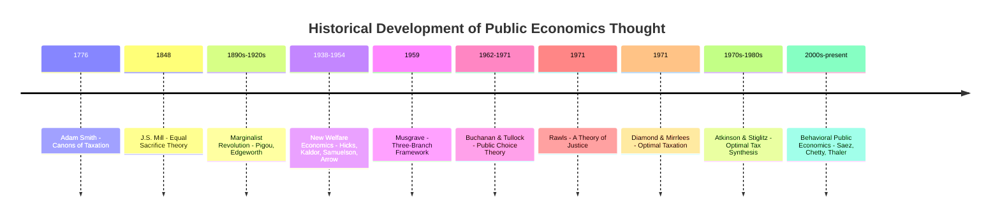

## Historical Development of Public Economics Thought

### Definition

The historical development of public economics thought traces the evolution of ideas about the proper role, scope, and instruments of government in the economy — from early mercantilist and classical treatments of taxation, through the marginalist welfare-economics revolution, to the modern synthesis of optimal tax theory, public choice, and behavioral public economics. Understanding this intellectual history clarifies why the field is organized around efficiency, equity, and institutional constraints as its three central concerns.

### Overview Timeline

### Phase 1: Classical Foundations (18th–19th Century)

**Adam Smith (1776, *The Wealth of Nations*)** established the first systematic framework for evaluating taxation through his four **canons of taxation**:

1. **Equity**: taxes should be proportional to ability to pay
2. **Certainty**: tax liability should be clear and not arbitrary
3. **Convenience**: taxes should be collected at a time/manner convenient to the taxpayer
4. **Economy**: the cost of collection should be minimized relative to revenue raised

Smith also articulated an early view of government's proper role limited to national defense, justice, and public works/institutions that private markets would under-provide — an early, informal statement of the public goods rationale.

**David Ricardo** contributed to tax incidence theory, notably analyzing the incidence of land taxes and the theory of rent, laying groundwork for later incidence analysis.

**John Stuart Mill (1848, *Principles of Political Economy*)** advanced the **equal sacrifice principle** as a normative basis for progressive taxation — the idea that taxation should impose equal *sacrifice of utility* across taxpayers rather than equal absolute or proportional payments, distinguishing between equal absolute sacrifice, equal proportional sacrifice, and equal marginal sacrifice (the last implying strongly progressive taxation under diminishing marginal utility of income).

### Phase 2: The Marginalist Revolution and Welfare Economics (1870s–1930s)

The marginalist revolution (Jevons, Menger, Walras) introduced utility-based marginal analysis, which **Alfred Marshall** and later **A.C. Pigou** applied systematically to public finance.

**Arthur Cecil Pigou (1920, *The Economics of Welfare*)** is the pivotal figure of this phase:

- Formalized the distinction between **private marginal product/cost** and **social marginal product/cost**, providing the modern theory of externalities
- Proposed the **Pigouvian tax**: a corrective tax set equal to the marginal external cost at the socially optimal quantity, aligning private incentives with social welfare
- Advanced early welfare economics based on cardinal, interpersonally comparable utility — later criticized as scientifically untenable

**Key Points**

- Pigou's framework assumed utility could be measured and compared across individuals (cardinal utilitarianism), a premise the subsequent "New Welfare Economics" sought to avoid
- The Pigouvian tradition remains the theoretical basis for modern carbon taxes, congestion pricing, and sin taxes

### Phase 3: The New Welfare Economics and Ordinalist Turn (1930s–1950s)

Responding to the philosophical difficulty of interpersonal utility comparisons, economists developed frameworks avoiding cardinal utility:

- **Pareto efficiency** (building on Vilfredo Pareto, early 1900s) became the dominant efficiency criterion, requiring no interpersonal comparisons — an allocation is efficient if no one can be made better off without making someone else worse off
- **Nicholas Kaldor (1939) and John Hicks (1939)** developed the **Kaldor-Hicks compensation criterion**: a policy is an improvement if the gainers *could* compensate the losers and still be better off, even if compensation does not actually occur — allowing cost-benefit comparisons without requiring literal redistribution
- **Paul Samuelson (1954, "The Pure Theory of Public Expenditure")** formalized the modern theory of public goods, deriving the efficiency condition $\sum MRS_i = MRT$ for optimal public goods provision — the **Samuelson condition**
- **Kenneth Arrow (1951, *Social Choice and Individual Values*)** proved the **Impossibility Theorem**, showing that no voting/aggregation rule can satisfy a minimal set of reasonable fairness axioms simultaneously when aggregating individual preferences into a social ranking — a foundational result for social choice theory and normative public economics
- **John Hicks and Roy Harrod** formalized the **First and Second Fundamental Theorems of Welfare Economics**, distinguishing the efficiency role of competitive markets from the separate question of distributive justice achievable via lump-sum redistribution

### Phase 4: The Musgrave Synthesis (1959)

**Richard Musgrave (1959, *The Theory of Public Finance*)** is widely regarded as unifying public finance into a coherent field via the **three-branch framework**:

1. **Allocation branch**: correcting market failures, providing public goods
2. **Distribution branch**: adjusting the distribution of income/wealth
3. **Stabilization branch**: macroeconomic stabilization via fiscal policy

This taxonomy structured how public finance was taught and organized for decades and remains a standard pedagogical reference point, even as stabilization has increasingly migrated toward macroeconomics as a distinct subfield.

### Phase 5: Public Choice Theory (1960s–1970s)

**James Buchanan and Gordon Tullock (1962, *The Calculus of Consent*)** launched **public choice theory**, applying economic reasoning (rational self-interest, methodological individualism) to political and bureaucratic behavior rather than assuming a benevolent social planner.

**Key Points**

- Challenged the implicit assumption in welfare economics that government would act to correct market failures optimally
- Introduced concepts of **rent-seeking** (Tullock, 1967), **regulatory capture**, and **median voter theorem** dynamics (building on Duncan Black's 1948 work) as explanations for why real-world policy diverges from the social-welfare-maximizing benchmark
- Buchanan received the 1986 Nobel Memorial Prize in Economic Sciences for this contribution
- This phase introduced the now-standard caveat that "market failure" is necessary but not sufficient justification for intervention, since **government failure** is also possible

### Phase 6: Optimal Taxation Theory (1970s–1980s)

This phase formalized normative tax design using explicit social welfare functions subject to behavioral (incentive) constraints.

- **Frank Ramsey (1927)** — though earlier — provided the foundational result for optimal commodity taxation: the **inverse elasticity rule**, whereby tax rates on goods should be inversely proportional to their price elasticity of demand to minimize aggregate deadweight loss for a given revenue requirement
- **Peter Diamond and James Mirrlees (1971)** extended Ramsey's logic to production efficiency and formalized the **optimal income tax problem** under asymmetric information (the government observes income but not underlying ability), a landmark contribution for which Mirrlees shared the 1996 Nobel Memorial Prize
- **John Rawls (1971, *A Theory of Justice*)** provided an influential normative benchmark via the **maximin criterion** — evaluating policies by their effect on the worst-off individual — offering an alternative to utilitarian social welfare functions
- **Anthony Atkinson and Joseph Stiglitz (1976)** derived the **Atkinson-Stiglitz theorem**, showing that under a nonlinear optimal income tax and separable preferences, differential commodity taxation is unnecessary — a foundational result in the optimal tax literature refining when indirect taxes are needed alongside income taxation

### Phase 7: Empirical and Behavioral Turn (1990s–Present)

**Key Points**

- The **"credibility revolution"** in empirical economics (Angrist, Card, Krueger, and others) brought quasi-experimental methods (difference-in-differences, regression discontinuity, instrumental variables) into public economics, shifting emphasis toward measuring real-world behavioral elasticities rather than relying solely on calibrated theoretical models
- **Emmanuel Saez** extended optimal tax theory using empirically estimated elasticities of taxable income and top income distributions, producing widely cited formulas for revenue-maximizing top tax rates
- **Raj Chetty** and coauthors pioneered large-scale administrative-data studies of tax and transfer program effects (EITC, unemployment insurance, intergenerational mobility)
- **Behavioral public economics** (Richard Thaler, 2017 Nobel laureate; and others) incorporated insights from behavioral economics — present bias, limited attention, default effects — into the design of tax and social insurance policy, producing concepts like "nudges," automatic enrollment in retirement savings, and internality-correcting taxation (e.g., sin taxes justified partly by self-control problems rather than pure externalities)
- [Inference: The relative weight given to structural theoretical modeling versus reduced-form empirical estimation remains an actively debated methodological question within the field.]

### Comparative Table: Major Contributors and Contributions

| Era | Key Figure(s) | Core Contribution |
| --- | --- | --- |
| 1776 | Adam Smith | Canons of taxation |
| 1848 | J.S. Mill | Equal sacrifice theory of progressive taxation |
| 1920 | A.C. Pigou | Externality theory, Pigouvian tax |
| 1939 | Kaldor, Hicks | Compensation criterion (Kaldor-Hicks efficiency) |
| 1951 | Kenneth Arrow | Impossibility Theorem (social choice) |
| 1954 | Paul Samuelson | Public goods efficiency condition |
| 1959 | Richard Musgrave | Three-branch framework |
| 1962-1967 | Buchanan, Tullock | Public choice theory, rent-seeking |
| 1971 | Diamond, Mirrlees | Optimal income taxation under asymmetric information |
| 1971 | John Rawls | Maximin normative criterion |
| 1976 | Atkinson, Stiglitz | Atkinson-Stiglitz theorem on commodity taxation |
| 1990s-present | Saez, Chetty, Thaler | Empirical and behavioral public economics |

### Illustrative Diagram: Conceptual Evolution of the Field's Core Concerns

<svg xmlns="http://www.w3.org/2000/svg" viewBox="0 0 700 360">
<text x="350" y="26" font-size="16" font-weight="bold" text-anchor="middle" fill="#1a1a1a">Evolution of Public Economics Thought (svg_diagram)</text>
<line x1="60" y1="320" x2="660" y2="320" stroke="#333" stroke-width="1.5" />
<line x1="60" y1="320" x2="60" y2="330" stroke="#333" />
<text x="60" y="345" font-size="10" text-anchor="middle" fill="#333">1776</text>
<line x1="190" y1="320" x2="190" y2="330" stroke="#333" />
<text x="190" y="345" font-size="10" text-anchor="middle" fill="#333">1920</text>
<line x1="320" y1="320" x2="320" y2="330" stroke="#333" />
<text x="320" y="345" font-size="10" text-anchor="middle" fill="#333">1954</text>
<line x1="420" y1="320" x2="420" y2="330" stroke="#333" />
<text x="420" y="345" font-size="10" text-anchor="middle" fill="#333">1962</text>
<line x1="520" y1="320" x2="520" y2="330" stroke="#333" />
<text x="520" y="345" font-size="10" text-anchor="middle" fill="#333">1971</text>
<line x1="630" y1="320" x2="630" y2="330" stroke="#333" />
<text x="630" y="345" font-size="10" text-anchor="middle" fill="#333">2000s+</text>
<circle cx="60" cy="280" r="8" fill="#3366cc" />
<text x="60" y="260" font-size="10" text-anchor="middle" fill="#333">Smith:</text>
<text x="60" y="248" font-size="10" text-anchor="middle" fill="#333">Tax canons</text>
<circle cx="190" cy="230" r="8" fill="#cc3333" />
<text x="190" y="210" font-size="10" text-anchor="middle" fill="#333">Pigou:</text>
<text x="190" y="198" font-size="10" text-anchor="middle" fill="#333">Externalities</text>
<circle cx="320" cy="180" r="8" fill="#33994d" />
<text x="320" y="160" font-size="10" text-anchor="middle" fill="#333">Samuelson:</text>
<text x="320" y="148" font-size="10" text-anchor="middle" fill="#333">Public goods</text>
<circle cx="420" cy="230" r="8" fill="#cc9933" />
<text x="420" y="210" font-size="10" text-anchor="middle" fill="#333">Buchanan:</text>
<text x="420" y="198" font-size="10" text-anchor="middle" fill="#333">Public choice</text>
<circle cx="520" cy="150" r="8" fill="#8833cc" />
<text x="520" y="130" font-size="10" text-anchor="middle" fill="#333">Mirrlees/Rawls:</text>
<text x="520" y="118" font-size="10" text-anchor="middle" fill="#333">Optimal tax/justice</text>
<circle cx="630" cy="200" r="8" fill="#008080" />
<text x="630" y="180" font-size="10" text-anchor="middle" fill="#333">Saez/Chetty:</text>
<text x="630" y="168" font-size="10" text-anchor="middle" fill="#333">Empirical turn</text>
</svg>

### Why the Historical Development Matters for Modern Practice

**Key Points**

- Each phase added a durable analytical layer rather than replacing prior frameworks: modern public economics still uses Pigouvian logic for externalities, Samuelson's condition for public goods, Musgrave's taxonomy for organizing the field, and public choice caveats for institutional realism
- The historical arc traces a shift from **normative philosophizing** (Smith, Mill) → **formal welfare theory** (Pigou, Samuelson, Arrow) → **institutional realism** (Buchanan, Tullock) → **rigorous optimal design** (Mirrlees, Diamond, Atkinson-Stiglitz) → **empirical grounding** (Saez, Chetty) and **behavioral realism** (Thaler)
- Understanding this progression clarifies why contemporary public economics treats efficiency, equity, and political-institutional feasibility as jointly necessary lenses rather than competing paradigms

### Conclusion

The history of public economics thought reflects a cumulative deepening of analytical rigor: from Smith's practical canons of taxation, through Pigou's formalization of externalities and the ordinalist welfare-economics revolution, to Musgrave's organizing synthesis, Buchanan's institutional realism, Mirrlees' optimal tax theory, and the contemporary empirical and behavioral turn. Each phase remains embedded in the modern toolkit, making the field's history directly relevant to understanding its current methods and open debates.

**Related Topics**

- Pigouvian Taxation and the Theory of Externalities
- The Samuelson Condition for Public Goods Provision
- Musgrave's Three-Branch Framework in Depth
- Public Choice Theory and the Median Voter Theorem
- The Mirrlees Optimal Income Tax Model
- The Atkinson-Stiglitz Theorem
- Rawlsian versus Utilitarian Social Welfare Functions
- Behavioral Public Economics and Nudge Theory
- The Credibility Revolution in Empirical Public Finance