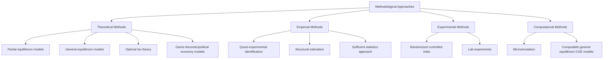

## Methodological Approaches in Public Economics

### Definition

Methodological approaches in public economics refer to the analytical, theoretical, and empirical toolkits economists use to study government intervention in markets. These range from abstract theoretical modeling of optimal policy design to applied econometric estimation of behavioral responses, and increasingly incorporate experimental, computational, and behavioral methods. The choice of method reflects the underlying question: theoretical methods derive what *should* be optimal under stated assumptions, while empirical methods estimate what actually *happens* when policies change.

### Overview of Major Methodological Families

### 1. Theoretical/Analytical Methods

**Key Points**

- Build formal mathematical models under explicit assumptions to derive qualitative or quantitative predictions about optimal policy or market outcomes
- Serve as the deductive backbone of the field, providing testable hypotheses for empirical work and normative benchmarks for policy evaluation

**Partial equilibrium analysis** examines a single market in isolation, holding other markets fixed — standard for analyzing tax incidence and deadweight loss in a specific market.

**Example**

For a per-unit tax $t$ in a competitive market with linear supply and demand, the deadweight loss is:

$$DWL = \frac{1}{2} t \cdot \Delta Q = \frac{1}{2} t^2 \cdot \frac{\varepsilon_D \varepsilon_S}{\varepsilon_D + \varepsilon_S} \cdot \frac{Q_0}{P_0}$$

where $\varepsilon_D$ and $\varepsilon_S$ are demand and supply elasticities — illustrating the theoretical result that deadweight loss rises with the square of the tax rate and with the elasticities of supply and demand.

**General equilibrium analysis** accounts for interactions across multiple markets simultaneously (e.g., how a corporate tax affects wages, capital returns, and consumer prices jointly), essential when policy changes are large enough to affect relative prices across the economy.

**Optimal tax and expenditure theory** derives policy prescriptions by maximizing a social welfare function subject to behavioral incentive-compatibility constraints — exemplified by the Ramsey rule for commodity taxation and the Mirrlees model for income taxation.

**Game-theoretic and political economy models** analyze strategic interaction among voters, politicians, bureaucrats, and interest groups (e.g., median voter models, probabilistic voting models, principal-agent models of bureaucracy).

### 2. Empirical/Econometric Methods

**Key Points**

- Estimate real-world causal effects of taxes, transfers, and regulations using observational or quasi-experimental data
- The "credibility revolution" (1990s–present) shifted emphasis toward research designs with a clear source of identifying variation, rather than relying solely on structural assumptions

**Standard identification strategies:**

| Method | Core Idea | Public Economics Example |
| --- | --- | --- |
| Difference-in-differences (DiD) | Compare treated vs. control groups before/after a policy change | Effect of a state minimum wage increase on employment |
| Regression discontinuity (RD) | Exploit a sharp eligibility threshold | Effect of crossing an EITC income threshold on labor supply |
| Instrumental variables (IV) | Use exogenous variation to isolate causal effect | Using tax reform "kinks" as an instrument for marginal tax rates |
| Bunching estimators | Analyze excess mass at kinks/notches in a tax schedule | Estimating the elasticity of taxable income from bunching at tax-bracket kinks |
| Event study designs | Track outcomes around a policy change over time | Dynamic effects of a corporate tax reform on investment |

**Example**

The elasticity of taxable income (ETI) is commonly estimated via a bunching estimator: if a tax schedule has a kink at income $y^*$ where the marginal tax rate jumps from $\tau_1$ to $\tau_2$, excess bunching mass $B$ just below $y^*$ identifies the elasticity:

$$e \approx \frac{B / h(y^*)}{y^* \cdot \log\left(\frac{1-\tau_1}{1-\tau_2}\right)}$$

where $h(y^*)$ is the counterfactual density at the kink. [Inference: precise bunching estimates are sensitive to the bandwidth and counterfactual density assumptions used in a given study.]

**Structural estimation** specifies and estimates a full behavioral model (e.g., a labor supply model with specific utility function parameters), allowing researchers to simulate counterfactual policies not directly observed in the data — at the cost of relying on stronger functional-form assumptions than quasi-experimental "reduced-form" methods.

### 3. The Sufficient Statistics Approach

**Key Points**

- Developed prominently by Raj Chetty and coauthors, this approach bridges theory and empirics by deriving optimal policy formulas that depend only on a small number of empirically estimable "sufficient statistics" (typically elasticities), rather than requiring full structural estimation of underlying preferences
- Example: the optimal top tax rate formula $\tau^* = \frac{1}{1+a \cdot e}$ requires only the Pareto parameter $a$ and the ETI $e$ — both directly estimable — rather than a fully specified utility function
- This approach has become a dominant paradigm in modern applied optimal tax and expenditure analysis because it minimizes reliance on potentially misspecified structural assumptions while retaining a clear link to welfare theory

### 4. Experimental Methods

**Randomized controlled trials (RCTs)** randomly assign a policy treatment (e.g., a cash transfer, a job training program, a tax nudge) across a sample, enabling clean causal identification without relying on quasi-experimental assumptions.

**Example**: Randomized evaluations of conditional cash transfer programs (e.g., Mexico's Progresa/Oportunidades) and randomized nudges in retirement savings (default enrollment experiments) have directly informed program design in both developing and developed countries.

**Lab and field experiments** test behavioral responses to stylized tax and public goods scenarios (e.g., voluntary contribution mechanism experiments testing free-riding behavior in public goods games), informing behavioral public economics.

**Key Points**

- RCTs offer high internal validity but can face limits to external validity (scale effects, general equilibrium effects not present in small pilots) and ethical/political constraints on randomizing certain policies (e.g., tax rates)

### 5. Computational and Simulation Methods

**Microsimulation models** apply detailed tax and benefit rules to representative household-level survey or administrative data to simulate the distributional and revenue effects of policy reforms.

**Example**: A microsimulation model might apply a proposed new income tax schedule to a nationally representative household dataset, computing the resulting change in tax liability, disposable income, and poverty rates across the income distribution — before and after accounting for estimated behavioral responses (e.g., labor supply adjustments).

**Computable general equilibrium (CGE) models** simulate an entire economy with multiple sectors, factor markets, and household types, used to evaluate large-scale policy reforms (e.g., major tax reforms, trade policy) where cross-market feedback effects are significant.

### Comparative Table: Strengths and Limitations

| Method | Strength | Limitation |
| --- | --- | --- |
| Theoretical/optimal tax models | Clear normative benchmark, internally consistent | Relies on strong assumptions (SWF form, rationality) |
| Reduced-form empirical (DiD, RD, IV) | High internal validity, minimal structural assumptions | Estimates local/specific effects; limited external validity |
| Structural estimation | Enables counterfactual policy simulation | Sensitive to functional-form and distributional assumptions |
| Sufficient statistics approach | Links theory and evidence with minimal assumptions | Requires assumption that a small set of elasticities is sufficient |
| RCTs | Strong causal identification | Scale/general equilibrium effects, ethical/feasibility constraints |
| Microsimulation | Detailed distributional analysis | Often static; behavioral responses added separately |
| CGE models | Captures economy-wide feedback effects | Complex calibration; sensitive to parameter choices |

### Illustrative Diagram: Theory-Empirics Feedback Loop

<svg xmlns="http://www.w3.org/2000/svg" viewBox="0 0 680 340">
<text x="340" y="26" font-size="16" font-weight="bold" text-anchor="middle" fill="#1a1a1a">Theory-Empirics Feedback Loop (svg_diagram)</text>
<rect x="60" y="70" width="180" height="80" rx="8" fill="#e8f0fe" stroke="#3366cc" stroke-width="1.5" />
<text x="150" y="105" font-size="13" font-weight="bold" text-anchor="middle" fill="#1a1a1a">Theoretical Model</text>
<text x="150" y="125" font-size="11" text-anchor="middle" fill="#333">Generates testable</text>
<text x="150" y="140" font-size="11" text-anchor="middle" fill="#333">predictions (e.g., elasticity)</text>
<rect x="440" y="70" width="180" height="80" rx="8" fill="#e6f4ea" stroke="#33994d" stroke-width="1.5" />
<text x="530" y="105" font-size="13" font-weight="bold" text-anchor="middle" fill="#1a1a1a">Empirical Estimation</text>
<text x="530" y="125" font-size="11" text-anchor="middle" fill="#333">DiD, RD, IV, RCT</text>
<text x="530" y="140" font-size="11" text-anchor="middle" fill="#333">estimates parameters</text>
<path d="M240 100 L440 100" stroke="#666" stroke-width="2" marker-end="url(#arrow2)" />
<text x="340" y="90" font-size="10" text-anchor="middle" fill="#666">Predicts</text>
<path d="M440 130 L240 130" stroke="#666" stroke-width="2" marker-end="url(#arrow2)" />
<text x="340" y="150" font-size="10" text-anchor="middle" fill="#666">Refines/Calibrates</text>
<rect x="250" y="220" width="180" height="80" rx="8" fill="#fff4e5" stroke="#cc9933" stroke-width="1.5" />
<text x="340" y="255" font-size="13" font-weight="bold" text-anchor="middle" fill="#1a1a1a">Sufficient Statistics</text>
<text x="340" y="275" font-size="11" text-anchor="middle" fill="#333">Optimal policy formula</text>
<text x="340" y="290" font-size="11" text-anchor="middle" fill="#333">using estimated elasticities</text>
<path d="M150 150 L280 220" stroke="#666" stroke-width="1.5" marker-end="url(#arrow2)" />
<path d="M530 150 L400 220" stroke="#666" stroke-width="1.5" marker-end="url(#arrow2)" />
</svg>

### Methodological Debates and Open Issues

**Key Points**

- **Structural vs. reduced-form tension**: reduced-form methods offer credible identification but limited ability to predict unobserved counterfactual policies; structural models can simulate any counterfactual but rest on stronger assumptions — the sufficient statistics approach is a partial reconciliation
- **External validity**: results from a specific natural experiment (e.g., one country's tax reform) may not generalize to different institutional contexts [Inference: the degree of generalizability varies substantially by policy domain and is actively debated within applied microeconomics]
- **General equilibrium vs. partial equilibrium**: partial equilibrium estimates (e.g., a single-market labor supply elasticity) may miss important cross-market effects captured only by general equilibrium or CGE approaches
- **Behavioral realism vs. tractability**: incorporating behavioral biases (present bias, inattention) improves realism but complicates optimal policy derivation and often requires additional untested assumptions about the welfare-relevance of biased behavior

### Conclusion

Public economics employs a pluralistic methodological toolkit spanning theoretical optimal-policy modeling, quasi-experimental and structural econometrics, randomized experiments, and computational simulation. The sufficient statistics approach exemplifies the field's current methodological synthesis, deriving policy-relevant formulas that depend on a small set of empirically estimable elasticities, thereby linking rigorous welfare theory to credible causal estimation. Contemporary public economics research typically combines multiple methods — using theory to identify which parameters matter, quasi-experimental or experimental methods to estimate them credibly, and simulation methods to translate estimates into policy-relevant distributional and revenue projections.

**Related Topics**

- Difference-in-Differences and Regression Discontinuity Design
- The Elasticity of Taxable Income and Bunching Estimators
- The Sufficient Statistics Approach to Optimal Policy
- Structural versus Reduced-Form Estimation in Public Finance
- Microsimulation Modeling of Tax and Transfer Reforms
- Computable General Equilibrium (CGE) Models in Fiscal Policy Analysis
- Randomized Controlled Trials in Development and Public Finance
- Behavioral Public Economics Methodology