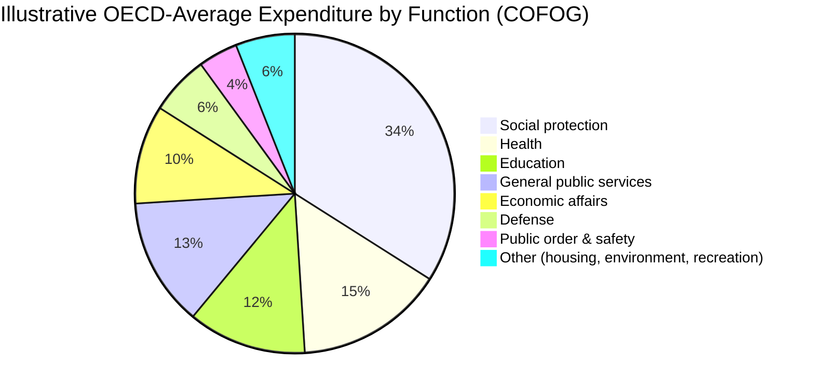

## Overview of Government Revenue and Expenditure Trends

### Definition

Government revenue and expenditure trends refer to the observed patterns in how governments raise resources (through taxation, borrowing, and other sources) and allocate them (through spending on goods, services, and transfers) over time, typically measured relative to gross domestic product (GDP) to allow cross-country and cross-period comparison. Tracking these trends is foundational to public economics because it reveals the actual scale and composition of government activity relative to the theoretical rationales for intervention, and grounds analysis of fiscal sustainability, redistribution, and macroeconomic stabilization.

### Standard Measurement Framework

Government fiscal accounts are typically measured on a **general government** basis under the **System of National Accounts (SNA 2008)**, consolidating central, state/regional, and local government plus social security funds, expressed as a share of GDP for comparability:

$$\text{Revenue ratio} = \frac{\text{Total government revenue}}{\text{GDP}} \times 100, \qquad \text{Expenditure ratio} = \frac{\text{Total government expenditure}}{\text{GDP}} \times 100$$

The **fiscal balance** (or net lending/net borrowing) is the difference:

$$\text{Fiscal balance} = \text{Revenue} - \text{Expenditure}$$

A negative balance is a **deficit**, financed by borrowing, which accumulates into **government debt** (typically measured as **gross debt-to-GDP**).

Expenditure is commonly classified two ways:

- **Economic classification**: compensation of employees, intermediate consumption, social benefits/transfers, subsidies, interest payments, capital expenditure
- **Functional classification (COFOG)**: general public services, defense, public order/safety, economic affairs, environmental protection, housing, health, recreation/culture, education, social protection

### Revenue-Side Trends

**Key Points**

- General government revenues across the OECD averaged 37.9% of GDP in 2023, a slight increase of 0.4 percentage points from 37.5% in 2019 [OECD](https://www.oecd.org/en/publications/government-at-a-glance-2025_0efd0bcd-en/full-report/general-government-revenues_b2379d0e.html)
- Norway, Finland, and France recorded the highest revenue-to-GDP ratios among OECD countries in 2023, at 63.2%, 53.0%, and 51.6% respectively [OECD](https://www.oecd.org/en/publications/government-at-a-glance-2025_0efd0bcd-en/full-report/general-government-revenues_b2379d0e.html)
- OECD government revenues remained broadly stable between 2007 and 2024, fluctuating between a low of 35.6% of GDP in 2009 following the global financial crisis and a peak of 39.4% in 2022 in the aftermath of the COVID-19 pandemic, before largely returning to pre-pandemic levels by 2023 [OECD](https://www.oecd.org/en/publications/government-at-a-glance-2025_0efd0bcd-en/full-report/general-government-revenues_b2379d0e.html)[OECD](https://www.oecd.org/en/publications/government-at-a-glance-2025_0efd0bcd-en/full-report/general-government-revenues_b2379d0e.html)
- Revenues increased notably since 2019 in Japan (+2.3 percentage points) and the United Kingdom (+2.6 percentage points) [OECD](https://www.oecd.org/en/publications/government-at-a-glance-2025_0efd0bcd-en/full-report/general-government-revenues_b2379d0e.html)
- Revenue levels differ substantially when measured per capita due to cross-country income differences; Luxembourg recorded the highest per-capita revenue in 2023 despite a revenue-to-GDP ratio close to the OECD-EU average [OECD](https://www.oecd.org/en/publications/government-at-a-glance-2025_0efd0bcd-en/full-report/general-government-revenues_b2379d0e.html)

**Composition of revenue** typically includes:

- **Direct taxes**: personal income tax, corporate income tax
- **Indirect taxes**: value-added tax (VAT)/sales tax, excise duties, tariffs
- **Social security contributions**: payroll-based financing of pensions, health insurance, unemployment insurance
- **Non-tax revenue**: fees, property income, grants

**Example**: Revenue composition varies significantly by country — Nordic countries rely heavily on broad-based income taxation and VAT to fund extensive welfare states, while some emerging economies rely more heavily on indirect taxes and resource royalties due to weaker income-tax administrative capacity. [Inference: the precise revenue mix at any point in time reflects both policy choices and administrative constraints specific to each country.]

### Expenditure-Side Trends

**Key Points**

- OECD-EU countries tend to have a substantially higher expenditure share of GDP — averaging 46.0% — compared to the overall OECD average of 37.5%, reflecting more extensive welfare states in continental and Northern Europe relative to the OECD as a whole [OECD](https://www.oecd.org/en/publications/government-at-a-glance-2025_0efd0bcd-en/full-report/general-government-revenues_b2379d0e.html)
- Expenditure composition has shifted structurally over recent decades toward **social protection** (pensions, health, unemployment benefits) as populations age in advanced economies, a trend widely documented in COFOG functional breakdowns
- Government **investment spending** (capital expenditure on infrastructure, R&D, green energy, digital transformation) is tracked separately from current spending because of its distinct implications for long-run growth and debt sustainability

[Inference: The pie chart above illustrates a stylized/representative OECD-average functional expenditure breakdown based on well-documented long-run patterns; exact percentages vary by year and by country and should be verified against current COFOG data for precise figures.]

### Fiscal Balance and Deficit Trends

**Key Points**

- In 2023, the average general government fiscal balance across OECD countries was a deficit of 4.6% of GDP [Oecdstatistics](https://oecdstatistics.blog/2025/07/29/what-is-government-deficit-and-why-does-it-matter/)
- Only six OECD countries recorded a fiscal surplus in 2023, while 31 member countries ran fiscal deficits, reflecting a broad-based pattern of governments spending more than they raise in revenue [Oecdstatistics](https://oecdstatistics.blog/2025/07/29/what-is-government-deficit-and-why-does-it-matter/)
- The gap between revenue stability (relatively flat around 37–39% of GDP) and expenditure levels (persistently higher, especially in OECD-EU economies) is the structural source of the persistent deficit pattern observed across most advanced economies

### Government Debt Trends

**Key Points**

- Global debt stabilized just above 235% of GDP in 2024, with total global debt reaching roughly $251 trillion; public debt as a share of GDP fell globally from 100% to under 93% between the compared years, though this masks divergent trends across country groups [IMF](https://www.imf.org/external/datamapper/GDD/2025%20Global%20Debt%20Monitor.pdf)[IMF](https://www.imf.org/external/datamapper/GDD/2025%20Global%20Debt%20Monitor.pdf)
- Government borrowing rose marginally in advanced economies, including the United States, to close to 110% of GDP, while in emerging markets and developing economies it rose further [IMF](https://www.imf.org/external/datamapper/GDD/2025%20Global%20Debt%20Monitor.pdf)
- Global debt stockpiles grew by nearly $29 trillion in 2025, reaching a record $348 trillion, driven by a combination of fiscal expansion, accommodative monetary policy, and lighter-touch regulatory conditions [Institute of International Finance](https://www.iif.com/LinkClick.aspx?fileticket=tEhC0oymVlM%3D)[Institute of International Finance](https://www.iif.com/LinkClick.aspx?fileticket=tEhC0oymVlM%3D)
- The IMF's April 2026 Fiscal Monitor projects only modest narrowing of the global primary-deficit-to-GDP ratio by 2031, by roughly half a percentage point from a current level of about 2.2% — an improvement judged insufficient to meaningfully stabilize the debt trajectory [International Monetary Fund](https://www.imf.org/-/media/files/publications/fiscal-monitor/2026/april/english/text.pdf)[International Monetary Fund](https://www.imf.org/-/media/files/publications/fiscal-monitor/2026/april/english/text.pdf)
- Debt-to-GDP ratios vary enormously by country, driven by differing fiscal histories, monetary regimes, and debt-holder composition (e.g., Japan's high domestic-held debt versus emerging-market reliance on foreign-currency-denominated debt) [Inference: comparisons of debt sustainability across countries with very different debt compositions and monetary sovereignty require substantial caveats beyond the headline debt-to-GDP ratio alone]

### Comparative Table: Key Global Fiscal Indicators (Recent Data)

| Indicator | Value | Period/Source |
| --- | --- | --- |
| OECD average revenue-to-GDP | 37.9% | 2023, OECD Government at a Glance 2025 |
| OECD-EU average expenditure-to-GDP | 46.0% | Recent, OECD |
| OECD average fiscal balance | -4.6% of GDP (deficit) | 2023, OECD |
| Global debt-to-GDP | ~235%+ (all sectors) | 2024, IMF Global Debt Monitor |
| Advanced economy government debt-to-GDP | ~110% | 2024, IMF |
| Global government debt added in one year | ~$29 trillion | 2025, IIF Global Debt Monitor |
| Global primary deficit-to-GDP | 2.2% | Current, IMF Fiscal Monitor April 2026 |

### Structural Drivers of Long-Run Expenditure Growth

**Key Points**

- **Wagner's Law**: an empirical regularity observed since the late 19th century suggesting government expenditure tends to grow as a share of GDP as economies develop, reflecting rising demand for public goods, social insurance, and regulation as income rises [Inference: Wagner's Law is a widely cited empirical pattern rather than a strict theoretical law, and its applicability varies across countries and time periods]
- **Demographic aging**: rising old-age dependency ratios increase pension and healthcare expenditure pressures in most advanced economies, a key driver of the long-run expenditure trend documented in IMF and OECD fiscal projections
- **Baumol's cost disease**: labor-intensive public services (education, healthcare, public administration) tend to see costs rise faster than productivity growth relative to goods-producing sectors, pushing up the relative cost of maintaining constant service levels
- **Discretionary fiscal responses to shocks**: crises (global financial crisis 2008–09, COVID-19 pandemic 2020–21) trigger temporary but sometimes persistent step-changes in both revenue (automatic stabilizers) and expenditure (stimulus, relief programs)

### Illustrative Diagram: Revenue-Expenditure-Debt Relationship

<svg xmlns="http://www.w3.org/2000/svg" viewBox="0 0 680 380">
<text x="340" y="26" font-size="16" font-weight="bold" text-anchor="middle" fill="#1a1a1a">Revenue-Expenditure-Debt Dynamics (svg_diagram)</text>
<rect x="40" y="70" width="170" height="70" rx="8" fill="#e8f0fe" stroke="#3366cc" stroke-width="1.5" />
<text x="125" y="100" font-size="13" font-weight="bold" text-anchor="middle" fill="#1a1a1a">Revenue</text>
<text x="125" y="120" font-size="11" text-anchor="middle" fill="#333">~38% of GDP (OECD avg)</text>
<rect x="470" y="70" width="170" height="70" rx="8" fill="#fce8e6" stroke="#cc3333" stroke-width="1.5" />
<text x="555" y="100" font-size="13" font-weight="bold" text-anchor="middle" fill="#1a1a1a">Expenditure</text>
<text x="555" y="120" font-size="11" text-anchor="middle" fill="#333">~42-46% of GDP (OECD/EU avg)</text>
<path d="M210 105 L280 105" stroke="#666" stroke-width="1.5" />
<path d="M470 105 L400 105" stroke="#666" stroke-width="1.5" />
<rect x="255" y="90" width="150" height="30" fill="#fff" stroke="none" />
<text x="330" y="110" font-size="12" text-anchor="middle" fill="#333">minus</text>
<rect x="255" y="180" width="170" height="60" rx="8" fill="#fff4e5" stroke="#cc9933" stroke-width="1.5" />
<text x="340" y="210" font-size="13" font-weight="bold" text-anchor="middle" fill="#1a1a1a">Fiscal Balance</text>
<text x="340" y="228" font-size="11" text-anchor="middle" fill="#333">avg -4.6% of GDP (deficit)</text>
<path d="M330 140 L340 180" stroke="#666" stroke-width="1.5" marker-end="url(#arrow3)" />
<rect x="255" y="290" width="170" height="60" rx="8" fill="#e6f4ea" stroke="#33994d" stroke-width="1.5" />
<text x="340" y="318" font-size="13" font-weight="bold" text-anchor="middle" fill="#1a1a1a">Accumulated Debt</text>
<text x="340" y="336" font-size="11" text-anchor="middle" fill="#333">Advanced econ. ~110% of GDP</text>
<path d="M340 240 L340 290" stroke="#666" stroke-width="1.5" marker-end="url(#arrow3)" />
</svg>

### Implications for Public Economics Analysis

**Key Points**

- Persistent deficits and rising debt ratios sharpen the relevance of **optimal tax theory** and **expenditure prioritization**, since fiscal space for new spending or tax cuts is increasingly constrained by debt-service obligations
- The gap between relatively stable revenue ratios and rising expenditure pressures (driven by aging populations and cost disease) underlies ongoing policy debate over entitlement reform, tax base broadening, and efficiency-enhancing expenditure reallocation
- Cross-country variation in revenue/expenditure ratios (Nordic high-tax/high-spend models versus lower-tax/lower-spend models elsewhere) provides natural comparative evidence for evaluating the equity-efficiency tradeoffs central to public economics
- Debt sustainability analysis — comparing the growth rate of debt to GDP growth and the primary balance needed to stabilize debt — has become a central applied topic given IMF assessments that debt-to-GDP trajectories are not expected to stabilize under current policies in a majority of global GDP [Inference: this reflects an assessment as of the IMF's most recent Fiscal Monitor and is subject to revision as policy and macroeconomic conditions evolve] [International Monetary Fund](https://www.imf.org/-/media/files/publications/fiscal-monitor/2026/april/english/text.pdf)

### Conclusion

Government revenue-to-GDP ratios across OECD economies have remained comparatively stable over recent decades (around 37–39%), while expenditure ratios — particularly in OECD-EU countries — have tended to run higher, producing persistent average fiscal deficits (around 4.6% of GDP in 2023) and a global debt stock that has continued to climb, exceeding $348 trillion by 2025. These trends, driven structurally by demographic aging, cost disease in labor-intensive public services, and episodic crisis responses, underscore the practical fiscal constraints within which the normative and positive tools of public economics — optimal taxation, expenditure design, and debt sustainability analysis — must operate.

**Related Topics**

- Fiscal Sustainability and Debt Dynamics
- Classification of Government Expenditure by Function (COFOG)
- Automatic Stabilizers and Discretionary Fiscal Policy
- Wagner's Law and the Long-Run Growth of Government
- Tax Structure and Revenue Composition Across Countries
- Intergenerational Fiscal Burden and Population Aging
- Sovereign Debt Sustainability Analysis
- Comparative Welfare State Models (Nordic, Continental, Liberal)