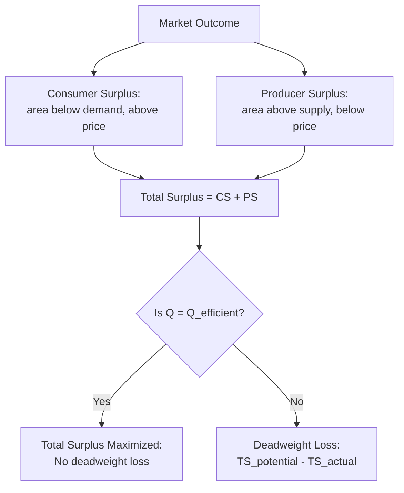

## Consumer and Producer Surplus Review

### Definition

Consumer surplus and producer surplus are the foundational welfare-measurement tools of applied welfare economics, used throughout public economics to quantify the efficiency effects of taxes, subsidies, regulation, and market interventions. **Consumer surplus (CS)** is the difference between what consumers are willing to pay for a good and what they actually pay. **Producer surplus (PS)** is the difference between what producers receive for a good and their marginal cost of producing it. Together, CS + PS constitute **total surplus (social surplus)**, the standard measure of economic welfare in a given market used to evaluate the efficiency of market outcomes and policy interventions.

### Formal Definitions

**Consumer surplus** at market price $P^*$ and quantity $Q^*$:

$$CS = \int_0^{Q^*} \left[ D(q) - P^* \right] dq$$

where $D(q)$ is the inverse demand function (marginal willingness to pay at quantity $q$). Geometrically, CS is the area below the demand curve and above the price line, from zero to $Q^*$.

**Producer surplus** at market price $P^*$ and quantity $Q^*$:

$$PS = \int_0^{Q^*} \left[ P^* - S(q) \right] dq$$

where $S(q)$ is the inverse supply function (marginal cost at quantity $q$). Geometrically, PS is the area above the supply curve and below the price line, from zero to $Q^*$.

**Total surplus**:

$$TS = CS + PS$$

Total surplus is maximized at the competitive equilibrium where $D(Q^*) = S(Q^*)$, i.e., where marginal willingness to pay equals marginal cost — the standard efficiency benchmark.

### Illustrative Diagram: Consumer and Producer Surplus at Competitive Equilibrium

<svg xmlns="http://www.w3.org/2000/svg" viewBox="0 0 620 420">
<text x="310" y="26" font-size="16" font-weight="bold" text-anchor="middle" fill="#1a1a1a">Consumer and Producer Surplus (svg_diagram)</text>
<line x1="70" y1="360" x2="560" y2="360" stroke="#333" stroke-width="1.5" />
<line x1="70" y1="360" x2="70" y2="50" stroke="#333" stroke-width="1.5" />
<text x="560" y="378" font-size="12" text-anchor="middle" fill="#333">Quantity</text>
<text x="45" y="50" font-size="12" text-anchor="middle" fill="#333">Price</text>
<line x1="90" y1="90" x2="540" y2="330" stroke="#33994d" stroke-width="2" />
<text x="545" y="332" font-size="11" fill="#33994d">Demand (MB)</text>
<line x1="90" y1="330" x2="540" y2="90" stroke="#cc3333" stroke-width="2" />
<text x="545" y="88" font-size="11" fill="#cc3333">Supply (MC)</text>
<line x1="70" y1="210" x2="315" y2="210" stroke="#666" stroke-width="1" stroke-dasharray="4" />
<text x="55" y="214" font-size="11" text-anchor="middle" fill="#666">P*</text>
<line x1="315" y1="360" x2="315" y2="210" stroke="#666" stroke-width="1" stroke-dasharray="4" />
<text x="315" y="376" font-size="11" text-anchor="middle" fill="#666">Q*</text>
<polygon points="90,90 315,210 70,210" fill="#cfe8cf" fill-opacity="0.7" stroke="none" />
<text x="150" y="150" font-size="11" fill="#1a662e">Consumer Surplus</text>
<polygon points="90,330 315,210 70,210" fill="#f7d6d6" fill-opacity="0.7" stroke="none" />
<text x="130" y="280" font-size="11" fill="#991a1a">Producer Surplus</text>
</svg>

### Consumer Surplus: Deeper Mechanics

**Key Points**

- Reflects the aggregate "extra value" consumers receive beyond what they pay, summed across all inframarginal units — for each unit, the difference between the height of the demand curve (marginal willingness to pay) and price
- Consumer surplus changes when price changes: a price decrease from $P_0$ to $P_1$ increases CS by the area between the demand curve, the two price lines, bounded by quantities $Q_0$ and $Q_1$
- Related but distinct welfare measures exist for large price changes: **compensating variation (CV)** and **equivalent variation (EV)**, which correctly account for income effects that simple consumer surplus (based on Marshallian demand) ignores. [Inference: For most public finance applications with modest price changes and small income effects, Marshallian consumer surplus is treated as a good approximation to CV/EV, though the divergence can be material for large price changes or goods with high income elasticity.]

**Example**

Suppose demand is linear: $P = 100 - 2Q$. At market price $P^* = 40$, quantity demanded is $Q^* = 30$. Consumer surplus is the triangular area:

$$CS = \frac{1}{2} \times Q^* \times (100 - P^*) = \frac{1}{2} \times 30 \times 60 = 900$$

### Producer Surplus: Deeper Mechanics

**Key Points**

- Reflects the aggregate "extra return" producers receive beyond their marginal cost of production, summed across all inframarginal units
- In the short run, producer surplus is related to but distinct from **economic profit**: $PS = \text{Total Revenue} - \text{Variable Cost}$, whereas profit also subtracts fixed costs; in the long run under perfect competition with free entry, PS reflects returns to any scarce or fixed factors (e.g., land rents), since economic profit is driven to zero
- Producer surplus and the concept of **economic rent** are closely related: producer surplus can be interpreted as rent earned by suppliers whose costs are below the market-clearing price

**Example**

Suppose supply is linear: $P = 10 + Q$. At market price $P^* = 40$, quantity supplied is $Q^* = 30$. Producer surplus is:

$$PS = \frac{1}{2} \times Q^* \times (P^* - 10) = \frac{1}{2} \times 30 \times 30 = 450$$

### Total Surplus and the Efficiency Benchmark

Combining the example above, total surplus at the competitive equilibrium is $TS = CS + PS = 900 + 450 = 1350$. This is the maximum attainable total surplus in this market absent externalities — any deviation from $Q^* = 30$ (whether from a tax, price control, quota, or market power) reduces total surplus, generating **deadweight loss (DWL)**.

### Application: Surplus Analysis of a Per-Unit Tax

A per-unit tax $t$ imposed on a good drives a wedge between the price consumers pay ($P_c$) and the price producers receive ($P_p = P_c - t$), reducing quantity traded from $Q^*$ to $Q_t < Q^*$.

**Effects on surplus**:

- **CS falls** by the area between the demand curve and the original price line, from $0$ to $Q_t$, up to the new higher consumer price $P_c$
- **PS falls** by the area between the supply curve and the original price line, from $0$ to $Q_t$, down to the new lower producer price $P_p$
- **Tax revenue** collected equals $t \times Q_t$, transferred to the government (not a welfare loss, since it is a transfer, not a resource loss)
- **Deadweight loss (DWL)** is the surplus lost that accrues to neither consumers, producers, nor government — the "welfare triangle" between $Q_t$ and $Q^*$

$$DWL = \frac{1}{2} \times t \times (Q^* - Q_t)$$

**Example**

Using the demand $P = 100 - 2Q$ and supply $P = 10 + Q$ from above (competitive equilibrium at $P^*=40$, $Q^*=30$), suppose a tax of $t = 15$ is imposed. Setting $P_c - P_p = 15$ with $P_c = 100 - 2Q_t$ and $P_p = 10 + Q_t$:

$$100 - 2Q_t - (10 + Q_t) = 15 \implies 90 - 3Q_t = 15 \implies Q_t = 25$$

Then $P_c = 100 - 50 = 50$ and $P_p = 10 + 25 = 35$. Deadweight loss is:

$$DWL = \frac{1}{2} \times 15 \times (30 - 25) = 37.5$$

Tax revenue is $t \times Q_t = 15 \times 25 = 375$, which is a transfer from consumers and producers to government, distinct from the $37.5 deadweight loss.

### Illustrative Diagram: Tax Wedge and Deadweight Loss

<svg xmlns="http://www.w3.org/2000/svg" viewBox="0 0 620 420">
<text x="310" y="26" font-size="16" font-weight="bold" text-anchor="middle" fill="#1a1a1a">Tax Wedge and Deadweight Loss (svg_diagram)</text>
<line x1="70" y1="360" x2="560" y2="360" stroke="#333" stroke-width="1.5" />
<line x1="70" y1="360" x2="70" y2="50" stroke="#333" stroke-width="1.5" />
<text x="560" y="378" font-size="12" text-anchor="middle" fill="#333">Quantity</text>
<text x="45" y="50" font-size="12" text-anchor="middle" fill="#333">Price</text>
<line x1="90" y1="90" x2="540" y2="330" stroke="#33994d" stroke-width="2" />
<text x="545" y="332" font-size="11" fill="#33994d">Demand</text>
<line x1="90" y1="330" x2="540" y2="90" stroke="#cc3333" stroke-width="2" />
<text x="545" y="88" font-size="11" fill="#cc3333">Supply</text>
<line x1="70" y1="180" x2="280" y2="180" stroke="#8833cc" stroke-width="1" stroke-dasharray="4" />
<text x="50" y="184" font-size="10" fill="#8833cc">Pc</text>
<line x1="70" y1="245" x2="280" y2="245" stroke="#cc6600" stroke-width="1" stroke-dasharray="4" />
<text x="50" y="249" font-size="10" fill="#cc6600">Pp</text>
<line x1="280" y1="360" x2="280" y2="180" stroke="#666" stroke-width="1" stroke-dasharray="4" />
<text x="280" y="376" font-size="11" text-anchor="middle" fill="#666">Qt</text>
<line x1="315" y1="360" x2="315" y2="210" stroke="#999" stroke-width="1" stroke-dasharray="2" />
<text x="315" y="376" font-size="11" text-anchor="middle" fill="#999">Q*</text>
<rect x="280" y="180" width="0" height="65" fill="none" />
<polygon points="280,180 280,245 315,210" fill="#f4cccc" fill-opacity="0.8" stroke="#991a1a" stroke-width="0.5" />
<text x="330" y="215" font-size="10" fill="#991a1a">DWL</text>
<rect x="90" y="180" width="190" height="65" fill="#e0d6f7" fill-opacity="0.5" stroke="none" />
<text x="185" y="215" font-size="10" fill="#5a2d91">Tax Revenue (t × Qt)</text>
</svg>

### Comparative Table: Welfare Effects of Interventions

| Intervention | Effect on CS | Effect on PS | Government Revenue | Deadweight Loss |
| --- | --- | --- | --- | --- |
| Per-unit tax | Decreases | Decreases | Increases ($t \times Q_t$) | Positive |
| Per-unit subsidy | Increases | Increases | Decreases (cost = $s \times Q_s$) | Positive |
| Binding price ceiling | Ambiguous (depends on elasticity) | Decreases | None | Positive |
| Binding price floor | Decreases | Ambiguous (depends on elasticity) | None (unless purchased) | Positive |
| Quota | Decreases | Increases (if quota rents captured by sellers) | None (unless auctioned) | Positive |
| Competitive equilibrium (no intervention) | Maximized jointly with PS | Maximized jointly with CS | None | Zero |

### Determinants of Deadweight Loss Magnitude

**Key Points**

- Deadweight loss from a tax rises approximately with the **square** of the tax rate: $DWL \propto t^2$, implying that doubling a tax rate roughly quadruples the efficiency cost — a key result underlying the case for broad-based taxation at moderate rates rather than narrow, high-rate taxation
- DWL is larger when supply and/or demand are more **elastic**, since a given tax induces a larger quantity reduction the more responsive quantity is to price
- This elasticity relationship underlies the **inverse elasticity rule** in optimal commodity taxation (Ramsey rule): to minimize aggregate deadweight loss for a given revenue target, tax rates should be set inversely proportional to the elasticity of demand for each good

$$DWL \approx \frac{1}{2} t^2 \frac{\varepsilon_D \varepsilon_S}{\varepsilon_D + \varepsilon_S} \frac{Q_0}{P_0}$$

### Applications in Public Economics

**Key Points**

- **Tax incidence analysis**: surplus changes reveal who bears the true economic burden of a tax (statutory incidence differs from economic incidence, which depends on relative elasticities)
- **Cost-benefit analysis of public projects**: surplus measures form the basis for evaluating whether a proposed public investment or regulation generates net social benefit
- **Evaluating market failures**: comparing total surplus under laissez-faire versus corrective policy (e.g., a Pigouvian tax) quantifies the welfare gain from correcting an externality
- **Trade and tariff analysis**: surplus decomposition is the standard tool for analyzing the welfare effects of tariffs, quotas, and trade liberalization

### Common Pitfalls and Caveats

**Key Points**

- Consumer surplus based on Marshallian (uncompensated) demand is an approximation to exact welfare measures (CV/EV) and can diverge meaningfully for goods with large income effects or large price changes
- Surplus analysis in a single market (partial equilibrium) ignores cross-market effects; for policies with large economy-wide impacts, general equilibrium analysis may be needed to capture spillovers into related markets
- Producer surplus is not equivalent to accounting profit; conflating the two can lead to incorrect welfare conclusions, particularly in industries with significant fixed costs
- Surplus-based welfare analysis implicitly assumes each dollar of surplus is valued equally regardless of who receives it (no distributional weighting) — a limitation addressed by incorporating social welfare weights in more advanced normative analysis

### Conclusion

Consumer and producer surplus provide the standard quantitative framework for measuring market welfare and the efficiency costs of policy interventions in public economics. Total surplus is maximized at the competitive equilibrium where marginal willingness to pay equals marginal cost; any intervention that creates a wedge between these — taxes, subsidies, price controls, quotas — reduces total surplus by an amount captured in the deadweight loss triangle, whose magnitude depends on the square of the price distortion and the elasticities of supply and demand. This surplus framework underlies tax incidence analysis, cost-benefit analysis, and optimal tax theory throughout public economics.

**Related Topics**

- Tax Incidence and the Wedge Between Statutory and Economic Burden
- Deadweight Loss and the Excess Burden of Taxation
- The Ramsey Rule and Inverse Elasticity Rule for Optimal Commodity Taxation
- Compensating Variation versus Equivalent Variation
- Price Controls: Ceilings, Floors, and Welfare Effects
- Cost-Benefit Analysis of Public Projects
- Partial versus General Equilibrium Welfare Analysis
- Pigouvian Taxation and Externality-Corrected Surplus