## Pareto Efficiency and Competitive Equilibrium

### Overview

Pareto efficiency is the central normative benchmark in welfare economics: an allocation of resources is Pareto efficient if there is no feasible reallocation that makes at least one person better off without making anyone else worse off. Competitive equilibrium is the positive, market-based mechanism that, under specified conditions, achieves such allocations without central coordination. The relationship between the two is formalized by the First and Second Fundamental Theorems of Welfare Economics, which together justify (and bound) the classical case for decentralized markets.

### Pareto Efficiency: Formal Definition

**Key Points**

- An allocation $x$ is **Pareto dominated** by allocation $x'$ if $u_i(x') \geq u_i(x)$ for all individuals $i$, with strict inequality for at least one individual.
- An allocation is **Pareto efficient** (or Pareto optimal) if no feasible allocation Pareto dominates it.
- Pareto efficiency is a criterion of allocative efficiency only — it says nothing about equity or the distribution of welfare across individuals.

Formally, for an economy with $n$ individuals and utility functions $u_1, \ldots, u_n$, allocation $x^*$ is Pareto efficient if there is no feasible $x$ such that:

$$u_i(x) \geq u_i(x^*) \quad \forall i, \quad \text{with } u_j(x) > u_j(x^*) \text{ for some } j$$

A useful equivalent characterization: $x^*$ is Pareto efficient if and only if it solves

$$\max_{x \in \text{Feasible Set}} u_1(x) \quad \text{subject to } u_i(x) \geq \bar{u}_i \; \forall i \neq 1$$

for some vector of utility floors $\bar{u}_i$. This shows that the set of Pareto efficient allocations can be traced out by varying the constraints $\bar{u}_i$ — this is the basis of the **utility possibility frontier**.

### Conditions for Pareto Efficiency

In an economy with two goods ($x$, $y$) and two consumers (A, B), and two goods produced by two inputs (capital $K$, labor $L$), Pareto efficiency requires three simultaneous conditions:

**1. Efficiency in Exchange (Consumption Efficiency)**

$$MRS^A_{x,y} = MRS^B_{x,y}$$

The marginal rate of substitution between any two goods must be equalized across all consumers. If MRS differs, a mutually beneficial trade exists. Graphically, this is depicted in an **Edgeworth box**, where efficient allocations lie on the **contract curve** — the locus of points where consumers' indifference curves are tangent.

**2. Efficiency in Production**

$$MRTS^x_{K,L} = MRTS^y_{K,L}$$

The marginal rate of technical substitution between inputs must be equalized across all goods produced. This condition is also depicted via an Edgeworth box (in input space), generating the **production contract curve**, which maps into the **production possibility frontier (PPF)**.

**3. Efficiency in Product Mix (Top-Level Condition)**

$$MRS_{x,y} = MRT_{x,y}$$

The marginal rate of substitution in consumption must equal the marginal rate of transformation in production (the slope of the PPF). This ensures the economy produces the bundle of goods that matches consumers' relative valuations to the relative cost of production.

**Example**

Suppose $MRS_{x,y} = 2$ (consumers are willing to give up 2 units of $y$ for 1 more unit of $x$) but $MRT_{x,y} = 1$ (the economy only needs to sacrifice 1 unit of $y$ to produce 1 more unit of $x$). Since consumers value the marginal unit of $x$ more than it costs to produce, reallocating resources toward $x$ increases welfare — the current allocation is not Pareto efficient.

### The Edgeworth Box and Contract Curve

<svg xmlns="http://www.w3.org/2000/svg" viewBox="0 0 640 420" font-family="sans-serif">
<text x="320" y="24" text-anchor="middle" font-size="16" font-weight="bold">Edgeworth Box and Contract Curve (svg_diagram)</text>
<rect x="80" y="60" width="440" height="300" fill="none" stroke="#333" stroke-width="2" />
<text x="60" y="370" font-size="13" text-anchor="end">O_A</text>
<circle cx="80" cy="360" r="3" fill="#333" />
<text x="530" y="55" font-size="13">O_B</text>
<circle cx="520" cy="60" r="3" fill="#333" />
<path d="M 80 360 C 150 260, 250 200, 340 150" stroke="#c0392b" stroke-width="2" fill="none" />
<text x="330" y="140" font-size="12" fill="#c0392b">Contract Curve</text>
<path d="M 90 340 Q 220 260 400 180" stroke="#2980b9" stroke-width="1.5" fill="none" />
<path d="M 130 355 Q 260 300 460 230" stroke="#2980b9" stroke-width="1.5" fill="none" />
<text x="470" y="225" font-size="11" fill="#2980b9">A's Indiff. Curves</text>
<path d="M 500 90 Q 350 150 200 220" stroke="#27ae60" stroke-width="1.5" fill="none" />
<path d="M 480 130 Q 330 190 160 260" stroke="#27ae60" stroke-width="1.5" fill="none" />
<text x="150" y="270" font-size="11" fill="#27ae60">B's Indiff. Curves</text>
<circle cx="240" cy="230" r="4" fill="#8e44ad" />
<text x="248" y="228" font-size="11" fill="#8e44ad">Tangency (efficient point)</text>
<line x1="120" y1="320" x2="120" y2="80" stroke="#999" stroke-dasharray="3,3" />
<line x1="80" y1="100" x2="500" y2="100" stroke="#999" stroke-dasharray="3,3" />
</svg>

The box's width represents the total endowment of good $x$; its height represents the total endowment of good $y$. Consumer A's origin is bottom-left, Consumer B's origin is top-right (rotated 180°). Every point in the box is a feasible allocation. The **contract curve** traces all Pareto efficient allocations — points where an indifference curve of A is tangent to an indifference curve of B. Any point off the contract curve permits a Pareto improvement by moving into the "lens" formed by the two indifference curves passing through it.

### Competitive Equilibrium: Definition

A **competitive (Walrasian) equilibrium** consists of a price vector $p^*$ and an allocation $x^*$ such that:

1. **Utility maximization**: Each consumer $i$ chooses $x_i^*$ to maximize $u_i(x_i)$ subject to their budget constraint $p^* \cdot x_i \leq p^* \cdot \omega_i$ (where $\omega_i$ is their endowment).
2. **Profit maximization**: Each firm chooses production plans to maximize profit at prices $p^*$.
3. **Market clearing**: For every good $k$, $\sum_i x_{i,k}^* = \sum_i \omega_{i,k} + \sum_j y_{j,k}^*$ (aggregate demand equals aggregate supply).

Under a competitive equilibrium, every consumer's individual optimization implies:

$$MRS^i_{x,y} = \frac{p_x}{p_y} \quad \forall i$$

Since all consumers face the same relative price ratio $p_x/p_y$, their MRS values are automatically equalized — satisfying the exchange efficiency condition. Analogously, profit-maximizing firms equate $MRTS$ to the input price ratio, and set $MRT = p_x/p_y$ through marginal cost pricing, satisfying production and product-mix efficiency.

### First Fundamental Theorem of Welfare Economics (FFT)

**Statement**: If preferences are locally non-satiated, every competitive equilibrium allocation is Pareto efficient.

**Key Points**

- This formalizes Adam Smith's "invisible hand" — decentralized, self-interested exchange at market-clearing prices produces an allocation with no available Pareto improvement.
- Local non-satiation (consumers always prefer having a bit more of some good) is the only substantive requirement — no convexity, no continuity of preferences, no assumption about the number of goods or agents.
- Proof sketch (by contradiction): suppose equilibrium allocation $x^*$ is not Pareto efficient. Then there exists $x'$ with $u_i(x') \geq u_i(x^*)$ for all $i$ and strict for some $j$. Since $x_i^*$ was utility-maximizing subject to the budget constraint, $x_i'$ must cost at least as much as $x_i^*$ at prices $p^*$ (otherwise $x_i^*$ wasn't optimal). For agent $j$, strict preference plus local non-satiation implies $p^* \cdot x_j' > p^* \cdot x_j^*$ strictly. Summing across all agents: $\sum_i p^* \cdot x_i' \geq \sum_i p^* \cdot x_i^*$, with strict inequality from $j$'s term — total expenditure at $x'$ exceeds total value of endowments, so $x'$ cannot be feasible. Contradiction.

**Caveats**

- The theorem requires the absence of externalities, public goods, market power, and information asymmetries — if these are present, competitive equilibrium may fail to be Pareto efficient (**market failure**).
- Efficiency does not imply desirability: a competitive equilibrium can be Pareto efficient while leaving one person with almost all resources and another with almost none.

### Second Fundamental Theorem of Welfare Economics (SFT)

**Statement**: Under convexity of preferences and production sets (plus continuity and, typically, local non-satiation), any Pareto efficient allocation can be achieved as a competitive equilibrium, provided the social planner can costlessly redistribute initial endowments (lump-sum transfers) before trading begins.

**Key Points**

- The SFT separates the **efficiency question** from the **equity question**: society can pick any point on the utility possibility frontier it deems just, then rely on competitive markets to reach it efficiently — provided redistribution is lump-sum (non-distortionary).
- Convexity is essential here (unlike the FFT). Non-convex preferences or production sets (e.g., increasing returns to scale, indivisibilities) can make some efficient allocations unsupportable by any price system — no tangent hyperplane (supporting price line) exists at a "kink" or non-convex boundary point.
- This is the theoretical foundation for the **"tax-and-transfer plus free markets"** policy paradigm: redistribute via lump-sum taxes/transfers, then let markets operate without price distortion.

**Example**

If society wants a more equal distribution than the initial equilibrium provides, the SFT says: don't set price ceilings or subsidize goods directly (this distorts $MRS = MRT$ conditions and destroys efficiency). Instead, transfer purchasing power (ideally via lump-sum, non-distortionary means) and let the competitive market reallocate goods efficiently at the new endowment point.

[Inference] In practice, purely lump-sum redistribution is rarely achievable because taxes based on observable characteristics (income, consumption) generally have behavioral (distortionary) effects — this gap between the theorem's ideal and feasible policy tools is a central theme in optimal tax theory (e.g., Mirrlees taxation).

### Diagram: Relationship Between the Two Theorems

```mermaid
flowchart LR
    A[Initial Endowments] -->|Competitive Trading| B[Competitive Equilibrium]
    B -->|First Welfare Theorem| C[Pareto Efficient Allocation]
    D[Any Pareto Efficient Allocation] -->|Second Welfare Theorem: requires convexity + lump-sum transfers| E[Redistributed Endowments]
    E -->|Competitive Trading| F[Competitive Equilibrium = D]
    C -.->|Equity judgment by planner| D
```

### Utility Possibility Frontier (UPF)

The UPF plots the maximum attainable utility for one individual given a fixed utility level for all others, tracing out the set of Pareto efficient utility combinations.

$$UPF: \quad u_B = g(u_A) \text{ where } g \text{ is derived from the economy's feasible set}$$

Points **inside** the UPF are feasible but Pareto dominated (inefficient). Points **outside** are infeasible given current resources and technology. Points **on** the frontier are Pareto efficient — but the UPF alone cannot rank these points; that requires a **social welfare function** (see Bergson-Samuelson or utilitarian/Rawlsian criteria) to select a specific point.

### Failures of the First Theorem: Sources of Market Failure

| Condition Violated | Consequence | Example |
| --- | --- | --- |
| No externalities | Fails when present | Pollution from a factory not priced into output |
| No public goods | Fails when present | National defense; free-riding prevents efficient private provision |
| Perfect competition (price-taking) | Fails under market power | Monopoly restricts output below efficient level, $P > MC$ |
| Complete markets | Fails when markets missing | No insurance market for certain risks |
| Perfect information | Fails under asymmetric information | Adverse selection (Akerlof's "lemons"), moral hazard |
| No taxes/distortions | Fails under distortionary taxation | Income tax creates a wedge between consumer and producer prices |

**Next Steps / Related Topics**

- Externalities and the Coase Theorem
- Public Goods and the Free-Rider Problem
- Social Welfare Functions (Utilitarian, Rawlsian, Bergson-Samuelson)
- General Equilibrium Theory (Arrow-Debreu Model)
- Market Failure and the Case for Government Intervention
- Optimal Taxation and the Equity-Efficiency Trade-off
- Second-Best Theory (Lipsey-Lancaster)
- Welfare Measurement: Compensating and Equivalent Variation