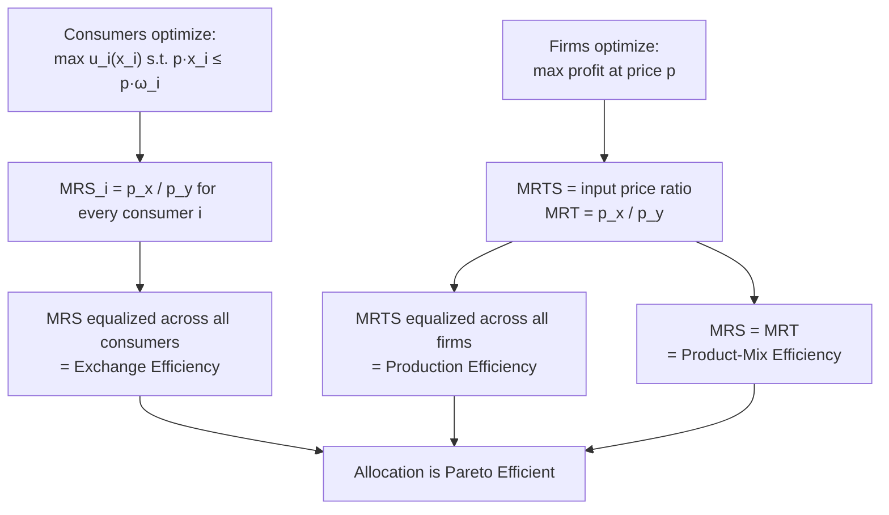

## First Fundamental Theorem of Welfare Economics

### Overview

The First Fundamental Theorem of Welfare Economics (FFT) is the formal statement that decentralized, price-mediated exchange among self-interested, price-taking agents leads to a Pareto efficient outcome. It provides the rigorous mathematical backbone for the intuitive claim that competitive markets, left alone, allocate resources efficiently — Adam Smith's "invisible hand" made precise.

### Formal Statement

**Theorem**: If $(x^*, y^*, p^*)$ is a competitive (Walrasian) equilibrium and consumer preferences are locally non-satiated, then the allocation $(x^*, y^*)$ is Pareto efficient.

Where:

- $x^*$ = equilibrium consumption allocation across all individuals
- $y^*$ = equilibrium production plan across all firms
- $p^*$ = equilibrium price vector
- **Local non-satiation**: for every bundle $x_i$ and every $\varepsilon > 0$, there exists a bundle $x_i'$ within distance $\varepsilon$ of $x_i$ such that $u_i(x_i') > u_i(x_i)$ — consumers can always be made strictly better off by some small change in their bundle.

### Required Assumptions

**Key Points**

- **Local non-satiation** — the only preference assumption needed for the core result. It rules out "bliss points" where a consumer is fully satisfied and indifferent to marginal changes.
- **Price-taking behavior** — all consumers and firms treat prices as parametric (perfect competition, no market power).
- **Complete markets** — a market exists for every good, service, and contingency relevant to agents' decisions.
- **No externalities** — one agent's consumption or production does not directly affect another's utility or production function outside of price signals.
- **Perfect information** — no asymmetric information distorting decisions.
- **Budget constraints hold with equality at the optimum** — implied by local non-satiation, since any unspent income could buy a utility-improving bundle.

Notably, the theorem does **not** require convex preferences, convex production sets, continuity of preferences, or a finite number of goods/agents — this is a much weaker assumption set than required for the **Second** theorem, and much weaker than what's needed to *prove equilibrium exists* (existence proofs typically do require convexity or similar fixed-point conditions).

### Proof (Exchange Economy, by Contradiction)

**Setup**: Consider a pure exchange economy with $n$ consumers, endowments $\omega_i$, and competitive equilibrium $(x^*, p^*)$.

**Step 1 — Assume the equilibrium is not Pareto efficient.**

Suppose there exists a feasible allocation $x'$ such that:

$$u_i(x_i') \geq u_i(x_i^*) \text{ for all } i, \quad u_j(x_j') > u_j(x_j^*) \text{ for at least one } j$$

**Step 2 — Use utility maximization to bound expenditure.**

Since $x_i^*$ maximizes $u_i$ subject to $p^* \cdot x_i \leq p^* \cdot \omega_i$, any bundle $x_i'$ that is weakly preferred to $x_i^*$ must cost at least as much:

$$p^* \cdot x_i' \geq p^* \cdot \omega_i \quad \text{for all } i$$

(If $p^* \cdot x_i' < p^* \cdot \omega_i$, the consumer would have had unspent income at $x_i^*$; local non-satiation implies they could find a strictly better bundle within their original budget — contradicting that $x_i^*$ was utility-maximizing.)

**Step 3 — Strict inequality for the strictly-better-off agent.**

For agent $j$, since $u_j(x_j') > u_j(x_j^*)$ and $x_j^*$ was chosen as the utility-maximizing bundle in the budget set, $x_j'$ must lie **outside** agent $j$'s budget set:

$$p^* \cdot x_j' > p^* \cdot \omega_j$$

**Step 4 — Sum across all agents.**

$$\sum_{i=1}^n p^* \cdot x_i' > \sum_{i=1}^n p^* \cdot \omega_i$$

$$p^* \cdot \left(\sum_i x_i'\right) > p^* \cdot \left(\sum_i \omega_i\right)$$

**Step 5 — Contradiction with feasibility.**

But $x'$ was assumed feasible, meaning $\sum_i x_i' \leq \sum_i \omega_i$ (aggregate consumption cannot exceed aggregate endowment). At positive prices $p^* > 0$, this implies:

$$p^* \cdot \left(\sum_i x_i'\right) \leq p^* \cdot \left(\sum_i \omega_i\right)$$

This directly contradicts Step 4. Therefore, no such Pareto-improving $x'$ can exist — $x^*$ must be Pareto efficient. $\blacksquare$

### Diagrammatic Intuition

Because every agent faces the **same** equilibrium price vector $p^*$, individually optimal choices are automatically mutually consistent: consumers' MRS values converge to the same price ratio, firms' MRTS values converge to the same input price ratio, and firms set output such that MRT equals the same price ratio — jointly satisfying all three Pareto efficiency conditions without any need for a central coordinator.

### Worked Numerical Example

**Setup**: Two consumers (A, B), two goods ($x$, $y$). At competitive equilibrium prices $p_x = 2$, $p_y = 1$:

- Consumer A's utility: $u_A(x,y) = x^{0.5}y^{0.5}$, giving $MRS^A = y/x$
- Consumer B's utility: $u_B(x,y) = x^{0.3}y^{0.7}$, giving $MRS^B = \frac{0.3y}{0.7x} \cdot \frac{x}{y}$ adjusted per bundle

At the competitive equilibrium, each consumer independently sets their MRS equal to $p_x/p_y = 2$:

$$MRS^A = 2 \quad \text{and} \quad MRS^B = 2$$

**Key Points**

- Since both consumers independently solve $MRS_i = p_x/p_y$, they arrive at $MRS^A = MRS^B = 2$ **without ever negotiating directly with each other**.
- This equality is precisely the exchange-efficiency condition from Pareto optimality — verifying the FFT mechanism in miniature.

### Why the Theorem Matters: Policy Implications

**Key Points**

- Provides the theoretical justification for **laissez-faire** policy stances: if markets are competitive and complete, government intervention (price controls, quotas) can only move the economy away from an already-efficient outcome.
- Establishes a **diagnostic checklist** for economists: if an observed market outcome seems inefficient, the FFT directs attention to which assumption is violated (externality? market power? incomplete markets? asymmetric information?) rather than assuming markets categorically fail.
- Underpins cost-benefit analysis frameworks that use market prices as proxies for marginal social value, valid precisely when FFT conditions hold.

### Limitations and Common Misinterpretations

**Key Points**

- **Efficiency ≠ equity.** A Pareto efficient allocation can be extremely unequal (e.g., one agent holds nearly all endowments) — the theorem makes no distributional claim.
- **Existence is not guaranteed by the FFT.** The theorem is conditional: *if* an equilibrium exists, *then* it is efficient. Proving equilibrium existence (via Arrow-Debreu, using Kakutani's fixed-point theorem) is a separate, more demanding result requiring convexity assumptions.
- **Real markets rarely satisfy all assumptions perfectly.** Externalities, public goods, imperfect competition, and incomplete information are pervasive — hence the FFT is best understood as a **benchmark** against which real-world market failures are measured, not a description of actual outcomes.
- [Inference] The theorem's practical value lies less in predicting real-market efficiency and more in structuring where economists look for inefficiency and what policy tools (Pigouvian taxes, antitrust, public provision) are theoretically appropriate for each type of failure.

### Relationship to General Equilibrium Existence

The FFT is typically presented alongside, but is logically distinct from, the **Arrow-Debreu existence theorem**, which establishes that a competitive equilibrium exists under conditions including convex preferences, convex production technologies, and continuity. The FFT then guarantees that *whatever* equilibrium exists is efficient. Together, they form the two-part foundation of Arrow-Debreu general equilibrium theory: **(1) equilibrium exists**, and **(2) equilibrium is efficient**.

**Related Topics**

- Second Fundamental Theorem of Welfare Economics
- Arrow-Debreu General Equilibrium Model and Existence Proofs
- Market Failures: Externalities, Public Goods, Asymmetric Information
- Perfect Competition and Price-Taking Behavior
- Convexity Assumptions and Non-Convex Economies
- Welfare Theorems Under Incomplete Markets
- Pigouvian Taxation and Corrective Policy