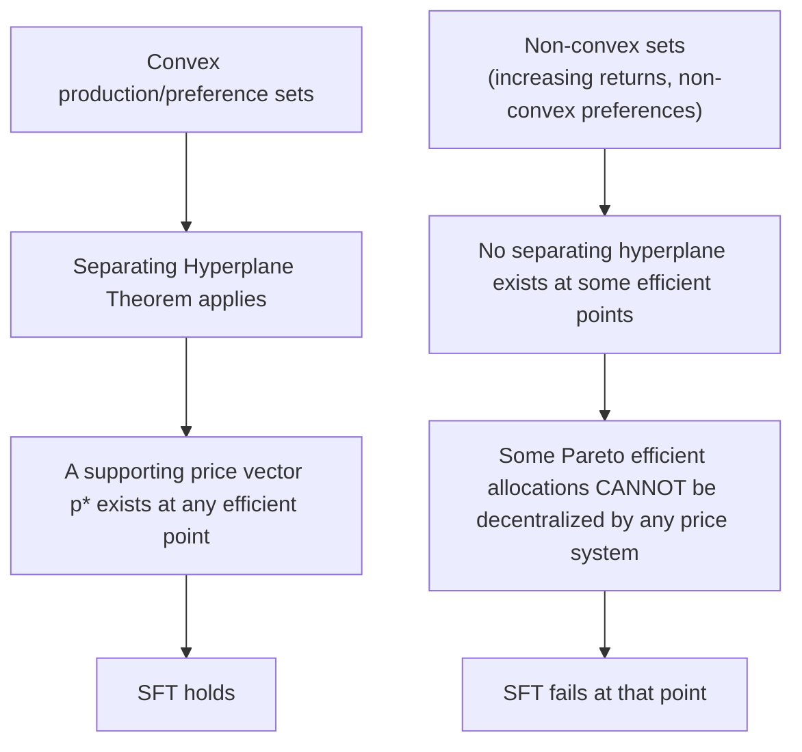

## Second Fundamental Theorem of Welfare Economics

### Overview

The Second Fundamental Theorem of Welfare Economics (SFT) reverses the direction of the First Theorem: rather than showing that competitive equilibria are efficient, it shows that (under stronger conditions) any desired Pareto efficient allocation can be *implemented* as a competitive equilibrium, provided society first redistributes initial endowments appropriately. This separates the **efficiency problem** from the **equity problem**, providing the theoretical foundation for combining lump-sum redistribution with undistorted market pricing.

### Formal Statement

**Theorem**: Let $x^*$ be a Pareto efficient allocation in an economy where consumer preferences are convex, continuous, and locally non-satiated, and production sets are convex. Then there exists a price vector $p^*$ and a reallocation of endowments $\{\omega_i'\}$ (with $\sum_i \omega_i' = \sum_i \omega_i^*$, i.e., feasible and summing to the same aggregate resources) such that $(x^*, p^*)$ is a competitive equilibrium relative to endowments $\{\omega_i'\}$.

Equivalently: every point on the utility possibility frontier can be **decentralized** — supported by some price system — as long as the underlying preference and technology sets are convex.

### Required Assumptions (Stronger Than the First Theorem)

**Key Points**

- **Convexity of preferences** — indifference curves must be convex to the origin (diminishing MRS), ruling out "corner-loving" or non-convex preference structures.
- **Convexity of production sets** — no increasing returns to scale over the relevant range; technology must not permit "corner" production optima that a price line cannot support.
- **Continuity of preferences** — needed to guarantee the existence of a supporting price hyperplane via separating hyperplane theorems.
- **Local non-satiation** — as in the FFT.
- **Existence of a well-functioning lump-sum redistribution mechanism** — the government (or planner) must be able to costlessly transfer purchasing power between agents *before* trading occurs, without distorting any prices or incentives.

This is a substantially stronger assumption set than the FFT requires, because the proof relies on the **Separating Hyperplane Theorem**, a result from convex analysis that requires convex sets to guarantee a separating price line exists.

### The Separating Hyperplane Intuition

**Key Points**

- Given a Pareto efficient allocation $x^*$, define the set of allocations that make every agent *at least as well off* — the "better-than" set $B = \{x : u_i(x_i) \geq u_i(x_i^*) \; \forall i\}$.
- If preferences are convex, $B$ is a convex set.
- Because $x^*$ is Pareto efficient, $B$ intersects the feasible set only at $x^*$ itself — there is no feasible point strictly inside $B$.
- The Separating Hyperplane Theorem guarantees that a hyperplane (price line) exists that separates $B$ from the feasible set, touching only at $x^*$. This hyperplane's slope **is** the supporting equilibrium price vector $p^*$.

### Why Convexity Cannot Be Dropped: The Non-Convex Case

**Example**

Consider a production technology exhibiting increasing returns to scale (non-convex production set) — e.g., a natural monopoly with declining average cost. Suppose the Pareto efficient allocation requires operating at a specific point on this non-convex frontier. At that point, no single price line is tangent to the frontier in a way that also makes the point profit-maximizing for the firm at those prices — the firm would instead want to produce more or less, or drop out of the market entirely, given any price the planner tries to set.

[Inference] This is why goods and industries with strong increasing returns to scale (natural monopolies, network industries) are frequently cited as cases where market-based efficient outcomes require non-price interventions (regulation, direct public provision) rather than pure lump-sum transfer plus laissez-faire.

### Formal Proof Sketch

**Step 1.** Fix a Pareto efficient allocation $x^*$. Define $Y = \{y : y \text{ is aggregate net production feasible for the economy}\}$ (convex by assumption) and $B = \{\sum_i x_i : u_i(x_i) \geq u_i(x_i^*) \forall i\}$ (convex, by convexity of preferences and the fact that a sum of convex sets is convex).

**Step 2.** Because $x^*$ is Pareto efficient, the interiors of $B$ and $Y$ (translated appropriately by aggregate endowment) do not intersect — if they did, some feasible bundle would allow strictly improving at least one agent while keeping others at $u_i(x_i^*)$, contradicting Pareto efficiency.

**Step 3.** By the Separating Hyperplane Theorem, there exists a nonzero price vector $p^*$ such that:

$$p^* \cdot z \geq p^* \cdot \left(\sum_i x_i^*\right) \quad \forall z \in B$$

$$p^* \cdot y \leq p^* \cdot \left(\sum_i x_i^*\right) \quad \forall y \in Y$$

**Step 4.** This means $x^*$ minimizes cost among all bundles giving each agent at least $u_i(x_i^*)$, and it maximizes the value of production given $p^*$. These are precisely the necessary conditions for $x^*$ to be individually utility/profit maximizing at prices $p^*$.

**Step 5.** The planner then redistributes endowments so that each agent's wealth at prices $p^*$, i.e., $p^* \cdot \omega_i'$, exactly equals $p^* \cdot x_i^*$ — the value of their target consumption bundle. Given this wealth, each agent's own utility-maximization problem at prices $p^*$ yields exactly $x_i^*$ as their optimal choice. $\blacksquare$

### Worked Example: Redistribution Then Market Clearing

**Setup**: An economy has two agents. The social planner decides, on equity grounds, that the efficient allocation $x^*$ giving Agent A a larger utility share is socially preferred (chosen via some social welfare function, not derived from the SFT itself).

**Key Points**

1. Compute the equilibrium price vector $p^*$ that supports $x^*$ (via the separating hyperplane / marginal conditions: $MRS^A = MRS^B = MRT = p_x/p_y$).
2. Determine the wealth each agent needs at $p^*$ to afford bundle $x_i^*$: $W_i = p^* \cdot x_i^*$.
3. Transfer initial endowments (lump-sum) so that $p^* \cdot \omega_i' = W_i$ for each $i$.
4. Open markets. Each agent, taking $p^*$ as given, independently chooses their utility-maximizing bundle subject to $p^* \cdot x_i \leq p^* \cdot \omega_i'$ — and by construction, this choice is exactly $x_i^*$.

**Output**: The market decentralizes the planner's chosen efficient-and-equitable allocation without the planner ever directly assigning goods — only initial purchasing power was redistributed.

### Policy Implications: Separating Efficiency from Equity

**Key Points**

- The SFT is the theoretical basis for the principle: **"redistribute lump-sum, then let markets work"** — rather than intervening in prices or quantities directly (price controls, in-kind transfers, quotas), which typically reintroduce inefficiency.
- This underlies arguments for using the **income tax and cash transfer system** (rather than price controls or subsidies on specific goods) as the primary redistributive tool, preserving the $MRS = MRT$ conditions in markets.
- It also underlies the classic argument that a competitive market economy is compatible with *any* point on the utility possibility frontier — the choice of *which* point is a value judgment (via a social welfare function), fully separable from the technical question of how to achieve it efficiently.

### Practical Limitations: Why "Lump-Sum" Is Hard

**Key Points**

- A truly lump-sum tax/transfer must not depend on any choice variable the agent controls (income, consumption, labor supply) — otherwise, the agent can alter behavior to change their tax liability, introducing distortion (violating the "no incentive effects" assumption).
- **Lump-sum taxes based on unchangeable characteristics** (e.g., a fixed poll tax, taxes based on innate ability) are the only theoretically pure instruments, but ability is unobservable and poll taxes are typically viewed as inequitable and are rarely implemented at scale.
- In practice, governments rely on **distortionary instruments** (income taxes, commodity taxes) for redistribution, which do affect $MRS$ vs. $MRT$ conditions — creating deadweight loss and the classic **equity-efficiency trade-off** studied in optimal tax theory (Mirrlees, Diamond).
- [Inference] This gap between the SFT's idealized lump-sum mechanism and real-world distortionary tax tools is arguably the central motivating tension of modern public economics and optimal taxation theory.

### Comparison: First vs. Second Fundamental Theorem

| Dimension | First Theorem | Second Theorem |
| --- | --- | --- |
| Direction of claim | Equilibrium ⟹ Efficient | Efficient ⟹ Supportable by equilibrium |
| Key assumption | Local non-satiation only | Convexity of preferences and production, plus non-satiation and continuity |
| Mathematical tool | Direct contradiction argument | Separating Hyperplane Theorem |
| Policy implication | Justifies free markets / laissez-faire | Justifies lump-sum redistribution + free markets |
| Addresses equity? | No | Indirectly — enables any equity outcome via redistribution |
| Sensitive to non-convexities? | No | Yes — fails at non-convex efficient points |

**Related Topics**

- First Fundamental Theorem of Welfare Economics
- Separating Hyperplane Theorem and Convex Analysis in Economics
- Social Welfare Functions and Choosing a Point on the UPF
- Optimal Taxation Theory (Mirrlees Model, Ramsey Taxation)
- Lump-Sum vs. Distortionary Taxation
- Non-Convexities and Natural Monopoly
- Second-Best Theory (Lipsey-Lancaster)