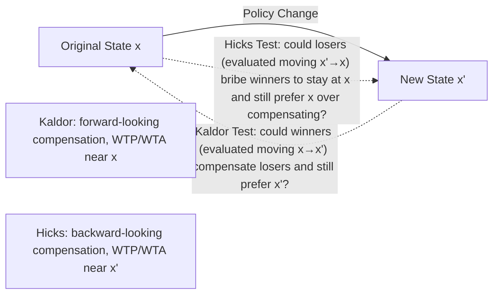

## Kaldor-Hicks and Scitovsky Compensation Criteria

### Overview

The compensation criteria emerged to address a core limitation of the Pareto criterion: most real-world policy changes create both winners and losers, making them impossible to rank by strict Pareto dominance. The Kaldor and Hicks criteria attempt to evaluate such changes by asking whether winners could *hypothetically* compensate losers, without requiring compensation to actually occur. The Scitovsky criterion then exposes a logical flaw in applying Kaldor and Hicks independently, leading to the "Scitovsky paradox" and the need for a "double criterion."

### The Underlying Problem: Pareto's Limitation

**Key Points**

- A move from allocation $x$ to $x'$ is a Pareto improvement only if **no one** is made worse off.
- Nearly every real policy — trade liberalization, a new tax, infrastructure investment — benefits some individuals while harming others, making the Pareto criterion silent on whether the change is desirable.
- Compensation tests were designed to extend welfare evaluation to these more realistic cases without requiring a full social welfare function or interpersonal utility comparisons.

### Kaldor Criterion (Kaldor 1939)

**Statement**: A move from state $x$ to state $x'$ is a **Kaldor improvement** if the gainers from the move could *potentially* compensate the losers (using a lump-sum transfer) and still remain better off than at the original state $x$ — regardless of whether the compensation is actually paid.

Formally, if $x'$ generates gains $G$ for winners and losses $L$ for losers (both measured in monetary/willingness-to-pay terms), the Kaldor criterion is satisfied if:

$$G > L$$

i.e., the winners' willingness to pay to retain the change exceeds the losers' willingness to accept compensation to give it up.

**Key Points**

- Also called the **potential Pareto improvement** criterion — "potential" because actual compensation is not required, only that it *could* occur.
- This was motivated by a desire to separate the **efficiency question** (does the pie grow?) from the **equity question** (who gets the pie?), similar in spirit to the logic of the Second Welfare Theorem.
- Widely used, often implicitly, in **cost-benefit analysis**: if aggregate benefits exceed aggregate costs, a project passes the Kaldor test, independent of who actually bears the costs and who receives the benefits.

### Hicks Criterion (Hicks 1939)

**Statement**: A move from state $x$ to state $x'$ is a **Hicks improvement** if the losers, from the vantage point of the *new* state $x'$, could not profitably bribe the winners to prevent the change (i.e., the losers cannot compensate the winners to remain at the original state $x$ and have anything left over).

**Key Points**

- Kaldor asks: "Could winners compensate losers **from the new state** and still prefer the change?" (compensation flows *forward*, evaluated using the losers' willingness-to-accept and winners' willingness-to-pay at/near the *original* state).
- Hicks asks: "Could losers bribe winners **to stay at the original state** and both be at least as well off as at the new state?" (compensation flows in reverse, evaluated using willingness-to-pay/accept at/near the *new* state).
- The two tests use different reference points (initial vs. final prices/utility levels) for measuring gains and losses, which is the technical root of why they can, in principle, give **conflicting verdicts** for the same policy change (related to the difference between compensating variation and equivalent variation).

### Diagram: Direction of the Two Tests

### Kaldor-Hicks Criterion (Combined)

Because Kaldor and Hicks can disagree when evaluated separately, the term **"Kaldor-Hicks efficiency"** in modern usage (especially in law and economics) typically refers to a simplified, practical standard: a change is a Kaldor-Hicks improvement if the monetized gains to winners exceed the monetized losses to losers, i.e., **aggregate wealth or surplus increases** — this is the standard applied in most applied cost-benefit analysis, even though it technically corresponds most closely to the Kaldor formulation alone.

**Key Points**

- This is the efficiency criterion embedded in most net-present-value / cost-benefit-ratio calculations used in public project evaluation.
- It underlies major swaths of **law and economics** (e.g., Richard Posner's wealth-maximization framework for evaluating legal rules).
- [Inference] Practitioners often invoke "Kaldor-Hicks efficiency" loosely to mean simply "total surplus increases," without necessarily distinguishing the technical Kaldor/Hicks asymmetry — this is a common simplification in applied policy contexts, though not strictly rigorous from a theoretical standpoint.

### The Scitovsky Paradox

**Key Points**

- Tibor Scitovsky (1941) demonstrated that the Kaldor criterion alone can produce **inconsistent rankings**: it is possible for a move from $x$ to $x'$ to pass the Kaldor test (winners could compensate losers and still gain), while the **reverse** move from $x'$ back to $x$ *also* passes the Kaldor test.
- This means Kaldor's criterion alone can simultaneously recommend $x \to x'$ **and** $x' \to x$ — a logical contradiction, since a well-behaved ranking cannot prefer both directions.
- The paradox arises because the Kaldor test uses different implicit price/utility weightings depending on which state is treated as the reference point — changes in the distribution of income between $x$ and $x'$ can shift aggregate demand patterns enough to reverse the compensation calculus in each direction.

**Example**

Suppose a trade policy shifts income from group B to group A (state $x'$ vs. original $x$). Evaluated with income distributed as at $x'$, group A's gains (as valued by their willingness to pay, now wealthier and possibly caring more about the good in question) exceed group B's losses — passing Kaldor for $x \to x'$. But evaluated with income redistributed back at $x$, group B's now-larger valuation of what they'd regain could similarly exceed group A's loss from reversing the policy — passing Kaldor for $x' \to x$ as well. Both directions appear to be "improvements," which is incoherent.

### Scitovsky (Double) Criterion

**Statement**: A move from $x$ to $x'$ represents an unambiguous improvement under the **Scitovsky criterion** only if:

1. The move from $x$ to $x'$ passes the Kaldor test, **AND**
2. The reverse move from $x'$ to $x$ **fails** the Kaldor test (i.e., losers from returning to $x$ could not compensate winners who'd have to give up $x'$).

$$\text{Scitovsky improvement} \iff \text{Kaldor}(x \to x') = \text{True} \; \text{ and } \; \text{Kaldor}(x' \to x) = \text{False}$$

**Key Points**

- This "double test" rules out the paradoxical case where both directions simultaneously pass, restoring logical consistency to the ranking.
- The Scitovsky criterion is strictly more demanding than the Kaldor criterion alone — it requires the potential Pareto improvement to hold **robustly**, not just in one direction.
- Even the Scitovsky criterion does not fully resolve all conceptual issues (e.g., it still relies on hypothetical, unpaid compensation and monetized valuations that implicitly weight individuals by their marginal utility of income / ability to pay).

### Comparison Table

| Criterion | Test | Reference Point | Key Limitation |
| --- | --- | --- | --- |
| Pareto | No one worse off | N/A (no compensation needed) | Silent on nearly all real policies with mixed winners/losers |
| Kaldor | Winners could compensate losers and still gain | Evaluated near original state $x$ | Vulnerable to the Scitovsky paradox |
| Hicks | Losers could not profitably bribe winners to block the change | Evaluated near new state $x'$ | Can disagree with Kaldor on the same change |
| Scitovsky | Kaldor holds forward AND fails in reverse | Both states | Resolves the paradox but still relies on hypothetical, unpaid compensation |

### Relationship to Actual Compensation and Pareto Improvements

**Key Points**

- If compensation implied by the Kaldor/Hicks tests were **actually paid**, the resulting outcome would, by construction, be a genuine Pareto improvement over the original state — this is the conceptual bridge connecting compensation tests back to the Pareto criterion.
- Because compensation in the Kaldor-Hicks framework is **hypothetical** (not actually paid), a policy can pass Kaldor-Hicks while making real losers strictly worse off in practice — this is the central ethical criticism of the criterion.
- This gap is precisely why cost-benefit analysis based on aggregate surplus (a Kaldor-Hicks style test) is sometimes supplemented with **distributional weights** or **equity constraints**, effectively re-introducing a social-welfare-function perspective (see: Social Welfare Functions) on top of the raw efficiency test.

### Applications in Public Economics

**Key Points**

- **Cost-Benefit Analysis (CBA)**: Standard CBA practice — summing discounted benefits and costs across all affected parties and approving projects where benefits exceed costs — is a direct application of the Kaldor-Hicks (potential Pareto improvement) logic.
- **Trade policy evaluation**: The standard economic argument for free trade (aggregate gains from trade exceed aggregate losses to import-competing sectors) is a canonical Kaldor-Hicks argument, distinct from claiming trade liberalization is a literal Pareto improvement (it typically is not, without actual compensation/adjustment assistance).
- **Environmental and infrastructure project appraisal**: Willingness-to-pay and willingness-to-accept measures (contingent valuation, hedonic pricing) are used to monetize gains and losses for Kaldor-Hicks-style project evaluation.
- **Legal rule-making (Law and Economics)**: Posner's efficiency-based theory of common law evaluates legal rules by whether they maximize the size of the (hypothetically transferable) social pie.

### Critiques

**Key Points**

- **No actual compensation requirement** means the criterion can rationalize policies that impose real, uncompensated harm on identifiable losers — raising distributive justice concerns that a pure efficiency test cannot address.
- **Reliance on willingness-to-pay** as the measure of "gain" implicitly weights individuals by their income/wealth (a dollar of WTP means less to a rich person than a poor one), so aggregate-surplus tests are not distributionally neutral even though they appear technical/objective.
- [Inference] These critiques are a central motivation for supplementing Kaldor-Hicks-based cost-benefit analysis with explicit distributional weighting schemes or separate equity constraints in applied public economics, rather than relying on the raw efficiency test alone.

**Related Topics**

- Pareto Efficiency and Competitive Equilibrium
- Social Welfare Functions
- Cost-Benefit Analysis and Distributional Weights
- Compensating Variation and Equivalent Variation
- Consumer and Producer Surplus Measurement
- Law and Economics (Posner's Wealth Maximization)
- Willingness to Pay vs. Willingness to Accept