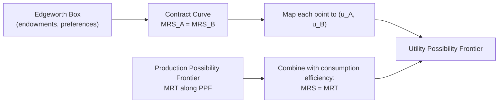
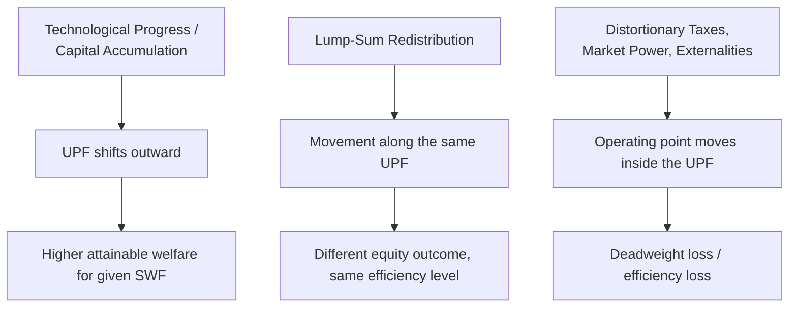

## Utility Possibility Frontiers

### Overview

The utility possibility frontier (UPF) translates the economy's real resource and technology constraints — summarized in the production possibility frontier (PPF) and consumers' preferences — into utility space. It represents the maximum attainable utility for one individual given fixed utility levels for all others, and its outer boundary traces the complete set of Pareto efficient allocations for the economy. The UPF is the essential link between the technical concept of Pareto efficiency and the evaluative apparatus of social welfare functions.

### Formal Definition

For an economy with $n$ individuals, the utility possibility frontier is the outer boundary of the **utility possibility set** $U$:

$$U = \{(u_1, u_2, \ldots, u_n) : u_i = u_i(x_i) \text{ for some feasible allocation } x\}$$

The frontier itself is defined by:

$$UPF = \{(u_1, \ldots, u_n) \in U : \text{there is no } (u_1', \ldots, u_n') \in U \text{ with } u_i' \geq u_i \; \forall i, \; u_j' > u_j \text{ for some } j\}$$

In the two-person case, this is typically expressed as an implicit function:

$$u_B = g(u_A)$$

where $g$ is a decreasing function derived from the economy's aggregate feasible set — increasing $u_A$ beyond a certain point can only be achieved by reducing $u_B$, given fixed resources and technology.

### Constructing the UPF from the Edgeworth Box

**Key Points**

- Every point on the **contract curve** in the Edgeworth box (the exchange-efficient allocations where $MRS^A = MRS^B$) corresponds to exactly one point on the UPF.
- The mapping proceeds by taking each contract curve point, computing $u_A$ and $u_B$ at that allocation, and plotting the resulting pair $(u_A, u_B)$ in utility space.
- Points **inside** the Edgeworth box but off the contract curve are Pareto inefficient allocations — they map to points **strictly inside** the UPF, since some feasible reallocation could raise both utilities simultaneously.

### Diagram: The UPF and Its Interior

<svg xmlns="http://www.w3.org/2000/svg" viewBox="0 0 640 440" font-family="sans-serif">
<text x="320" y="24" text-anchor="middle" font-size="16" font-weight="bold">Utility Possibility Frontier (svg_diagram)</text>
<line x1="80" y1="380" x2="580" y2="380" stroke="#333" stroke-width="2" />
<line x1="80" y1="380" x2="80" y2="50" stroke="#333" stroke-width="2" />
<text x="590" y="385" font-size="13">u_A</text>
<text x="65" y="45" font-size="13">u_B</text>
<path d="M 100 360 Q 300 340 420 250 Q 500 180 520 80" stroke="#c0392b" stroke-width="2.5" fill="none" />
<text x="430" y="240" font-size="12" fill="#c0392b">UPF (Pareto efficient boundary)</text>
<path d="M 100 360 Q 300 340 420 250 Q 500 180 520 80 L 100 360 Z" fill="#f5cba7" opacity="0.35" />
<circle cx="280" cy="300" r="4" fill="#2980b9" />
<text x="290" y="305" font-size="11" fill="#2980b9">Point inside: feasible but Pareto inefficient</text>
<circle cx="600" cy="200" r="4" fill="#7f8c8d" />
<text x="480" y="60" font-size="11" fill="#7f8c8d">Region outside: infeasible</text>
<circle cx="392" cy="222" r="5" fill="#8e44ad" />
<text x="400" y="215" font-size="12" fill="#8e44ad" font-weight="bold">Efficient point on UPF</text>
</svg>

**Key Points**

- Points **on** the UPF: Pareto efficient — no reallocation can raise one person's utility without lowering another's.
- Points **inside** the UPF (the shaded region): feasible but Pareto **inefficient** — some reallocation exists that raises at least one utility without lowering any other.
- Points **outside** the UPF: infeasible given current resources, technology, and preferences.

### Slope of the UPF: The Marginal Rate of Transformation in Utility Space

The slope of the UPF at any point represents the rate at which one person's utility must be sacrificed to increase another's by one unit, holding the allocation on the efficient frontier:

$$MRT_{u_A, u_B} = -\frac{du_B}{du_A} \Big|_{UPF}$$

**Key Points**

- This slope is generally **not constant** — it depends on the curvature of individual utility functions and the underlying PPF, and typically becomes steeper (in absolute value) as one individual's utility share increases, reflecting diminishing returns to reallocating resources toward an already-well-off individual.
- The UPF is typically drawn as **concave to the origin** (bowed outward) under standard convexity assumptions on preferences and technology — though its exact shape depends on the specific utility functions and production technology of the economy and need not always be strictly concave in every application. [Inference] Non-convexities in preferences or technology can produce a UPF with concave-to-origin segments or even locally convex stretches, which corresponds to the same conditions under which the Second Welfare Theorem can fail.

### Why the UPF Alone Cannot Select a Unique Outcome

**Key Points**

- The UPF, being derived purely from Pareto efficiency, ranks all its own points as **equally valid** — Pareto efficiency is silent on *which* efficient point is best, since moving along the frontier always makes someone better off and someone else worse off (a movement the Pareto criterion cannot rank).
- Selecting a single point requires an additional value judgment — typically a **social welfare function** $W(u_A, u_B)$ — whose indifference curves are overlaid on the UPF diagram; the point of tangency between the highest attainable $W$-indifference curve and the UPF is the **social optimum**.
- This division of labor (UPF = feasibility and efficiency; SWF = equity and selection) is the standard two-step architecture of normative welfare analysis in public economics.

### Worked Numerical Example

**Setup**: A two-person economy with utility possibility frontier approximated by:

$$u_B = 100 - 0.5 \, u_A^2 \quad \text{for } 0 \leq u_A \leq \sqrt{200}$$

At $u_A = 5$: $u_B = 100 - 0.5(25) = 87.5$ — a feasible, efficient point.

At $u_A = 8$: $u_B = 100 - 0.5(64) = 68$ — moving further along the frontier trades off $u_B$ at an increasing rate (the marginal utility "cost" of raising $u_A$ from 5 to 8 is much steeper than from 0 to 3), illustrating the typical concave-to-origin shape.

**Example**

If a policymaker's social welfare function is utilitarian, $W = u_A + u_B$, the optimal point maximizes $u_A + (100 - 0.5u_A^2)$. Taking the derivative and setting it to zero: $1 - u_A = 0 \Rightarrow u_A^* = 1$, giving $u_B^* = 99.5$. If instead the SWF is Rawlsian ($W = \min(u_A, u_B)$), the optimum occurs where $u_A = u_B$ (since increasing the higher one further does not raise the minimum): solving $u_A = 100 - 0.5u_A^2$ gives $u_A^* \approx 12.6$, $u_B^* \approx 12.6$ — a markedly more equal, and lower aggregate, outcome than the utilitarian solution.

### The UPF and Shifts: Growth vs. Redistribution

**Key Points**

- **Economic growth** (technological improvement, capital accumulation, increased factor endowments) shifts the **entire UPF outward**, expanding the set of feasible efficient allocations for everyone.
- **Redistribution** (lump-sum transfers) moves the economy **along** a *given* UPF, from one efficient point to another, without shifting the frontier itself — consistent with the Second Welfare Theorem's logic of decentralizing any point on a fixed UPF via appropriate endowment transfers.
- **Distortionary policy** (e.g., inefficient taxation, trade barriers, monopoly power) causes the economy to operate **inside** the UPF rather than on it — the efficiency loss from such distortions is often visualized as the gap between the actual utility pair achieved and the frontier.

### Relationship to the Production Possibility Frontier (PPF)

**Key Points**

- The PPF describes the economy's technological trade-off between **producing** different goods; the UPF describes the trade-off between individuals' **utility levels**, incorporating both production and consumption/exchange efficiency.
- Deriving the UPF from the PPF requires imposing both production efficiency ($MRTS$ equalized) and the top-level condition $MRS = MRT$ at every point along the PPF, then mapping the resulting efficient consumption bundles into individual utility levels.
- Because utility functions are ordinal and individual-specific, the *shape* of the UPF depends on more than just technology (which shapes the PPF) — it also depends on the specific cardinalization or curvature assumptions imposed on each individual's utility function, which is why UPF diagrams in textbooks are illustrative rather than empirically estimated in most applications.

### Applications in Public Economics

**Key Points**

- **Optimal taxation**: The Mirrlees framework computes the "second-best" utility possibility frontier — the UPF that remains achievable once informational constraints (unobservable ability) and incentive-compatibility requirements are imposed, which lies strictly inside the "first-best" UPF derived only from resource constraints.
- **Policy evaluation**: Comparing two policies' UPFs (rather than single-point utility comparisons) allows economists to distinguish efficiency effects (does the frontier expand or contract?) from distributional effects (does the policy move the economy along a given frontier?).
- **International trade**: Standard trade theory shows that opening to trade shifts a country's UPF outward (gains from trade expand the possible utility combinations), even though within-country distributional effects (who gains, who loses) determine where on the new, larger frontier the economy actually lands.

### First-Best vs. Second-Best UPF

**Key Points**

- The **first-best UPF** assumes the planner can costlessly observe all relevant information and implement lump-sum transfers — this is the UPF implied directly by the Second Welfare Theorem's construction.
- The **second-best UPF** incorporates realistic constraints (asymmetric information, distortionary tax instruments, administrative costs) and necessarily lies **inside** the first-best frontier — some feasible-in-principle allocations become unattainable once incentive-compatibility constraints bind.
- [Inference] The gap between the first-best and second-best UPF is often used pedagogically and analytically as a way to quantify the welfare cost of informational and incentive constraints that prevent society from implementing pure lump-sum redistribution, connecting directly to the practical limitations of the Second Fundamental Theorem.

**Related Topics**

- Pareto Efficiency and Competitive Equilibrium
- Social Welfare Functions
- Second Fundamental Theorem of Welfare Economics
- Kaldor-Hicks and Scitovsky Compensation Criteria
- Optimal Income Taxation (Mirrlees Model) and Second-Best Analysis
- Production Possibility Frontier and Marginal Rate of Transformation
- Gains from Trade and Welfare Analysis